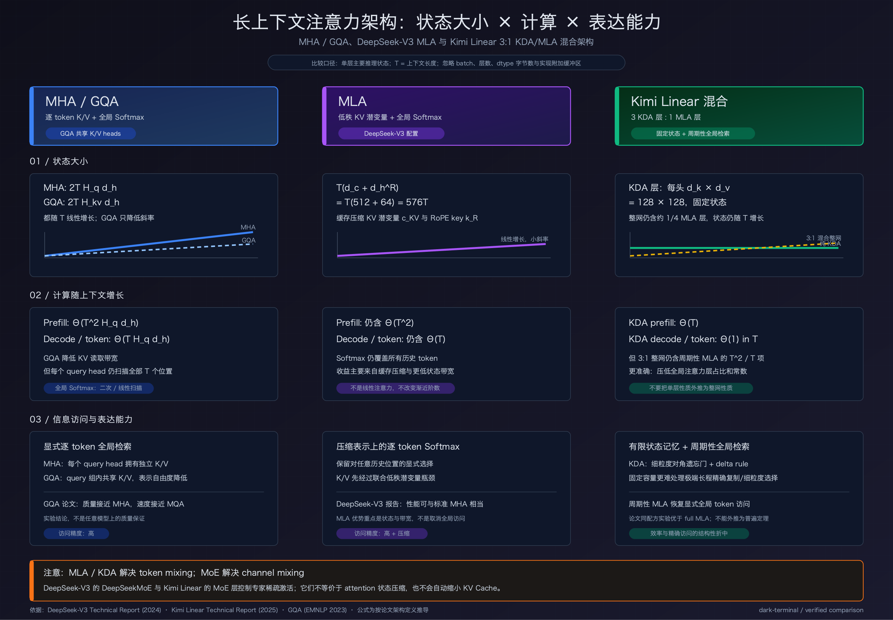

# MHA、GQA、MLA 与混合线性注意力对比图



## 先看结论

- **MHA / GQA**：保留每个历史 token 的 K、V，能够直接进行逐 token 的 Softmax 检索。GQA 通过让多个 query head 共享一组 K/V head，降低 KV Cache 和读取带宽，但没有改变注意力计算随上下文长度增长的阶数。
- **MLA**：仍然对所有历史 token 做 Softmax 注意力，但缓存的是低秩压缩后的 KV 潜变量。DeepSeek-V3 每层、每 token 缓存 `d_c + d_h^R = 512 + 64 = 576` 个元素，明显小于常规 MHA；它减少的是状态大小和带宽，不是全局注意力的二次计算阶数。
- **KDA 层**：使用固定大小的矩阵状态递归压缩历史，不保存随上下文增长的逐 token KV Cache；因此单个 KDA 层的状态大小与上下文长度无关，序列计算对长度 `T` 呈线性增长。
- **Kimi Linear 整体**：不是纯 KDA，而是按 **3 个 KDA 层 : 1 个 MLA 层**交错。KDA 层提供高效的有限状态记忆，周期性的 MLA 层保留全局逐 token 检索能力。因此它最多减少 75% 的 KV Cache，但只要仍保留固定比例的 MLA 层，整网的渐近复杂度仍包含全局注意力项。

## 符号与状态大小

设：

- `T`：已经进入上下文的 token 数量；
- `H_q`：query head 数量；
- `H_kv`：key/value head 数量；
- `d_h`：每个 attention head 的维度；
- `d_c`：MLA 的 KV 压缩维度；
- `d_h^R`：MLA 中解耦 RoPE key 的维度；
- `d_k × d_v`：KDA 每个 head 的矩阵记忆状态大小。

忽略 batch、层数、数据类型字节数以及实现附加缓冲区后，每层主要推理状态为：

| 架构 | 主要状态元素数 | 是否随 `T` 增长 |
|---|---:|---|
| MHA | `2T H_q d_h` | 是，线性增长 |
| GQA | `2T H_kv d_h` | 是，线性增长；`H_kv < H_q` |
| DeepSeek-V3 MLA | `T(d_c + d_h^R) = 576T` | 是，线性增长但斜率较小 |
| 单个 KDA 层 | 每头 `d_k d_v = 128 × 128` | 否，固定大小 |
| 3:1 KDA/MLA 混合 | KDA 固定状态 + 约四分之一 MLA 层的线性缓存 | 是，但增长斜率显著降低 |

> 表中的 MLA 数值来自 DeepSeek-V3 的具体配置，不代表所有 MLA 模型都必须使用 512 和 64。KDA 的 `128 × 128` 也对应 Kimi Linear 技术报告中的实现。

## 计算复杂度应该怎样理解

### MHA 与 GQA

全局 Softmax 注意力的主要计算为：

- Prefill：`Θ(T² H_q d_h)`；
- 自回归生成一个新 token：`Θ(T H_q d_h)`。

GQA 主要减少 K/V 的缓存与读取量。每个 query head 仍需要对 `T` 个历史位置计算权重，因此它不会把全局注意力从二次复杂度变成线性复杂度。

### MLA

MLA 先把 K/V 联合压缩为潜变量，再在计算时恢复或通过权重吸收直接使用压缩表示。它最终仍计算对全部历史位置的 Softmax，所以：

- Prefill 仍含 `Θ(T²)` 的全局注意力项；
- 每生成一个 token 仍需扫描 `T` 个历史位置，即含 `Θ(T)` 项。

MLA 的主要收益是显著缩小 KV Cache 以及解码时必须搬运的历史状态，不应描述成“线性注意力”。

### KDA 与 Kimi Linear

KDA 技术报告给出的单 head、固定 chunk 大小 `C = 64` 的注意力 FLOPs 为：

```text
FLOPs_KDA(T; C, d_h) = 6T d_h² + 3TCd_h + TC²
```

在 `C` 和 `d_h` 固定时，它对序列长度 `T` 是线性的。自回归生成时，KDA 递归更新固定矩阵状态，单步计算不随历史长度 `T` 增长。

但是 Kimi Linear 每四层中仍有一层 MLA。因此，更准确的说法是：

- KDA 部分：线性 prefill、与 `T` 无关的单步状态更新；
- MLA 部分：仍有二次 prefill 和随 `T` 增长的单步扫描；
- 整体：全局注意力项的常数和层数占比被压低，但不能把整个 3:1 混合模型写成严格的 `Θ(T)` prefill 或严格的 `Θ(1)` decode。

## “表达能力”不是一个可以脱离训练直接排序的单一数字

这里的表达能力指信息访问机制，而不是宣称某架构在所有模型、数据和任务上必然更强：

- **MHA**：每个 query head 有独立 K/V，具有最直接的逐 token Softmax 访问机制。
- **GQA**：多个 query head 共享 K/V，减少了 K/V 表示自由度；原始 GQA 论文报告其质量接近 MHA、速度接近 MQA，但这是实验结论，不是对任意模型的保证。
- **MLA**：保留逐 token 的全局 Softmax 选择，但历史内容先经过低秩压缩。DeepSeek-V3 报告其性能可与标准 MHA 相当。
- **纯 KDA**：把任意长历史压入固定矩阵状态，通过细粒度对角遗忘门和 delta rule 更新记忆；容量固定意味着极长上下文中的精确复制和细粒度选择更困难。
- **Kimi Linear**：用周期性 MLA 弥补纯线性注意力的全局检索瓶颈。论文在相同训练配方下报告，Kimi Linear 在其所有评测任务上优于 full-MLA 基线；这仍是该论文配置和实验范围内的经验结果，不应外推为普遍定理。

## MLA 与 MoE 不要混为一谈

DeepSeek-V3 同时使用 MLA 和 DeepSeekMoE，但两者解决的是不同维度的问题：

- MLA 位于 attention / token mixing，主要降低推理 KV 状态与带宽；
- DeepSeekMoE 位于 FFN / channel mixing，通过稀疏激活专家控制每个 token 的激活参数与计算量。

同样，Kimi Linear 的 KDA/MLA 混合描述的是 token mixing，而其 MoE 层描述的是 channel mixing。MoE 不会自动缩小 attention 的 KV Cache。

## 原始资料

- [DeepSeek-V3 Technical Report](https://arxiv.org/abs/2412.19437)
- [DeepSeek-V3 官方推理实现](https://github.com/deepseek-ai/DeepSeek-V3/blob/main/inference/model.py)
- [Kimi Linear: An Expressive, Efficient Attention Architecture](https://arxiv.org/abs/2510.26692)
- [Kimi Linear 官方仓库](https://github.com/MoonshotAI/Kimi-Linear)
- [GQA: Training Generalized Multi-Query Transformer Models from Multi-Head Checkpoints](https://aclanthology.org/2023.emnlp-main.298/)

## 准确性边界

图中标为“论文事实”的内容直接来自上述论文或官方实现；复杂度和状态公式是根据这些架构定义推导出的数量级。没有把 Kimi Linear 的“最高 75% KV Cache 降低”和“最高 6.3 倍解码吞吐”解释成所有硬件、batch、上下文长度下都成立的固定收益。
