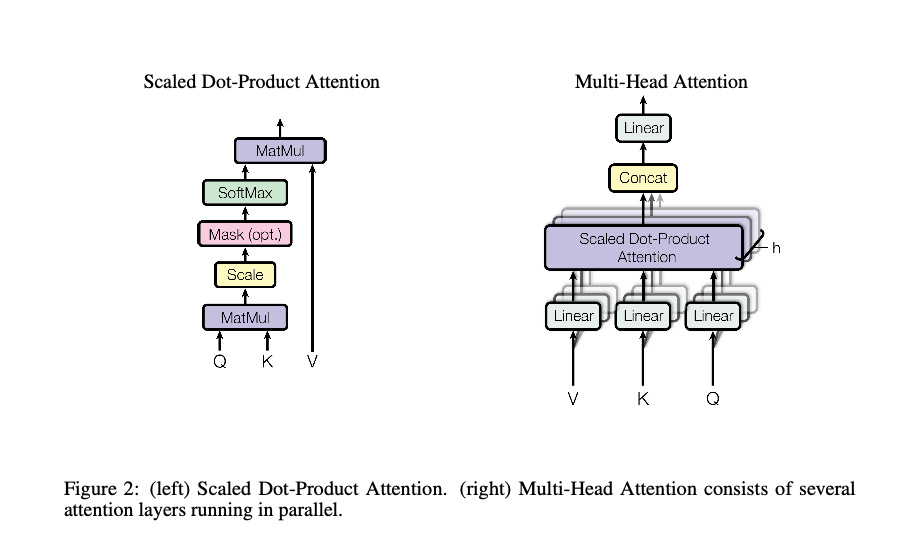
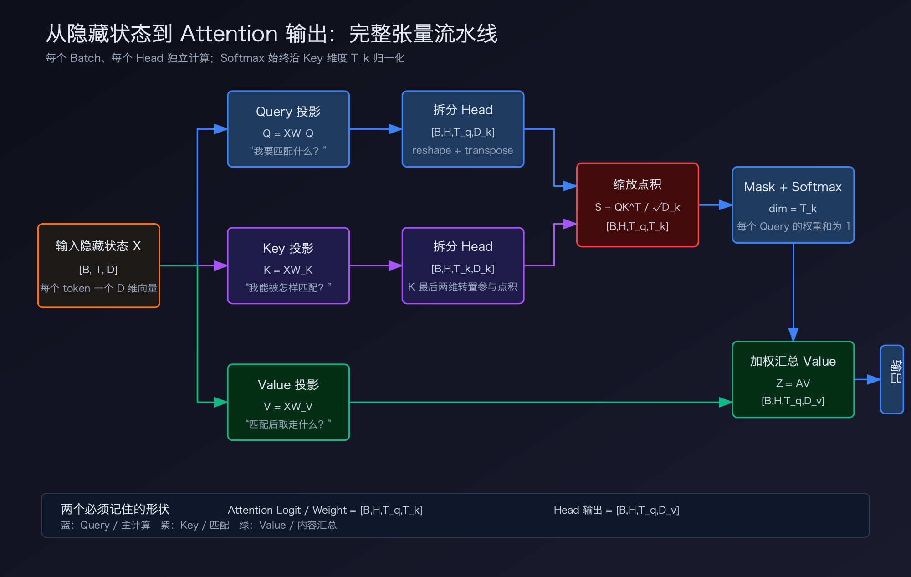
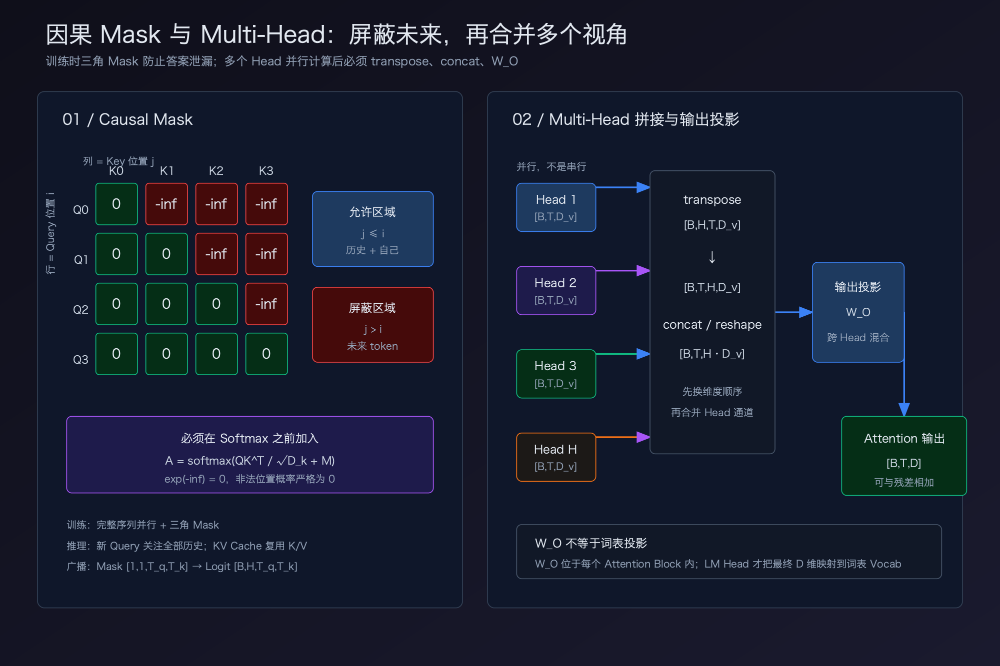
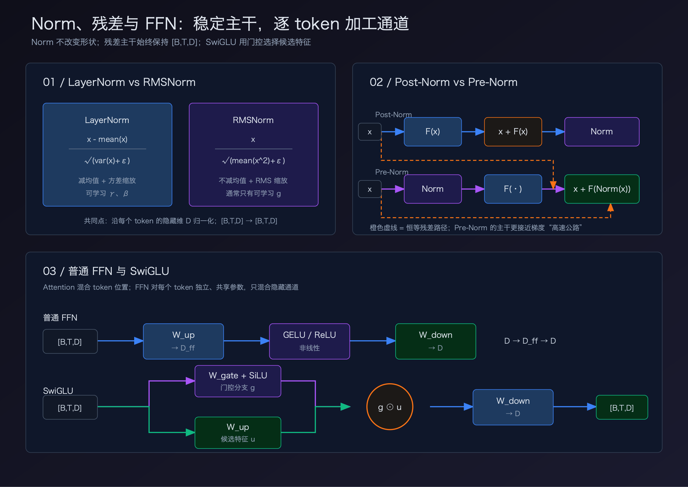
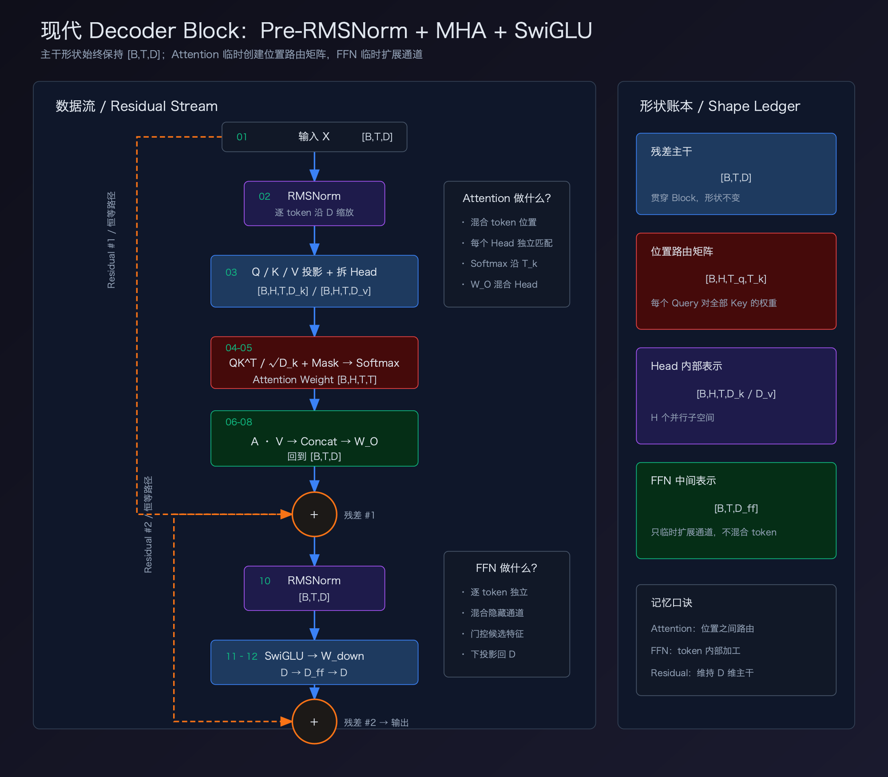

# Transformer 核心张量与模块原理

本文聚焦实现和理解 Transformer 时最容易混淆的六部分：

1. Q、K、V 的张量形状与含义；
2. 因果 Mask；
3. Multi-Head Attention 的拆分与拼接；
4. Attention 输出投影；
5. LayerNorm、RMSNorm 与残差连接；
6. MLP、GELU 与 SwiGLU。

阅读目标不是记住名词，而是能够从输入形状一路推导出每一步的输出形状。

## 1. 统一符号

| 符号 | 含义 |
|---|---|
| $B$ | Batch Size |
| $T_q$ | Query 序列长度 |
| $T_k$ | Key、Value 序列长度 |
| $D$ | 模型主维度，即 $d_{model}$ |
| $H$ | Query Head 数 |
| $D_k$ | 每个 Head 的 Query、Key 维度 |
| $D_v$ | 每个 Head 的 Value 维度 |
| $D_{ff}$ | MLP/FFN 中间维度 |

原始 Transformer Base 使用：

$$
D=512,\qquad H=8,\qquad D_k=D_v=64,\qquad D_{ff}=2048
$$

并满足：

$$
H\times D_k=H\times D_v=D
$$

现代模型中这个等式不一定始终成立，例如 GQA 会让 KV Head 数少于 Query Head 数；但 Attention 的基本推导不变。

## 2. Q、K、V 到底是什么



> 图源：Vaswani et al., 2017, Figure 2。左侧是单个 Head 的 Scaled Dot-Product Attention，右侧是多个 Head 并行计算、拼接并进行输出投影。



> 暗黑极客风张量图：从 `[B,T,D]` 出发，依次展示 Q/K/V 投影、拆分 Head、缩放点积、Mask、Softmax 与 Value 汇总。

### 2.1 从隐藏状态投影出 Q、K、V

设输入隐藏状态为：

$$
X\in\mathbb{R}^{B\times T\times D}
$$

Self-Attention 使用三个不同的可学习矩阵：

$$
Q=XW_Q,\qquad K=XW_K,\qquad V=XW_V
$$

如果先不拆 Head，则：

$$
W_Q\in\mathbb{R}^{D\times(HD_k)},\quad
W_K\in\mathbb{R}^{D\times(HD_k)},\quad
W_V\in\mathbb{R}^{D\times(HD_v)}
$$

投影后再 reshape 和 transpose：

$$
Q,K\in\mathbb{R}^{B\times H\times T\times D_k},\qquad
V\in\mathbb{R}^{B\times H\times T\times D_v}
$$

在原始 Transformer Base 中：

$$
[B,T,512]\rightarrow[B,T,8\times64]\rightarrow[B,8,T,64]
$$

### 2.2 Q、K、V 的分工

- **Query**：当前位置用来匹配其他位置的向量。
- **Key**：每个候选位置参与匹配的向量。
- **Value**：匹配得到权重后，真正被加权汇总的内容。

注意：Q、K、V 都是从隐藏状态学习出来的表示，并不是输入中预先存在的三种数据。

### 2.3 Attention 的完整形状推导

为支持 Self-Attention 和 Cross-Attention，下面分别保留 $T_q$ 与 $T_k$：

$$
Q:[B,H,T_q,D_k],\quad
K:[B,H,T_k,D_k],\quad
V:[B,H,T_k,D_v]
$$

第一步，计算每个 Query 与所有 Key 的相似度：

$$
S=\frac{QK^\top}{\sqrt{D_k}}
$$

最后两个维度执行矩阵乘法：

$$
[T_q,D_k]\times[D_k,T_k]=[T_q,T_k]
$$

所以：

$$
S\in\mathbb{R}^{B\times H\times T_q\times T_k}
$$

第二步，在 Key 维度，也就是最后一维上执行 Softmax：

$$
A=\operatorname{softmax}(S,\operatorname{dim}=-1)
$$

其中 $A[b,h,i,j]$ 表示第 $b$ 个样本、第 $h$ 个 Head 中，第 $i$ 个 Query 对第 $j$ 个 Key 的注意力权重。固定前三个索引时，最后一维之和为 1：

$$
\sum_{j=1}^{T_k}A[b,h,i,j]=1
$$

第三步，用注意力权重汇总 Value：

$$
Z=AV
$$

形状为：

$$
[T_q,T_k]\times[T_k,D_v]=[T_q,D_v]
$$

因此每个 Head 的输出为：

$$
Z\in\mathbb{R}^{B\times H\times T_q\times D_v}
$$

### 2.4 Self-Attention 与 Cross-Attention

| 类型 | Q 来自哪里 | K、V 来自哪里 | 长度关系 |
|---|---|---|---|
| Self-Attention | 当前序列 | 当前序列 | $T_q=T_k=T$ |
| Decoder Causal Self-Attention | Decoder 当前序列 | Decoder 当前序列 | $T_q=T_k=T$，再加因果 Mask |
| Cross-Attention | Decoder 隐藏状态 | Encoder 最终输出 | $T_q$ 与 $T_k$ 可以不同 |

## 3. 因果 Mask



> 左侧展示因果 Mask 的下三角允许区域；右侧展示多个 Head 并行输出经过 transpose、concat 和 $W_O$ 回到 `[B,T,D]`。

### 3.1 为什么需要 Mask

训练自回归模型时，一次会并行输入完整目标序列。如果不加限制，位置 $i$ 会直接看到未来位置 $i+1,i+2,\ldots$，形成答案泄漏。

因果 Mask 要保证：

$$
\text{位置 }i\text{ 只能关注满足 }j\le i\text{ 的位置}
$$

对长度为 4 的序列，Mask 为：

$$
M=
\begin{bmatrix}
0 & -\infty & -\infty & -\infty\\
0 & 0 & -\infty & -\infty\\
0 & 0 & 0 & -\infty\\
0 & 0 & 0 & 0
\end{bmatrix}
$$

行表示 Query 位置，列表示 Key 位置。主对角线保留，说明 token 可以关注自己。

### 3.2 Mask 必须加在 Softmax 之前

正确顺序是：

$$
A=\operatorname{softmax}\left(\frac{QK^\top}{\sqrt{D_k}}+M\right)
$$

因为：

$$
e^{-\infty}=0
$$

未来位置经过 Softmax 后权重严格为 0。不能简单地在 Logit 中给非法位置加 0，因为 0 仍然会参与 Softmax；如果在 Softmax 后再清零，还需要重新归一化。

### 3.3 Mask 的广播形状

Attention Logit 通常是：

$$
[B,H,T_q,T_k]
$$

因果 Mask 可以存成：

$$
[1,1,T_q,T_k]
$$

然后在 Batch 和 Head 维度广播。Padding Mask 则通常从每个样本的有效长度产生，用于屏蔽 `<pad>`；它和因果 Mask 解决的是两个不同问题，可以组合使用。

### 3.4 训练与推理的区别

- **训练**：完整序列并行进入模型，依靠三角 Mask 阻止未来信息泄漏。
- **推理**：每次通常只生成一个新 token，并通过 KV Cache 复用历史 $K,V$。新 Query 可以看到全部历史，但看不到尚未生成的未来。

## 4. Multi-Head 拼接与输出投影

### 4.1 为什么要多个 Head

多个 Head 使用不同的 $W_Q,W_K,W_V$，可以在不同表示子空间中学习不同的匹配关系。它们是并行的，不是第一个 Head 的输出再传给第二个 Head。

每个 Head 的输出：

$$
Z_h\in\mathbb{R}^{B\times T_q\times D_v}
$$

把 $H$ 个 Head 沿最后一维拼接：

$$
Z_{cat}=\operatorname{Concat}(Z_1,\ldots,Z_H)
$$

$$
Z_{cat}\in\mathbb{R}^{B\times T_q\times(HD_v)}
$$

原始 Transformer Base 中：

$$
[B,8,T,64]\xrightarrow{\text{transpose + reshape}}[B,T,512]
$$

实现时不能忽略维度顺序：常见内部布局是 `[B, H, T, D_v]`，拼接前要先转成 `[B, T, H, D_v]`，再 reshape 为 `[B, T, H D_v]`。

### 4.2 输出投影 $W_O$

拼接后还要经过：

$$
Y=Z_{cat}W_O
$$

$$
W_O\in\mathbb{R}^{(HD_v)\times D},\qquad
Y\in\mathbb{R}^{B\times T_q\times D}
$$

$W_O$ 有两个关键作用：

1. 混合不同 Head 的输出，而不是让各 Head 永远占据固定通道；
2. 把结果投影回 $D$ 维，使它能与残差分支的输入相加。

Attention 的输出投影不是语言模型最后的词表投影。前者发生在每个 Attention Block 内，后者把最终隐藏状态从 $D$ 维映射到词表大小 $V_{ocab}$。

### 4.3 一段带形状的伪代码

下面假设标准 MHA，并且 $D_k=D_v=D/H$：

```python
# x: [B, T, D]
q = q_proj(x).view(B, T, H, D_k).transpose(1, 2)  # [B, H, T, D_k]
k = k_proj(x).view(B, T, H, D_k).transpose(1, 2)  # [B, H, T, D_k]
v = v_proj(x).view(B, T, H, D_v).transpose(1, 2)  # [B, H, T, D_v]

scores = q @ k.transpose(-2, -1) / sqrt(D_k)       # [B, H, T, T]
scores = scores.masked_fill(~causal_mask, -inf)
weights = softmax(scores, dim=-1)                  # [B, H, T, T]
heads = weights @ v                                # [B, H, T, D_v]

merged = heads.transpose(1, 2).reshape(B, T, H * D_v)
out = o_proj(merged)                               # [B, T, D]
```

## 5. 残差连接、LayerNorm 与 RMSNorm



> 上半部分对比 LayerNorm、RMSNorm、Post-Norm 与 Pre-Norm；下半部分对比普通 FFN 与 SwiGLU 的数据路径。

### 5.1 残差连接

Attention 或 MLP 子层学习的是对输入的增量：

$$
y=x+F(x)
$$

残差连接保留一条恒等信息通路，使信息与梯度更容易穿过深层网络。它要求 $F(x)$ 的输出与 $x$ 形状相同，这也是 Attention 输出投影和 MLP 降回 $D$ 维的重要原因。

### 5.2 LayerNorm

对单个 token 的隐藏向量 $x\in\mathbb{R}^{D}$：

$$
\mu=\frac{1}{D}\sum_{i=1}^{D}x_i,\qquad
\sigma^2=\frac{1}{D}\sum_{i=1}^{D}(x_i-\mu)^2
$$

$$
\operatorname{LayerNorm}(x)
=\frac{x-\mu}{\sqrt{\sigma^2+\epsilon}}\odot\gamma+\beta
$$

LayerNorm 沿每个 token 的隐藏维度 $D$ 归一化，不跨 Batch，也不跨序列位置。$gamma$ 和 $\beta$ 是可学习参数。

### 5.3 RMSNorm

RMSNorm 去掉均值中心化，只按均方根缩放：

$$
\operatorname{rms}(x)=\sqrt{\frac{1}{D}\sum_{i=1}^{D}x_i^2+\epsilon}
$$

$$
\operatorname{RMSNorm}(x)=\frac{x}{\operatorname{rms}(x)}\odot g
$$

| 对比 | LayerNorm | RMSNorm |
|---|---|---|
| 减均值 | 是 | 否 |
| 按方差或均方根缩放 | 方差 | 均方根 |
| 可学习参数 | $\gamma,\beta$ | 通常只有 $g$ |
| 输出形状 | 不变 | 不变 |
| 常见使用 | 原始 Transformer、BERT 等 | 许多现代 Decoder LLM |

RMSNorm 的目标不是改变张量形状，而是控制数值尺度。它计算更简单，但不能仅凭这一点断言在所有硬件和实现上都一定更快。

### 5.4 Post-Norm 与 Pre-Norm

原始 Transformer 使用 Post-Norm：

$$
y=\operatorname{Norm}(x+\operatorname{Dropout}(F(x)))
$$

现代深层 Transformer 常使用 Pre-Norm：

$$
y=x+\operatorname{Dropout}(F(\operatorname{Norm}(x)))
$$

Pre-Norm 让残差主干更接近恒等映射，通常更容易稳定训练很深的网络；模型 Stack 末尾通常还会再放一次 Norm。

## 6. MLP、FFN 与 SwiGLU

### 6.1 MLP 和 FFN 是什么关系

MLP（Multi-Layer Perceptron，多层感知机）是通用概念，通常由线性层和非线性激活函数交替组成。FFN（Feed-Forward Network，前馈网络）强调信息从输入单向流向输出、不包含循环连接。在 Transformer 语境中，MLP、FFN、Position-wise FFN 通常指同一类子模块：Transformer 使用的逐位置 MLP。

这里的“前馈”描述网络连接方式，并不是“前向传播”的简称。该模块对每个 token 独立应用同一组参数，不负责 token 之间的信息交换：

$$
[B,T,D]\rightarrow[B,T,D_{ff}]\rightarrow[B,T,D]
$$

Attention 混合序列位置，MLP 混合每个 token 内部的特征通道。

三者可以按下面的层次理解：

```text
MLP：通用的线性层 + 非线性激活结构
└── Transformer FFN：逐 token 应用的 MLP 子层
    ├── ReLU/GELU FFN
    └── SwiGLU FFN：带 SiLU 门控的 FFN
```

### 6.2 原始 FFN

原论文采用两层线性变换和 ReLU：

$$
\operatorname{FFN}(x)=\operatorname{ReLU}(xW_1+b_1)W_2+b_2
$$

$$
W_1:[D,D_{ff}],\qquad W_2:[D_{ff},D]
$$

Transformer Base 的维度是：

$$
512\rightarrow2048\rightarrow512
$$

后来的模型常用更平滑的 GELU：

$$
\operatorname{MLP}(x)=\operatorname{GELU}(xW_1)W_2
$$

对应的简化伪代码是：

```python
hidden = gelu(x @ W_up)      # [B, T, D_ff]
output = hidden @ W_down     # [B, T, D]
```

### 6.3 SwiGLU

SwiGLU 增加一条门控分支：

$$
u=xW_u,\qquad g=\operatorname{SiLU}(xW_g)
$$

$$
\operatorname{SwiGLU}(x)=(u\odot g)W_d
$$

其中：

$$
\operatorname{SiLU}(z)=z\cdot\operatorname{sigmoid}(z)
$$

张量形状为：

$$
x:[B,T,D]
$$

$$
xW_u,\ xW_g:[B,T,D_{ff}]
$$

$$
(xW_u)\odot\operatorname{SiLU}(xW_g):[B,T,D_{ff}]
$$

$$
\text{输出}:[B,T,D]
$$

普通 FFN 有两个主要权重矩阵，SwiGLU 有三个。为了在相近参数量下比较，如果普通 FFN 使用 $D_{ff}=4D$，SwiGLU 常把中间维度设置在约 $\frac{8}{3}D$ 附近，再按硬件友好的倍数取整；实际模型配置并不统一。

SwiGLU 的直觉是：一条分支生成候选特征，另一条分支学习哪些特征应该通过。这里的“门”是逐元素乘法，不会改变 Batch 或序列长度。

对应的简化伪代码是：

```python
value = x @ W_up             # [B, T, D_ff]
gate = silu(x @ W_gate)      # [B, T, D_ff]
output = (value * gate) @ W_down  # [B, T, D]
```

## 7. 一个现代 Decoder Block 的形状账本

下面使用 Pre-RMSNorm、标准 MHA 和 SwiGLU。所有残差主干始终保持 `[B, T, D]`：



> 左侧沿数据流追踪两次 Pre-RMSNorm、Attention、SwiGLU 和残差相加；右侧集中列出四类关键张量形状。

| 步骤 | 操作 | 输出形状 |
|---:|---|---|
| 1 | 输入 $X$ | `[B, T, D]` |
| 2 | $X_n=\operatorname{RMSNorm}(X)$ | `[B, T, D]` |
| 3 | Q/K/V 投影并拆 Head | `[B, H, T, D_k]`、`[B, H, T, D_k]`、`[B, H, T, D_v]` |
| 4 | $QK^\top/\sqrt{D_k}$ | `[B, H, T, T]` |
| 5 | 加因果 Mask 后 Softmax | `[B, H, T, T]` |
| 6 | Attention Weight 乘 $V$ | `[B, H, T, D_v]` |
| 7 | 拼接所有 Head | `[B, T, H D_v]` |
| 8 | 输出投影 $W_O$ | `[B, T, D]` |
| 9 | 第一次残差相加 | `[B, T, D]` |
| 10 | RMSNorm | `[B, T, D]` |
| 11 | SwiGLU 上投影与门控 | `[B, T, D_{ff}]` |
| 12 | SwiGLU 下投影 | `[B, T, D]` |
| 13 | 第二次残差相加 | `[B, T, D]` |

最需要记住的两个中间形状：

$$
\text{Attention Logit/Weight}:[B,H,T_q,T_k]
$$

$$
\text{残差主干}:[B,T,D]
$$

前者负责位置之间的路由，后者贯穿整个网络。

## 8. 常见误区

1. **把 $D_k$ 当成全部 Q/K 的维度**：$D_k$ 通常是每个 Head 的维度，全部 Head 合起来是 $H D_k$。
2. **Softmax 维度选错**：应该在 Key 维度 $T_k$ 上归一化，而不是 Head 或 Query 维度。
3. **用 0 代替 $-\infty$ 做 Mask**：加 0 不会屏蔽位置。
4. **忘记拼接前转置**：`[B,H,T,D_v]` 不能直接按错误的内存顺序 reshape 成 `[B,T,HD_v]`。
5. **把 $W_O$ 与词表投影混为一谈**：$W_O$ 是 Attention Block 内部投影。
6. **认为 Norm 会改变形状**：LayerNorm 和 RMSNorm 只调整数值，不改变张量形状。
7. **认为 MLP 会混合 token**：标准 Position-wise MLP 只混合隐藏维度，token 之间的交互由 Attention 完成。
8. **认为 KV Cache 让 Attention 变成常数复杂度**：它避免重复计算历史 $K,V$，但新 Query 仍需与历史 Key 做匹配。

## 9. 掌握标准与自测

如果能够独立回答下面的问题，说明已经掌握本节核心：

1. 已知 $B=2,T=128,D=512,H=8$，写出拆 Head 后 Q、K、V 的形状。
2. 为什么 Attention Logit 是 `[B,H,T_q,T_k]`？
3. 因果 Mask 为什么必须在 Softmax 前加入？
4. 多个 Head 拼接后为什么还需要 $W_O$？
5. LayerNorm 与 RMSNorm 的计算差别是什么？它们沿哪个维度归一化？
6. 为什么残差连接要求 Attention 和 MLP 最终回到 $D$ 维？
7. 普通 FFN 与 SwiGLU 在权重矩阵数量和计算过程上有什么区别？
8. KV Cache 缓存什么？它没有消除哪部分计算？

### 参考答案

1. **Q、K、V 的形状**

   在标准 MHA 且 $D_k=D_v=D/H$ 时：

   $$
   D_k=D_v=\frac{512}{8}=64
   $$

   因此：

   $$
   Q,K,V:[2,8,128,64]
   $$

2. **为什么 Attention Logit 是 `[B,H,T_q,T_k]`？**

   每个 Batch、每个 Head 独立计算：

   $$
   Q:[B,H,T_q,D_k]
   $$

   $$
   K^\top:[B,H,D_k,T_k]
   $$

   最后两个维度相乘：

   $$
   [T_q,D_k]\times[D_k,T_k]=[T_q,T_k]
   $$

   所以结果是 `[B,H,T_q,T_k]`。其中每一行表示一个 Query 对全部 $T_k$ 个 Key 的分数。

3. **因果 Mask 为什么必须在 Softmax 前加入？**

   Mask 把未来位置的 Logit 设为 $-\infty$：

   $$
   \operatorname{softmax}(-\infty)=0
   $$

   这样非法位置的概率为 0，其余合法位置会自动重新归一化且总和为 1。如果在 Softmax 后直接清零，剩余权重之和通常不再等于 1，还需要额外归一化；在 Logit 中加 0 则完全没有屏蔽效果。

4. **多个 Head 拼接后为什么还需要 $W_O$？**

   Concat 只是把不同 Head 的通道并排放在一起，并没有让它们互相混合。$W_O$ 会：

   - 学习不同 Head 之间的特征组合；
   - 把 $HD_v$ 维映射回模型主维度 $D$；
   - 保证 Attention 输出可以与 `[B,T,D]` 的残差分支相加。

   即使原始 Transformer 中 $HD_v=D$，$W_O$ 仍然承担跨 Head 混合，而不只是调整形状。

5. **LayerNorm 与 RMSNorm 有什么区别？沿哪个维度归一化？**

   二者都对每个 token 的最后一个隐藏维度 $D$ 独立归一化，不跨 Batch，也不跨序列位置。

   - LayerNorm：先减去均值，再除以标准差，最后应用可学习参数 $\gamma,\beta$。
   - RMSNorm：不减均值，只除以均方根，通常只有可学习缩放参数 $g$。

   它们都保持形状 `[B,T,D]` 不变，只调整数值分布。

6. **为什么残差连接要求 Attention 和 MLP 最终回到 $D$ 维？**

   残差连接执行逐元素相加：

   $$
   y=x+F(x)
   $$

   当 $x$ 的形状是 `[B,T,D]` 时，$F(x)$ 也必须是 `[B,T,D]`。因此 Attention 拼接后通过 $W_O$ 回到 $D$ 维，MLP 在扩大到 $D_{ff}$ 后也要通过下投影回到 $D$ 维。

7. **普通 FFN 与 SwiGLU 有什么区别？**

   普通 FFN 有两个主要权重矩阵：

   $$
   \operatorname{FFN}(x)=\phi(xW_1)W_2
   $$

   数据经过一次上投影、激活函数和一次下投影。

   SwiGLU 有三个主要权重矩阵：

   $$
   \operatorname{SwiGLU}(x)
   =[\operatorname{SiLU}(xW_g)\odot(xW_u)]W_d
   $$

   $W_g$ 产生门控值，$W_u$ 产生候选特征，二者逐元素相乘后再由 $W_d$ 投影回 $D$ 维。因为多了一个投影矩阵，进行相近参数量比较时通常会适当减小 SwiGLU 的 $D_{ff}$。

8. **KV Cache 缓存什么？没有消除什么计算？**

   KV Cache 为每一层缓存历史 token 投影后的 Key 和 Value；使用 RoPE 时，通常缓存已经应用位置旋转的 Key。生成新 token 时只需计算新 token 的 Q、K、V，不必重新计算全部历史 $K,V$。

   但它没有消除新 Query 与全部历史 Key 的匹配，也没有消除对历史 Value 的加权汇总。因此单个新 token 的 Attention 工作量仍随当前上下文长度近似线性增长，KV Cache 占用也会随层数和上下文长度增长。

建议在实现中为每一步加入 `assert tensor.shape == ...`，用实际张量验证上述推导。

## 10. 参考资料

- [Attention Is All You Need](https://arxiv.org/abs/1706.03762)：Scaled Dot-Product Attention、Multi-Head Attention、Post-LN 和原始 FFN。
- [Root Mean Square Layer Normalization](https://arxiv.org/abs/1910.07467)：RMSNorm。
- [On Layer Normalization in the Transformer Architecture](https://arxiv.org/abs/2002.04745)：Pre-LN 与 Post-LN 的梯度分析。
- [GLU Variants Improve Transformer](https://arxiv.org/abs/2002.05202)：SwiGLU 等门控 FFN 变体。
