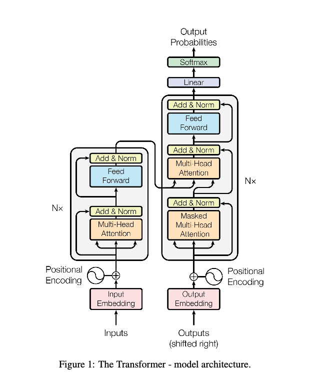
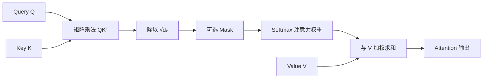

# 《Attention Is All You Need》结构与技术摘要

> Vaswani et al., 2017。论文提出 Transformer：移除序列建模中的 RNN 和 CNN，用 Attention 在不同位置之间交换信息，从而提高训练并行度并缩短长距离依赖的传播路径。

论文：[本地 PDF](./1706.03762v7.pdf)｜[arXiv](https://arxiv.org/abs/1706.03762)

## 1. 模型结构

基础模型参数：$N=6$、$d_{model}=512$、$d_{ff}=2048$、$h=8$、$d_k=d_v=64$。

### 1.1 参数含义与维度变化

| 参数 | 含义 | 在基础模型中的作用 |
|---|---|---|
| $N=6$ | Encoder、Decoder 各自的堆叠层数 | 6 个 Encoder Layer 加 6 个 Decoder Layer；各层结构相同，但参数不共享 |
| $d_{model}=512$ | 每个 token 的主表示维度 | Embedding、Attention 输出和 FFN 输出都是 512 维，才能进行残差相加 |
| $d_{ff}=2048$ | FFN 中间隐藏层维度 | 每个 token 独立经历 $512\rightarrow2048\rightarrow512$ 的非线性变换 |
| $h=8$ | Multi-Head Attention 的 Head 数 | 将 Attention 分成 8 个不同的表示子空间并行计算 |
| $d_k=64$ | 每个 Head 的 Query、Key 维度 | 用于计算 $QK^\top/\sqrt{d_k}$ 的相关性分数 |
| $d_v=64$ | 每个 Head 的 Value 维度 | 每个 Head 输出一个 64 维的信息向量 |

设序列长度为 $L$，暂时省略 Batch 维度，则进入 Transformer 的隐藏状态为：

$$
X\in\mathbb{R}^{L\times512}
$$

在每个 Attention Head 内，投影后的张量形状为：

$$
Q,K,V\in\mathbb{R}^{L\times64}
$$

8 个 Head 分别计算后拼接，正好恢复到模型主维度：

$$
\operatorname{Concat}(\operatorname{head}_1,\ldots,\operatorname{head}_8)
\in\mathbb{R}^{L\times(8\times64)}
=\mathbb{R}^{L\times512}
$$

因此这些参数之间的关键关系是：

$$
d_k=d_v=\frac{d_{model}}{h}=\frac{512}{8}=64
$$

一个 Transformer Layer 内的主要维度流转可以概括为：

$$
\boxed{
512
\xrightarrow{\text{8 Heads，每个 64 维}}
8\times64
\xrightarrow{\text{Concat}}
512
\xrightarrow{\text{FFN}}
2048
\rightarrow512
}
$$

> 图源：Vaswani et al., 2017, Figure 1。左侧为 Encoder，右侧为 Decoder；图中的 $N\times$ 在基础模型中表示顺序堆叠 6 层。

按原论文 Figure 1 从下往上阅读：

1. **输入表示**：输入和输出 token 分别经过 Embedding，再与 Positional Encoding 相加。训练时，Decoder 接收右移一位的目标序列。
2. **Encoder**：每层依次包含 Multi-Head Self-Attention 和逐位置 Feed-Forward Network，共堆叠 $N=6$ 层；Self-Attention 的 $Q,K,V$ 均来自 Encoder 前一层。
3. **Decoder**：每层依次包含 Masked Multi-Head Self-Attention、Encoder-Decoder Attention 和 Feed-Forward Network，同样堆叠 $N=6$ 层。Mask 阻止当前位置看到后续 token。
4. **连接 Encoder 与 Decoder**：在每个 Encoder-Decoder Attention 子层中，$Q$ 来自 Decoder，$K,V$ 来自最终 Encoder 输出，因此每个输出位置都能关注全部输入位置。
5. **输出概率**：Decoder Stack 的输出经过 Linear 和 Softmax，得到下一个 token 的概率分布；推理时再通过搜索或采样选出 token，并继续自回归生成。

每个子层外都有残差连接，随后执行 Layer Normalization。原论文采用 Post-LN：
$\operatorname{LayerNorm}(x+\operatorname{Sublayer}(x))$。逐位置前馈网络为
$\operatorname{FFN}(x)=\max(0,xW_1+b_1)W_2+b_2$。

## 2. Attention

缩放点积注意力：

$$
\operatorname{Attention}(Q,K,V)
=\operatorname{softmax}\left(\frac{QK^\top}{\sqrt{d_k}}\right)V
$$

$QK^\top$ 衡量 Query 与 Key 的相关性；除以 $\sqrt{d_k}$ 可避免高维点积过大、Softmax 饱和和梯度变小。Mask 在 Decoder 中把非法的未来位置设为 $-\infty$。

多头注意力先将 $Q,K,V$ 投影到多个子空间并行计算，再拼接结果：

$$
\operatorname{head}_i=\operatorname{Attention}(QW_i^Q,KW_i^K,VW_i^V)
$$

$$
\operatorname{MultiHead}(Q,K,V)
=\operatorname{Concat}(\operatorname{head}_1,\ldots,\operatorname{head}_h)W^O
$$

不同 Head 可以关注不同位置与表示子空间。由于每个 Head 的维度缩小为 $d_{model}/h$，多头注意力的总体计算量与单个全维 Attention 大致相当。

## 3. 从原始 Transformer 到主流变体

> 下面这些技术并非都出现在 2017 年原论文中。理解时应区分“原始 Transformer 的设计”和“后来模型的常见改造”。

### 3.1 位置编码

Self-Attention 本身不区分 token 顺序，因此必须额外注入位置信息。

| 方法 | 如何加入位置 | 特点与常见用途 |
|---|---|---|
| **固定正弦编码** | 将不同频率的 $sin/\cos$ 向量加到 Token Embedding | 原论文采用；无可学习参数，理论上可计算任意位置 |
| **可学习绝对位置向量** | 为每个位置学习一个向量并与 Token Embedding 相加 | 实现简单；通常受训练时最大位置范围限制，BERT 等模型使用 |
| **相对位置编码 / Bias** | 根据 $i-j$ 修改 Attention Logit | 直接表达相对距离；Transformer-XL、T5 等采用不同实现 |
| **RoPE** | 按位置旋转每个 Head 的 $Q,K$，不旋转 $V$ | 让点积自然包含相对位置信息，是现代 Decoder LLM 的常见选择 |
| **ALiBi** | 给 Attention Logit 加上与距离成比例的线性惩罚 | 不需要位置向量，结构简单，并强调长度外推能力 |

[RoPE](https://arxiv.org/abs/2104.09864) 的核心关系为：

$$
q_m'=R_mq,\qquad k_n'=R_nk,\qquad
{q_m'}^\top k_n'=q^\top R_{n-m}k
$$

因此 $Q,K$ 分别编码绝对位置 $m,n$，但它们的点积只显式依赖相对位置 $n-m$。长上下文模型还会在 RoPE 之上使用位置插值或频率缩放；这些是 RoPE 的扩展策略，不是另一种 Attention。

[ALiBi](https://arxiv.org/abs/2108.12409) 则直接修改打分：

$$
\operatorname{score}_{ij}=\frac{q_i k_j^\top}{\sqrt{d_k}}-a_h|i-j|
$$

其中不同 Head 使用不同斜率 $a_h$。

### 3.2 残差连接与归一化

残差连接将子层学习目标从完整映射变成增量 $F(x)$：$y=x+F(x)$。它保留恒等信息通路，使深层网络中的信息和梯度更容易传播。归一化则控制隐藏状态尺度，改善训练稳定性。

| 结构 | 计算顺序 | 说明 |
|---|---|---|
| **Post-LN** | $y=\operatorname{LN}(x+\operatorname{Dropout}(F(x)))$ | 原论文结构；深层模型通常更依赖学习率 Warmup |
| **Pre-LN** | $y=x+\operatorname{Dropout}(F(\operatorname{Norm}(x)))$ | 先归一化再进入子层，梯度通常更稳定；现代深层 Transformer 常用，Stack 末尾通常再加一次 Norm |

落实到一个包含 Attention 和 FFN 的 Block，二者顺序分别是：

$$
\begin{aligned}
\text{Post-LN:}\quad h&=\operatorname{LN}(x+\operatorname{Dropout}(\operatorname{Attention}(x))),\\
y&=\operatorname{LN}(h+\operatorname{Dropout}(\operatorname{FFN}(h))) \\
\text{Pre-LN:}\quad h&=x+\operatorname{Dropout}(\operatorname{Attention}(\operatorname{Norm}(x))),\\
y&=h+\operatorname{Dropout}(\operatorname{FFN}(\operatorname{Norm}(h)))
\end{aligned}
$$

[Pre-LN 分析](https://arxiv.org/abs/2002.04745)指出，归一化位置会显著影响初始化时的梯度行为。Norm 本身也有两种常见选择：

- **LayerNorm**：减去均值并除以标准差，再应用可学习的缩放和平移。
- **RMSNorm**：不做均值中心化，只按均方根缩放：

$$
\operatorname{RMSNorm}(x)
=\frac{x}{\sqrt{\frac{1}{d}\sum_{i=1}^{d}x_i^2+\epsilon}}\odot g
$$

[RMSNorm](https://arxiv.org/abs/1910.07467) 计算更简单。现代 Decoder LLM 中常见的组合是 **Pre-Norm + RMSNorm + Residual**。

### 3.3 Attention 与推理效率

| 技术 | 核心做法 | 主要作用 |
|---|---|---|
| **MHA** | 每个 Head 都有独立的 $Q,K,V$ | 原论文方案，表达能力强 |
| **MQA** | 多个 Query Head 共享一组 $K,V$ | 显著减小 KV Cache 和解码带宽，可能损失部分质量 |
| **GQA** | 多个 Query Head 分组共享若干组 $K,V$ | 在 MHA 质量与 MQA 推理效率之间折中 |
| **KV Cache** | 自回归生成时缓存历史 token 的 $K,V$ | 避免每一步重新计算历史 $K,V$；但每个新 token 仍需关注历史位置，Cache 随上下文增长 |
| **FlashAttention** | 分块计算精确 Attention，减少 HBM 与片上 SRAM 之间的数据搬运 | 不改变 Attention 数学结果，也不消除 $O(n^2)$ 计算量，但能显著减少中间显存和实际耗时 |
| **局部 / 滑动窗口 Attention** | 每个 token 只关注邻近窗口，必要时混入少量全局连接 | 将长序列 Attention 从平方计算降到近似线性，但会限制直接可见范围 |

[MQA](https://arxiv.org/abs/1911.02150) 共享全部 KV Head；[GQA](https://arxiv.org/abs/2305.13245) 使用介于 1 和 Query Head 数之间的 KV Head；[FlashAttention](https://arxiv.org/abs/2205.14135) 是精确 Attention 的 IO 优化算法，不是新的 Attention 公式。

### 3.4 FFN 与激活函数

Attention 负责不同 token 之间的信息混合，FFN 则在每个 token 内部独立地变换特征维度。

| FFN | 形式 | 使用情况 |
|---|---|---|
| **ReLU FFN** | $\max(0,xW_1+b_1)W_2+b_2$ | 原论文采用 |
| **GELU FFN** | 用平滑的 GELU 替代 ReLU | BERT、GPT 系模型中常见 |
| **SwiGLU FFN** | $[\operatorname{SiLU}(xW_g)\odot(xW_u)]W_d$ | 增加门控分支，现代 LLM 常见；通常会相应调整中间维度以控制参数量 |
| **MoE FFN** | Router 为每个 token 选择少量 Expert FFN | 在不等比例增加每 token 计算量的情况下扩大参数容量，但会增加路由、负载均衡和跨设备通信复杂度 |

[SwiGLU 等 GLU 变体](https://arxiv.org/abs/2002.05202)通过两个投影的逐元素门控增强 FFN；[Switch Transformer](https://arxiv.org/abs/2101.03961)则用稀疏路由的 Expert 替换密集 FFN。

### 3.5 三种整体架构

- **Encoder-Decoder**：原始 Transformer。Encoder 双向理解输入，Decoder 通过 Cross-Attention 读取 Encoder，适合翻译、摘要等条件生成。
- **Encoder-only**：只保留 Encoder，允许双向 Attention，常用于理解、分类和向量表示，代表模型是 BERT。
- **Decoder-only**：只保留带 Causal Mask 的 Decoder Self-Attention，不再需要 Encoder-Decoder Attention，适合续写和自回归生成，是生成式 LLM 的常见架构。

一个典型的现代 Decoder-only Block 可以概括为：

> Pre-RMSNorm → $Q,K,V$ 投影 → RoPE 作用于 $Q,K$ → MHA/GQA → Residual → Pre-RMSNorm → SwiGLU FFN → Residual；推理时配合 KV Cache，计算内核常使用 FlashAttention。

这是一种常见组合而非统一标准。例如 [OpenELM](https://arxiv.org/abs/2404.14619) 同时采用 RMSNorm、RoPE、GQA 和 SwiGLU，不同模型仍会按训练稳定性、上下文长度和推理硬件进行取舍。

## 4. 复杂度比较

设序列长度为 $n$，表示维度为 $d$，卷积核宽度为 $k$，局部注意力窗口为 $r$。

| 层类型 | 每层复杂度 | 最少串行操作数 | 最长依赖路径 |
|---|---:|---:|---:|
| Self-Attention | $O(n^2d)$ | $O(1)$ | $O(1)$ |
| Recurrent | $O(nd^2)$ | $O(n)$ | $O(n)$ |
| Convolutional（扩张卷积） | $O(knd^2)$ | $O(1)$ | $O(\log_k n)$ |
| Restricted Self-Attention | $O(rnd)$ | $O(1)$ | $O(n/r)$ |

当 $n<d$ 时，Self-Attention 通常比循环层计算量更低；任意两个位置一层即可直接交互，最长路径为 $O(1)$，并且所有位置可并行计算。普通连续卷积需要堆叠约 $O(n/k)$ 层才能连接远距离位置，表中的 $O(\log_k n)$ 对应扩张卷积。Self-Attention 的代价是注意力矩阵大小为 $n\times n$，因此长序列的计算与显存开销呈平方增长。

> **关键结论：**Transformer 用全局、多头、可并行的 Self-Attention 替代循环计算，以 $O(n^2d)$ 的代价换取 $O(1)$ 的依赖路径和更高的训练并行度。这里的并行性指训练时的层内计算；自回归 Decoder 在生成时仍需逐 token 解码。
