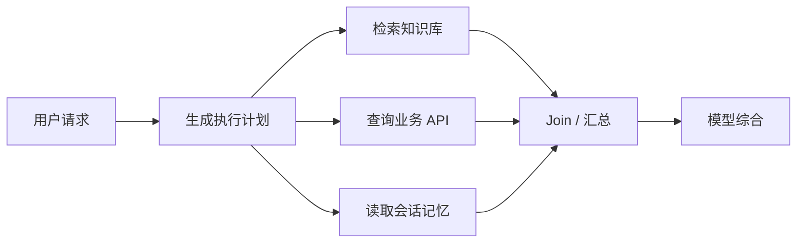
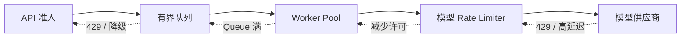
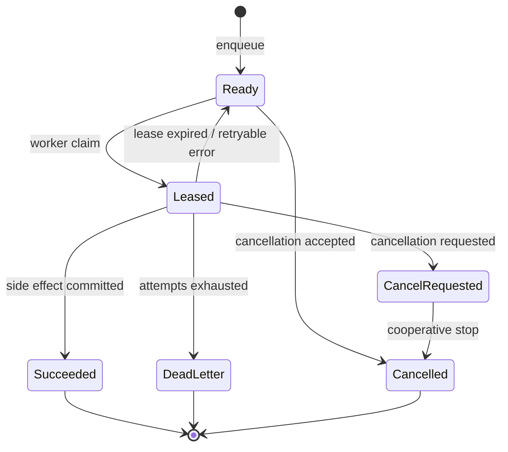

# 异步并发、Backpressure、Rate Limit、Queue 与 Worker 模型

> 目标：不是把所有 Agent 步骤都改成 `async`，而是建立一套可计算、可限界、过载时可预测的执行模型。

## 阅读前术语表

| 术语 | 说明 |
|---|---|
| Concurrency | 并发；多个任务在同一时间区间内推进，不等于同时占用 CPU |
| Parallelism | 并行；多个任务在同一时刻由不同 CPU/GPU 执行 |
| Coroutine | 协程；在等待 I/O 时主动让出执行权的轻量任务 |
| Structured Concurrency | 结构化并发；子任务生命周期被父作用域约束，异常和取消可向上传播 |
| Backpressure | 背压；下游处理不过来时，向上游传播减速、等待、拒绝或降级信号 |
| Admission Control | 准入控制；在消耗昂贵资源前决定请求是否可以进入系统 |
| Rate Limit | 速率限制；约束一段时间内允许发生的请求量或 Token 量 |
| Queue | 队列；解耦生产者和消费者，并吸收短时流量波动 |
| Worker | 从队列领取任务、处理并确认结果的执行单元 |
| Visibility Timeout | 消息被 Worker 领取后暂时对其他 Worker 不可见的时间窗口 |
| Head-of-line Blocking | 队首阻塞；前方慢任务阻塞后方本可快速完成的任务 |
| Little's Law | 稳态系统中平均在途数 `L = λW`，其中 `λ` 是吞吐率，`W` 是平均停留时间 |

## 1. 先区分并发、速率和容量

这三个量经常被混为一个“并发数”配置：

- **并发上限**限制同时在途的工作数量，例如最多 20 个模型请求；
- **速率上限**限制单位时间内新启动的工作，例如每分钟 300 次请求；
- **容量上限**限制等待区大小，例如队列最多 1,000 条任务。

它们解决不同问题。并发上限保护连接池、内存和下游在途容量；速率限制保护供应商配额和长期吞吐；有界队列限制过载时的内存与等待时间。只设置其中一个，系统仍可能失控。

由 Little's Law：

```text
L = λ × W
```

若模型调用平均耗时 `W = 2s`，目标吞吐 `λ = 8 req/s`，仅维持平均吞吐就需要约 `L = 16` 个在途请求。考虑尾延迟和波动后可设置 20～24，但不能直接开到 1,000：更高并发可能触发供应商限流，进一步拉长延迟，形成正反馈。

## 2. Agent 中哪些步骤适合异步并发

### 2.1 适合并发的独立 I/O

- 多个互不依赖的检索源；
- 多个只读工具查询；
- 独立文档的解析或 Embedding 请求；
- 并行候选生成、评审或验证；
- 多个租户之间相互隔离的后台任务。

只有依赖图中没有先后关系的节点才可并发。若 B 的参数来自 A 的结果，强行并发只会引入占位数据、重复请求或竞态。



### 2.2 不适合盲目并发的操作

- 对同一账户余额、库存或文件进行读改写；
- 必须保持业务顺序的动作，例如“创建订单后再付款”；
- 共享一个不可并发使用的浏览器会话或 Sandbox；
- 高风险副作用工具；
- 会消耗同一个全局 Token/费用预算的无限 Fan-out。

异步只是调度机制，不自动提供隔离、原子性、顺序或幂等。

## 3. 结构化并发：父任务必须拥有子任务

不受管理的 `create_task()` 容易产生孤儿任务：请求已超时，后台模型调用仍继续计费；父任务失败，子任务异常无人读取；服务退出时任务被硬切断。

Python 3.11+ 可用 `TaskGroup` 表达“要么整组完成，要么失败时取消同组任务”：

```python
import asyncio

async def gather_context(query: str) -> dict:
    async with asyncio.TaskGroup() as group:
        rag = group.create_task(search_rag(query))
        crm = group.create_task(query_crm(query))
        memory = group.create_task(read_memory(query))

    # 离开 TaskGroup 时，所有子任务已经完成；异常不会静默丢失。
    return {
        "rag": rag.result(),
        "crm": crm.result(),
        "memory": memory.result(),
    }
```

工程上还要定义：

1. 任一分支失败时，是取消全部，还是保留部分结果；
2. 父任务取消是否必须取消供应商 HTTP 请求；
3. 子任务是否允许独立重试；
4. 每个分支如何占用全局 Token、费用和并发预算。

## 4. 用 Semaphore 限制在途数

```python
import asyncio

model_slots = asyncio.Semaphore(20)

async def bounded_model_call(request):
    async with model_slots:
        return await call_model(request)
```

Semaphore 控制的是同时进入临界区的数量，不控制一分钟总请求数，也不限制等待 Semaphore 的任务数量。如果上游瞬间创建 100 万个协程，即使 Semaphore 是 20，内存仍可能耗尽。因此还需要准入控制和有界队列。

不应在持有 Semaphore 时做无关等待。例如先占据模型槽位，再等待审批，会让所有槽位被“睡眠任务”占满。正确顺序是：

```text
认证/授权 → 审批 → 等待 Rate Limit → 获取并发槽 → 发起模型调用
```

## 5. Backpressure：让过载显式传播

### 5.1 为什么无界队列不是缓冲，而是延迟放大器

生产速率 `λ_in` 长期大于消费速率 `λ_out` 时：

```text
backlog(t) ≈ backlog(0) + (λ_in - λ_out) × t
```

队列越大，只是把“立即拒绝”改成“很久以后超时”。若 5,000 个任务排队、Worker 每秒处理 10 个，队尾至少要等待约 500 秒；而用户的端到端 Deadline 可能只有 30 秒。这些任务在出队前就已失去价值。

### 5.2 常见背压策略

| 策略 | 行为 | 适用场景 | 风险 |
|---|---|---|---|
| Block | 生产者等待容量释放 | 内部流水线、可自然减速 | 占用连接，可能传递超时 |
| Reject | 返回 429/503 与 `Retry-After` | 在线 API | 客户端若无 Jitter 会重试风暴 |
| Shed | 丢弃低优先级任务 | 推荐、预取、遥测 | 必须可识别任务价值 |
| Coalesce | 合并相同 Key 的请求 | 缓存刷新、重复检索 | 错误合并可能跨租户 |
| Degrade | 使用缓存、小模型、低 Top-K | 可接受质量下降 | 必须标记降级结果 |
| Spill | 转入持久队列 | 可延迟的长任务 | 延迟、重复交付、积压治理 |

背压必须从最稀缺资源向入口传播：



只在最下游处理 429，而入口继续收请求，会把供应商限流转化为本地队列雪崩。

## 6. Rate Limit 算法

### 6.1 Fixed Window

在固定时间窗口内计数，实现简单，但窗口边界可能出现双倍突发：上一分钟末尾和下一分钟开头各打满配额。

### 6.2 Sliding Window

按精确时间戳或分桶近似统计最近一段时间，边界更平滑，但状态与计算成本更高。

### 6.3 Token Bucket

令桶容量为 `B`，补充速率为 `r token/s`，距离上次更新经过 `Δt`：

```text
tokens = min(B, tokens + r × Δt)
```

请求成本为 `c`，只有 `tokens >= c` 时允许，并扣减 `c`。`B` 决定可接受的短时 Burst，`r` 决定长期平均速率。对 LLM 最好按估算 Token、模型权重或费用计费，而不是把所有请求都视作成本 1。

### 6.4 Leaky Bucket

以固定速率排出请求，输出更平滑，适合严格保护下游；代价是 Burst 被转化为等待时间。等待超过请求剩余 Deadline 时应立即拒绝，不能排入一个注定超时的队列。

### 6.5 分层配额

真实 Agent 服务至少需要以下维度：

```text
全局供应商额度
  ∩ 模型/区域额度
  ∩ 租户额度
  ∩ 用户额度
  ∩ 单 Workflow Token/费用预算
```

最终许可取交集。只做全局限流会产生 noisy neighbor；只做租户限流又可能突破供应商总配额。

## 7. Queue 与 Worker 的状态模型

一个可恢复的 Worker 不只是 `while True: get()`：



消息至少应包含：

```json
{
  "task_id": "task_01J...",
  "tenant_id": "tenant-a",
  "task_type": "research_report",
  "payload_ref": "obj://encrypted/input/42",
  "idempotency_key": "tenant-a:report:2026-08-16",
  "attempt": 2,
  "not_before": "2026-08-16T10:00:05Z",
  "deadline": "2026-08-16T10:05:00Z",
  "traceparent": "00-...-...-01",
  "priority": 30,
  "schema_version": 3
}
```

不要把完整 Prompt、Token 或 PII 直接塞入消息 Header；Header 容易进入 Broker 控制台、Trace 和死信队列。大对象应加密存储，消息仅传受权限控制的引用。

## 8. Worker 并发和公平调度

### 8.1 Prefetch 不是越大越好

Prefetch 太小会降低吞吐；太大时，一个 Worker 会囤积消息，其他 Worker 空闲，且崩溃后大量消息同时重投。经验上从“每个并发槽 1～2 个预取”起步，用实测调整。

### 8.2 长短任务分队列

若 30 分钟研究任务和 100 毫秒缓存查询共用 FIFO 队列，会发生队首阻塞。可按任务资源画像拆分：

- `interactive-high`：短 Deadline、低批量；
- `batch-normal`：吞吐优先；
- `sandbox-heavy`：受 CPU/内存配额限制；
- `retry-delayed`：延迟重试；
- `dead-letter`：人工或自动修复。

拆队列后仍需全局公平性。可使用租户加权公平队列、每租户并发上限与总成本配额，防止单个大租户占满 Worker。

### 8.3 Autoscaling 看什么

只看 CPU 会漏掉 I/O 型 Agent。更有用的指标是：

- queue depth 与 oldest message age；
- arrival rate / completion rate；
- in-flight 数和各阶段耗时；
- 每租户排队时间；
- 模型 429、Timeout 和 Circuit Breaker 状态；
- Worker 饱和度与 Lease 续约失败率。

扩容速度还必须受供应商 Rate Limit 约束，否则增加 Worker 只会增加 429。

## 9. 一套完整的准入顺序

```text
1. 验证身份与 tenant
2. 检查任务 Schema、大小与 Deadline
3. 检查租户/用户预算和 Rate Limit
4. 检查队列容量与预计等待时间
5. 写入持久任务记录和 Outbox
6. 发布消息
7. Worker 获取 Lease
8. 获取具体资源的并发许可
9. 执行、Checkpoint、确认或延迟重试
```

第 4 步可用粗略等待估计：

```text
estimated_wait ≈ queue_work_seconds / effective_worker_concurrency
```

若 `estimated_wait + estimated_service_time > remaining_deadline`，应在入口拒绝或降级，而不是接受后必然超时。

## 10. 常见失败模式

1. **无限 `gather`**：对 10 万条输入一次创建 10 万个任务；应分批或使用有界生产者—消费者。
2. **只有 Semaphore，没有有界等待区**：在途受限，等待协程仍无限增长。
3. **429 立即重试**：所有 Worker 同时重试，形成同步风暴。
4. **队列满仍返回 202**：客户端以为任务已持久接受，实际稍后丢失。
5. **跨租户请求合并**：Singleflight Key 缺少 tenant，导致数据泄漏。
6. **先 Ack 后提交结果**：Worker 崩溃时任务永久丢失。
7. **先提交副作用后 Ack、但无幂等**：重投时重复发送邮件或扣款。
8. **把优先级当权限**：用户可自行提交最高优先级，挤压系统任务。

## 11. 可观测性与验收指标

建议至少记录：

| 指标 | 用途 |
|---|---|
| `queue.depth` | 当前积压量，需按队列而非 task_id 聚合 |
| `queue.oldest_age` | 比 depth 更直接反映用户等待 |
| `admission.rejected_total{reason}` | 区分限流、容量、预算、Deadline |
| `worker.in_flight` | Worker 当前占用量 |
| `worker.task.duration` | 处理时间分布 |
| `rate_limit.wait_duration` | 许可等待是否吞噬 Deadline |
| `task.retry_count` | 重试放大和毒消息 |
| `tenant.queue_wait` | 发现 noisy neighbor 与不公平 |

验收问题：

- 当下游吞吐降为 0 时，入口能否在有界时间内开始拒绝？
- 队列是否有硬容量，满时响应是否明确？
- 一个请求取消后，其子任务和供应商连接是否真正取消？
- 每个租户是否同时受并发、速率和费用三类限制？
- Worker 扩容时是否会突破模型供应商配额？
- 积压恢复时是否通过 Jitter 平滑放量？
- 慢任务是否会阻塞交互任务？

## 12. 本文结论

可靠并发的核心不是“同时跑更多”，而是让每一层都有容量合同：入口做准入，有界队列吸收短时波动，Worker 只领取可完成的任务，Semaphore 限制在途资源，Rate Limit 限制长期吞吐，Backpressure 把过载传回调用者。任何无界环节都会把局部变慢放大成全局故障。

## 参考资料

- [Python `asyncio` Task Groups](https://docs.python.org/3/library/asyncio-task.html#task-groups)
- [OpenTelemetry Messaging Semantic Conventions](https://opentelemetry.io/docs/specs/semconv/messaging/)
- [OpenTelemetry Messaging Spans](https://opentelemetry.io/docs/specs/semconv/messaging/messaging-spans/)

