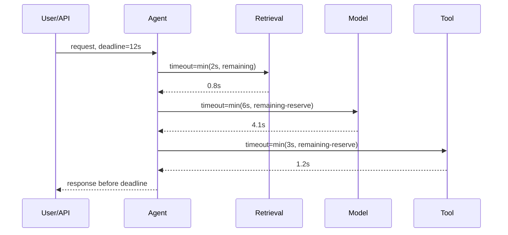
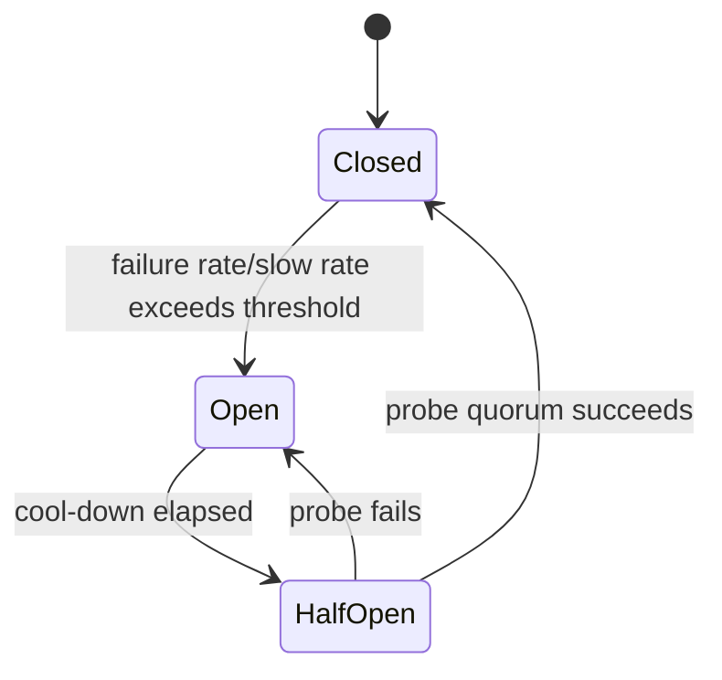
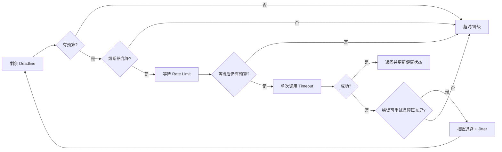

# 超时预算、指数退避、Jitter、熔断与降级

> 目标：把“遇到错误再试几次”升级为受端到端 Deadline、错误语义和系统容量约束的韧性策略。

## 阅读前术语表

| 术语 | 说明 |
|---|---|
| Deadline | 一个绝对完成时刻；跨进程传播时比“再等 5 秒”更不易重复计时 |
| Timeout | 某次等待最多允许持续多久，是从 Deadline 派生的局部限制 |
| Retry | 在满足条件时再次尝试同一逻辑操作 |
| Backoff | 重试前等待，避免持续冲击故障依赖 |
| Jitter | 在退避时间中加入随机性，打散大量客户端的同步重试 |
| Retry Budget | 系统允许重试流量占正常流量的上限 |
| Circuit Breaker | 熔断器；依赖持续失败时快速拒绝，并周期性探测恢复 |
| Bulkhead | 舱壁隔离；为不同依赖/租户/任务池分配独立资源，避免故障扩散 |
| Fallback | 主路径不可用时使用的替代结果或替代能力 |
| Load Shedding | 过载时主动拒绝低价值工作，保护核心路径 |
| Hedging | 请求超过阈值后向另一个副本发起冗余请求，以降低尾延迟 |

## 1. Deadline 是调用链的共同事实

超时不能由每一层独立配置成 30 秒：若 Agent 依次调用 5 个工具，每层都允许 30 秒，用户可能等待 150 秒以上。入口应生成绝对 Deadline，后续每层只消费剩余预算。

```text
remaining = deadline - monotonic_now
child_timeout = min(component_cap, remaining - reserve)
```

`reserve` 用于序列化、返回响应、写审计和清理资源。若剩余时间不足，不应再启动一个注定无法完成的调用。



应使用单调时钟计算进程内持续时间，避免系统时钟校准导致剩余预算跳变；跨进程则传播标准时间戳或毫秒级剩余预算，并在接收端立即转换为本地单调 Deadline。

## 2. 超时预算如何分配

### 2.1 串行路径

若关键路径由 `n` 个串行阶段构成：

```text
T_total ≥ Σ(T_i) + T_queue + T_retry + T_serialize + T_reserve
```

不能把总预算全部给模型，再期待工具仍有时间。预算分配应来自阶段延迟分布和业务价值，而不是平均值。例如 10 秒总预算可以设计为：

| 阶段 | 上限 | 说明 |
|---|---:|---|
| 准入与排队 | 0.5s | 超过即快速拒绝 |
| Retrieval | 1.5s | 可降级为空或缓存 |
| Model | 5.5s | 核心质量路径 |
| Tool | 1.5s | 仅允许一个受控动作 |
| 汇总与清理 | 0.5s | 输出、审计、取消 |
| Reserve | 0.5s | 尾部安全余量 |

### 2.2 并行路径

并行分支的关键路径接近最大值而不是总和：

```text
T_parallel ≈ max(T_branch_1, ..., T_branch_n) + T_join
```

但并行会增加总资源消耗。可以设置软 Deadline：到点后采用已完成的分支；硬 Deadline：取消全部未完成分支。

### 2.3 排队时间属于 Deadline

常见错误是 Worker 出队后才启动 30 秒 Timeout。任务在队列中等待 5 分钟后仍执行，用户早已取消。消息必须携带原始 Deadline；Worker 领取时先判断是否过期。

## 3. 哪些错误可以重试

重试需要同时满足四个条件：

```text
可恢复错误 ∧ 操作可安全重复 ∧ 剩余预算足够 ∧ Retry Budget 未耗尽
```

| 错误/结果 | 默认策略 | 原因 |
|---|---|---|
| 连接中断、网关 502/503/504 | 有界重试 | 可能是瞬时故障 |
| 429 | 遵守 `Retry-After` 后重试 | 必须服从服务端节流信号 |
| 408/客户端超时 | 谨慎重试 | 服务端可能已执行副作用 |
| 400/Schema 错误 | 不重试 | 相同输入不会自愈 |
| 401 | 刷新一次凭证后最多重试一次 | 无限刷新可能掩盖配置错误 |
| 403/策略拒绝 | 不重试 | 授权事实未改变 |
| 内容安全拒绝 | 不自动改写绕过 | 可能违反策略 |
| 非幂等副作用结果未知 | 先查询幂等记录/状态 | 盲重试会重复执行 |

重试单元应是最小失败操作。例如 Retrieval 超时，只重试 Retrieval，不应从头重新执行已经成功的模型调用和工具副作用。

## 4. 指数退避与 Jitter

### 4.1 无 Jitter 的指数退避仍会同步

基础退避：

```text
backoff_n = min(cap, base × 2^n)
```

若 10,000 个客户端同时收到 503，它们会在 1、2、4、8 秒同时重试，形成周期性尖峰。

### 4.2 Full Jitter

```text
sleep_n = random(0, min(cap, base × 2^n))
```

Full Jitter 能最大程度打散请求，通常是默认选择。

### 4.3 Equal Jitter

```text
max_n = min(cap, base × 2^n)
sleep_n = max_n / 2 + random(0, max_n / 2)
```

它保证至少等待一半窗口，适合不希望过早重试的依赖。

### 4.4 Decorrelated Jitter

```text
sleep_n = min(cap, random(base, previous_sleep × 3))
```

它避免严格指数阶梯，适合持续重连，但必须设置 `cap` 和总 Deadline。

### 4.5 遵守 Retry-After

当服务端返回 `Retry-After`，客户端等待至少该时长，再叠加小范围 Jitter；如果等待会超过剩余 Deadline，应直接失败或降级。

```python
import asyncio
import random
import time

async def retry(call, *, deadline: float, max_attempts: int = 4):
    base, cap = 0.2, 4.0
    for attempt in range(max_attempts):
        remaining = deadline - time.monotonic()
        if remaining <= 0:
            raise TimeoutError("deadline exhausted")
        try:
            return await asyncio.wait_for(call(), timeout=min(2.0, remaining))
        except RetryableError as exc:
            if attempt + 1 == max_attempts:
                raise
            window = min(cap, base * (2 ** attempt))
            delay = max(exc.retry_after or 0.0, random.uniform(0, window))
            if delay >= deadline - time.monotonic():
                raise TimeoutError("no budget for another attempt") from exc
            await asyncio.sleep(delay)
```

## 5. Retry Budget：防止重试成为攻击流量

假设正常请求量为 `N`，允许额外重试比例为 `β`：

```text
retry_allowance = β × N
```

例如 `β = 0.1`，每 1,000 次初始请求只允许约 100 次重试。故障扩大时，重试预算先耗尽，系统保留容量处理新的正常请求或健康依赖。

预算应按依赖和租户隔离。否则一个故障租户可能耗尽全局重试预算。还要记录 `attempt` 与根请求 ID，避免服务 A 重试 B、B 又重试 C 造成乘法放大：每层 3 次重试，最坏可能产生 `3 × 3 = 9` 次下游调用。

## 6. 熔断器是依赖状态机，不是另一种重试



### 6.1 Closed

正常放行，并在滚动窗口内统计错误率、慢调用率和最小样本数。没有最小样本数时，启动阶段 1 次失败就可能错误熔断。

### 6.2 Open

快速失败，不再把流量压向故障依赖。Open 不是永久状态；到达冷却期后进入 Half-Open。

### 6.3 Half-Open

只允许少量探测请求。若所有等待请求同时成为探测，Half-Open 会再次制造洪峰，因此必须限制探测并发。

### 6.4 熔断键怎么选

通常按 `provider + model + region + operation` 建立熔断器。按用户建立会导致状态太分散；只用全局熔断器又会让一个区域故障拖垮所有健康区域。授权失败、Schema 错误和用户取消不应计入依赖健康失败率。

## 7. Timeout、Retry、Rate Limit、熔断的正确顺序



熔断应在昂贵的连接与请求之前；Rate Limit 的等待也必须计入 Deadline；单次 Timeout 小于剩余总预算，才能给清理或下一次尝试留空间。

## 8. 降级不是“吞掉异常”

降级必须保留语义：调用者应知道结果来自缓存、旧数据、小模型还是部分分支。

| 主路径 | 可接受降级 | 不可接受的伪降级 |
|---|---|---|
| 实时搜索 | 带时间戳的缓存结果 | 把旧结果标成实时 |
| 大模型综合 | 小模型/抽取式摘要 | 静默省略关键限制 |
| 多源 Retrieval | 已完成来源 + 缺失列表 | 编造未返回来源 |
| 写操作 | 转持久队列并返回任务 ID | 返回成功但未持久接受 |
| 推荐 | 空结果或热门项 | 跨租户复用缓存 |
| 高风险工具 | 明确失败、等待人工 | 绕过审批使用替代工具 |

推荐降级结果结构：

```json
{
  "status": "degraded",
  "data": {"answer": "..."},
  "degradation": {
    "reason": "retrieval_timeout",
    "used_cache": true,
    "cache_age_seconds": 180,
    "missing_sources": ["crm"]
  }
}
```

## 9. Hedging：只适合可取消、幂等、昂贵度可控的读请求

若请求超过历史 p95，可向独立副本发第二个请求，先成功者获胜，取消另一个。Hedging 能降低尾延迟，但会增加负载；在依赖已经过载时可能雪上加霜。

限制条件：

- 只用于只读或有相同幂等键的操作；
- 副本应具有相对独立的故障域；
- 仅在尾延迟异常且 Retry Budget 允许时启动；
- 获胜后必须取消败者并观察取消是否生效；
- Token/费用预算要计算两个请求的最坏成本。

## 10. Agent 特有的韧性陷阱

1. **模型超时后重新规划**：可能选择不同工具并产生第二次副作用；重试应复用已持久化计划或幂等键。
2. **流式响应已有部分输出**：重试可能向用户输出两份前缀；需要缓冲、序号或显式重启标记。
3. **工具结果未知**：HTTP 超时不代表工具未执行；先查询 Tool Call ID/幂等结果。
4. **Fallback 改用更宽权限工具**：可用性策略不能扩大授权。
5. **熔断器把策略拒绝当失败**：大量 403 会错误打开依赖熔断器。
6. **降级内容进入长期记忆**：旧缓存或部分结果应带来源和新鲜度，避免污染事实记忆。

## 11. 推荐的策略配置

策略不应散落在每个调用点：

```yaml
dependencies:
  model-primary:
    attempt_timeout_ms: 5000
    max_attempts: 3
    backoff: full-jitter
    backoff_base_ms: 200
    backoff_cap_ms: 3000
    retry_budget_ratio: 0.10
    circuit_breaker:
      window: 50
      minimum_calls: 20
      failure_rate: 0.50
      slow_call_ms: 4000
      open_ms: 10000
      half_open_probes: 3
    fallback: model-small
```

配置加载失败时应使用保守默认值或拒绝启动，不要无重试上限地“尽力而为”。配置版本应进入 Trace，才能解释某次调用为什么重试或降级。

## 12. 测试与验收

必须使用故障注入，而不是只测成功路径：

- 固定 429 并带 `Retry-After`；
- 交替 503/成功，观察 Jitter 与尝试次数；
- 服务响应晚于 Deadline，确认连接和子任务被取消；
- 触发 Open/Half-Open/Closed 全状态迁移；
- 在熔断时确认没有下游网络调用；
- 让 Fallback 也失败，确认不会递归降级；
- 验证重试流量不超过 Retry Budget；
- 验证降级响应带有来源、新鲜度和缺失项；
- 验证 403、Schema 错误、用户取消不计入熔断失败率；
- 验证父 Deadline 经过 Queue、Worker、Model、Tool 全程递减。

核心指标：

```text
attempts_per_request
retry_amplification_ratio
deadline_exhausted_total
circuit_state / circuit_rejected_total
fallback_total{reason,type}
dependency_latency{attempt}
retry_sleep_duration
cancelled_work_duration
```

## 13. 本文结论

韧性不是把失败隐藏起来，而是限制失败的时间、空间和成本。Deadline 约束整条调用链，单次 Timeout 约束一次等待，指数退避与 Jitter 打散重试，Retry Budget 限制额外流量，熔断器阻断持续故障，降级则以显式质量合同保留核心能力。任何重试或降级都不能改变授权、幂等与数据隔离边界。

## 参考资料

- [AWS Builders' Library: Timeouts, retries, and backoff with jitter](https://aws.amazon.com/builders-library/timeouts-retries-and-backoff-with-jitter/)
- [Google Cloud: Retry strategy](https://cloud.google.com/storage/docs/retry-strategy)
- [Microsoft Azure Architecture Center: Circuit Breaker pattern](https://learn.microsoft.com/azure/architecture/patterns/circuit-breaker)

