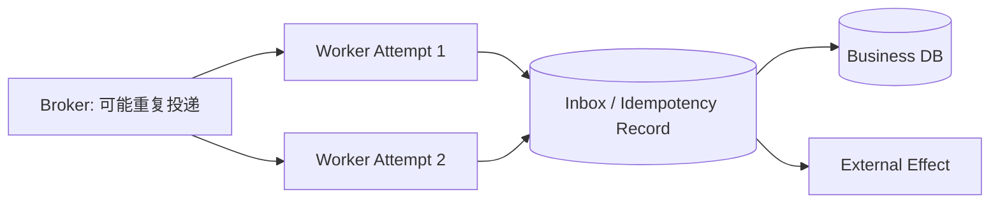
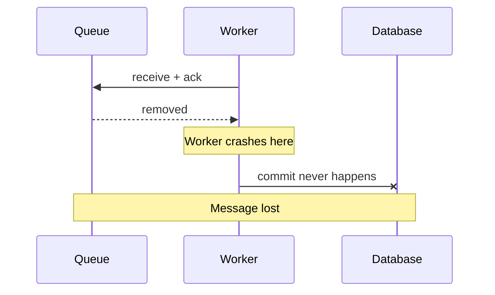
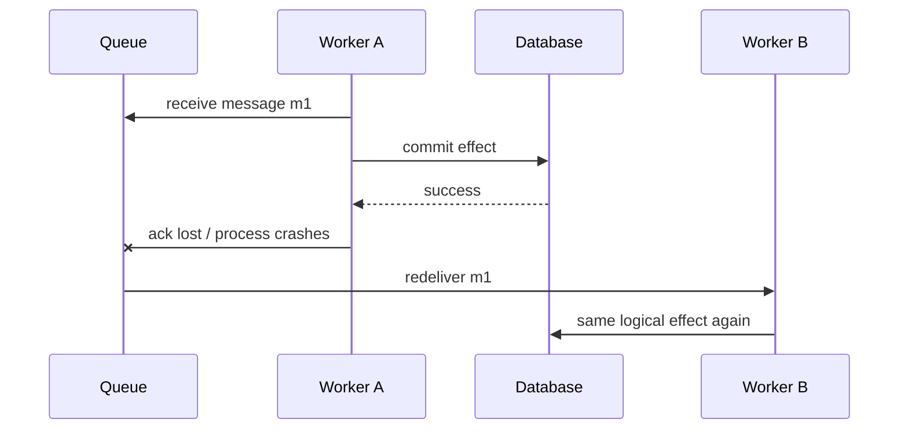
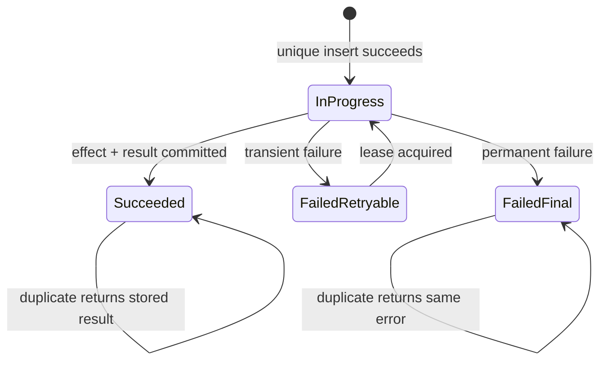
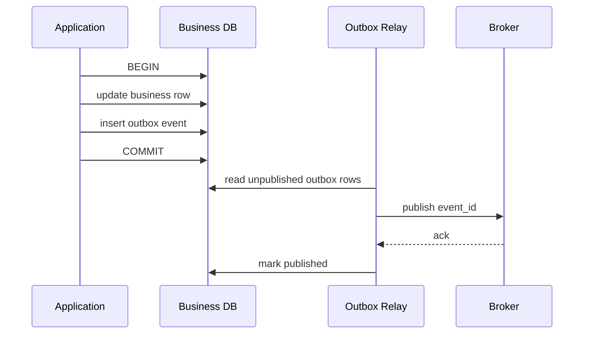
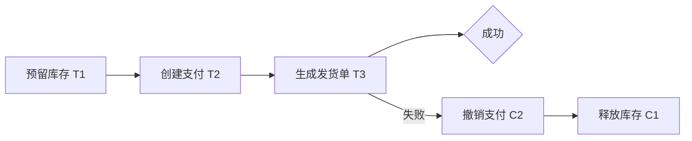

# At-most-once、At-least-once、幂等与补偿事务

> 目标：准确回答“消息会不会重复、业务会不会重复生效、失败后如何恢复”这三个不同问题。

## 阅读前术语表

| 术语 | 说明 |
|---|---|
| Delivery Semantics | 消息系统对一次逻辑消息可能投递多少次的保证 |
| At-most-once | 最多一次；可能丢失，但同一消息不会由系统重投 |
| At-least-once | 至少一次；在假设系统最终恢复时尽力不丢，但可能重复投递 |
| Exactly-once | 恰好一次；必须说明作用域，通常只在特定事务边界内成立 |
| Idempotency | 幂等；同一个逻辑操作执行多次，最终可观察效果与执行一次相同 |
| Deduplication | 去重；识别已处理的逻辑操作并复用结果或拒绝重复 |
| Inbox | 消费端持久记录已接收/已处理消息的表 |
| Transactional Outbox | 在业务事务中先写 Outbox，再异步可靠发布事件的模式 |
| Saga | 将跨服务长事务拆成多个本地事务和相应补偿动作 |
| Compensation | 补偿；用新的业务动作抵消已提交动作的影响，不等于数据库回滚 |
| Idempotency Key | 客户端为一个逻辑操作提供的稳定唯一键 |
| Fencing Token | 单调递增的所有权代次，用于拒绝过期 Worker 的迟到写入 |

## 1. 投递次数不等于业务效果次数

需要分三层讨论：

1. **Transport**：Broker 是否可能重复传递消息；
2. **Processing**：Worker 是否可能重复运行处理逻辑；
3. **Effect**：数据库、邮件、支付、外部 API 是否重复产生业务效果。

即使 Broker 宣称 Exactly-once，也不代表外部邮件只发一次；即使消息 At-least-once，只要副作用实现幂等，业务效果仍可表现为一次。



## 2. At-most-once：低延迟换取可能丢失

At-most-once 的核心不变量：

```text
delivery_count(message) ≤ 1
```

常见做法是在处理前确认消息，或不提供失败重投。如果 Worker 在确认后、业务提交前崩溃，消息永久丢失。

适用场景：

- 高频非关键遥测，丢少量可接受；
- 可由下一次状态刷新覆盖的进度通知；
- 实时 UI 增量，客户端可重新拉取快照；
- 重复成本远大于偶发丢失，且上游能重新生成。

不适合支付、租户删除、合规导出等必须有结果的业务。



## 3. At-least-once：不丢的代价是重复

At-least-once 的目标不变量：

```text
delivery_count(message) ≥ 1
```

它通常在处理成功后 Ack。若数据库已提交但 Ack 丢失或 Worker 随后崩溃，消息会再次投递。



因此 At-least-once 必须和幂等、去重、事务边界共同设计。“我们的队列不会丢消息”不是完整答案，因为重复副作用仍可能破坏业务。

## 4. Exactly-once 必须写出作用域

“端到端 Exactly-once”很容易成为模糊承诺。需要明确：

- 对哪个消息 ID；
- 在哪个时间窗口；
- Broker 内、数据库内，还是包含外部 API；
- Producer、Broker、Consumer 是否共享事务；
- 故障、跨区域切换和人工重放是否仍包含在保证中。

某些流系统可以在“同一集群、同一事务协议、消费 Offset 与输出 Topic”范围内提供 Exactly-once processing semantics。但一旦处理过程调用不参与同一事务的支付 API、邮件或 Sandbox，就重新回到至少一次 + 幂等/补偿。

更准确的工程目标是：

```text
At-least-once delivery
+ durable idempotency record
+ atomic business transition
+ replayable result
= effectively-once business effect within a declared scope
```

## 5. 幂等键的设计

### 5.1 幂等键标识逻辑意图，而不是某次网络请求

用户点击一次“生成月报”后客户端网络重试，应沿用同一个 Key：

```text
tenant_id + operation + business_object + intent_version
```

示例：

```text
tenant-a:report:2026-07:v1
tenant-a:delete:user-42:request-019
tenant-a:tool-call:call_abc123
```

不同租户必须有不同命名空间。用随机 Request ID 作为每次重试的新 Key 等于没有幂等；仅用参数哈希又可能把用户有意重复的两次同参操作错误合并。

### 5.2 请求指纹防止 Key 被复用到不同参数

记录规范化参数的哈希：

```text
request_hash = SHA256(operation || canonical_json(arguments) || tenant_id)
```

相同 Key + 相同 Hash：返回已存在状态/结果；相同 Key + 不同 Hash：返回冲突，不允许把旧批准或旧结果套到新动作上。

### 5.3 幂等记录状态机



记录示例：

```sql
CREATE TABLE idempotency_record (
    tenant_id       text        NOT NULL,
    idempotency_key text        NOT NULL,
    request_hash    text        NOT NULL,
    status          text        NOT NULL,
    response_ref    text,
    owner_epoch     bigint      NOT NULL DEFAULT 0,
    expires_at      timestamptz NOT NULL,
    updated_at      timestamptz NOT NULL,
    PRIMARY KEY (tenant_id, idempotency_key)
);
```

必须依赖数据库唯一约束或原子 Compare-and-Set；“先查询是否存在，再插入”存在并发竞态，两个 Worker 都可能看到不存在。

## 6. 数据库内幂等：把去重和业务修改放在同一事务

```sql
BEGIN;

INSERT INTO inbox(tenant_id, message_id, request_hash, status)
VALUES (:tenant, :message_id, :hash, 'processing')
ON CONFLICT (tenant_id, message_id) DO NOTHING;

-- 若影响行数为 0：读取既有状态，不重复执行业务更新。

UPDATE report_jobs
SET status = 'completed', result_ref = :result_ref
WHERE tenant_id = :tenant
  AND job_id = :job_id
  AND status = 'running';

UPDATE inbox
SET status = 'completed', response_ref = :result_ref
WHERE tenant_id = :tenant AND message_id = :message_id;

COMMIT;
```

Inbox 与业务数据若不在同一事务中，可能出现“已记为处理，但业务未提交”或“业务已提交，但去重记录未写”的裂缝。

## 7. Transactional Outbox：解决数据库提交与发消息的双写

错误实现：

```text
1. 更新数据库
2. 发布事件
```

若第 1 步成功、第 2 步失败，下游永远不知道状态变化。反过来先发布再更新，也可能让下游看到一个未提交事实。

Outbox 将业务更新和待发事件放进同一个数据库事务：



Relay 在 Publish 成功但标记前崩溃会重复发布，所以消费端仍需 Inbox/幂等。Outbox 解决“最终会发”，不单独解决“只发一次”。

## 8. 外部 Tool/API 的幂等

### 8.1 下游支持幂等键

把稳定 Key 传给下游，并持久保存返回的 Resource ID。重试时使用同一 Key，而不是生成新的 Tool Call ID。

### 8.2 下游不支持幂等键

可选方案：

- 在本方数据库用唯一业务键串行化操作；
- 调用后通过业务查询确认是否已经生效；
- 为操作建立单线程/单 Key Worker；
- 将不可判定结果转人工处理，而不是盲重试；
- 对可逆动作设计补偿。

如果外部系统既无幂等键又无查询接口，那么“超时后是否执行成功”可能不可判定。系统必须把它表示为 `UNKNOWN`，不能谎称失败或成功。

### 8.3 Tool Call ID 的角色

Tool Call ID 用于把模型提出的调用与工具结果关联；幂等键用于标识业务意图。二者可以相同，但不能默认等价：模型重新规划可能生成新 Tool Call ID，却仍代表同一笔付款。应由 Host 根据业务动作生成稳定 Idempotency Key。

## 9. 幂等不等于锁，也不等于没有副作用

- `SET x = 10` 是幂等，`x = x + 10` 不是；
- “创建名字为 report 的文件”只有在名字唯一且内容策略明确时才可能幂等；
- 发送同一邮件两次最终数据库状态可能相同，但用户收到两封，仍不幂等；
- 幂等只说明重复执行的结果，不阻止两个不同意图并发冲突；
- 去重记录过期后重放，仍可能产生第二次效果。

幂等记录 TTL 应覆盖客户端重试、队列保留、灾难恢复和人工重放的最大窗口。对支付、删除等高风险动作，可能需要长期审计而不是短 TTL 缓存。

## 10. Saga 与补偿事务

跨多个独立服务的长事务通常无法使用单个 ACID 事务。Saga 将其拆为本地事务：



### 10.1 补偿不是时间倒流

退款不是删除原付款，而是新增退款记录；删除后恢复可能使用快照，但审计仍保留删除与恢复事实。补偿可能失败、需要重试，也必须幂等。

### 10.2 Orchestration 与 Choreography

| 模式 | 特点 | 优点 | 风险 |
|---|---|---|---|
| Orchestration | 中央协调器显式发命令 | 状态和顺序清晰，适合 Agent Workflow | 协调器需高可用，可能集中复杂度 |
| Choreography | 服务监听事件并继续发布 | 解耦、自治 | 全局流程难观察，事件环与隐含依赖增多 |

Agent 长任务通常更适合显式 Orchestrator，因为它已经需要 Deadline、Checkpoint、审批、取消和恢复状态。

### 10.3 Saga 状态必须持久化

```json
{
  "saga_id": "saga_123",
  "tenant_id": "tenant-a",
  "state": "COMPENSATING",
  "steps": [
    {"name": "reserve", "status": "DONE", "compensation": "PENDING"},
    {"name": "pay", "status": "DONE", "compensation": "DONE"},
    {"name": "ship", "status": "FAILED"}
  ],
  "version": 8
}
```

只把进度保存在 Agent 上下文中，进程崩溃后无法证明哪些副作用已发生。

## 11. 补偿策略的限制

1. **不可逆动作**：邮件已被阅读、数据已外泄，不能真正撤回；应在执行前审批。
2. **隔离缺失**：Saga 执行期间其他事务可能观察到中间状态；业务必须容忍或使用预留状态。
3. **补偿顺序**：通常逆序执行，但可能有业务例外。
4. **补偿也会重复**：必须有独立幂等键，例如 `saga_id + compensation_step`。
5. **人工介入**：超过重试上限后进入明确的 `MANUAL_REVIEW`，不能静默挂起。
6. **权限变化**：原操作授权不自动赋予补偿权限；系统身份需有最小补偿 Scope，并记录原因。

## 12. 取消与交付语义

取消请求不是删除队列消息那么简单：

- 尚未领取：原子地从 `READY` 转 `CANCELLED`；
- 正在执行且未产生副作用：协作式停止并 Ack；
- 已提交部分步骤：停止新步骤，进入补偿或人工确认；
- 外部结果未知：先查询状态，保持 `CANCEL_PENDING/UNKNOWN`；
- 已完成：取消应返回“已完成”，不能伪造撤销。

取消命令本身也可能重复，应以 `task_id + cancel_intent_id` 幂等处理。

## 13. 端到端推荐组合

```text
API 接收请求
  → 持久化 Task + Idempotency Record + Outbox（同一事务）
  → Relay 至少一次发布
  → Worker 使用 Inbox 去重并获取 Lease/Fencing Token
  → 每个外部 Tool 携带稳定 Idempotency Key
  → 本地结果与 Checkpoint 原子提交
  → Ack 消息
  → 失败时按 Saga 状态执行幂等补偿
```

这不是数学意义上的无限范围 Exactly-once，而是在明确故障模型和保留窗口内实现可证明的业务效果一次性。

## 14. 攻击与故障测试

至少验证：

1. 数据库提交后、Ack 前杀死 Worker；
2. Outbox 发布后、标记前杀死 Relay；
3. 两个 Worker 同时处理同一消息；
4. 相同 Key、相同参数并发提交；
5. 相同 Key、不同参数复用；
6. 去重记录接近过期时重放；
7. 外部 API 成功但客户端超时；
8. 补偿执行后 Ack 丢失并重投；
9. 旧 Lease Worker 在新 Worker 完成后迟到写入；
10. 跨租户使用相同裸 Idempotency Key；
11. 人工重放死信消息；
12. 取消与完成同时发生。

验收证据应包含消息 ID、Idempotency Key 哈希、Attempt、Lease/Fencing Token、业务版本、结果引用、补偿状态和 Trace ID，但不记录原始凭证或敏感 Payload。

## 15. 本文结论

At-most-once 与 At-least-once 描述的是传输和重投策略，幂等描述的是重复执行后的业务效果，补偿事务处理的是多个已提交步骤如何在失败后恢复可接受状态。可靠 Agent 系统通常选择 At-least-once，通过 Inbox/Outbox、唯一约束、稳定幂等键和 Fencing Token 抑制重复，再用持久 Saga 处理无法放进单一事务的跨系统副作用。

## 参考资料

- [OpenTelemetry Messaging Spans](https://opentelemetry.io/docs/specs/semconv/messaging/messaging-spans/)
- [Microsoft Azure Architecture Center: Compensating Transaction](https://learn.microsoft.com/azure/architecture/patterns/compensating-transaction)
- [AWS Prescriptive Guidance: Transactional Outbox Pattern](https://docs.aws.amazon.com/prescriptive-guidance/latest/cloud-design-patterns/transactional-outbox.html)
