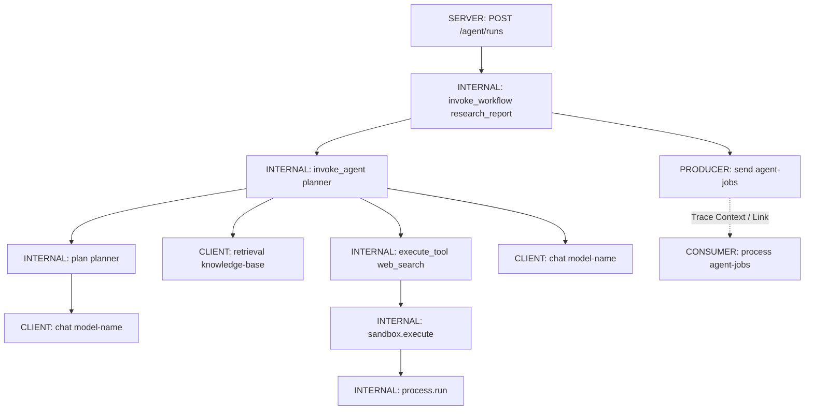
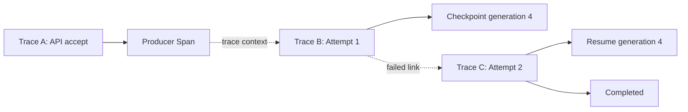

# OpenTelemetry GenAI Trace/Span 设计与隐私安全

> 目标：让 Model、Agent、Workflow、Retrieval、Tool 与 Sandbox 的因果关系可追踪，同时默认不采集 Prompt、Tool Result、PII 或凭证。

> 规范快照：本文按 2026-08-16 的 OpenTelemetry GenAI Semantic Conventions 主分支编写。该规范目前标记为 **Development**，且已从核心 semantic-conventions 仓库迁移到独立仓库；生产实现应固定版本并维护迁移测试。

## 阅读前术语表

| 术语 | 说明 |
|---|---|
| Trace | 一次分布式操作的因果图，由共享 Trace ID 关联多个 Span |
| Span | 一个有开始、结束、属性、事件和状态的操作单元 |
| Parent/Child | 子 Span 的工作由父 Span 直接触发，形成嵌套因果关系 |
| Span Link | 关联另一个 Span/Trace，但不声明严格父子关系，适合队列、批处理和恢复 |
| Context Propagation | 通过 HTTP Header 或消息属性传播 Trace Context |
| Span Kind | `SERVER`、`CLIENT`、`PRODUCER`、`CONSUMER`、`INTERNAL` 等操作角色 |
| Attribute | 附加到 Span 的键值；应控制大小、敏感性和基数 |
| Event | Span 内某个时间点发生的结构化事件 |
| Resource | 描述产生遥测的服务、版本、部署环境等实体 |
| Head Sampling | Span 开始时决定是否采样，只能使用开始时已有属性 |
| Tail Sampling | Collector 收齐 Trace 后按错误、延迟等条件决定是否保留 |
| Cardinality | 属性可能取值的数量；高基数值不适合成为 Metrics Label 或 Span Name |
| Opt-In Content | 默认不记录，只有显式开启并经过安全控制后才采集的内容字段 |

## 1. 先定义观测目标，不要把 Trace 当完整会话录像

安全的 Trace 应回答：

- 哪个 Workflow/Agent 调用了哪个模型和工具；
- 哪一步排队、重试、熔断、超时或降级；
- Token、费用、延迟和错误消耗在哪里；
- Retrieval 使用了哪个数据源、返回多少结果；
- Sandbox 是否按策略启动、限时并销毁；
- 一个异步任务的生产、消费和恢复尝试如何关联。

默认不应回答：

- 用户完整 Prompt 是什么；
- 系统 Prompt 或隐藏策略是什么；
- Tool Result 中包含哪些客户数据；
- 原始文档、向量内容、Shell 输出是什么；
- Access Token、Cookie、API Key 或 Secret 是什么。

可观测性目标是建立**控制流与性能证据**，而不是复制敏感业务数据。

## 2. 推荐的 Trace 层级



边界原则：

- HTTP/RPC 入口由协议自动埋点产生 `SERVER` Span；
- 组合多个 Agent/GenAI 操作的用户可见流程使用 Workflow Span；
- 单个 Agent 调用使用 Agent Span；远程 Agent 为 `CLIENT`，进程内 Agent 为 `INTERNAL`；
- 真正的模型 API 请求使用 Model `CLIENT` Span；
- Retrieval 使用 GenAI Retrieval Span；
- 工具调用使用 `execute_tool` Span；
- Sandbox 目前没有对应的标准 GenAI Span，作为 Tool Span 的自定义子 Span；
- 消息发布/消费遵循 Messaging Semantic Conventions，并传播 Trace Context 或使用 Span Link。

## 3. Span 设计总表

| 组件 | Span Name | Kind | 关键标准属性 | 内容默认值 |
|---|---|---|---|---|
| Workflow | `invoke_workflow {workflow.name}` | `INTERNAL` | `gen_ai.operation.name=invoke_workflow`、`gen_ai.workflow.name` | 不记录输入输出正文 |
| Agent 本地 | `invoke_agent {agent.name}` | `INTERNAL` | `gen_ai.operation.name=invoke_agent`、`gen_ai.agent.name/version` | Messages 关闭 |
| Agent 远程 | `invoke_agent {agent.name}` | `CLIENT` | 再加 `gen_ai.provider.name`、`server.address` | Messages 关闭 |
| Plan | `plan {agent.name}` | `INTERNAL` | `gen_ai.operation.name=plan` | 不记录 Chain-of-Thought |
| Model | `{operation} {request.model}` | `CLIENT` | `gen_ai.operation.name`、`gen_ai.provider.name`、`gen_ai.request.model` | Prompt/Output 关闭 |
| Retrieval | `retrieval {data_source.id}` | `CLIENT` | `gen_ai.operation.name=retrieval`、`gen_ai.data_source.id` | Query/Documents 正文关闭 |
| Tool | `execute_tool {tool.name}` | `INTERNAL` | `gen_ai.operation.name=execute_tool`、`gen_ai.tool.name/type` | 参数/结果关闭 |
| Sandbox | `sandbox.execute` | `INTERNAL` | 项目自定义 `app.sandbox.*` | 代码、stdout/stderr 关闭 |
| Queue Send | `{operation} {destination}` | `PRODUCER` | `messaging.system`、`messaging.operation.name`、destination | Payload 关闭 |
| Worker Process | `{operation} {destination}` | `CONSUMER` | Messaging 属性、attempt | Payload 关闭 |

Span Name 必须低基数。不要把 `task_id`、用户问题、URL、完整模型响应或 Tool 参数放进名称。它们会破坏聚合，并可能直接泄漏 PII。

## 4. Model Span

模型推理操作的 Span Name 按规范使用：

```text
{gen_ai.operation.name} {gen_ai.request.model}
```

例如 `chat gpt-model-x`。推荐属性分层：

### 4.1 默认记录

```yaml
gen_ai.operation.name: chat
gen_ai.provider.name: openai
gen_ai.request.model: gpt-model-x
gen_ai.response.model: gpt-model-x-2026-xx-xx
gen_ai.response.id: resp_...
gen_ai.response.finish_reasons: [stop]
gen_ai.usage.input_tokens: 1530
gen_ai.usage.output_tokens: 242
gen_ai.request.stream: true
server.address: api.provider.example
error.type: timeout  # 仅错误时
```

Token 数、模型名、结束原因通常足够做性能与费用分析，且不需要内容正文。`response.id`、conversation ID 等是高基数属性，可以用于 Trace 查询，但不能复制成 Metrics Label。

### 4.2 默认关闭

```text
gen_ai.input.messages
gen_ai.output.messages
gen_ai.system_instructions
gen_ai.prompt.variable.*
gen_ai.tool.definitions
```

这些字段在当前规范中是 Opt-In，并明确可能包含敏感信息。即使开启，也必须结构化、过滤和截断，不能直接把整个 SDK Request/Response 对象序列化进 Span。

### 4.3 流式响应事件

不要为每个 Token 创建 Span/Event，会造成遥测风暴。记录聚合信息：

```text
time_to_first_chunk
stream.chunk_count
stream.output_bytes
finish_reason
cancelled_after_first_chunk
```

如果 SDK/规范已有标准属性优先使用；没有时放在稳定的项目命名空间，例如 `app.gen_ai.stream.chunk_count`，并维护属性注册表。

## 5. Agent 与 Workflow Span

Workflow 只用于协调多个可组合操作的流程，不应为一个独立 Agent 调用再包一层空 Workflow。当前规范建议：

```text
invoke_workflow {gen_ai.workflow.name}
invoke_agent {gen_ai.agent.name}
plan {gen_ai.agent.name}
```

推荐记录：

```yaml
gen_ai.operation.name: invoke_workflow
gen_ai.workflow.name: research_report
app.workflow.version: 10w-v1
app.task.type: report
app.task.attempt: 2
app.policy.version: policy-2026-08
app.result.status: degraded
```

Agent Span 可记录 `gen_ai.agent.name`、稳定 Agent ID 和版本。不要把内存对象地址或每次进程启动产生的实例 ID 当作稳定 Agent ID。

Plan Span 只表示可可靠识别的计划/任务分解阶段。可以记录步骤数、允许工具类别、计划版本和预算，但不记录模型隐藏推理或 Chain-of-Thought：

```yaml
gen_ai.operation.name: plan
gen_ai.agent.name: planner
app.plan.step_count: 4
app.plan.max_steps: 8
app.budget.tokens_remaining: 12000
```

## 6. Retrieval Span

当前规范定义：

```text
gen_ai.operation.name = retrieval
Span name = retrieval {gen_ai.data_source.id}
Span kind = CLIENT
```

默认安全属性：

```yaml
gen_ai.operation.name: retrieval
gen_ai.data_source.id: kb-support-v3
app.retrieval.top_k: 8
app.retrieval.result_count: 6
app.retrieval.filter.tenant_applied: true
app.retrieval.query_hash: sha256:...
app.retrieval.max_score: 0.91
```

默认不记录 `gen_ai.retrieval.query.text` 或文档正文。文档 ID 也可能暴露客户、案件或文件名；只有经过分类后才可记录稳定伪名 ID。租户 ID 可作为 Trace 检索属性，但应使用内部不可逆 ID，并在 Collector 与后端实施租户访问控制。

Retrieval Trace 应能证明“先应用 tenant/ACL 过滤，再召回”，但不需要保存召回文本。可用布尔策略证据和过滤策略版本：

```yaml
app.authz.tenant_filter: enforced
app.authz.policy_version: rag-policy-17
app.retrieval.index_version: 2026-08-15
```

## 7. Tool Span

标准 Tool Span：

```text
gen_ai.operation.name = execute_tool
Span name = execute_tool {gen_ai.tool.name}
Span kind = INTERNAL
```

默认记录：

```yaml
gen_ai.operation.name: execute_tool
gen_ai.tool.name: tenant_export
gen_ai.tool.type: function
gen_ai.tool.call.id: call_...
app.tool.risk: high
app.authz.decision: allow
app.authz.policy_version: 42
app.approval.required: true
app.approval.status: approved
app.tool.result.type: object
app.tool.result.bytes: 812
```

默认不记录 `gen_ai.tool.call.arguments` 与 `gen_ai.tool.call.result`。替代方案：

- 参数 Schema 版本；
- 规范化参数哈希；
- 参数键列表，但排除敏感字段名；
- 结果类型、大小、行数；
- 对外部资源仅记录伪名 ID；
- 错误使用低基数 `error.type`。

Tool Call ID 用于关联模型提出的调用、Host 执行和结果回传；幂等键应单独保存哈希或内部引用，避免将可重放凭据当 Trace 属性。

## 8. Sandbox Span：使用自定义命名空间，不冒充标准字段

Sandbox 是 Tool 执行的隔离机制，目前不是独立的 OpenTelemetry GenAI 标准操作。推荐结构：

```text
execute_tool run_code
└── sandbox.execute
    ├── sandbox.provision
    └── process.run
```

项目属性：

```yaml
app.sandbox.provider: e2b
app.sandbox.template: secure-python-v4
app.sandbox.isolation: microvm
app.sandbox.network.mode: deny-by-default
app.sandbox.cpu.limit: 1
app.sandbox.memory.limit_mb: 512
app.sandbox.timeout_ms: 5000
app.sandbox.lifecycle: ephemeral
app.sandbox.exit_code: 0
app.sandbox.output_bytes: 124
app.sandbox.output_truncated: false
```

严禁记录：

- 代码全文、Shell 命令全文；
- stdout/stderr 原文；
- Guest 环境变量；
- 挂载路径中的用户/租户名称；
- Sandbox 登录 Token 或公开 URL。

可以记录代码哈希、语言、字节数、受控命令类别和策略拒绝原因。若为安全调查临时采集原文，必须使用独立加密存储、短 TTL、工单批准和访问审计，而不是放入通用 Trace Backend。

## 9. Queue、Worker 与跨 Trace 恢复

OpenTelemetry Messaging 约定区分 Producer、Consumer、Destination、Message 与 Consumer Group。Producer 应把 Trace Context 附加到消息；Consumer 提取后创建处理 Span。

但一个长任务可能等待数小时、重试多次，不适合让单个 Span 一直开放。需要按等待时长选择因果表达：短时消息处理可以把提取出的 Context 作为 Consumer 父上下文并延续同一 Trace；跨越长时间等待、恢复或人工审批时，建立新的根 Trace，并用 Span Link 关联消息创建 Span 或上一次 Attempt。推荐：

- API 接受阶段是一条短 Trace；
- Queue Publish 是该 Trace 的 Producer Span；
- 每次长任务 Worker Attempt 建立一条可独立结束的新 Trace；
- Consumer Span 使用 Link 指向消息创建 Context；短任务才直接采用父上下文延续原 Trace；
- 恢复 Attempt 通过 Link 指向上次失败 Attempt；
- `task_id`、checkpoint generation 和 attempt 作为高基数检索属性，不进入 Span Name/Metric Label。



## 10. 内容记录的默认关闭策略

```yaml
telemetry:
  genai_content:
    enabled: false
    allow_environments: []
    max_bytes: 0
  tool_content:
    enabled: false
  sandbox_content:
    enabled: false
  identifiers:
    hash_user_id: true
    hash_tenant_id: true
```

显式开启时必须同时满足：

1. 环境允许，例如仅隔离测试环境；
2. 数据所有者和安全负责人批准；
3. 结构化字段 Allowlist，而非 Blocklist；
4. Secret 检测 Fail-closed；
5. PII 分类、脱敏、截断和大小限制；
6. 独立存储、访问控制、加密和短 TTL；
7. 可按租户/用户删除；
8. 配置版本和开启人进入审计；
9. 禁止采集隐藏推理、原始凭证和高风险 Tool Result。

## 11. 三层脱敏，而不是依赖一个正则

### 11.1 SDK 层

默认根本不创建内容属性；只记录 Schema、大小、计数、哈希和分类标签。这是最有效的数据最小化。

### 11.2 Collector 层

作为第二道防线：删除敏感属性、哈希内部标识、截断异常消息、拒绝超大 Span。Collector 规则应版本化并测试。

### 11.3 Backend 层

实施租户隔离、细粒度 RBAC、字段级加密、保留/删除、查询审计和导出审批。Backend 不能弥补已经泄露到 Exporter 网络路径中的原文，因此不是第一道防线。

正则只识别已知格式；Secret 还可能以 Base64、JSON 嵌套、URL Query、异常堆栈或 Tool Result 出现。结构化 Allowlist 优先于“记录所有再脱敏”。

## 12. 错误、取消、重试与降级怎样记录

成功时通常保持默认 Span Status；失败时设置 `error.type` 为文档化的低基数类别，并按 OpenTelemetry Error 规则设置状态。

推荐事件：

```text
retry.scheduled       attempt, delay_ms, reason
circuit.open          dependency, policy_version
fallback.selected     fallback_type, reason
checkpoint.committed  generation, state_hash
lease.lost            owner_epoch
cancellation.requested source
content.dropped       category, policy_reason
```

不要把异常 `str(exc)` 无限制写入属性；它可能包含 URL Query、Prompt、数据库记录或 Token。保留异常类型、稳定错误码和经过脱敏截断的消息。

每次 Retry 是独立子 Span 或独立 Attempt Trace，不应把多次请求揉成一个 Model Span，否则无法区分单次超时、实际费用和供应商响应。

## 13. Sampling 与成本

### 13.1 Head Sampling

适合使用开始时已有的低基数属性：

- `gen_ai.operation.name`；
- Provider、Model、Agent/Workflow Name；
- 部署环境和服务版本；
- 风险等级或任务类型。

### 13.2 Tail Sampling

优先保留：

- Error/Timeout；
- 高延迟或高 Token；
- 熔断、降级、补偿；
- 高风险 Tool 与审批拒绝；
- Sandbox 策略拒绝或异常退出；
- 跨租户授权拒绝。

错误 Trace 也不能自动获得记录敏感内容的权限。Sampling 决定“保留哪条 Trace”，Content Policy 决定“Trace 里允许有什么”，两者必须独立。

## 14. 最小 Python 埋点示例

```python
from opentelemetry import trace

tracer = trace.get_tracer("agent-runtime", "10w-v1")

def run_tool(tool_name: str, tool_call_id: str, invoke):
    with tracer.start_as_current_span(
        f"execute_tool {tool_name}",
        kind=trace.SpanKind.INTERNAL,
        attributes={
            "gen_ai.operation.name": "execute_tool",
            "gen_ai.tool.name": tool_name,
            "gen_ai.tool.type": "function",
            "gen_ai.tool.call.id": tool_call_id,
            "app.telemetry.content_recording": False,
        },
    ) as span:
        try:
            result = invoke()
            span.set_attribute("app.tool.result.type", type(result).__name__)
            return result
        except Exception as exc:
            # 生产代码应映射到稳定、低基数且无敏感内容的错误类别。
            span.set_attribute("error.type", type(exc).__name__)
            span.set_status(trace.Status(trace.StatusCode.ERROR))
            raise
```

示例刻意不写 Tool 参数、结果正文和异常消息。若自动埋点库会默认采集内容，必须用集成测试确认配置实际生效，不能只相信配置名。

## 15. Schema 治理和兼容性

GenAI 规范仍在 Development，必须：

- 固定 OpenTelemetry SDK、Instrumentation 和 Semantic Convention 版本；
- 建立允许属性清单及 Stability 列；
- 禁止业务团队随意创建 `gen_ai.*` 键；项目扩展使用 `app.*` 或组织命名空间；
- 在 CI 中验证 Span Name、Kind、必需属性和内容禁用策略；
- 升级时运行双写/影子验证，避免 Dashboard 静默失效；
- Messaging 与 GenAI 规范分别固定版本，记录 opt-in 迁移配置。

## 16. 验收清单

- [ ] Workflow、Agent、Plan、Model、Retrieval、Tool 层级与 Kind 正确；
- [ ] Sandbox 使用项目命名空间，没有冒充 `gen_ai.*` 标准字段；
- [ ] Span Name 不包含 task_id、用户文本、URL 或 Tool 参数；
- [ ] `gen_ai.input.messages`、`output.messages`、`system_instructions` 默认不存在；
- [ ] Tool 参数/结果、Sandbox 代码和输出默认不存在；
- [ ] Trace 中搜索原始 JWT、API Key、Email、手机号返回 0；
- [ ] Queue 传播 Trace Context，重试/恢复使用正确 Parent 或 Link；
- [ ] Error、Retry、Fallback、Checkpoint、Lease Lost 可定位；
- [ ] Metrics Label 不使用 task_id、response_id、conversation_id；
- [ ] Tail Sampling 不绕过内容策略；
- [ ] 用户删除能覆盖可观测性后端；
- [ ] 规范版本和项目属性字典已固定并可迁移。

## 17. 本文结论

符合 OpenTelemetry GenAI 约定的关键不只是使用 `gen_ai.*` 前缀，而是正确表达操作边界、Span Kind、因果关系和标准名称。内容字段在当前规范中明确属于 Opt-In；生产系统应默认仅记录模型、操作、Token、延迟、状态、策略版本和安全摘要。Sandbox 尚无独立标准 GenAI Span，应在 Tool Span 下使用受治理的项目命名空间，并把代码、输出与 Secret 留在 Trace 之外。

## 参考资料

- [OpenTelemetry GenAI Semantic Conventions 独立仓库](https://github.com/open-telemetry/semantic-conventions-genai)
- [GenAI Model Spans](https://github.com/open-telemetry/semantic-conventions-genai/blob/main/docs/gen-ai/gen-ai-spans.md)
- [GenAI Agent and Framework Spans](https://github.com/open-telemetry/semantic-conventions-genai/blob/main/docs/gen-ai/gen-ai-agent-spans.md)
- [GenAI Events](https://github.com/open-telemetry/semantic-conventions-genai/blob/main/docs/gen-ai/gen-ai-events.md)
- [OpenTelemetry Messaging Spans](https://opentelemetry.io/docs/specs/semconv/messaging/messaging-spans/)
