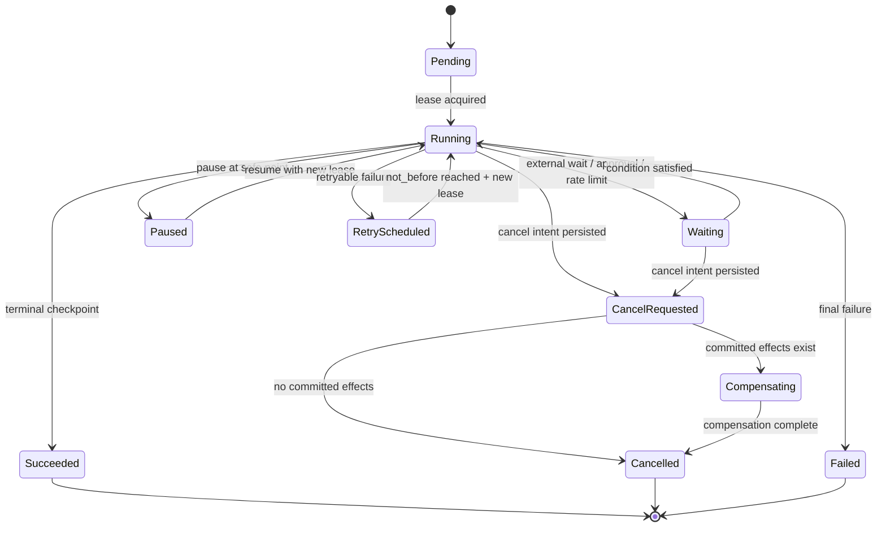
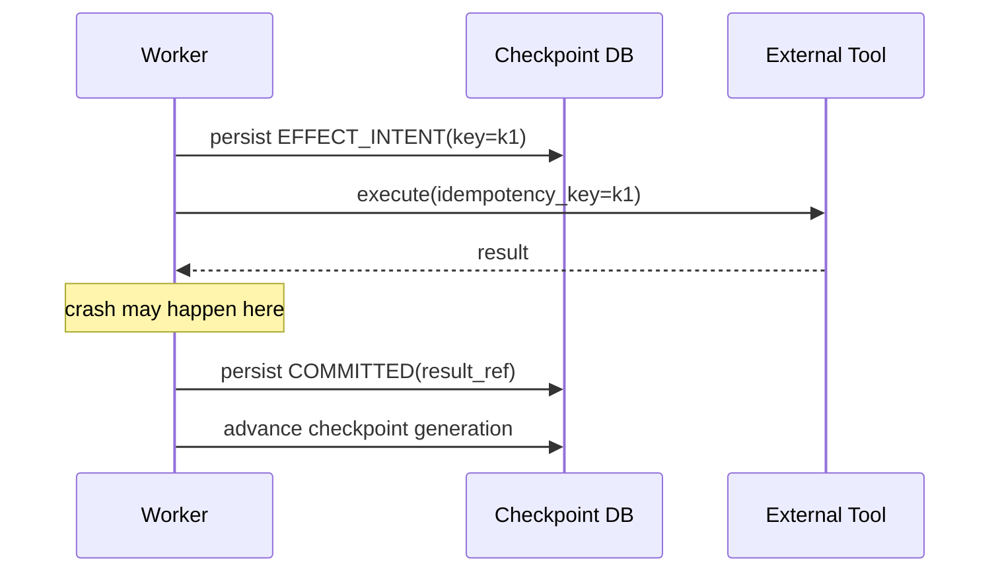
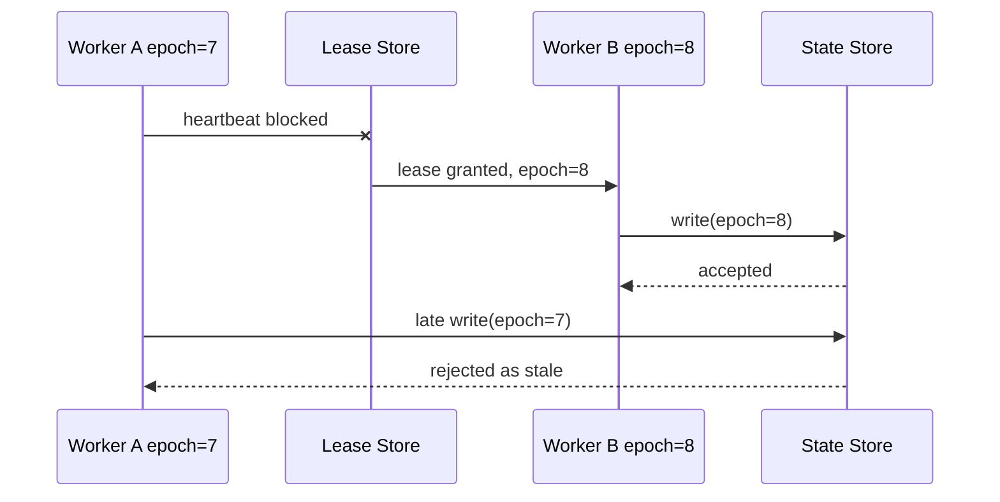

# 长任务 Checkpoint、Lease、Heartbeat、取消与恢复

> 目标：让持续数分钟到数小时的 Agent 任务在进程崩溃、Worker 重启、网络分区、用户取消和版本升级时仍能安全恢复，并且不重复高风险副作用。

## 阅读前术语表

| 术语 | 说明 |
|---|---|
| Checkpoint | 持久化的恢复点，包含继续执行所需的最小状态和已提交副作用证据 |
| Snapshot | 某一代完整状态快照，读取快但体积较大 |
| Event Log | 只追加状态事件，通过重放重建当前状态 |
| Lease | 有期限的执行所有权；到期后其他 Worker 可以接管 |
| Heartbeat | Worker 周期性报告存活和进度，常用于续租与故障检测 |
| Fencing Token | 每次获取 Lease 获得的单调递增代次；存储拒绝旧代次写入 |
| Cooperative Cancellation | 协作式取消；任务在安全点检查取消状态并清理退出 |
| Resume | 从持久 Checkpoint 开始新的 Attempt，而不是恢复旧进程内存 |
| Replay | 重新执行事件/步骤以重建状态或完成未确认工作 |
| Safe Point | 没有未记录副作用，或副作用状态已可判定的可暂停/取消位置 |
| Split Brain | 两个 Worker 都认为自己拥有同一任务并同时写入 |
| Generation | Checkpoint 的单调版本号，用于乐观并发和恢复定位 |

## 1. 长任务不能依赖进程内 Agent 状态

以下状态若只存在内存中，进程退出后都无法可靠恢复：

- 已完成哪些 Workflow 节点；
- 哪个 Tool 已调用、是否成功；
- 已消费的 Token/费用/步数；
- 用户是否请求取消；
- 哪个 Worker 当前拥有任务；
- 上一次模型响应对应哪个计划版本；
- 哪些外部副作用已经提交；
- 哪个审批票据已消费。

模型上下文不是数据库。它可能被截断、重写、总结或污染，也不能提供并发写入、唯一约束和事务。控制面状态必须结构化并持久化。

## 2. 任务状态机



状态迁移必须通过 Compare-and-Set：

```sql
UPDATE task
SET state = 'RUNNING', version = version + 1
WHERE task_id = :id
  AND state IN ('PENDING', 'RETRY_SCHEDULED', 'PAUSED')
  AND version = :expected_version;
```

如果影响行数为 0，说明状态已被其他 Worker 或取消请求改变，当前执行者必须重新读取，不能覆盖。

## 3. Checkpoint 应保存什么

一个可恢复 Checkpoint 至少包含：

```json
{
  "task_id": "task_01J...",
  "tenant_id": "tenant-a",
  "generation": 12,
  "workflow_name": "research_report",
  "workflow_version": "10w-v3",
  "state_schema_version": 4,
  "current_node": "synthesize",
  "completed_nodes": ["plan", "retrieve", "verify"],
  "node_outputs": {
    "retrieve": {"result_ref": "obj://encrypted/result/77", "sha256": "..."}
  },
  "effects": [
    {
      "effect_id": "effect-9",
      "tool": "web_search",
      "idempotency_key": "tenant-a:task_01J:search:1",
      "status": "COMMITTED",
      "result_ref": "obj://encrypted/tool/9"
    }
  ],
  "budget": {
    "steps_used": 5,
    "tokens_used": 8021,
    "cost_microunits": 33100,
    "deadline": "2026-08-16T11:00:00Z"
  },
  "cancel_generation_seen": 0,
  "owner_epoch": 8,
  "created_at": "2026-08-16T10:10:00Z",
  "state_hash": "sha256:..."
}
```

Checkpoint 不应保存原始 Access Token、Secret、未脱敏 Prompt 或超大 Tool Result。大内容加密存入对象存储，Checkpoint 保存受租户授权保护的引用、内容哈希、Schema 和分类标签。

## 4. Checkpoint 的原子性

### 4.1 纯计算步骤

计算结果写入对象存储后，再原子更新 Checkpoint 指向该结果。对象可先用临时 Key 写入，Checkpoint 提交成功后转为可见或由垃圾回收清理未引用对象。

### 4.2 数据库副作用

业务修改、Outbox 事件和 Checkpoint 应尽量在同一数据库事务提交：

```text
BEGIN
  compare owner_epoch/version
  apply business transition
  insert outbox event
  insert checkpoint generation+1
  update task current_generation
COMMIT
```

### 4.3 外部副作用

不能与本地 Checkpoint 共享事务时：

1. 先持久化 `EFFECT_INTENT` 与稳定 Idempotency Key；
2. 调用外部 Tool；
3. 持久化 `COMMITTED + result_ref`；
4. 再推进 Workflow Checkpoint。

若第 2 步成功、第 3 步前崩溃，恢复时先用 Idempotency Key 查询/重放外部操作，不能直接创建新意图。



## 5. Checkpoint 粒度

Checkpoint 太频繁会增加存储与锁竞争；太稀疏会导致恢复时重复大量昂贵工作。

必须 Checkpoint 的边界：

- 高风险或不可逆 Tool 前后；
- 外部副作用状态变化；
- 人工审批前后；
- 长时间等待前；
- Token/费用预算跨过阈值；
- Fan-out 完成一批结果；
- 用户可见进度节点；
- Workflow 版本迁移点。

纯 CPU 循环可按时间或处理数量 Checkpoint，例如每 30 秒或每 100 个文档。粒度应由“重复工作的最大可接受成本”和“Checkpoint 开销”共同决定。

## 6. Lease：有期限的执行所有权

Lease 记录：

```text
task_id
owner_id
owner_epoch
lease_expires_at
last_heartbeat_at
attempt
```

获取 Lease 的原子操作：

```sql
UPDATE task
SET owner_id = :worker,
    owner_epoch = owner_epoch + 1,
    lease_expires_at = :now + :lease_duration,
    attempt = attempt + 1
WHERE task_id = :task
  AND state IN ('PENDING', 'RUNNING', 'RETRY_SCHEDULED')
  AND (owner_id IS NULL OR lease_expires_at < :now)
RETURNING owner_epoch;
```

Lease 解决“Worker 长时间无响应后允许接管”，但单独不能阻止旧 Worker 迟到写入。网络分区时旧 Worker 可能仍在运行，只是无法续租；新 Worker 获取 Lease 后形成 Split Brain。

## 7. Fencing Token：拒绝旧 Worker

每次 Lease 所有权变化，`owner_epoch` 单调增加。所有持久写和外部支持的副作用请求都携带 Epoch：

```sql
UPDATE checkpoint
SET generation = generation + 1, state = :state
WHERE task_id = :task
  AND owner_epoch = :my_epoch;
```

存储只接受当前 Epoch。若 Worker A 的 Epoch=7 失联，Worker B 获取 Epoch=8，A 即使恢复也无法再提交 Epoch=7 的结果。



如果外部 Tool 不支持 Fencing Token，则至少使用稳定 Idempotency Key、状态查询和本地提交校验；高风险系统应优先选支持条件写或版本令牌的依赖。

## 8. Heartbeat：故障检测信号，不是进度本身

Heartbeat 周期通常明显短于 Lease：例如每 10 秒 Heartbeat，Lease 30～45 秒。必须加入 Jitter，避免数千 Worker 同时更新数据库。

Heartbeat 可携带低成本状态：

```json
{
  "task_id": "task_01J...",
  "owner_epoch": 8,
  "checkpoint_generation": 12,
  "phase": "synthesize",
  "progress": 0.62,
  "sent_at": "..."
}
```

注意：

- Heartbeat 存活不代表任务有进展；线程可能死锁但心跳线程正常；
- 没有 Heartbeat 不一定已死亡，可能是网络分区或 GC Pause；
- 用户看到的进度应来自已提交 Checkpoint，而不是易丢的 Heartbeat；
- 续租必须验证 `owner_id + owner_epoch`，旧 Worker 不能续新 Lease；
- 连续无进度但有 Heartbeat 应触发 stuck detector。

建议同时监测 `last_heartbeat_age` 与 `last_checkpoint_age`。

## 9. 取消：持久意图 + 安全点

取消 API 应先持久化单调的 Cancel Intent：

```json
{
  "task_id": "task_01J...",
  "cancel_generation": 3,
  "requested_by": "user-42",
  "requested_at": "...",
  "reason_code": "user_request",
  "mode": "stop_and_compensate"
}
```

Worker 在以下安全点检查：

- 开始新 Workflow 节点前；
- 获取 Rate Limit 或并发许可后、发请求前；
- 每个流式 Chunk/批次边界；
- Tool 调用前；
- 等待重试前后；
- Heartbeat/Checkpoint 时。

```python
async def cancellation_point(control, task_id, seen_generation):
    intent = await control.read_cancel_intent(task_id)
    if intent.generation > seen_generation:
        raise TaskCancellationRequested(intent)
```

不能只用内存中的 `asyncio.Event`：它无法跨 Worker、跨进程恢复。进程内 Event 可用于加速响应，但持久 Cancel Intent 才是权威事实。

## 10. 强制终止和协作取消的边界

取消流程：

```text
持久化 Cancel Intent
  → 通知当前 Worker
  → 协作式停止新工作
  → 取消下游 HTTP/模型流
  → 等待 grace period
  → Sandbox kill / 进程终止
  → 检查已提交副作用
  → 补偿或进入人工处理
  → 写终态 Checkpoint
```

强制 Kill 只能停止计算，不能自动撤销已经发送的邮件、支付或删除。终态必须区分：

- `CANCELLED_NO_EFFECT`；
- `CANCELLED_COMPENSATED`；
- `CANCELLED_PARTIAL`；
- `CANCEL_PENDING_EXTERNAL_STATUS`。

仅返回 `cancelled=true` 会掩盖残留副作用。

## 11. 恢复算法

Worker 恢复任务时：

```text
1. 原子获取新 Lease 与 Fencing Token
2. 读取最新已提交 Checkpoint
3. 验证 tenant、Schema、workflow_version、state_hash
4. 读取最新 Cancel Intent 和绝对 Deadline
5. 校验 Token/费用/步骤预算
6. 对 IN_FLIGHT/UNKNOWN Effect 做状态判定
7. 对已提交步骤跳过或读取结果引用
8. 从下一个安全节点继续
9. 新 Attempt 使用新的 Trace，并 Link 到上次 Attempt
```

恢复不是反序列化任意 Python 对象。Checkpoint Schema 必须向后兼容或有显式迁移器；不能加载不可信 Pickle。

## 12. Workflow 版本升级

长任务可能在部署 v3 前由 v2 创建。策略选择：

| 策略 | 行为 | 适用 |
|---|---|---|
| Pin | 整个任务继续使用原版本 | 高风险、强可复现流程 |
| Migrate | 在指定 Checkpoint 运行状态迁移 | 长周期且必须升级 |
| Restart | 从安全起点以新版本重跑 | 无副作用或成本低 |
| Abort | 无兼容路径时停止并人工处理 | 安全优先 |

迁移函数应是确定性的：`old_state + migration_version -> new_state`，记录输入/输出哈希，禁止在迁移中直接调用外部 Tool。

计划/Prompt/模型版本也应固定或记录。否则同一个 Checkpoint 恢复后，模型可能因版本变化生成完全不同的后续动作。

## 13. Fan-out/Fan-in 的 Checkpoint

处理 10,000 个文档时，不应把每个结果塞进一个巨大 JSON：

```text
Parent task
  ├── shard 0: items 0..999, generation 5, DONE
  ├── shard 1: items 1000..1999, generation 4, RUNNING
  ├── shard 2: items 2000..2999, generation 4, RETRY
  └── ...
```

每个 Shard 有独立 Idempotency Key、Lease 和 Checkpoint；Parent 只保存 Shard 状态摘要和结果 Manifest。Fan-in 必须验证所有必需 Shard 的完成版本，避免把旧 Attempt 的结果和新 Attempt 混合。

## 14. 数据模型建议

```text
task
  task_id, tenant_id, state, version, workflow_version,
  deadline, cancel_generation, current_generation,
  owner_id, owner_epoch, lease_expires_at,
  last_heartbeat_at, last_checkpoint_at

checkpoint
  task_id, generation, owner_epoch, state_schema_version,
  state_ref, state_hash, created_at

effect
  task_id, effect_id, idempotency_key, request_hash,
  status, external_resource_id, result_ref, compensation_status

task_event
  event_id, task_id, generation, type, safe_metadata, trace_id, created_at
```

所有表以 tenant 为授权维度；Task ID 即使全局唯一，也不能代替租户过滤。

## 15. 可观测性

关键指标：

```text
task.running / waiting / retry_scheduled
checkpoint.commit.duration
checkpoint.generation_gap
lease.acquire.conflict_total
lease.expired_total
heartbeat.age
checkpoint.age
task.stuck_total
cancellation.latency
recovery.total{reason}
stale_worker_write_rejected_total
effect.unknown_total
compensation.failed_total
```

Trace 中记录 generation、attempt、owner_epoch 和 state hash；不记录完整 Checkpoint 内容。每次恢复建立新 Attempt Trace，并使用 Span Link 保留因果关系，避免创建持续数小时且难以导出的开放 Span。

## 16. 故障注入与验收

至少测试：

1. 纯计算步骤中途杀死 Worker；
2. 对象写入后、Checkpoint 提交前崩溃；
3. 外部 Tool 成功后、Effect Commit 前崩溃；
4. Heartbeat 丢失但 Worker 仍运行；
5. Lease 到期后新 Worker 接管，旧 Worker 随后恢复；
6. Checkpoint 并发提交冲突；
7. 用户在排队、模型流式生成、Tool 执行和补偿阶段分别取消；
8. 取消请求重复投递；
9. Deadline 在队列中到期；
10. Checkpoint Schema 跨版本恢复；
11. Workflow 新版本没有迁移器；
12. Fan-out 部分 Shard 重试；
13. Budget 已耗尽后恢复；
14. Checkpoint 对象引用损坏或 Hash 不匹配；
15. 跨租户猜测 Task ID/Checkpoint ID。

验收不变量：

```text
同一时刻只有当前 owner_epoch 能提交
已 COMMITTED 的 Effect 不以新 Key 重做
取消后不启动新副作用
恢复不重置 Deadline、Token、费用或步骤预算
终态任务不会重新变成 RUNNING
Checkpoint 不含原始凭证和敏感正文
```

## 17. 常见错误

1. **Heartbeat 等于锁**：旧 Worker 在网络分区后仍可写，缺少 Fencing Token。
2. **Checkpoint 只有 current_step**：不知道外部副作用是否已经提交。
3. **每次恢复重新生成幂等键**：导致重复付款、邮件或删除。
4. **取消即删除消息**：正在执行的 Worker 仍继续产生副作用。
5. **恢复时重置 Deadline/预算**：攻击者可通过反复恢复获得无限资源。
6. **序列化整个 Agent 对象**：版本不兼容、安全风险高、难以审计。
7. **一个超长 Span 覆盖数小时任务**：Exporter 丢失、查询困难且无法表达多个 Attempt。
8. **新版本直接读取旧状态**：字段语义漂移造成错误动作。

## 18. 本文结论

长任务可靠性的核心是把执行权和执行状态分开：Lease 决定谁可以尝试执行，Fencing Token 决定谁可以提交，Heartbeat 只提供存活信号，Checkpoint 保存可恢复事实，Cancel Intent 持久表达用户意图，幂等 Effect 记录防止恢复时重复副作用。恢复必须延续原 Deadline 和预算，并从已验证的安全点开始，而不是让 Agent“根据上下文猜测上次做到哪里”。

## 参考资料

- [Temporal Documentation: Durable Execution](https://docs.temporal.io/)
- [Kubernetes API Concepts: Resource Versions and Concurrency Control](https://kubernetes.io/docs/reference/using-api/api-concepts/)
- [OpenTelemetry Trace API](https://opentelemetry.io/docs/specs/otel/trace/api/)
- [OpenTelemetry Messaging Spans](https://opentelemetry.io/docs/specs/semconv/messaging/messaging-spans/)
