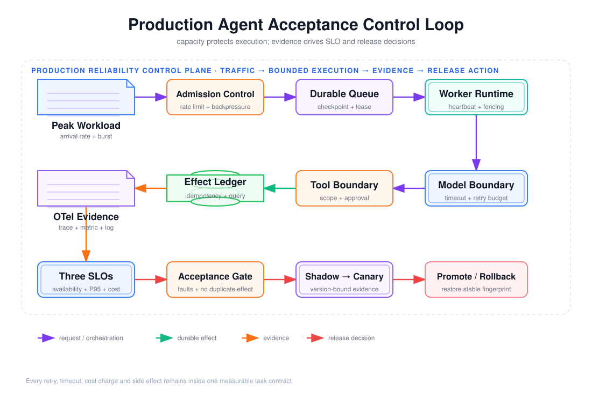

# 第 10 周总结：生产系统设计面试、SLO、容量、故障演练与灰度回滚验收



本文把第 10 周的并发、可靠性、幂等、可观测性、长任务恢复和版本治理收敛为一份可面试、可演练、可复核的验收文档。重点不是背诵“重试、队列、熔断”等名词，而是证明：系统在过载和部分失败下仍能守住截止时间、预算、租户边界和副作用不变量，并能根据版本绑定的证据停止灰度或恢复稳定版本。

> 验收日期：2026-08-16。本文中的测试数、故障结果、延迟、成本和版本指纹来自本次本地重跑。它们证明实现与控制链路可工作，不等价于 30 天生产 SLO 已达标。

---

## 1. 阅读前术语表

| 术语 | 说明 |
|---|---|
| SLI | Service Level Indicator，服务水平指标，是从真实遥测计算出的数值，例如 30 天任务成功率。 |
| SLO | Service Level Objective，服务水平目标，是 SLI 必须满足的门槛和统计窗口，例如“滚动 30 天可用性不低于 99.9%”。 |
| Error Budget | 错误预算，等于 `1 - SLO` 允许消耗的失败比例；它把可靠性目标转化为发布和变更速度约束。 |
| Availability | 可用性。本文按“合格逻辑任务在恢复期限内正确完成”的比例计算，不按进程是否存活计算。 |
| P95 | 第 95 百分位。95% 的样本不大于该值；它比平均值更能暴露排队、重试和长尾延迟。 |
| Backpressure | 背压。下游容量不足时，主动减慢、排队或拒绝上游流量，防止无限堆积。 |
| Retry Amplification | 重试放大。失败请求产生额外尝试，使故障组件收到比原始流量更高的负载。 |
| Idempotency Key | 幂等键。相同逻辑副作用重复提交时使用同一个稳定标识，使服务返回既有结果而不是再次执行。 |
| Fencing Token | 栅栏令牌。Lease 每次重新授予时递增的 Epoch，旧 Worker 的迟到写入会因令牌过期而被拒绝。 |
| Checkpoint | 检查点。持久保存长任务阶段、预算和必要引用，使进程退出后从确定阶段恢复。 |
| Logical Task | 逻辑任务。用户认为的一次工作；它可以包含多个 Attempt，但成功率和单位成本不能把重试当成多个新任务。 |
| Attempt | 执行尝试。逻辑任务的一次 Worker 处理；429、超时或进程退出会增加 Attempt。 |
| Canary | 金丝雀发布。只让少量真实或代表性流量进入候选版本，并按预设门禁决定扩大或回滚。 |
| Version Fingerprint | 版本指纹。由 Prompt、模型、Tool Schema、MCP、记忆策略、评测集和 Runtime 等完整组合计算的稳定标识。 |

---

## 2. 验收结论先行

| 验收项 | 本次结果 | 判定 |
|---|---|---|
| 生产系统设计题 | 12 道，每题包含约束、设计与权衡 | 通过 |
| 三项 SLO | 已定义可用性、端到端 P95、单位成功任务成本的 SLI、目标、窗口和排除规则 | 定义完成 |
| 容量估算 | 已给出峰值、重试放大、并发、Provider 配额、突发积压和存储估算 | 完成，需用生产数据校准 |
| 自动化测试 | `10 passed in 0.90s` | 通过 |
| 故障注入 | 429、网络超时、工具半成功、真实子进程退出、重复消息全部恢复 | 通过 |
| 重复副作用 | 5 条 Effect 记录的 `execution_count` 全部为 1 | 通过 |
| 灰度回滚 | Shadow 通过，Canary 被阻断，Rollback 恢复稳定指纹并通过 | 通过 |
| Trace 版本追踪 | Shadow、Canary、Rollback 均能定位完整版本组合 | 通过 |
| 生产 SLO 达标证明 | 本地样本量小且使用模拟 Model/Tool | 尚不能证明 |

核心不变量是：

\[
Success = CorrectOutcome \land WithinDeadline \land WithinBudget
          \land Authorized \land NoDuplicateEffect
\]

如果最终文本看似正确，但任务越权、超预算、超过截止时间或重复产生副作用，仍应判为失败。

### 2.1 图中的控制闭环

上图由 `$fireworks-tech-graph` 生成并通过 XML、箭头碰撞、语义几何和构图质量检查，PNG 已完成视觉复核。阅读顺序如下：

1. 峰值流量先经过 Rate Limit 和 Backpressure，系统只接收有能力处理的工作；
2. Durable Queue 保存任务、Checkpoint、Lease 和恢复所需状态；
3. Worker 在独立的 Model/Tool 超时、并发和全局预算内执行；
4. 副作用进入 Effect Ledger，通过幂等键、请求哈希和结果查询实现去重与半成功恢复；
5. Trace、Metric 和 Log 聚合为可用性、P95 和单位成功任务成本；
6. 验收门禁联合故障测试和副作用不变量决定是否进入 Canary；
7. Canary 不满足门槛时恢复稳定版本指纹，而不是让模型自行判断是否继续发布。

---

## 3. 三项 SLO 的严格定义

### 3.1 SLO 1：逻辑任务可用性

**目标：滚动 30 天，可用性不低于 99.9%。**

合格任务（Eligible Task）是已经通过身份、授权、Schema、配额和 Admission Control，并由系统返回“已接受”的逻辑任务。非法输入、越权请求和进入系统前的客户端取消不进入分母；服务接受后发生的排队超时、预算耗尽、依赖失败和恢复失败必须进入分母。

\[
Availability =
\frac{\text{在恢复期限内以正确 Outcome 完成的合格逻辑任务数}}
{\text{系统已接受的合格逻辑任务总数}}
\]

本文将恢复期限定义为：交互任务 5 分钟，长任务按 Task Contract 中的 Deadline。以下情况都算不可用：

- 返回成功文本但权威系统没有对应 Outcome；
- 最终成功但超过任务 Deadline；
- 产生重复扣款、重复发布等安全不变量破坏；
- Retry exhausted、Lease 永久丢失或补偿失败；
- 遥测缺失导致无法证明最终 Outcome，按 fail-closed 计失败。

99.9% 对应 0.1% 任务错误预算。若用时间近似，30 天约允许 43 分 49.7 秒不可用；本系统的主要口径仍是任务比例，因为队列系统可能“进程在线但任务持续失败”。建议设置两级告警：1 小时 Burn Rate 大于 14.4 倍立即告警，6 小时 Burn Rate 大于 6 倍阻止继续灰度。

### 3.2 SLO 2：端到端 P95 延迟

**目标：交互型任务滚动 7 天端到端 P95 不高于 2 秒。**

计时起点是 Admission 接受任务的时间，终点是权威 Outcome 持久化且响应可查询的时间：

\[
T_{e2e}=T_{queue}+\sum T_{model}+\sum T_{tool}+T_{retry\ delay}+T_{checkpoint}+T_{commit}
\]

必须包含 Queue Wait、Semaphore Wait、重试退避、Lease 恢复和结果提交，不能只统计某一次模型 HTTP 调用。失败任务进入可用性 SLI；同时保留 `deadline_exceeded` 比例，防止只对成功样本计算 P95 造成幸存者偏差。长任务不混入 2 秒交互 SLO，而使用“在承诺 Deadline 内完成的比例”。

本次 Dashboard 的本地 Attempt P95 为：候选版本 `11.794 ms`、稳定版本 `11.875 ms`。这只是 7 个 Attempt、模拟 5 ms Model 和 3 ms Tool 的控制链路测试，既不是逻辑任务端到端 P95，也不能作为生产延迟容量依据。

### 3.3 SLO 3：单位成功任务成本

**目标：滚动 30 天，单位成功任务成本不高于 0.0015 美元。**

\[
CostPerSuccess =
\frac{C_{model}+C_{tool}+C_{sandbox}+C_{storage}+C_{network}+C_{allocated\ infra}}
{\text{成功且满足安全不变量的逻辑任务数}}
\]

分子必须包含失败 Attempt、重试、Shadow 流量和为成功任务分摊的基础设施成本；分母按逻辑任务去重，不能让重试增加“成功次数”。安全失败不得进入成功分母，否则重复副作用既伤害用户又会虚假降低单位成本。

本次模拟器中每个成功任务记录 `760 microUSD = 0.00076 USD` 的模型成本：

- `tenant-a`：4 个逻辑任务、6 个 Attempt、总成本 3,040 microUSD，单位成功任务成本 760 microUSD；
- `tenant-b`：1 个逻辑任务、1 个 Attempt、总成本 760 microUSD，单位成功任务成本 760 microUSD。

该数值只包含模拟 Model 的声明成本，不包含 Tool、Sandbox、存储和机器成本，因此只能证明聚合口径正确，不能直接判定生产成本 SLO 达标。

---

## 4. 容量估算

### 4.1 工作负载假设

容量估算必须显式写出假设，否则“需要多少 Worker”没有可复核答案。

| 参数 | 规划值 | 含义 |
|---|---:|---|
| 平均到达率 | 5 tasks/s | 月度成本与常态资源基线 |
| 峰值到达率 | 20 tasks/s | 正常高峰的 Admission 目标 |
| 突发到达率 | 40 tasks/s，持续 60 s | Queue 吸收的短时突发 |
| Model P95 服务时间 | 0.4 s | 包含 Provider 网络时间，不含本地 Queue Wait |
| Tool P95 服务时间 | 0.2 s | 包含鉴权、业务提交和结果持久化 |
| 规划重试放大系数 | 1.2 | 平均每个逻辑任务最多消耗 1.2 倍尝试容量 |
| 容量余量 | 1.5 | 发布、节点故障和估算误差的 50% Headroom |
| 每任务持久状态 | 8 KiB | Payload 引用、Checkpoint、Lease、结果元数据和索引估算 |

规划重试放大系数不是 `max_attempts`。若单次尝试失败概率为 \(p\)，最多执行 \(r\) 次，独立失败假设下期望尝试数为：

\[
A_{retry}=1+p+p^2+\cdots+p^{r-1}
\]

当 `p=0.1, r=4` 时，期望值约为 1.111；本文按 1.2 规划。真实事故中失败并不独立，所有客户端可能同时失败并重试，所以还必须用全局 Retry Budget 和 Admission Control 将放大系数硬限制在规划值附近。

### 4.2 并发与 Provider 配额

用 Little's Law 的工程近似：

\[
Concurrency \ge \lceil \lambda_{peak}\times ServiceTime_{p95}
\times A_{retry}\times Headroom \rceil
\]

计算结果：

| 资源 | 计算 | 最小规划并发 |
|---|---|---:|
| Model | `ceil(20 × 0.4 × 1.2 × 1.5)` | 15 |
| Tool | `ceil(20 × 0.2 × 1.2 × 1.5)` | 8 |
| Worker 工作流 | `ceil(20 × (0.4 + 0.2) × 1.2 × 1.5)` | 22 |

Provider 侧至少要支持 `20 × 1.2 = 24 attempts/s`，即约 1,440 RPM。若沿用演示中的 152 Token/成功 Model 调用，最低约需 218,880 TPM；生产必须替换成 Prompt、检索上下文和输出的真实 P95 Token，而不是使用平均值。

当前 Demo 的 `model.concurrency=2`、`tool.concurrency=1`、Model 延迟 5 ms、Tool 延迟 3 ms 只用于验证并发门和超时语义。用这些模拟延迟推导出的吞吐量没有生产意义。

### 4.3 突发积压与存储

当 40 tasks/s 的突发进入，而安全处理能力暂时只有 20 tasks/s，持续 60 秒时：

\[
Backlog=(40-20)\times60=1,200\ tasks
\]

恢复到正常 20 tasks/s 的净空闲处理能力后，至少还需要 60 秒排空。1,200 条任务按 8 KiB 原始状态约为 9.4 MiB；考虑索引、WAL、版本和 2 倍存储余量，应为该突发预留至少 20 MiB。生产还要按保留周期估算：平均 5 tasks/s、保留 7 天约有 302.4 万任务，原始状态约 23.1 GiB，按 2 倍余量约 46.2 GiB，因此必须配置归档、压缩和删除策略。

容量不足时的顺序应是：先限制低优先级租户和非交互任务，再降低并发昂贵功能，最后快速返回可重试的过载错误。不能继续无界入队，因为那只会把立即失败变成长时间后失败，同时消耗用户的 Deadline。

---

## 5. 故障注入演练报告

本次执行入口是 [`run_demo.py`](./source/run_demo.py)，持久结果见 [`fault-results.json`](./source/artifacts/fault-results.json)。自动化测试结果为 `10 passed in 0.90s`。

| 注入故障 | 预期防护 | 本次实际结果 | 残余风险 |
|---|---|---|---|
| Model 429 | 记录 `RateLimited`，尊重 Retry-After，在 Deadline、最大 Attempt 和全局预算内重试 | 第 1 次失败，第 2 Attempt 成功，最终 `SUCCEEDED` | 单机重试预算不能阻止全 Fleet 同步重试；生产需分布式限流与 Jitter |
| Model 网络超时 | Timeout 包含等待并发槽时间；保留 MODEL Stage 和累计预算，重试不重置 Deadline | 第 1 次 `NetworkTimedOut`，第 2 Attempt 成功 | Provider 可能已计算并收费但响应丢失；应按实际账单校准成本 |
| Tool 半成功 | 副作用先提交、响应丢失后按幂等键查询结果；查到 `SUCCEEDED` 就继续而不再次执行 | 任务在第 1 Attempt 成功恢复，Effect `execution_count=1` | 外部 Tool 必须支持幂等键或权威结果查询；否则只能补偿和人工对账 |
| 真实子进程退出 | Model 后持久化 `stage=TOOL`；Lease 到期后新 Worker 取得更高 Epoch 并续跑 | 子进程退出码 73；退出后为 `RUNNING/TOOL`；第 2 Attempt 恢复为 `SUCCEEDED` | SQLite 是单节点演示；生产需事务 Queue、复制存储和跨节点 Fencing |
| 重复消息 | `message_id + tenant + payload/version` 建立逻辑任务唯一性；相同消息返回既有 Task | 两次提交映射到同一 Task，第二次 `inserted=false`，最终成功 | 幂等键保留期结束后的重放、跨区域键冲突仍需全局策略 |

### 5.1 “没有重复副作用”的证据

最新 `state.db` 中共有 5 条 Effect，覆盖上述五个逻辑任务；每一条均满足：

```text
status = SUCCEEDED
execution_count = 1
```

实现依赖三层约束：

1. `effects.idempotency_key` 是数据库主键，相同键不能创建第二条 Effect；
2. `request_hash` 绑定租户和规范化参数，相同键但不同请求会触发 `IdempotencyConflict`；
3. Tool 半成功或 Worker 恢复时先查询已有结果，旧 Lease 的迟到 Checkpoint 被 `StaleLease` 拒绝。

这里证明的是“在本地 Effect Ledger 所覆盖的 `publish_report` 操作中没有重复提交”，不是宣称任意外部系统都天然 Exactly-once。若外部 API 不接受幂等键、不能查询结果且 Effect Store 与外部提交无法原子化，就必须增加 Outbox/Inbox、业务唯一键、对账或补偿事务。

---

## 6. Shadow → Canary → Rollback 灰度报告

发布演练复用了第 8 周的确定性 Eval Gate，完整结果见 [`release-drill.json`](./source/artifacts/release-drill.json)，版本 Trace 校验见 [`trace-version-verification.json`](./source/artifacts/trace-version-verification.json)。

| 阶段 | 版本指纹 | 严格成功率 | Gate | 决策 |
|---|---|---:|---|---|
| Shadow | `83fc04ba36cf4421` | 98.5% | PASS | 进入 Canary |
| Canary（注入回归） | `83fc04ba36cf4421` | 90.0% | BLOCK | 触发 Rollback |
| Rollback | `469d6de3e3a6717c` | 100% | PASS | 恢复稳定基线 |

Canary 被阻断不是因为一个模糊总分，而是同时违反了以下确定性门槛：

- 总体严格成功率 `0.90 < 0.95`；
- 相对基线下降 `0.10 > 0.02`；
- normal、failure、adversarial 三个关键切片均低于 0.95。

Rollback 后验证了三件事：阶段顺序确实为 `shadow → canary → rollback`；恢复版本指纹等于稳定基线；三个阶段的 Trace 都包含 Prompt、Model、Tool Schema、MCP Server、Memory Policy、Eval Set 和 Runtime 的完整版本组合。

**报告边界：**本次成功率由 `release_drill.py` 构造固定 AggregateReport，用于验证门禁、状态迁移和版本证据链；没有操作真实负载均衡器，也没有证明真实 Canary 流量下的 RTO。生产报告还必须记录流量比例、开始/决策/恢复时间、配置传播完成时间、积压变化、用户影响和回滚后至少一个观察窗口的 SLO。

---

## 7. 无笔记口述：重试为什么可能扩大事故

下面是一段约 90 秒、可以脱离笔记直接回答的版本：

> 重试不是免费的恢复动作，它会把一个逻辑请求变成多个物理请求。假设下游已经因为过载开始超时，上游如果立刻重试，相当于在最脆弱的时候继续增加 QPS。每个客户端都用相同退避时间时，还会在同一时刻再次唤醒，形成同步尖峰。更多请求会占满连接池、线程、并发槽和队列，让原本健康的请求也超时，于是失败比例继续升高，再触发更多重试，形成正反馈。
>
> 重试还会放大成本和副作用风险。模型调用可能已经计费但响应丢失，Tool 可能已经扣款或发布成功；如果没有幂等键和结果查询，重试会重复执行。正确设计不是“失败就重试三次”，而是只重试明确的瞬时错误，受端到端 Deadline、最大 Attempt、Token 和费用预算共同约束；使用指数退避和随机 Jitter，尊重 Retry-After；在高失败率时用熔断、Admission Control 和全局 Retry Budget 停止放大；副作用必须幂等或可查询。重试的目标是提高成功概率，但前提是它不能降低整个系统的成功概率。

数学上，若每个 Attempt 以概率 \(p\) 失败、最多尝试 \(r\) 次，原始到达率 \(\lambda\) 会被放大为：

\[
\lambda' = \lambda(1+p+p^2+\cdots+p^{r-1})
\]

该公式仍低估了事故，因为真实失败存在相关性；当故障由过载导致时，\(p\) 会随 \(\lambda'\) 上升，形成“流量增加 → 失败增加 → 重试增加 → 流量继续增加”的反馈环。

---

## 8. 生产系统设计面试题与参考答案

以下 12 道题按“先明确目标和约束，再给关键机制，最后说明失败模式与权衡”的方式回答。只报技术名词、不定义不变量或容量边界，不能算完整系统设计答案。

### 题 1：设计一个多租户、可恢复的 Agent 执行平台

**设计答案：**入口先完成身份验证、租户解析、Schema 和配额检查，再生成稳定 `message_id` 并写入 Durable Queue。Worker 通过 Lease Claim 取得任务，Checkpoint 保存阶段和累计预算；Model 与 Tool 使用独立并发器和超时，但共享 Workflow Deadline、Step、Token 和费用预算。Tool 调用前经过租户授权与高风险审批，副作用写入按租户隔离的 Effect Ledger。所有 Span 携带 `tenant.id + task.id + attempt + version_fingerprint`，但不记录原始 Prompt、Tool Result、凭证或 PII。

关键权衡是 Queue 与 Effect Store 的一致性：任务恢复不能重置预算，效果提交不能仅依赖 Worker 内存。生产至少需要条件写或事务保证 Claim、Checkpoint、Fencing 和 Effect 去重。

### 题 2：下游模型容量突然下降一半，如何防止系统雪崩？

**设计答案：**先通过 Model Semaphore 和 Provider Rate Limit 限制在已知安全并发，再让 Queue 吸收短突发；当预测 Queue Wait 将超过 Deadline 时，Admission 直接拒绝低优先级任务，而不是无限入队。429 使用 Retry-After、指数退避和 Jitter，但全局 Retry Budget 限制重试流量比例。错误率持续升高时开启熔断，降级为缓存答案、低成本模型或异步受理。

必须监控 Queue Age、在途并发、Retry Ratio、Provider 429、Deadline 剩余量和每租户公平性。只有 CPU 利用率不足不能证明系统有余量，Provider 配额或连接池可能才是瓶颈。

### 题 3：如何分配端到端超时预算？

**设计答案：**由入口创建不可延长的绝对 Deadline。每一步超时取 `min(资源超时, 剩余全局时间)`，并把排队等待和获取并发槽的时间算入资源超时。为最终提交和清理保留固定尾部预算，例如 2 秒 SLO 中给 Admission/Queue 200 ms、Model 1,000 ms、Tool 400 ms、Commit 200 ms、余量 200 ms。

重试不能重新获得完整超时；恢复后的 Worker 从 Checkpoint 读取原 Deadline。否则每层都配置 2 秒且各重试 3 次，最坏延迟会远大于用户承诺。

### 题 4：如何设计安全重试策略？

**设计答案：**先按错误分类：参数错误、授权失败和确定性业务拒绝不重试；连接重置、部分 429 和可证明未提交的超时才可重试。每次重试同时受最大 Attempt、绝对 Deadline、Token/费用和全局 Retry Budget 限制。退避使用 Full Jitter，并尊重服务端 Retry-After。大面积故障时熔断优先于继续重试。

对副作用操作，只有具备稳定幂等键、请求哈希和结果查询时才能自动重试；否则进入 `UNKNOWN` 状态，通过对账或人工处理，不能把“不知道是否成功”当作“失败所以再做一次”。

### 题 5：At-least-once Queue 如何实现不重复副作用？

**设计答案：**承认消息可能重复，把 Exactly-once 目标缩小到业务 Effect。以业务稳定字段生成 Idempotency Key，在 Effect Store 中建立唯一约束；同键同请求返回既有状态，同键不同请求拒绝冲突。执行前写 `PENDING`，提交后写 `SUCCEEDED + result_ref`；超时恢复时先查询 Effect，再决定是否重试。

如果外部系统与本地数据库不能共享事务，使用 Transactional Outbox、外部业务唯一键或可查询的 Operation ID。仅在 Consumer 完成后 ACK 消息，重复投递由幂等层吸收。

### 题 6：Tool 已执行成功但响应丢失，系统如何处理？

**设计答案：**状态不能简单记为失败，而应记为 `UNKNOWN/COMMIT_UNCONFIRMED`。Worker 用相同租户和 Idempotency Key 查询结果：查到成功就保存 result_ref 并继续；查到确定失败才按策略重试；长期未知则进入对账或人工审批。查询接口必须执行租户校验，避免用已知 Key 跨租户读取结果。

补偿不是回滚数据库事务。例如付款后退款是新的业务动作，具有自己的权限、幂等键、审计和失败处理。

### 题 7：如何设计长任务的 Checkpoint、Lease、Heartbeat 和恢复？

**设计答案：**任务记录保存 `stage、checkpoint_ref、deadline、budget_used、lease_owner、lease_expiry、lease_epoch`。Worker Claim 时通过条件写取得 Lease 并递增 Epoch；运行中定期 Heartbeat。每个可重放边界原子保存 Checkpoint。Lease 过期后新 Worker 取得更高 Epoch，从最近安全阶段恢复；旧 Worker 的写入携带旧 Epoch，被 Fencing 拒绝。

Checkpoint 不应保存原始 Secret 或巨大 Model Context，只保存可重新取得数据的引用、哈希和必要状态。恢复后不得重置 Deadline、Attempt、Token 或成本。

### 题 8：如何定义可用性，避免“进程在线但任务不可用”？

**设计答案：**可用性分母是系统已接受的合格逻辑任务，分子是在任务 Deadline/恢复期限内得到正确权威 Outcome 且未破坏安全不变量的任务。HTTP 200、Worker 存活和模型生成文本都不是充分条件。按租户、任务类型、模型版本和依赖切片，避免总体平均值掩盖某个租户完全不可用。

Error Budget 应进入发布决策：快速 Burn 时冻结 Canary、降低变更频率或回滚，而不是只发告警后继续发布。

### 题 9：如何做 Agent 服务容量规划？

**设计答案：**从平均、峰值和持续突发到达率开始，分别测量 Model、Retrieval、Tool、Sandbox 的 P50/P95 服务时间和配额。用 `并发≈到达率×服务时间×重试放大×余量` 计算每个独立资源池，而不是只估 Worker 数。再计算 Queue 在突发期间的积压、排空时间、存储、Lease 扫描和数据库写 IOPS。

上线前用阶梯压测找到第一个饱和资源；在目标峰值下验证 P95、错误率、Queue Age 和单位成本仍满足 SLO，并为单节点/单可用区故障保留 N+1 余量。

### 题 10：如何设计 OpenTelemetry，既能定位问题又不泄漏敏感数据？

**设计答案：**Trace 层级至少覆盖 Workflow、Model、Retrieval、Tool、Sandbox，并用 Task ID、Tenant ID、Attempt、版本指纹关联；Metric 记录成功率、错误率、P95、Token、成本、Queue Age 和 Retry Ratio；Log 只记录状态变化和确定性错误码。Prompt、Tool Arguments/Result、JWT、API Key、Email 和手机号默认不创建或先脱敏。

高基数 Tenant ID 更适合 Trace/Log；若放入 Metric 必须评估 Cardinality 成本。Exporter 失败不能阻断业务，但要有丢弃计数和本地缓冲上限。

### 题 11：如何设计 Shadow、Canary 和自动回滚？

**设计答案：**Shadow 复制请求但禁止副作用，比较 Outcome、成本和轨迹；通过离线 Eval Gate 后，Canary 只接收小比例真实流量。门禁同时约束可用性、P95、单位成本、安全不变量和关键切片，不只看平均成功率。触发回滚时恢复完整稳定版本组合，而不是只改模型别名。

回滚完成必须验证：路由权重归零、配置传播完成、稳定指纹重新出现在 Trace、积压没有继续增长、至少一个观察窗口内 SLO 恢复。数据库 Schema 等不可逆变更需要向后兼容或 Roll-forward 方案。

### 题 12：如何在多租户系统中实现公平性和故障隔离？

**设计答案：**入口按租户执行 Token Bucket，Queue 使用租户分区或 Weighted Fair Queue，Worker 并发设置全局上限和租户上限，避免一个大租户占满 Model/Tool Semaphore。所有 Task、Effect、Checkpoint 和 Result Query 都携带可信 Token 解析出的 Tenant ID，数据库查询同时约束资源所属租户。

Dashboard 必须能按租户看到成功率、P95、429、Queue Age、Token 和成本。过载时优先限制超配额租户，但不能让租户自己提供的 `tenant_id` 决定优先级或数据范围。

---

## 9. 15 分钟面试与验收演练脚本

| 时间 | 内容 | 必须说清楚的证据 |
|---:|---|---|
| 0–2 分钟 | 目标与不变量 | 成功是 Outcome、Deadline、预算、授权和无重复副作用的逻辑与 |
| 2–5 分钟 | 架构与背压 | Admission、Durable Queue、独立资源池、全局预算 |
| 5–8 分钟 | SLO 与容量 | 三个 SLI 公式、20 tasks/s 峰值、15/8/22 并发估算 |
| 8–11 分钟 | 故障演练 | 429、超时、半成功、进程退出、重复消息全部恢复 |
| 11–13 分钟 | 灰度回滚 | 98.5% 进入 Canary，90% 被阻断，稳定指纹恢复到 100% |
| 13–15 分钟 | 残余风险 | 本地模拟、SQLite 单节点、外部 Tool 幂等、真实流量和 30 天 SLO 尚待验证 |

验收者应追问：“如果 Tool 实际成功但你不知道，为什么不是直接重试？”“为什么 P95 不只看模型调用？”“回滚了模型但 Prompt 和 Tool Schema 没回滚会怎样？”回答必须落到持久状态、版本组合和确定性证据。

---

## 10. 复现命令与证据索引

所有 Python 命令先进入项目虚拟环境：

```bash
source /Users/shiyiliu/workspace/pyproject/.venv/bin/activate && \
python -m pytest -q -o cache_dir=/tmp/week10-acceptance-pytest-cache \
  10-w/source/tests

source /Users/shiyiliu/workspace/pyproject/.venv/bin/activate && \
python 10-w/source/run_demo.py --output 10-w/source/artifacts
```

关键证据：

- [故障注入汇总](./source/artifacts/fault-results.json)
- [灰度回滚报告](./source/artifacts/release-drill.json)
- [Trace 版本组合验证](./source/artifacts/trace-version-verification.json)
- [可观测性 Dashboard](./source/artifacts/dashboard.md)
- [完整版本清单](./source/artifacts/version-manifests.json)
- [生产验收控制闭环 SVG](./assets/production-readiness-acceptance.svg)
- [生产验收控制闭环 PNG](./assets/production-readiness-acceptance.png)
- [图形布局校验报告](./assets/production-readiness-acceptance.layout.json)

最终结论：本地控制链路验收通过，故障注入均恢复且没有重复副作用，灰度回滚逻辑和版本追踪通过。三项 SLO 已形成可执行定义，容量估算给出了可复核假设；在接入真实 Provider、分布式 Queue/Effect Store 和生产流量后，还必须用至少一个完整 SLO 窗口重新校准并发、配额、成本和错误预算。
