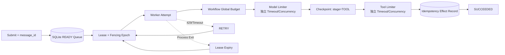
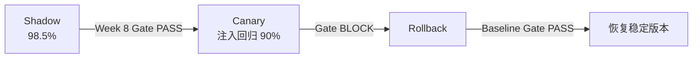

# 第 10 周编码实验：可靠 Agent Runtime 与可观测发布门禁

本目录把第 10 周的可靠性与可观测性知识落成一个可执行参考实现。它不依赖外部模型、Broker、Collector 或 Dashboard 服务即可验证核心不变量；生产接入时可分别替换 Model、Tool、SQLite Queue 和 OpenTelemetry Exporter。

## 1. 交付结构

```text
source/
├── budget.py              # 模型/工具独立超时与并发、Workflow 全局预算
├── state_store.py         # SQLite Queue、Lease/Fencing、Checkpoint、Effect 结果
├── faults.py              # 429、网络超时、半成功和进程退出注入
├── runtime.py             # Model/Tool Adapter 与可恢复 Worker 状态机
├── telemetry.py           # OpenTelemetry Trace/Metric/Log JSONL Exporter
├── dashboard.py           # 从 OTel 导出构建按租户/版本聚合的 Dashboard
├── versioning.py          # 六类组件版本与完整组合 Fingerprint
├── release_drill.py       # 复用第 8 周 evaluate_gate 的发布演练
├── run_demo.py            # 五类故障 + Shadow/Canary/Rollback 端到端运行
├── tests/                 # 10 个确定性测试
└── artifacts/             # 实际运行结果
```

## 2. 执行模型



默认配置：

| 边界 | Timeout | Concurrency | 其他限制 |
|---|---:|---:|---|
| Model | 200 ms | 2 | 调用前检查 Token/费用剩余量 |
| Tool | 100 ms | 1 | Idempotency Key、结果查询 |
| Workflow | 10 s | — | 8 Steps、2,000 Tokens、20,000 microUSD |

资源 Timeout 包含等待并发槽的时间，而不是获取槽位后重新计时。每个 Model/Tool Attempt 都消耗全局 Step；模型调用前先做声明成本预检，调用成功后按实际 Token 与费用扣减。Checkpoint 保存累计预算，恢复不会重置额度或 Deadline。

## 3. 副作用幂等与结果查询

副作用使用：

```text
Idempotency Key = tenant_id + task_id + operation + version
Request Hash    = SHA256(tenant_id + canonical request)
```

`effects` 表依赖主键和事务保证同一个 Key 只从 `PENDING` 提交一次。相同 Key 携带不同租户或参数会抛出 `IdempotencyConflict`。结果查询必须同时提供 `tenant_id`：

```python
result = runtime.query_tool_result(
    tenant_id="tenant-a",
    idempotency_key="tenant-a:task_x:publish:v1",
)
```

工具“半成功”时，外部效果先持久提交，响应随后丢失；Worker 捕获超时后调用结果查询，确认 `SUCCEEDED` 后继续，不重复执行副作用。

## 4. 进程中断与恢复

SQLite `tasks` 表保存 Stage、Attempt、绝对 Deadline、预算、Checkpoint、Lease Owner 和单调 `lease_epoch`。实际演练启动子进程：

1. 子进程完成 Model；
2. 原子写入 `stage=TOOL` Checkpoint；
3. 通过 `os._exit(73)` 立即退出；
4. 父进程观察任务保持 `RUNNING`；
5. Lease 到期后新 Worker 获取更高 Epoch；
6. 从 TOOL 阶段续跑并完成；
7. 旧 Epoch 的迟到 Checkpoint 被 `StaleLease` 拒绝。

这不是捕获异常后从头重跑，而是确实跨进程读取持久状态恢复。

## 5. 故障注入

`run_demo.py` 实际注入并记录：

| 故障 | 预期结果 |
|---|---|
| Model 429 | 任务进入 RETRY，第二 Attempt 成功 |
| Model 网络超时 | 保留 MODEL Stage 与预算后重试 |
| Tool 半成功 | 查询幂等结果，Effect `execution_count=1` |
| 子进程退出 | 从 TOOL Checkpoint 恢复，Attempt=2 |
| 重复消息 | 相同消息映射到同一 Task；不同 Payload/版本拒绝冲突 |

## 6. OpenTelemetry Trace、Metric 与 Log

当前虚拟环境安装 `opentelemetry-api/sdk==1.43.0`，没有 OTLP Exporter。本实现使用 OpenTelemetry SDK 的 `TracerProvider`、`MeterProvider`、`LoggerProvider`，通过三个自定义 Exporter 输出：

```text
artifacts/traces.jsonl
artifacts/metrics.jsonl
artifacts/logs.jsonl
```

替换为 OTLP 时只需替换 Exporter，不修改业务埋点。

### 6.1 Trace

- Workflow：`invoke_workflow durable_agent_job`；
- Model：`chat {model_version}`，`SpanKind.CLIENT`；
- Tool：`execute_tool publish_report`；
- Release：`release.evaluate`；
- 全部携带 tenant、完整版本组合和 fingerprint；
- 不记录 Prompt、Tool Arguments/Result、PII 或凭证。

### 6.2 Metric

```text
agent.request.total
agent.error.total
gen_ai.client.token.usage
agent.cost
agent.operation.duration
```

Metrics 按租户、版本 Fingerprint、模型和 Outcome 关联。示例使用两个固定租户；生产环境若租户量大，应将租户下沉到 Trace/Log，避免高基数 Metrics。

### 6.3 Log

直接使用 OTel LogRecord API，不经过会自动加入本机源码路径的 Python `LoggingHandler`。日志只包含 Task ID、租户、Attempt、Outcome 和版本 Fingerprint，并自动关联当前 Trace/Span ID。

`Telemetry` 在 SDK 入口拒绝 `gen_ai.input.messages`、Prompt Variable、Tool Arguments/Result、Sandbox 输出、JWT、API Key、Email 和手机号，避免先泄漏再依赖 Collector 补救。

## 7. Dashboard

[Dashboard Markdown](./artifacts/dashboard.md) 与 [Dashboard JSON](./artifacts/dashboard.json) 都由实际 OTel JSONL 构建，按 `tenant + version_fingerprint` 聚合：

- 去重后的逻辑任务成功率；
- Attempt 错误率；
- 平均与 p95 Attempt 延迟；
- Token 与 microUSD 成本；
- 完整 Prompt/Model/Tool Schema/MCP/Memory/Eval/Runtime 版本组合。

同时保留 Task 和 Attempt 两种口径，避免“首次失败、重试成功”在统计上被含糊处理。

## 8. Shadow → Canary → Rollback

`release_drill.py` 直接从 `8-w/source/ci_gate.py` 导入 `evaluate_gate()`：



版本清单同时包含：

```text
Prompt
Model
Tool Schema
MCP Server
Memory Policy
Eval Set
Runtime
```

Canary 因总体成功率、成功率下降和关键分类低于阈值被阻断。`trace-version-verification.json` 逐阶段扫描实际 Trace，确认 Shadow、Canary、Rollback 都能定位到完整版本组合，而不是只有一个模糊的 Agent 版本。

## 9. 运行与测试

```bash
/Users/shiyiliu/workspace/pyproject/.venv/bin/python \
  -m pytest -q -o cache_dir=/tmp/week10-pytest-cache \
  10-w/source/tests

/Users/shiyiliu/workspace/pyproject/.venv/bin/python \
  10-w/source/run_demo.py \
  --output 10-w/source/artifacts
```

关键产物：

- [故障结果](./artifacts/fault-results.json)
- [发布演练](./artifacts/release-drill.json)
- [Trace 版本验证](./artifacts/trace-version-verification.json)
- [版本清单](./artifacts/version-manifests.json)
- [Dashboard](./artifacts/dashboard.md)

## 10. 生产化边界

该实现验证控制不变量，不声称 SQLite 和本地 JSONL 是生产集群方案。生产替换时仍须保持：

1. Queue Claim、Checkpoint 和 Fencing 使用事务或条件写；
2. Effect Store 与业务副作用保持幂等或可查询；
3. Deadline、Token、费用和 Step 在恢复后延续；
4. OTel Exporter 故障不能阻断业务，敏感内容在 SDK 层默认不创建；
5. Dashboard 区分逻辑 Task 与 Attempt；
6. 发布门禁使用固定评测集版本，并把完整版本组合写入 Trace；
7. Canary 阻断后必须验证流量和配置确实恢复到 Baseline Fingerprint。

