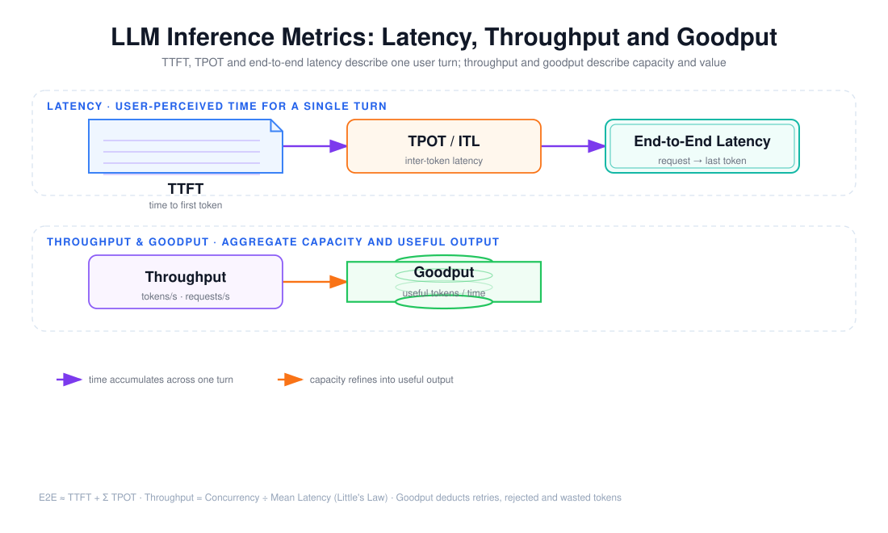

# TTFT、TPOT、端到端延迟、吞吐与 Goodput 的指标定义

> 目标：不是背下几个缩写的字面解释，而是能用同一套时间轴把每个指标放对位置，并说清它度量的是「单次用户体验」「系统容量」还是「有效价值」。



上图由 `$fireworks-tech-graph` 生成并通过 XML、箭头碰撞、语义几何和构图质量检查，PNG 已完成视觉复核。它把指标分成两个语义层：上层是**单次请求的延迟时间轴**（TTFT → TPOT → 端到端），下层是**聚合容量与价值**（吞吐 → Goodput）。阅读顺序如下：

1. 一次流式请求先经历 `TTFT`，再以 `TPOT` 为间隔逐 token 产出，最后一个 token 落地的时刻是 `端到端延迟`；
2. 端到端延迟 ≈ TTFT + Σ TPOT，它是时间轴上的累加；
3. 系统层面用 `吞吐`（tokens/s、requests/s）衡量容量，用 `Goodput` 衡量扣除浪费后的有效产出；
4. 吞吐与延迟由 Little's Law 相连，Goodput 是吞吐的「有效化」投影。

---

## 1. 阅读前术语表

| 术语 | 说明 |
|---|---|
| TTFT | Time To First Token，首 Token 延迟；从发送请求到收到第一个输出 token 的时间 |
| TPOT | Time Per Output Token，每个输出 token 的平均耗时；两个相邻输出 token 之间的间隔 |
| ITL | Inter-Token Latency，Token 间延迟；与 TPOT 本质同义，强调「瞬时」间隔 |
| E2E Latency | 端到端延迟；从请求发出到最后一个 token（或完成信号）落地的时间 |
| Prefill | 预填充；把全部输入 token 并行编码并产生首个 KV 状态的过程，发生在首 token 之前 |
| Decode | 自回归解码；每生成一个 token 都要把 KV 读一遍再算下一个 token 的过程 |
| Throughput | 吞吐；单位时间产出的 token 数或完成的请求数 |
| Goodput | 有效吞吐；单位时间产出的「有效/可用」token 或「成功」任务数，扣除重试与浪费 |
| P50 / P95 / P99 | 百分位；95% 的样本不大于 P95，用于描述延迟分布与尾延迟 |
| 流式 Streaming | 边生成边返回 token，而不是一次性返回完整结果 |
| Little's Law | 稳态下平均在途数 `L = λW`；`λ` 为吞吐率，`W` 为平均停留时间 |

---

## 2. 一条时间轴，三个延迟

不把时间轴画出来，TTFT、TPOT 和端到端延迟就只是三个孤立的数字。把一次**流式**请求展开：

```text
t=0           t=TTFT                     t=E2E
 │── Prefill ──┼── tok1 ── tok2 ── … ── tokN ──┼── 完成/收尾
               └──────── TPOT×N ───────────────┘
```

三个指标分别度量这条轴上的不同区间：

- **TTFT** = 从 `t=0` 到第一个 token 出现的时间；
- **TPOT** = 相邻两个 token 之间的平均间隔（`tok1→tok2→…→tokN` 每段）；
- **E2E** = 从 `t=0` 到最后一个 token（或完成）的时间。

三者不是并列的三个「指标」，而是同一个过程的三个切片。它们满足近似关系：

\[
T_{e2e} \approx TTFT + (N-1)\times TPOT + T_{finish}
\]

其中 `N` 是输出 token 数，`T_finish` 是停止符识别、后处理与客户端渲染的收尾时间。这个公式是后面所有「为什么」的基础：**想优化端到端延迟，要么缩短 TTFT，要么缩短 TPOT，要么减少 N**。

---

## 3. TTFT：用户感知的「响应速度」

### 3.1 它到底包含什么

TTFT 不是一个纯模型时间，它是一条链的累积：

\[
TTFT = T_{client\ queue} + T_{network\ up} + T_{server\ queue} + T_{prefill} + T_{first\ decode}
\]

- **客户端排队**：SDK 连接池满、本地限流或重试前等待；
- **网络上行**：把 prompt（可能含检索到的长上下文）传给服务端；
- **服务端排队**：等待调度、等待连续批处理的槽位；
- **Prefill**：把输入 token 全部编码，这是 TTFT 里最大的可变项，与输入长度近似线性；
- **首 token Decode**：生成并返回第一个输出 token 的一步。

所以「TTFT 高」不能默认等于「模型慢」。在一个长输入、冷缓存、高并发的场景里，TTFT 的大头常常是排队和 Prefill。

### 3.2 为什么 TTFT 对 Agent 尤其重要

- 流式 UI 的第一印象由 TTFT 决定：用户看到「思考中/打字中」的时间越短，感知延迟越低；
- Agent 的**工具调用循环**里，每一步（检索→模型→工具）都会产生一个新的 TTFT，累计起来就是交互延迟；
- TTFT 高还会放大重试和取消的成本：用户等不到首 token 就取消，但 Prefill 已经烧掉了全部输入的计算。

工程上常把 TTFT 当作交互式场景（聊天、代码补全、Copilot）的**首要延迟目标**，典型 SLO 在数百毫秒量级。

---

## 4. TPOT：用户感知的「生成速度」

### 4.1 TPOT 与 Decode 的关系

首 token 之后，模型进入**自回归 Decode**：每生成一个 token，都要读取一遍 KV Cache 和全部权重再算下一个。在内存带宽受限（memory-bound）的 Decode 阶段，单个 token 的时间近似等于：

\[
TPOT \approx \frac{模型权重字节数}{可用内存带宽}
\]

这说明两件事：

1. **TPOT 几乎不随输出内容变化**：无论生成的是「的」还是「超参数」，每一步读的权重字节数一样，所以 TPOT 相对稳定；
2. **TPOT 主要受硬件带宽和并行度约束**，而不是输入长度（那是 Prefill 的代价）。

### 4.2 TPOT 与 ITL 的细微差别

- **TPOT** 是统计量：总解码时间 ÷ 输出 token 数，是个平均值；
- **ITL** 是瞬时量：某两个具体 token 之间的间隔，会因网络抖动、批处理调度、系统 GC 而波动。

因此报告里写 TPOT，但**尾延迟要看 ITL 的 P95/P99**——平均 TPOT 很漂亮，不代表用户不会在某个 token 上卡一下。这个「卡顿」在流式 UI 里表现为打字机效果突然停顿。

---

## 5. 端到端延迟：真正交付的时间

端到端延迟是用户从发出请求到拿到**可用结果**的时间。它比 TTFT + 生成时间更严格，因为还要算：

- **收尾时间**：停止符检测、函数调用解析、工具结果回填、后处理；
- **非流式场景的等待**：如果没有流式，端到端 = 等待全部生成完再一次性返回，此时首 token 时间被隐藏，端到端就是唯一的延迟体验；
- **Agent 循环**：一次「任务」的端到端可能包含多次模型调用和多次工具往返，此时端到端是「逻辑任务」级而非「单次调用」级。

端到端延迟的定义必须先定「终点」：是最后一个 token，还是函数调用完成，还是副作用提交成功？不同终点对应不同口径，基准测试必须在报告里写清楚，否则两个「端到端延迟」不可比。

---

## 6. 吞吐：系统的容量

### 6.1 两种吞吐

| 口径 | 公式 | 度量的是 |
|---|---|---|
| Token 吞吐 | `输出 token 数 ÷ 墙钟时间` | 生成能力（tokens/s） |
| 请求吞吐 | `完成请求数 ÷ 墙钟时间` | 事务处理能力（requests/s） |

对单个请求，`tokens/s ≈ N / T_e2e`；当 `N` 很大时 `tokens/s ≈ 1 / TPOT`（TTFT 被摊薄）。但**单流吞吐 ≠ 系统吞吐**：服务端把多个请求的 Decode 步骤批处理在一起，共享一次权重读取，因此批处理下系统 tokens/s 可以远高于单流的 `1/TPOT`。

### 6.2 吞吐与并发、延迟由 Little's Law 相连

\[
Concurrency = \lambda \times W
\]

`λ` 是请求吞吐（req/s），`W` 是平均端到端延迟。它有两个直接推论：

1. **要维持吞吐，就得持有足够的在途请求**：若 `W=2s`、目标 `λ=50 req/s`，稳态在途数至少 `L=100`；
2. **吞吐上限 = 并发上限 ÷ 平均延迟**：并发不是无代价地提高——超过饱和点后，延迟上升，吞吐反而可能掉。

所以「tokens/s 高」是一个**系统在特定并发与延迟下的平衡结果**，不是独立的好指标。这一条是第 11 周面试里「为什么 Tokens/s 更高不一定意味着用户体验更好」的核心。

---

## 7. Goodput：扣除浪费后的有效产出

### 7.1 Goodput 与 Throughput 的区别

Throughput 数的是「产出了多少 token/请求」，Goodput 数的是「产出了多少**有用**的 token/成功任务」：

\[
Goodput = \frac{有效\ token\ (或成功任务)}{墙钟时间}
\]

要被从 Goodput 里扣掉的包括：

- **重试 token**：第一次失败、第二次成功，第一次的输入输出都算成本但不算有效产出；
- **取消/丢弃的请求**：用户取消或超时后仍在计算的 token；
- **安全/合规拒绝**：被 Guardrail 拦下、需要重写的输出；
- **无效中间步骤**：Agent 反复试错产生的中间推理与工具调用；
- **非交付 token**：思考/草稿/冗余输出中最终没有进入交付物的部分（视口径而定）。

### 7.2 为什么一定要区分

一个系统可以把 Throughput 做得极高，只要它**大量重试、疯狂产出无效 token**；但用户的单位成本和质量没有改善。Goodput 把「速度」重新锚定到「价值」：它是连接性能指标（第 11 周前半）和成本指标（第 11 周后半，见文档 05）的桥梁。报告吞吐时若不报告 Goodput，等于只报营收不报利润。

---

## 8. P50 / P95 / P99：用分布而不是均值

延迟几乎从不是正态分布：少数慢请求（排队、限流、GC、重试）把尾部拉得很长。均值会被这些异常值污染，P95/P99 才能反映「大多数用户最坏会遇到什么」：

| 指标 | 含义 | 用途 |
|---|---|---|
| 均值 Mean | 所有样本的平均 | 算总成本、做容量估算 |
| P50 | 一半请求快于它 | 「典型」体验 |
| P95 | 95% 请求快于它 | 常见尾延迟 SLO |
| P99 | 99% 请求快于它 | 尖峰、告警、容量余量 |

对 TTFT、TPOT、E2E 都应分别报 P50/P95/P99，而不是只报均值。尤其**尾延迟是并发的函数**：低并发下 P99 可能只有几十毫秒，高并发下 P99 可能暴涨到数秒，而均值只涨一点——只盯着均值会漏掉系统已经逼近饱和的信号。

---

## 9. 指标之间的权衡

这几个指标彼此牵制，优化一个往往牺牲另一个：

| 权衡 | 机制 |
|---|---|
| 吞吐 ↑ vs TTFT ↓ | 连续批处理/Chunked Prefill 提升吞吐，但可能让单个请求等更久才能抢到 Prefill 槽，抬高 TTFT |
| 吞吐 ↑ vs TPOT | 大 batch 摊薄权重读取，TPOT 近似不变直到 KV/带宽饱和，之后 TPOT 上升 |
| 延迟 ↓ vs 成本 | 加并发、加副本降低排队，但增加空闲基础设施与费用 |
| Goodput ↑ vs 成本 | 减少重试与无效 token 直接降低单位成本，但需要更聪明、更贵的前置判断 |

没有一个「全都要」的最优配置；基准测试的价值恰恰是画出这些曲线，让选型基于数据而不是直觉。

---

## 10. 一个可复核的口径清单

任何一次 Benchmark 报告，在给数字之前都应能回答：

1. TTFT 的起点是「请求发出」还是「进入服务端」？是否包含客户端排队？
2. TPOT 是平均值还是 P95？是纯 Decode 时间还是含网络抖动？
3. 端到端的终点是「最后一个 token」还是「副作用提交」？
4. 吞吐是单流还是批处理？在什么并发下测得？
5. Goodput 扣除了哪些 token？重试、取消、被拒绝的输出是否入分母？
6. 报的延迟是均值还是 P50/P95/P99？样本量和 Trial 数是多少？

把口径写死，两个数字才有可能比较；否则「我们的 TTFT 是 300ms」和「他们的 TTFT 是 800ms」之间没有任何信息量。

---

## 11. 本文结论

TTFT、TPOT、端到端延迟、吞吐、Goodput 不是五个并列的 KPI，而是一条时间轴上的切片加上两个系统层面的投影：**延迟层**回答「单个用户等多久」，**吞吐层**回答「系统能扛多少」，**Goodput** 回答「扛的这些里有多少真正有用」。用均值会掩盖尾延迟，用 Throughput 会掩盖浪费，用单流数据会掩盖批处理能力。正确做法是：先钉死口径，再在同一张图上同时报告延迟分布（P50/P95/P99）与有效吞吐，才能把「快不快」从口号变成可比较的工程结论。

---

## 参考资料

- [Anthropic — LLM latency vs throughput](https://www.anthropic.com/engineering) 工程博客中关于 TTFT/TPOT 的讨论
- [vLLM Docs — Prefill and Decode](https://docs.vllm.ai/en/latest/) 对 Prefill/Decode 与 PagedAttention 的解释
- [Little's Law（维基百科）](https://en.wikipedia.org/wiki/Little%27s_law)
- [OpenTelemetry GenAI Semantic Conventions](https://opentelemetry.io/docs/specs/semconv/gen-ai/) 关于 `gen_ai.client.operation.duration` 与 token 计量的约定
