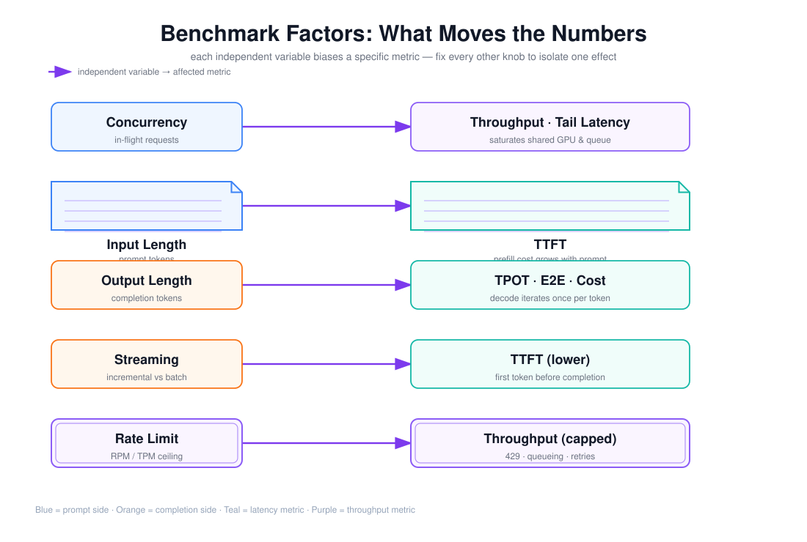

# 并发、输入长度、输出长度、流式与速率限制对 Benchmark 结果的影响

> 目标：理解为什么同一套模型与数据集，换一个并发或换一个输出长度，测出来的延迟/吞吐/成本可以差一个数量级，并学会用「控制变量」把每个因素的影响单独归因。

上图由 `$fireworks-tech-graph` 生成并通过 XML、箭头碰撞、语义几何和构图质量检查，PNG 已完成视觉复核。它把五个最常见的自变量与它们主影响的指标一一对应：并发主要推动吞吐与尾延迟，输入长度推动 TTFT，输出长度推动 TPOT/端到端与成本，流式压低用户感知的 TTFT，速率限制封顶吞吐。阅读顺序如下：

1. 左侧五列是**自变量**（knobs），每一行是一个独立实验变量；
2. 右侧是它们**主影响的指标**（蓝色=prompt 侧，橙色=completion 侧，青色=延迟，紫色=吞吐）；
3. 核心方法论是：**只动一个 knob，固定其余所有**，才能把变化归因到单一因素。

---

## 1. 阅读前术语表

| 术语 | 说明 |
|---|---|
| 并发 Concurrency | 同时处于在途状态的请求数，不等于到达率 |
| 到达率 Arrival Rate | 单位时间新进入系统的请求数（req/s） |
| 输入长度 Input Tokens | prompt 的 token 数，决定 Prefill 成本 |
| 输出长度 Output Tokens | completion 的 token 数，决定 Decode 步数 |
| 流式 Streaming | 边生成边返回 token，还是完成后一次性返回 |
| 速率限制 Rate Limit | 供应商/网关对 RPM、TPM 或并发数设置的上限 |
| 饱和点 Saturation | 继续加负载后吞吐不再上升、延迟开始陡增的拐点 |
| RPM / TPM | Requests Per Minute / Tokens Per Minute，速率限制的常见单位 |
| 控制变量 | 实验中保持不变的因素，用于隔离单一变量的因果 |

---

## 2. 为什么「同一个模型」会测出完全不同的结果

一个 Benchmark 的结论（「延迟 500ms」「吞吐 1200 t/s」）不是模型的固有属性，而是**模型 × 负载 × 配置**的联合输出。五个最常见、也最容易被忽视的变量：

1. **并发**：在途请求数；
2. **输入长度**：prompt 的 token 数；
3. **输出长度**：completion 的 token 数；
4. **流式**：是否增量返回；
5. **速率限制**：外部强加的 RPM/TPM 上限。

它们中的任何一个没写进报告，都会让结果不可复现、不可比。下面逐个拆开。

---

## 3. 并发：吞吐与尾延迟的「跷跷板」

### 3.1 并发先抬高吞吐，再毁掉延迟

并发从低到高扫一遍，典型曲线是：吞吐先线性上升，接近饱和点后走平，**之后延迟（尤其 P99）开始陡增**，吞吐甚至回落。机制是排队论：系统里可并行处理的能力（GPU 计算、KV 带宽、连接池、Worker 数）是有限的，在途请求超过能力后，多余请求只能排队。

\[
L = \lambda W
\]

由 Little's Law，并发 `L` 固定时，延迟 `W` 上升意味着吞吐 `λ` 下降。所以：

- **低并发**：请求无需排队，延迟最低，但系统能力远未用满，吞吐低；
- **饱和点附近**：吞吐最大，延迟开始出现排队尾巴；
- **过饱和**：延迟暴涨，吞吐不再增长甚至下降（排队开销、限流、重试放大开始反噬）。

Benchmark 必须**报告在什么并发下测得**，并扫一个并发序列（例如 1/4/16/64），画出「并发—吞吐」与「并发—尾延迟」两条曲线，而不是只给单点。

### 3.2 并发与到达率的区别

并发是**在途数**，到达率是**新请求速率**。到达率固定时，若每个请求耗时 2s，则在途数会自然稳定在 `2s × 到达率`。压测常通过控制并发（连接池大小/信号量）间接控制到达率，两者不可混用。真正的稳态吞吐上限取决于到达率上限与并发上限中更紧的那个。

### 3.3 并发还暴露尾延迟

尾延迟几乎都是并发的函数：低并发时 P99 与均值接近；高并发时 P99 可能比均值高数倍。第 8 周、第 10 周反复出现的「P95 尾延迟」在这里必须和并发一起看，否则一个「P99=200ms」在并发 1 和并发 64 下含义完全不同。

---

## 4. 输入长度：主攻 TTFT 与成本

### 4.1 输入长度 ≈ Prefill 成本

Prefill 阶段要把全部输入 token 并行编码。对计算受限（compute-bound）的 Prefill，时间近似与输入 token 数成正比：

\[
T_{prefill} \approx \alpha \times N_{input}
\]

因此**输入越长，TTFT 越高**（TTFT 里 Prefill 是最大可变项），但**对 TPOT 几乎无影响**（TPOT 是 Decode 阶段、受权重带宽约束）。这是理解「长 prompt 卡在首 token」的关键。

### 4.2 输入长度还推高 KV 与成本

- **KV Cache**：输入 token 都要写入 KV，长输入直接增加显存占用，间接影响能同时服务的并发数（显存是硬约束）；
- **成本**：输入 token 也计费，长 prompt（含检索回填的上下文）让每次调用更贵；
- **质量风险**：超长上下文可能稀释模型注意力，这是质量维度，但会通过「重试/重写」间接抬高成本与延迟。

### 4.3 实验上如何隔离

固定输出长度，扫输入长度（如 1K/4K/16K/64K tokens），只观察 TTFT 与输入成本的变化，就能干净地得到 Prefill 的斜率 `α`。第 12 周会用 PagedAttention/前缀缓存去优化这一段。

---

## 5. 输出长度：主攻端到端延迟与成本

### 5.1 输出长度 = Decode 步数

\[
T_{e2e} \approx TTFT + (N_{output} - 1)\times TPOT
\]

输出 token 数 `N` 直接线性放大端到端延迟。由于 TPOT 相对稳定，**输出长度主要影响「总生成时间」，而不是「每个 token 的速度」**。

### 5.2 输出长度是成本的最大杠杆

成本 = (输入 token × 输入单价) + (输出 token × 输出单价)，且输出单价通常数倍于输入单价。一个「让它写详细一点」的 prompt 改动，可能让输出从 200 token 涨到 2000 token，成本放大一个数量级。所以单位成本分析（文档 05）必须把输出长度当成第一变量。

### 5.3 流式「掩盖」但不「减少」输出长度

流式让用户提前看到内容，但生成完这 2000 个 token 的总时间不变。很多延迟抱怨本质是「输出太长」而非「模型慢」，优化方向应是减少冗余步骤、收紧输出上限，而不是只调硬件。

---

## 6. 流式：改变「感知」而非「总量」

### 6.1 流式做了什么

非流式：`发送 → [全部生成] → 一次性返回`，用户看到的是端到端延迟；流式：`发送 → 首 token → 逐 token 返回`，用户看到的是 TTFT + 逐 token 的速度。

流式**不减少**端到端延迟和总 token 数，它只把「等待」从「空白」变成「打字机」。这带来两个测量陷阱：

1. **只测 TTFT 就说「延迟降低了」**：流式确实把首 token 提前，但若用户任务需要完整结果，端到端没变；
2. **把「首 token 快」当成「任务快」**：对 Agent 而言，很多步骤需要函数调用完成或结果完整才能继续，此时流式收益有限。

### 6.2 流式对指标的精确影响

| 指标 | 影响 |
|---|---|
| TTFT（感知） | 显著降低（首 token 提前） |
| E2E 延迟 | 基本不变 |
| TPOT / ITL | 不变，但 ITL 抖动更易被用户察觉 |
| 吞吐 | 基本不变 |
| 成本 | 不变 |

所以 Benchmark 要**同时报告流式与非流式**，并明确「用户体验延迟」和「任务完成延迟」是两回事。

---

## 7. 速率限制：吞吐的「硬天花板」

### 7.1 RPM 与 TPM

供应商通常同时限制两类：

- **RPM**（Requests Per Minute）：请求数上限，约束事务吞吐；
- **TPM**（Tokens Per Minute）：token 数上限，约束 token 吞吐。

它们约束的是不同的瓶颈。一个输出极长的任务，RPM 可能很宽裕，但 TPM 会先被击穿。Benchmark 若只关心请求吞吐而忽略 TPM，会在长输出负载下高估能力。

### 7.2 限流如何污染测量

速率限制生效时，系统开始返回 429 或把请求排队，这会造成：

1. **吞吐被削平**：真实能力被 429 掩盖，测出的 tokens/s 是「配额」而不是「模型能力」；
2. **尾延迟失真**：排队/重试让 P95/P99 出现一个由配额造成的长尾；
3. **重试放大**：客户端重试让到达率翻倍，进一步触发限流，形成正反馈（第 10 周已详细讨论）；
4. **成本口径混乱**：被 429 拒掉但已计费的请求会污染单位成本。

### 7.3 实验上如何隔离

测量时要把「受配额约束的吞吐」和「受硬件约束的吞吐」分开：先在低并发、短负载下确认无 429，再逐步加负载找到配额的拐点；报告中单独标注「该结果受 TPM=X 限制」或「未触发限流」。

---

## 8. 一套控制变量的实验设计

要得到「并发对吞吐的影响」这种**单一因果**，必须固定其余四个变量。推荐的工作负载矩阵（与第 11 周编码实验一致）：

| 变量 | 取值 |
|---|---|
| 输入长度 | 短（~1K）/ 长（~16K） |
| 输出长度 | 短（~128）/ 长（~1K） |
| 流式 | 开 / 关 |
| 并发 | 1 / 4 / 16 / 64 |
| 速率限制 | 记录是否触发，触发时标注 |

每组配置**至少重复 5 次**，输出 P50/P95/P99。这样就能分别画出四条干净的曲线：

- 并发—吞吐（固定输入/输出长度、流式）；
- 并发—尾延迟（同上）；
- 输入长度—TTFT（固定输出长度、并发）；
- 输出长度—E2E 延迟与成本（固定输入长度、并发）。

只有控制住变量，第 12 周的 vLLM/SGLang 对比、第 13 周的模型路由才有可信的数据基础。

---

## 9. 本文结论

并发、输入长度、输出长度、流式、速率限制这五个变量，任何一个都能把 Benchmark 结果改得面目全非，且各自主攻不同的指标：并发决定吞吐与尾延迟的拐点，输入长度主攻 TTFT 与 KV/成本，输出长度主攻端到端延迟与成本，流式只改变感知不改变总量，速率限制是掩盖真实能力的硬天花板。Benchmark 不是「跑一次拿个数」，而是**在固定其余变量的前提下，逐变量扫描并画出曲线**。数字只有在口径、并发、长度、流式和限流状态都写清楚时，才有资格进入比较。

---

## 参考资料

- [Anthropic — Latency optimization](https://www.anthropic.com/engineering) 关于 TTFT/TPOT 与批处理权衡的工程讨论
- [vLLM Docs — Continuous Batching](https://docs.vllm.ai/en/latest/) 关于并发、批处理与吞吐的关系
- [Little's Law（维基百科）](https://en.wikipedia.org/wiki/Little%27s_law)
- [OpenAI API — Rate limits](https://platform.openai.com/docs/guides/rate-limits) RPM/TPM 与并发限制的说明
