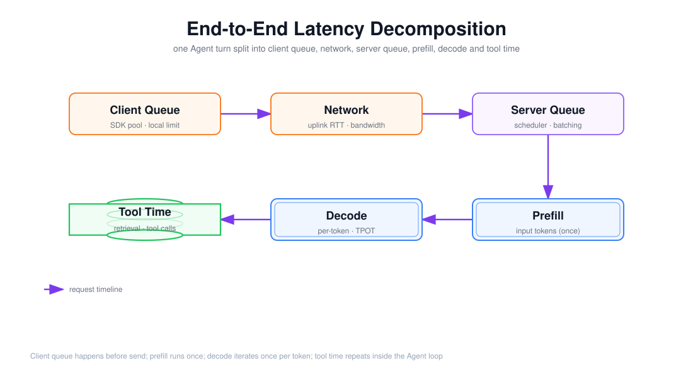

# 客户端排队、网络、服务端排队、Prefill、Decode 与工具时间的分解

> 目标：把「延迟 3 秒」这个黑盒拆成六段可以各自定位、各自优化的时间，并分清每一段归谁负责——客户端、网络、服务端、模型供应商，还是 Agent 自己的工具循环。

上图由 `$fireworks-tech-graph` 生成并通过 XML、箭头碰撞、语义几何和构图质量检查，PNG 已完成视觉复核。它把一次 Agent 轮次的时间按顺序拆成六段：客户端排队 → 网络 → 服务端排队 → Prefill → Decode → 工具时间。阅读顺序如下：

1. 前两段（橙色）发生在**请求发出之前**，归客户端/网络；
2. 第三段（紫色）归服务端调度；
3. 第四、五段（蓝色）是模型本体：Prefill 只跑一次，Decode 每个 token 迭代一次；
4. 第六段（绿色）是工具往返，在 Agent 循环里会**反复出现**。

---

## 1. 阅读前术语表

| 术语 | 说明 |
|---|---|
| 客户端排队 | 请求在客户端本地等待可用连接/许可的时间 |
| 网络上行/下行 | prompt 上传与 token 回传的传输时间 |
| 服务端排队 | 请求等待调度器分配计算槽位的时间 |
| Prefill | 并行编码全部输入 token，产生 KV 状态 |
| Decode | 自回归逐 token 生成，每个 token 读一遍 KV |
| 工具时间 | 检索、外部 API、沙箱等非模型往返的时间 |
| Span / 计时点 | 用于把端到端拆成可观测分段的时间戳 |
| 归属 Ownership | 某段延迟由哪一方（客户端/网络/服务端/供应商/外部）负责 |

---

## 2. 完整分解式

一次逻辑任务（一个 Agent 轮次）的端到端时间可以写成：

\[
T_{e2e} = T_{client} + T_{net} + T_{server\ queue} + T_{prefill} + T_{decode} + T_{tool} + T_{finish}
\]

其中 `T_finish` 是停止符检测、结果解析与副作用提交。对于**多步 Agent**，`T_prefill + T_decode + T_tool` 会循环多次。下面逐段拆开，重点说明「怎么测」和「谁负责」。

---

## 3. 客户端排队：请求还没发出就晚了

### 3.1 它是什么

请求在客户端 SDK 内部等待，常见来源：

- **连接池耗尽**：HTTP 连接/HTTP2 流被占满；
- **本地限流/背压**：客户端自己的 Token Bucket 或 Semaphore（第 10 周）在限制在途数；
- **重试退避**：上一次失败后的指数退避 + Jitter；
- **串行前置**：本地预处理、鉴权、Embedding 等同步步骤。

### 3.2 为什么容易被漏掉

服务端看到的是「请求到达服务端的时间」，客户端排队发生在到达之前，服务端 Trace 里根本看不到。**测量必须从客户端发起处打点**，否则会系统性低估延迟、并把客户端的锅算到服务端头上。

### 3.3 优化

扩大/复用连接池、异步化前置步骤、对非关键路径做背压降级、减少串行等待。

---

## 4. 网络：上行与下行要分开

### 4.1 上行（发 prompt）

上行时间 = RTT + prompt 字节数 ÷ 上行带宽。长 prompt（含检索回填）会显著拉长上行，尤其在移动端或弱网。对交互场景，上行 1MB 的 prompt 可能是 TTFT 的大头。

### 4.2 下行（收 token）

流式场景下，下行是「逐 token 的增量传输」；非流式是一次性大块返回。下行带宽不足时，即使模型 Decode 很快，用户也会看到 token 卡顿——这体现在 ITL 的抖动上，而不是模型 TPOT 上。

### 4.3 怎么测

用客户端与服务端的两个时间戳差出「网络 + 排队」，再用 RTT 探测和包大小把传输与队列分开；或注入 `X-Request-Id` 在网关两侧打点。网络归**基础设施/运营商**，优化靠 CDN、边缘接入、HTTP/2/3 多路复用和连接复用。

---

## 5. 服务端排队：调度器是隐形的延迟放大器

### 5.1 它是什么

请求到达服务端后、真正开始 Prefill 前的等待。来源：

- **连续批处理槽位**：正在服务的 batch 还没空出 Prefill 槽；
- **准入/配额**：服务端自己的 Rate Limit 和 Admission Control；
- **冷启动**：无热实例时拉起、加载权重、预热 KV；
- **GPU 排队**：多请求竞争同一张卡的 Prefill 计算。

### 5.2 它与并发的强耦合

服务端排队是**并发/负载的函数**（文档 02）：并发低时几乎为 0，接近饱和时指数上升。这是尾延迟的主要来源。测量上，服务端排队 = 「服务端收到请求」到「服务端开始 Prefill」的差值，需要服务端在入口和 Prefill 起点各打一个 Span。

### 5.3 优化

提高批处理效率、预留热实例、分优先级队列（交互优先）、Chunked Prefill 平滑长输入、对超过 Deadline 的请求提前拒绝（第 10 周）。

---

## 6. Prefill：只跑一次，却随输入线性增长

### 6.1 机制

Prefill 把全部输入 token 并行编码，计算量近似正比于输入 token 数：

\[
T_{prefill} \approx \alpha \times N_{input}
\]

它是计算受限的（compute-bound），GPU 越强、并行度越高，`α` 越小。Prefill 结束后产生完整的 KV Cache，后续 Decode 才能开始。

### 6.2 对指标的影响

- **直接决定 TTFT**：首 token 之前必须完成 Prefill；
- **不直接影响 TPOT**：TPOT 是 Decode 阶段的事；
- **显存占用**：KV Cache 随输入增长，约束并发（第 12 周 PagedAttention 处理碎片）。

### 6.3 优化

前缀缓存（共享 prompt 的 KV 复用）、KV 压缩、量化、以及把 Prefill 与 Decode 解耦（第 12 周 P/D 分离）。

---

## 7. Decode：每个 token 一次迭代

### 7.1 机制

Decode 是自回归的：每生成一个 token，都要读一遍 KV 和权重再算下一步。它是内存带宽受限的（memory-bound），单 token 时间近似：

\[
TPOT \approx \frac{权重字节数}{内存带宽}
\]

所以 Decode 总时间 ≈ `TPOT × 输出 token 数`，而 TPOT 本身对输出内容不敏感。

### 7.2 对指标的影响

- **决定 TPOT 和总生成时间**；
- 在批处理下，多个请求共享一次权重读取，所以系统吞吐能远超单流 `1/TPOT`。

### 7.3 优化

Speculative Decoding（草稿模型提前猜、一次验证多个 token）、量化降低权重字节数、提高带宽、KV Cache 分页减少读放大。

---

## 8. 工具时间：Agent 循环里的「重复项」

### 8.1 它是什么

模型调用之外的一切往返：检索（向量库/RAG）、调用业务 API、代码/沙箱执行、浏览器操作、人工审批等待。对「一次模型调用」，它可能不存在；对「一个 Agent 任务」，它往往是最大头。

### 8.2 为什么必须单列

- 它**不在模型供应商的延迟里**，但用户感知的是全部；
- 它**会重复**：Agent 每调用一次工具，就多一轮 `工具 → 回填 → 再次 Prefill/Decode`；
- 它**放大了模型延迟**：每次工具返回都要重新 Prefill 变长的上下文，工具链越长，后续 Prefill 越贵。

### 8.3 优化

减少工具往返（并行独立检索、合并查询）、缓存工具结果、收紧输出避免多余调用、对工具设置独立超时（第 10 周）。

---

## 9. 如何把分解变成可观测的 Span

分解不是纸上谈兵，必须在 Trace 里落地。一个可用的埋点边界（对齐第 10 周 OpenTelemetry）：

| Span | 起点 | 终点 | 归属 |
|---|---|---|---|
| `client.wait` | 客户端发起 | 请求离开发送缓冲区 | 客户端 |
| `http.request` | 发送 | 服务端收到 | 网络 |
| `server.queue` | 服务端收到 | Prefill 开始 | 服务端 |
| `gen_ai.prefill` | Prefill 开始 | 首 token 生成 | 供应商/模型 |
| `gen_ai.decode` | 首 token | 末 token | 供应商/模型 |
| `tool.execute` | 工具调用 | 工具返回 | 外部/工具 |

有了这六个 Span，任何一次「3 秒延迟」都能立刻定位到具体段落，而不是在客户端、网络、服务端、模型、工具之间互相甩锅。这也是面试里「给你一次慢请求，你怎么定位」的标准答案骨架。

---

## 10. 一个示例分解

假设一个交互式 Agent 轮次端到端 2.5s，拆开可能是：

| 段落 | 时间 | 占比 | 备注 |
|---|---:|---:|---|
| 客户端排队 | 50 ms | 2% | 连接池偶发等待 |
| 网络上行 | 80 ms | 3% | 16K prompt 上传 |
| 服务端排队 | 300 ms | 12% | 高并发下的 Prefill 槽等待 |
| Prefill | 600 ms | 24% | 长输入主导 |
| Decode | 900 ms | 36% | 450 token × 2ms TPOT |
| 工具时间 | 520 ms | 21% | 一次检索 + 一次 API |
| 收尾 | 50 ms | 2% | 结果解析与提交 |

这个例子说明：**优化 Decode（模型）只能拿到 36% 的上限**，真正的大头还散落在排队、Prefill 和工具时间里。没有分解，就会错误地把钱花在「换更快的 GPU」上，而忽略了排队和工具往返。

---

## 11. 本文结论

端到端延迟不是「模型延迟 + 一点网络」，而是客户端排队、网络、服务端排队、Prefill、Decode、工具时间六段之和，且每一段有不同的归属和优化手段。Prefill 只跑一次但随输入线性增长，Decode 每个 token 一次迭代但受带宽约束，工具时间在 Agent 循环里反复出现。把六段都打上 Span，慢请求才能从「感觉慢」变成「知道哪里慢」；把六段都写进 Benchmark 口径，不同系统的延迟才可比。

---

## 参考资料

- [Anthropic — Latency decomposition](https://www.anthropic.com/engineering) 关于 TTFT/TPOT 与请求生命周期的讨论
- [vLLM Docs — Prefill & Decode](https://docs.vllm.ai/en/latest/) Prefill/Decode 的机制与调度
- [OpenTelemetry GenAI Semantic Conventions](https://opentelemetry.io/docs/specs/semconv/gen-ai/) `gen_ai` span 的命名与计时约定
