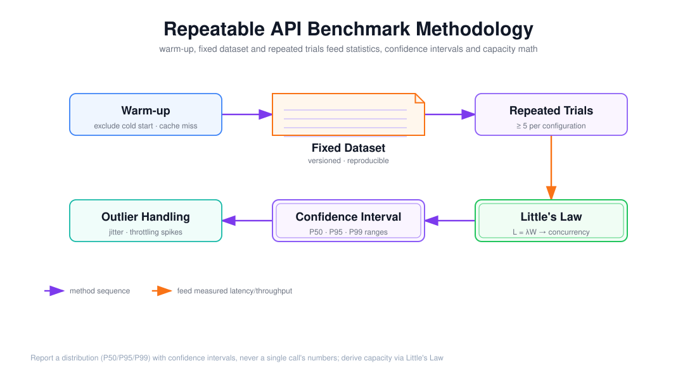

# Warm-up、固定数据集、重复 Trial、置信区间与 Little's Law

> 目标：把 Benchmark 从「跑一次、抄一个数」升级成「可复现、带误差棒、能推导容量」的科学测量流程，并理解为什么单次调用和均值都不足以支撑工程决策。

上图由 `$fireworks-tech-graph` 生成并通过 XML、箭头碰撞、语义几何和构图质量检查，PNG 已完成视觉复核。它把测量流程按「方法序列」排成一条蛇形路径：预热 → 固定数据集 → 重复 Trial，然后进入统计阶段——Little's Law 推导容量 → 置信区间 → 异常值处理。阅读顺序如下：

1. 上半行是**测量准备**：先预热、再固定数据集、再重复 Trial；
2. 从 Trial 处向下进入**统计与容量**阶段；
3. 下半行从右向左：Little's Law 推导并发，置信区间给出误差棒，异常值处理保证样本干净；
4. 核心原则：报告分布与区间，而不是单点数字。

---

## 1. 阅读前术语表

| 术语 | 说明 |
|---|---|
| Warm-up 预热 | 正式测量前先跑若干次，排除冷启动与缓存未命中的影响 |
| 固定数据集 | 版本化的、可复现的输入集，每次测量用同一份 |
| Trial | 一次完整测量；同一配置下重复多次得到样本 |
| 异常值 Outlier | 因抖动、限流、GC 等产生的偏离样本 |
| 置信区间 CI | 由样本估计总体均值/百分位的可信范围 |
| P50/P95/P99 | 分位数；描述延迟分布与尾延迟 |
| Little's Law | 稳态 `L = λW`，用于从延迟与到达率推导并发/容量 |
| 非确定性 | 浮点、调度、硬件温度等造成的跨 Trial 波动 |
| 幸存者偏差 | 只对成功样本统计，遗漏失败样本造成的失真 |

---

## 2. Warm-up：先让系统「热」起来

### 2.1 为什么需要预热

冷启动的代价会污染正式测量：

- **模型加载**：权重尚未载入显存；
- **KV/Prefix Cache 未命中**：前缀缓存为空；
- **连接池/线程池冷启动**：连接、线程、JIT 编译尚未就绪；
- **硬件频率爬坡**：GPU 频率、风扇、温控尚未稳定。

如果不预热，前几次测量的延迟会系统性偏高，把「冷启动」误当成「稳态性能」。

### 2.2 怎么做

- 先跑 `N_warmup` 次（例如 10~50 次，或固定时长），**丢弃这些样本**；
- 预热的负载要与正式测量一致（同样的输入长度分布、并发）；
- 在报告中写清预热次数和丢弃策略，让别人能复现。

预热解决的是「系统热了没有」，它本身不是性能数字——把预热样本混进统计，是最常见的 Benchmark 错误之一。

---

## 3. 固定数据集：可复现的前提

### 3.1 为什么必须固定

同一个模型，用「随机 100 条 prompt」和「固定 100 条 prompt」测出来的延迟/吞吐不可比：输入长度分布、内容难度、是否命中缓存，都会影响结果。固定数据集 + 版本号，才能让「上个月」和「这个月」的测量对齐。

### 3.2 数据集要具备的属性

- **版本化**：数据集有 hash/版本号，改动就升版本；
- **覆盖代表性**：短/长输入、短/长输出、中英文、不同任务类型（文档 02 的负载矩阵）；
- **与评测集解耦**：性能数据集不必和评测数据集相同，但都应固定；
- **规模足够**：每条至少重复多次，总数足以支撑百分位统计（见第 6 节）。

### 3.3 与数据卡的关系

第 8 周的评测集数据卡思路在这里同样适用：固定数据集要写清「覆盖什么、漏了什么、有哪些偏差」。否则一个「只测短问答」的 Benchmark 不能外推到长文档 Agent。

---

## 4. 重复 Trial：消灭单点噪声

### 4.1 非确定性的来源

LLM 推理看似确定，实际存在大量跨 Trial 波动：

- **浮点非确定性**：不同 batch 大小、不同算子融合顺序产生微小数值差异，进而影响采样路径与输出长度；
- **调度抖动**：GPU 上其它进程、容器邻居、网络拥塞；
- **硬件状态**：温度、频率、缓存状态；
- **供应商侧**：共享集群的负载、路由到不同实例。

单次调用（`n=1`）测到的是「噪声的一次实现」，不是「系统性能」。

### 4.2 怎么做

- 每组配置**至少重复 5 次**（计划要求），关键结论建议 10~30 次；
- 每次 Trial 重置必要的状态，避免前一次污染后一次；
- 报告每个指标的**分布**（均值 + P50/P95/P99），而不是单个 Trial 的数字；
- 记录样本量 `n`，因为区间宽度直接依赖它。

---

## 5. 异常值处理：记录，而不是静默删除

### 5.1 什么算异常值

异常值不是「你不喜欢的慢样本」，而是有**可归因的外部原因**的样本：

- 网络瞬时抖动/丢包重传；
- 供应商 429 后的退避重试；
- GC 停顿、宿主机迁移、冷缓存命中失败；
- 测量工具自身的调度延迟。

### 5.2 两条铁律

1. **不静默删除**：任何被剔除的样本都要记录数量、原因和剔除规则；
2. **先归因再剔除**：如果无法归因，宁可保留并用稳健统计（如中位数、MAD、分位数）而不是删除。

静默删异常值会人为制造一个漂亮的数字，掩盖真实的尾延迟——这正是「P95 看起来很好，用户却天天投诉」的成因。

### 5.3 报告形式

报告应同时给出：原始样本量、剔除样本量、剔除原因分布、剔除前后各分位数的变化。让读者能判断这个「干净结果」是真实性能还是筛选出来的性能。

---

## 6. 置信区间：给数字一个误差棒

### 6.1 为什么需要区间

「平均 TTFT = 300ms」没有信息量，因为 300ms 可能是 5 次样本的巧合，也可能是 1000 次样本的稳定均值。置信区间把「这个估计有多可靠」量化出来。

### 6.2 均值的区间

样本均值 `x̄` 的标准误为 `s/√n`（`s` 为样本标准差，`n` 为样本量），95% 置信区间近似：

\[
\bar{x} \pm 1.96 \times \frac{s}{\sqrt{n}}
\]

它揭示了关键结论：**区间宽度随 √n 缩小**。从 5 个样本到 20 个样本，宽度减半；要再减半，需要 80 个样本。样本量不够时，区间宽到无法区分两个模型，此时「A 比 B 快 10%」可能是噪声。

### 6.3 百分位的区间

P95/P99 比均值更难估准：它们只依赖分布尾部的一小部分样本，需要的样本量更大。估计 P99 通常需要数百次 Trial，否则区间极宽、甚至无意义。工程上用 bootstrap（对样本重采样多次求分位数的分布）来给分位数构造区间。

### 6.4 结论

Benchmark 报告的每个关键数字都应该带区间：`TTFT = 300 ± 18 ms（95% CI, n=20）`。没有区间的数字，只能当「轶事」，不能当「依据」。

---

## 7. Little's Law：从测量到容量

### 7.1 公式与含义

\[
L = \lambda \times W
\]

- `L`：平均在途请求数（并发）；
- `λ`：完成率/吞吐（req/s）；
- `W`：平均端到端停留时间。

它适用于**稳态**，是连接「单个请求有多慢」和「系统能扛多少」的桥梁，也是容量估算的核心工具（第 10 周已用于 Worker 并发估算）。

### 7.2 两个方向的使用

**方向一：从负载推并发。** 已知目标吞吐 `λ` 和测得延迟 `W`，就能算出需要的在途并发：

\[
L_{required} = \lambda_{target} \times W_{p95}
\]

例如 `W_p95 = 2s`、目标 `λ = 20 req/s`，至少需要 `L = 40` 个并发槽；再乘重试放大和余量（第 10 周的 `1.2 × 1.5`）得到规划值。

**方向二：从并发推吞吐上限。** 已知并发上限 `L_max` 和延迟 `W`，吞吐上限：

\[
\lambda_{max} = \frac{L_{max}}{W}
\]

这把「我能开多少并发」直接翻译成「我能扛多少 QPS」。

### 7.3 为什么 Little's Law 是 Benchmark 的「出口」

测量延迟和吞吐不是目的，推导容量才是。Little's Law 是最后一步：把「测到的延迟分布」和「可承受的并发/成本」转成「能承诺的吞吐与服务等级」。没有这一步，Benchmark 就停在报表层，进不了系统设计（第 10 周 SLO 与容量估算）。

---

## 8. 完整方法论清单

一个可复现、可验收的 Benchmark，应当按顺序走完：

1. **定口径**：明确每个延迟的起点/终点、流式与否、限流状态（文档 01、02）；
2. **预热**：跑够 `N_warmup` 并丢弃，记录策略；
3. **固定数据集**：版本化、覆盖代表性负载；
4. **重复 Trial**：每组 ≥5 次，记录 `n`；
5. **异常值处理**：归因、记录、不静默删除；
6. **统计**：报告均值 + P50/P95/P99 + 置信区间；
7. **容量推导**：用 Little's Law 把延迟/吞吐换算成并发与容量；
8. **可复现**：数据集、配置、代码、结果全部版本化，他人可重跑。

---

## 9. 本文结论

Benchmark 的方法论问题往往比测量本身更难：冷启动污染预热、随机数据集破坏可复现、单次调用掩盖噪声、均值掩盖尾延迟、静默删异常值制造假象、没有区间无法判断显著性、没有 Little's Law 无法落地成容量。正确的流程是一条闭环——**预热 → 固定数据集 → 重复 Trial → 异常值处理 → 置信区间 → Little's Law 容量**。每一个环节都服务于同一个目标：让数字可信、可比、可推导。

---

## 参考资料

- [Little's Law（维基百科）](https://en.wikipedia.org/wiki/Little%27s_law)
- [Anthropic — Demystifying Evals for AI Agents](https://www.anthropic.com/engineering/demystifying-evals-for-ai-agents) 关于 Trial、样本量与统计的讨论
- [vLLM Docs — Benchmarking](https://docs.vllm.ai/en/latest/) 关于 warm-up 与重复测量的实践
- [Bootstrap 置信区间](https://en.wikipedia.org/wiki/Bootstrapping_(statistics)) 用于分位数区间的构造
