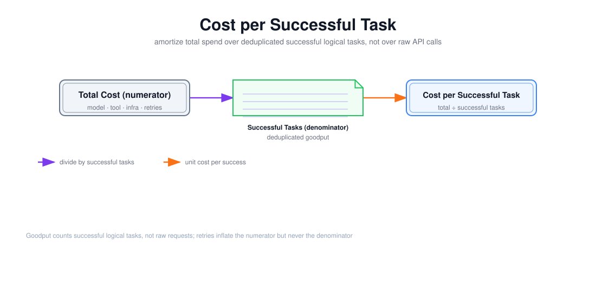

# 单位成功任务成本与 Goodput 成本建模

> 目标：把成本口径从「单次 API 调用了多少 token」升级到「成功交付一个逻辑任务花了多少钱」，让重试、失败、基础设施和 Goodput 都进入同一张账单。

上图由 `$fireworks-tech-graph` 生成并通过 XML、箭头碰撞、语义几何和构图质量检查，PNG 已完成视觉复核。它把公式拆成一条线性的「除法链」：总成本（分子）→ 成功任务数（分母）→ 单位成功任务成本。阅读顺序如下：

1. **总成本**是分子，必须包含模型、工具、基础设施和重试放大四类；
2. **成功任务数**是分母，是去重后的逻辑任务（Goodput），不包含重试与失败；
3. 两者相除得到**单位成功任务成本**；
4. 关键不变量：重试只抬高分子，从不抬高分母。

---

## 1. 阅读前术语表

| 术语 | 说明 |
|---|---|
| 逻辑任务 Logical Task | 用户认为的一次工作；可包含多个 Attempt |
| Attempt | 逻辑任务的一次执行尝试；429/超时/重试会增加 Attempt |
| Goodput | 单位时间的成功逻辑任务数（有效产出） |
| 单位成功任务成本 | 总成本 ÷ 成功逻辑任务数 |
| 重试放大 Retry Amplification | 失败产生的额外 Attempt 使总调用量高于原始请求量 |
| 分摊 Amortization | 把基础设施/空闲容量等固定成本摊到每个成功任务上 |
| Shadow 流量 | 只复制、不产生副作用的镜像流量，仍消耗计算与成本 |
| 幸存者偏差 | 只统计成功样本而遗漏失败样本造成的口径失真 |

---

## 2. 为什么「单次 Token 费用」是一个错误的分母

供应商账单告诉你「1M token 多少钱」，于是自然的做法是：

\[
\text{「成本」}= \frac{\text{总 token 费用}}{\text{总调用次数}}
\]

这个数字有几个致命问题：

1. **它不分成功失败**：失败的调用也花了 token，但没交付任何东西；
2. **它不看重试**：一个任务失败 3 次才成功，账单上是 4 次调用，分母却只算 1 次「成功调用」或 4 次「调用」都不对；
3. **它不含非模型成本**：工具、检索、沙箱、基础设施、Shadow 流量都不在「Token 费用」里；
4. **它把「调用」当「任务」**：一个逻辑任务可能需要 5 次模型调用 + 3 次工具调用。

真正应该优化的分母是**成功逻辑任务数**，分子是**为这些成功任务付出的全部代价**：

\[
CostPerSuccess = \frac{C_{model} + C_{tool} + C_{sandbox} + C_{infra} + C_{network}}{SuccessfulLogicalTasks}
\]

---

## 3. 分子：总成本的五个部分

### 3.1 模型成本（含失败）

\[
C_{model} = \sum_{all\ attempts} (输入\ token \times 输入单价 + 输出\ token \times 输出单价)
\]

关键点：**求和遍历所有 Attempt，包括失败与重试**。一次超时的调用，供应商可能已经计费（响应丢失但计算已完成，第 10 周「工具半成功」的模型版）。

### 3.2 工具与沙箱成本

检索、向量库查询、代码执行、浏览器、外部 API 的调用费。这些在 Agent 里可能超过模型成本，且同样存在失败重试。

### 3.3 基础设施成本

GPU/CPU 机器、存储、网络、以及**为峰值预留的空闲容量**。这里最容易被漏掉的是「闲置分摊」：为扛住 P99 峰值买的多余算力，闲时也在烧钱，必须摊到成功任务上。

### 3.4 网络与其它

数据上行/下行、对象存储、日志/遥测存储。

### 3.5 重试放大：分子里的隐性乘数

若单次 Attempt 失败概率为 `p`、最多尝试 `r` 次，独立失败假设下期望 Attempt 数：

\[
A_{retry} = 1 + p + p^2 + \cdots + p^{r-1}
\]

`p=0.1, r=4` 时 `A_retry ≈ 1.111`；但真实事故里失败相关（过载时 `p` 随负载上升），`A_retry` 可能远超此值。这个乘数只作用在分子上——**重试让账单变厚，却不增加成功任务数**。

---

## 4. 分母：成功逻辑任务数（Goodput）

### 4.1 什么是「一个成功任务」

分母不是「调用次数」，也不是「Attempt 数」，而是**去重后的、满足成功条件的逻辑任务数**。沿用第 10 周的定义：

\[
Success = CorrectOutcome \land WithinDeadline \land WithinBudget \land Authorized \land NoDuplicateEffect
\]

最终文本看似正确但超时、超预算、越权或重复副作用的任务，都不进分母。

### 4.2 Goodput 在这里的精确含义

文档 01 里 Goodput 是「单位时间有效 token」；在成本口径里，Goodput 是「单位时间成功逻辑任务」。两者同一精神：**只数有效交付，不数原始产出**。失败 Attempt、被取消的任务、重试中间结果，一律不进分母。

---

## 5. 一个更可用的等价形式

把分子近似看成「每次 Attempt 的平均成本 × Attempt 数」，并把成功率引入：

\[
CostPerSuccess \approx \frac{C_{per\ attempt} \times A_{attempts}}{N_{success}}
                 = \frac{C_{per\ attempt}}{SuccessRate}
\]

其中 `SuccessRate = N_success / A_attempts`。这个形式的价值在于把成本拆成两个独立的杠杆：

1. **降低每次 Attempt 的成本**：量化、缓存、更便宜的模型（第 13 周）；
2. **提高成功率**：更好的 Prompt、路由、检索、重试策略。

两者对单位成本是**同等**重要的：一个「每次调用便宜 50% 但成功率从 90% 掉到 50%」的方案，单位成本反而翻倍——这正对应第 13 周的面试题「为什么量化后吞吐提升不等于所有任务成本都下降」。

---

## 6. 一个示例计算

假设一个研究型 Agent 任务：

| 项目 | 值 |
|---|---:|
| 每次成功任务平均 Attempt 数 | 1.6（含重试） |
| 每次 Attempt 平均成本（模型+工具） | $0.03 |
| 基础设施分摊（每成功任务） | $0.01 |
| 成功率 | 62.5%（1/1.6） |

则：

\[
CostPerSuccess = 1.6 \times 0.03 + 0.01 = \$0.058
\]

若只算「单次成功调用」的 token 费，会得出 `$0.03`，**低估了近一半**——漏掉了 0.6 次重试的代价和基础设施分摊。这就是「单位成功任务成本」必须取代「单次调用成本」的原因。

---

## 7. 三个常见陷阱

### 7.1 把重试当成新任务

一个任务失败两次后成功，若把 3 次 Attempt 都当成 3 个「任务」，分母虚高，成本被稀释。分母必须按逻辑任务去重。

### 7.2 漏算 Shadow 与空闲容量

Shadow 流量、Canary 流量、为灰度保留的并行实例，都消耗真实成本，但往往不计入任何「任务」的分母。它们要么摊到生产成功任务上，要么单独作为「研发/发布成本」列示，不能凭空消失。

### 7.3 只看边际成本，不看固定成本

「多服务一个任务」的边际成本可能只有 token 费，但系统的**总**单位成本要除以全部成功任务、覆盖全部机器。用边际成本做定价会系统性低估真实成本。

---

## 8. 与性能指标、SLO 的连接

单位成功任务成本不是孤立指标，它把第 11 周前面的性能指标串起来：

- **延迟**影响并发与排队 → 影响需要多少基础设施 → 影响分子；
- **Goodput**（文档 01）直接就是分母的「速率版」；
- **成功率**（第 8 周评测）决定重试放大 → 决定分子；
- **SLO**（第 10 周）里「单位成功任务成本 ≤ X」把这一切固化成可监控、可验收的目标。

因此第 11 周的落点不是「知道成本公式」，而是能把「TTFT、TPOT、吞吐、Goodput、成功率」全部翻译成同一个单位：**每成功交付一个任务，花多少钱、用多久**。

---

## 9. 本文结论

单位成功任务成本 = 总成本（模型 + 工具 + 基础设施 + 重试放大）÷ 成功逻辑任务数（去重的 Goodput）。它的敌人是「单次 token 费用」这个偷懒口径，后者漏掉失败、漏掉重试、漏掉基础设施、混淆调用与任务。正确的建模抓住两个独立杠杆：**每次 Attempt 的成本**和**成功率**，并用 Goodput 作为分母保证「只有有效交付才算数」。最终，成本指标和延迟/吞吐指标在同一个公式里相遇，成为一个系统能否规模化交付的判断标准。

---

## 参考资料

- [Anthropic — Demystifying Evals for AI Agents](https://www.anthropic.com/engineering/demystifying-evals-for-ai-agents) 关于成功率与成本口径的讨论
- 本文第 10 周文档《生产系统设计面试、SLO、容量、故障演练与灰度回滚验收》中「单位成功任务成本」的 SLO 定义
- 本文文档 01《TTFT、TPOT、端到端延迟、吞吐与 Goodput 的指标定义》中 Goodput 的速率定义
