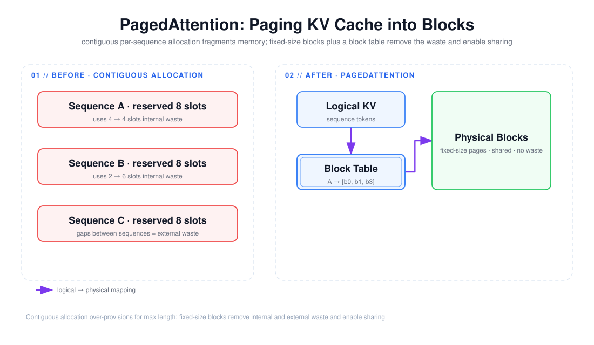

# PagedAttention：KV Cache 碎片与分页思想

> 目标：不是背下「PagedAttention 用固定块管理 KV Cache」这句话，而是说清它解决了哪两类碎片、block table 怎么把逻辑 token 映射到物理块、以及它为什么顺带解决了内存共享与并行采样的问题。



上图由 `$fireworks-tech-graph` 生成并通过 XML、箭头碰撞、语义几何和构图质量检查。它把 KV Cache 的两种分配方式放在一起对比：左侧是**连续分配**——每条序列预留「最大长度」的连续区间，用不完的部分是内部碎片，序列之间的空洞是外部碎片；右侧是**分页分配**——逻辑 KV 通过一张 block table 映射到固定大小的物理块，物理块可以被多条序列共享。阅读顺序如下：

1. 连续分配按 `max_length` 预留，序列短于上限时预留区后半段全部浪费（内部碎片）；
2. 不同序列的预留区之间、以及释放后留下的空洞构成外部碎片，显存利用率可能掉到 20% 以下；
3. PagedAttention 把 KV Cache 切成固定大小的 block，序列只用它能填满的块；
4. block table 记录「逻辑第 i 块 → 物理块 b」的映射，块可以不连续、可复用、可共享。

---

## 1. 阅读前术语表

| 术语 | 说明 |
|---|---|
| KV Cache | 推理时缓存每层 attention 的 Key/Value 张量，避免对已生成 token 重复计算 |
| 内部碎片 | 分配了但用不上的空间（预留 `max_length` 但实际输出更短） |
| 外部碎片 | 相邻已分配区间之间的、因大小不匹配无法被新请求利用的空洞 |
| Block / Page | PagedAttention 里 KV Cache 的最小分配单位（如 16 个 token 一块） |
| Block Table | 每条序列一张表，把「逻辑块号」映射到「物理块地址」 |
| Copy-on-Write | 复制块引用而非复制块数据；写入时才真正复制 |
| Prefill / Decode | 预填充（并行编码输入）/ 自回归解码（逐 token 生成） |
| 连续批处理 | 请求完成后不等整个 batch 结束就接纳新请求（见文档 02/06） |

---

## 2. 问题：KV Cache 为什么会有碎片

KV Cache 是 LLM 推理的显存大头。一个直观做法是：每条序列到达时，按它可能生成的最大长度 `max_length` 预留一块**连续**的显存。这个做法带来两类浪费：

1. **内部碎片（internal fragmentation）**：真实生成长度几乎总是小于 `max_length`，预留区的后半段从不被使用。若平均只用到预留的一半，一半显存被白白占着。
2. **外部碎片（external fragmentation）**：不同序列预留的大小、释放的时机都不同，空闲显存被切成一块块「大小不匹配」的洞。新请求需要一个较大的连续区间，但总空闲量足够、却没有一块连续区间放得下。

这两类碎片叠加，导致显存利用率可能只有 **20%～40%**（vLLM 论文给出的是传统系统 60%～80% 的浪费）。显存利用率低，直接限制了两个关键量：

- **能同时服务的请求数（batch 上限）**：显存被碎片占着，能放下的序列就少，吞吐上不去；
- **能容纳的最大输入长度**：长上下文请求需要更大的连续区间，碎片越多越难满足。

所以 KV Cache 碎片不是一个「内存卫生」问题，而是吞吐和长上下文能力的直接瓶颈。

---

## 3. 方案：把 KV Cache 当成虚拟内存来分页

PagedAttention 的洞见是：**操作系统早就在解决同样的问题——用分页把「连续的逻辑地址」映射到「不连续的物理页」**。把 KV Cache 切成固定大小的 block（例如每块 16 个 token），每条序列不再申请连续区间，而是申请「足够多的块」，并用一张 block table 记录映射：

```text
逻辑序列 A： [block 0] [block 1] [block 2]   ← 只申请 3 块，不预留 max_length
block table A：  0→b0      1→b3      2→b7    ← 块可以分散在显存任意位置

物理块池： b0 | b1 | b2 | b3 | b4 | b5 | b6 | b7 | ...
             └──── 被 A 占用的块可能互不相邻 ────┘
```

这个设计的三个直接后果：

1. **消除内部碎片**：序列只申请实际需要的块，最后一块内最多浪费不到一个 block 的 token（例如 16 token 里用 5 个），碎片上界从「预留的 max_length」降到「一个 block 大小」。
2. **消除外部碎片**：物理块大小统一，任何空闲块都能被任何序列复用，不存在「大小不匹配」的问题。
3. **延迟分配（惰性）**：只在 Decode 真的跨过一块边界时才申请下一块，而不是 Prefill 时就一次预留全部。

块大小是一个权衡：块太小，block table 和元数据开销大；块太大，最后一块的内部碎片多。常见取值是 16 token。

---

## 4. Block Table 与内存共享

分页之后，「共享」变得几乎免费——这是连续分配很难做到的。共享的典型场景：

- **并行采样 / Beam Search**：一个输入生成多个候选（如 beam width = 4），这 4 条序列共享同一份输入 KV Cache。PagedAttention 让它们**共享同一批物理块**，只在各自分叉出不同 token 时才通过 Copy-on-Write 复制出新块。连续分配下每条 beam 都要复制整个 KV，显存按 beam 宽度线性爆炸。
- **多请求共享同一前缀**：不同请求有相同的 system prompt 或 few-shot 前缀（这正是后面文档 03 的 Radix Cache 要自动化的），共享前缀对应的块可以被复用。

Copy-on-Write 的语义：多个逻辑序列的 block table 指向同一个物理块，物理块维护一个引用计数；当某条序列要向这个块写入新 token 时，先复制一份物理块再写，避免影响其他共享者。引用计数归零时才真正释放物理块回池。

---

## 5. 为什么这个设计能同时提升吞吐和长上下文能力

| 收益 | 机制 |
|---|---|
| 吞吐 ↑ | 显存利用率从 ~20% 提到 ~90%+，同显存能容纳更多序列，batch 更大、连续批处理更有效 |
| 长上下文 ↑ | 不再需要为一条序列找一大块连续显存，长输入只是「更多块」 |
| 并行采样显存 ↓ | 共享前缀块 + CoW，beam 宽度不再线性放大显存 |
| 碎片可预测性 ↑ | 碎片上界从一个请求的最大长度降到一个 block |

vLLM 论文报告的量化结果是：相比传统系统，PagedAttention 把 KV Cache 浪费从 60%～80% 降到 **4% 以内**，并带来约 **2～4 倍**的吞吐提升。这个数字的意义不在绝对值，而在「把显存从第一瓶颈解放出来，交给 batch 和长上下文」。

---

## 6. 代价与边界

PagedAttention 不是免费的：

1. **间接寻址开销**：每个 attention 操作都要先查 block table 再访问 KV，多一层间接。实际中用 kernel 层优化（分块 attention、把 block table 放进 kernel 参数）把开销压到可忽略。
2. **元数据与碎片转移**：block table 本身占用显存/内存；固定块大小只是把「大碎片」变成「小块内的小碎片」。
3. **不是所有场景都受益**：短请求、单请求低并发时，PagedAttention 的管理开销可能超过它省下的显存；它的收益在高并发、长上下文、并行采样下最明显。
4. **跨请求前缀复用需要更高层的机制**：PagedAttention 解决「单序列内部 + 并行采样的分页与共享」，但「自动识别并复用不同请求的共享前缀」是 Prefix Cache（文档 02）和 Radix Cache（文档 03）的事，二者建立在分页之上。

理解这一层边界很重要：PagedAttention 是「存储布局」层的改进，它让 KV Cache 变得像虚拟内存一样可被分页、共享和回收；而「要不要复用、怎么调度去复用」是更高层（缓存、调度、路由）的决策。

---

## 7. 本文结论

KV Cache 碎片是「连续分配 + 按 max_length 预留」这个组合的必然结果：内部碎片来自预留过多，外部碎片来自大小不一。PagedAttention 用**固定大小的物理块 + block table 间接寻址**同时消除这两类碎片，把浪费从「一个请求的最大长度」压到「一个 block」，并把显存利用率拉回 90% 以上。分页还顺带让**并行采样和前缀共享**变得几乎免费（共享引用 + Copy-on-Write）。它的代价是间接寻址和元数据开销，收益在**高并发、长上下文、多采样**场景最显著。它是 vLLM、SGLang、TensorRT-LLM 等现代引擎共用的 KV Cache 底层布局，也是后续 Prefix Cache、Radix Cache、KV 卸载与 P/D 解耦 KV 传输的共同地基。

---

## 参考资料

- [PagedAttention / Efficient Memory Management for LLM Serving（arXiv:2309.06180）](https://arxiv.org/abs/2309.06180)
- [vLLM 文档 — PagedAttention](https://docs.vllm.ai/en/latest/)
- [SGLang 文档 — RadixAttention（基于分页 KV 的 radix tree 复用）](https://docs.sglang.io/)
- [TensorRT-LLM 文档 — Paged KV Cache](https://nvidia.github.io/TensorRT-LLM/)
