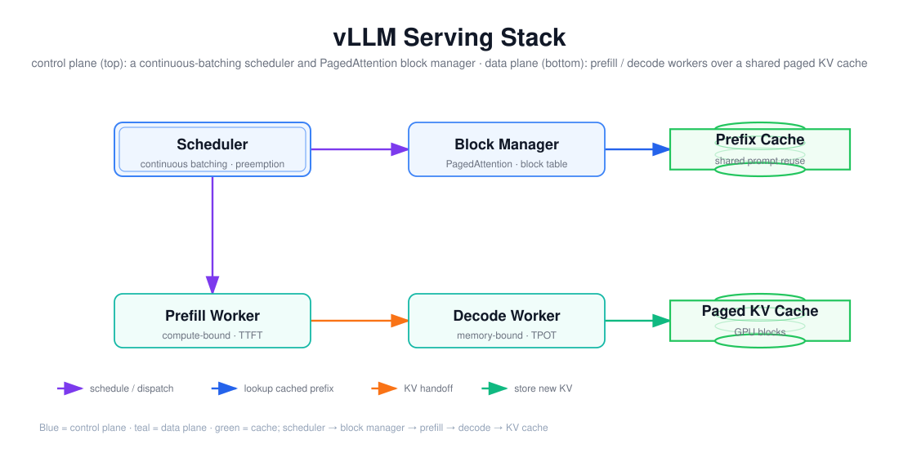

# vLLM：Serving、Benchmark 与缓存章节

> 目标：把 vLLM 拆成「调度层 + 块管理层 + GPU 数据层」三层，说清连续批处理和 Prefix Cache 各自解决什么问题，并能用 vLLM 自带的 benchmark 工具设计一次可复现的对比实验。



上图由 `$fireworks-tech-graph` 生成并通过 XML、箭头碰撞、语义几何和构图质量检查。它把 vLLM 分成两个平面：上层是**控制面**——Scheduler 做连续批处理和抢占决策，Block Manager 用 PagedAttention 管理物理块分配，Prefix Cache 复用共享前缀；下层是**数据面**——Prefill Worker 做计算受限的输入编码，Decode Worker 做内存受限的逐 token 生成，两者共享同一份分页 KV Cache。阅读顺序如下：

1. Scheduler 决定哪些请求进入本步 batch（连续批处理），并交给 Block Manager 分配 KV 块；
2. Block Manager 先查 Prefix Cache，命中的前缀跳过 Prefill，只算未命中的尾部；
3. Prefill Worker 编码输入、产生 KV，把 KV 交给 Decode Worker；
4. Decode Worker 逐 token 生成，每步把新 KV 写回分页缓存。

---

## 1. 阅读前术语表

| 术语 | 说明 |
|---|---|
| Continuous Batching | 连续批处理：请求完成后不等整个 batch 结束，立即把新请求填进空位 |
| Static Batching | 静态批处理：一个 batch 的所有请求同时开始、最慢者结束才整批返回 |
| Prefill | 把输入 token 并行编码、生成首个 KV 的过程，计算受限 |
| Decode | 自回归逐 token 生成，内存带宽受限 |
| Prefix Cache / APC | 自动前缀缓存：识别并复用请求间共享的前缀 KV，跳过其 Prefill |
| Block Manager | 基于 PagedAttention 的 KV 块分配器 |
| Preemption | 抢占：把低优先级或长请求移出，让位给更短/更高优先级的请求 |
| `gpu_memory_utilization` | 允许引擎占用的 GPU 显存比例 |
| `max_num_seqs` | 单步并行处理的最大序列数 |

---

## 2. Serving：从静态批处理到连续批处理

Serving 引擎的核心是「怎么把多个请求凑成一步 GPU 计算」。静态批处理的问题在 Decode 阶段被放大：不同请求的输出长度差异很大，短的早已生成完，却要等最长的那个，GPU 空转。

vLLM 的**连续批处理**把调度粒度降到**每步（iteration）**：每完成一步 Decode，就检查有没有请求已经结束、有没有新请求可以进来，动态重组 batch。于是：

- 短请求不用等长请求，结束后槽位立即被新请求占用；
- GPU 每步都尽量满负荷（要么在 Prefill，要么在 Decode）；
- 吞吐显著高于静态批处理，代价是单个请求的「每步等待」变多——这又回到了文档 11-w/01 里的吞吐/TTFT 权衡。

调度器还要处理**抢占（preemption）**：当新请求需要大量 KV 而显存不够时，把已在途的某些序列（如最长、优先级最低的）换出，腾出块给新请求；换出的序列等块空闲再恢复（或重算）。抢占分「交换式」（把 KV 搬到 CPU 内存）和「重算式」（丢弃 KV 重算 Prefill）两种，前者省计算费带宽、后者省带宽费计算。

---

## 3. 缓存章节：Prefix Cache 在复用共享前缀

PagedAttention（文档 01）解决了「块怎么分」，Prefix Cache 解决「哪些块的 KV 值得留着复用」。vLLM 的自动前缀缓存（APC）把 KV 缓存到 **block 粒度**，并按 token 的 hash 识别「这个块的 KV 是否已经算过」：

- 两个请求的 system prompt / 对话历史 / few-shot 前缀相同，前缀块就复用；
- 只有不同的尾部 token 需要 Prefill 和 Decode；
- 命中率取决于「请求间前缀重叠度」——多轮对话、带大 system prompt 的 Agent 负载命中率最高。

需要注意：Prefix Cache 的匹配单位是**块**（如 16 token），而 SGLang 的 Radix Cache（文档 03）匹配单位是**任意长度的 token 序列**。所以 vLLM 的前缀复用对齐到块边界，Radix 对齐到 token 边界——这是两者缓存精度的本质差别。

启用与调优相关的典型参数：`--enable-prefix-caching` 开启 APC；`--gpu-memory-utilization` 控制引擎可用显存（越大能装越多 KV 块，但也越容易触发抢占）；`--max-num-seqs` 限制并行序列数；`--kv-cache-dtype` 可把 KV 量化到 fp8 等以省显存。

---

## 4. Benchmark：vLLM 自带工具怎么测

vLLM 提供两类基准工具，分别对应「压测一个已部署服务」和「离线测引擎能力」：

| 工具 | 用途 | 关键参数 |
|---|---|---|
| `vllm bench serve` | 压测一个已启动的 OpenAI 兼容服务 | `--backend`、`--num-prompts`、`--request-rate`、`--input-len/--output-len`、`--concurrency`（较新版本用 `--request-rate` 或 `--multi`） |
| `vllm bench throughput` | 离线测引擎吞吐上限 | `--model`、`--input-len`、`--output-len`、`--batch-size` |

一次可复现的对比实验要点（和第 11 周的口径清单一致）：

1. **固定模型、精度、数据集**：同模型同 dtype，prompt 集版本化；
2. **固定输入/输出长度分布**：短输入短输出、长输入长输出分档，别混着报一个平均；
3. **预热 + 丢弃冷启动**：模型加载、CUDA kernel 编译、前缀缓存冷启动都要排除；
4. **同时报 TTFT、TPOT、吞吐、P95/P99**：单报吞吐会掩盖尾延迟（见 11-w/01）；
5. **标注缓存命中率与限流状态**：Prefix Cache 命中会改变 TTFT，RPM/TPM 限流会污染吞吐。

vLLM 的官方 benchmark 脚本输出通常包含 `Throughput`、`Median/Mean TTFT`、`Median/Mean ITL`（TPOT）和 E2E 延迟。用它做 A/B（如开关 `--enable-prefix-caching`、不同 `max_num_seqs`、不同 `gpu_memory_utilization`）是理解「参数如何平移吞吐/延迟曲线」的最快方式。

---

## 5. 三者如何组合成一个决策

把 Serving、缓存、Benchmark 串起来，vLLM 的实际工作流是：

```text
请求到达 → Scheduler（连续批处理 + 抢占）→ Block Manager 查 Prefix Cache
         → 命中前缀：跳过 Prefill  → 未命中：Prefill 算 KV
         → Decode 逐 token 生成，写回 KV Cache
         → Benchmark 工具在固定口径下测 TTFT/TPOT/吞吐/P95/P99
```

「要不要开 Prefix Cache、给多少显存、限制多少并行序列」这些旋钮的取舍，最终要用 benchmark 数据说话——这正是第 12 周「编码与分析」里要做的 vLLM/SGLang 实机对比实验。

---

## 6. 本文结论

vLLM 的三层可以这样记：**Scheduler 决定「谁在算」**（连续批处理、抢占），**Block Manager 决定「KV 放哪」**（PagedAttention 分页），**Prefix Cache 决定「什么值得复用」**（共享前缀块）。连续批处理消除 Decode 阶段的 GPU 空转，Prefix Cache 消除共享前缀的重复 Prefill，两者都建立在 PagedAttention 的分页 KV 之上。Benchmark 的职责是把这些旋钮的收益量化成可复现的 TTFT/TPOT/吞吐/尾延迟曲线——固定口径、固定数据集、同时报分布而不是单点。

---

## 参考资料

- [vLLM 文档 — Serving](https://docs.vllm.ai/en/latest/)
- [vLLM 文档 — Benchmark](https://docs.vllm.ai/en/latest/)
- [vLLM 文档 — 缓存 / Prefix Caching](https://docs.vllm.ai/en/latest/)
- [PagedAttention（arXiv:2309.06180）](https://arxiv.org/abs/2309.06180)
