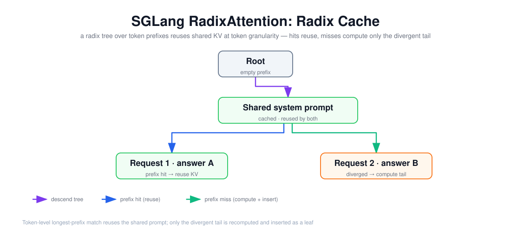

# SGLang：Runtime、Radix Cache 与 Serving 概览

> 目标：说清 SGLang 的 RadixAttention 为什么比块级前缀缓存更精细，Runtime 的 overlap scheduler 如何把计算和传输重叠，以及这三者如何协同出一个可复用的 KV 复用系统。



上图由 `$fireworks-tech-graph` 生成并通过 XML、箭头碰撞、语义几何和构图质量检查。它画的是 SGLang Radix Cache 的核心数据结构——一棵 **radix tree（基数树）**：根节点到任何节点的路径代表一个 token 前缀。两个请求共享同一段 system prompt（绿色节点），因此该前缀的 KV 只算一次、被两次复用；分叉之后，请求 1 命中缓存直接复用，请求 2 走到未命中分支、只重算分叉后的尾部并插为新叶子。阅读顺序如下：

1. 从 Root 沿最长公共前缀下降，匹配到「共享 system prompt」节点；
2. 匹配到的前缀 KV 直接复用，不重新 Prefill；
3. 分叉点之后，命中的分支复用、未命中的分支只算尾部并插入树中。

---

## 1. 阅读前术语表

| 术语 | 说明 |
|---|---|
| RadixAttention | SGLang 的 KV 复用机制，用 radix tree 在 token 粒度匹配并复用前缀 |
| Radix Tree | 基数树：边可代表多个 token 的压缩前缀树，任何根到节点路径是一个前缀 |
| Longest Prefix Match | 最长前缀匹配：找与请求 token 序列最长的公共前缀 |
| TreeNode | 树节点，存 key（token 序列）、value（KV 张量位置）、ref_count（在途引用数） |
| LRU / Priority Eviction | 淘汰策略：默认淘汰最久未用的叶子；priority 模式优先淘汰低优先级叶子 |
| Overlap Scheduler | 把某层的计算与另一层的数据搬运重叠，隐藏传输延迟 |
| HiCache | 层级 KV 缓存：GPU 淘汰降级到 CPU/宿主内存，而非直接删除 |
| Extend Kernel | 融合的「扩展」kernel，可从连续或不连续 KV 池读缓存，免拷贝 |

---

## 2. Runtime：RadixAttention 与 radix tree

SGLang Runtime 的核心洞见是：**很多 Agent / 多轮 / 树搜索负载里，请求之间有大量共享 token 前缀，而「丢弃式」KV 管理会反复重算这些前缀**。RadixAttention 把 KV Cache 组织成一棵 radix tree：

- 每个节点存一段 `key`（连续 token 序列）和它的 `value`（对应 KV 张量在 GPU 上的位置）；
- 任意「根到节点」的路径唯一代表一个 token 前缀；
- 边的长度可变（一段 token 子串而非单 token），减少树深度和节点数；
- 新请求到达时做 `match_prefix()`（最长前缀匹配），命中的前缀直接复用 KV，只算未匹配的尾部。

和 vLLM 的 Prefix Cache（文档 02）对比，这是本质区别：**vLLM 按固定 block（16 token）对齐复用，SGLang 按任意 token 序列对齐复用**。于是 SGLang 能精确到「共享了 37 个 token」就只重算第 38 个开始的部分，而块级缓存可能要对齐到 32 或 48。对 system prompt、few-shot 示例、多轮历史、tree-of-thought 搜索这类「前缀高度重叠但边界不一定是块的整数倍」的负载，token 粒度复用更彻底。SGLang 报告的收益是在此类负载上可达数倍吞吐（论文给出最高 ~4.4×）。

树的动态行为：节点可以**拆分（split）**——当两个会话共享同一 system prompt 但后续不同，公共前缀作为一个节点，分叉处拆出两个子节点；节点用 `ref_count` 记录多少在途请求正在引用它，归零才可淘汰。

---

## 3. 淘汰与层级缓存：LRU、Priority 与 HiCache

GPU 显存有限，KV 不能无限留存。Radix Cache 的淘汰策略：

- **LRU（默认）**：优先淘汰最久未使用的**叶子节点**，保留公共祖先——这样共享前缀尽量留着复用；
- **Priority**：`--radix-eviction-policy priority` 优先淘汰低优先级叶子，同优先级回退 LRU。这对 Agent 负载很有用——某些前缀（如正在多轮对话中的历史）优先级更高，不该被新请求挤掉。

**HiCache（层级缓存）**把单层 GPU 缓存扩展成多层：GPU 淘汰不再删除，而是**降级到 CPU/宿主内存**；真正删除发生在宿主内存淘汰时。这样共享前缀即使被挤出 GPU，也还能从 CPU 快速加载回来，避免完全重算。配合 overlap 机制，CPU→GPU 的加载可以在上一层计算时并行进行。

---

## 4. Serving：overlap scheduler 与缓存感知调度

SGLang 的 serving 层有两个关键设计：

1. **Overlap Scheduler**：把「计算」和「数据传输」重叠。例如 HiCache 下，算第 N 层的同时把第 N+1 层的 KV 从 CPU 搬到 GPU，隐藏传输延迟；GPU 辅助 I/O kernel 能让传输速度提升数倍。这直接降低缓存命中时的 TTFT（命中也得先把 KV 加载回 GPU）。

2. **缓存感知调度（cache-aware scheduling）**：调度器不再先进先出，而是**优先调度那些前缀已命中的请求**，按匹配前缀长度排序。这样缓存命中率更高、抖动更小；对 Agent 负载还支持 `--enable-priority-scheduling`，按请求自带的优先级值排序（同优先级按到达时间）。

两者结合的效果：缓存命中的请求既被优先调度、其 KV 加载又与计算重叠，于是「复用前缀」从「省了 Prefill 计算」进一步变成「连加载延迟都被隐藏」。

---

## 5. 一个多轮 Agent 会话的完整复用路径

把三件事串起来看一次多轮对话：

```text
第 1 轮：用户 + system prompt → 整段 Prefill → 生成 → 整条 KV 插入 radix tree
第 2 轮：新请求 = 第 1 轮全部历史 + 新问题
        → match_prefix() 命中第 1 轮全部历史 → 复用其 KV，不重算
        → 只对新问题做 Prefill → 生成 → 新尾部作为新叶子插入
第 3 轮：同上，命中第 1+2 轮全部历史
```

每一轮都只重算「新增的那一小段」，历史 KV 全部复用。这就是为什么多轮 Agent 场景下 SGLang 的 TTFT 和总计算量能显著下降——代价是 radix tree 的维护开销和更复杂的调度器。

---

## 6. 本文结论

SGLang 的差异化不在「有没有缓存复用」，而在**复用的粒度与调度**：RadixAttention 用 radix tree 做 **token 粒度**的最长前缀匹配（对比 vLLM 的块粒度 Prefix Cache），把共享前缀的重复计算压到最小；HiCache 让 GPU 淘汰变成层级降级而非删除；overlap scheduler 和缓存感知调度则把「命中」的收益从省计算扩大到「省延迟」。三者合起来，SGLang 在**前缀高度重叠、多轮、树搜索、Agent** 这类负载上是强项；对前缀几乎不重叠的单发短请求，它的缓存机制收益有限，反而要承担 tree 维护开销。选型时（文档 02/05/06 的对照）应把这个「负载特征 → 收益条件」作为判断依据。

---

## 参考资料

- [SGLang 文档 — Runtime / RadixAttention](https://docs.sglang.io/)
- [SGLang 文档 — Radix Cache 与淘汰策略](https://docs.sglang.io/)
- [SGLang 文档 — Serving / HiCache](https://docs.sglang.io/)
- [SGLang: Efficient Execution of Structured LLM Programs（arXiv:2312.07104）](https://arxiv.org/abs/2312.07104)
