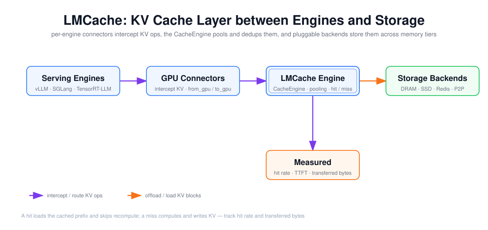

# LMCache：Quickstart、Integration 与命中/传输度量

> 目标：说清 LMCache 是「引擎之下的 KV Cache 层」而非引擎本身，它如何通过 connector 与 vLLM/SGLang/TensorRT-LLM 配合，以及命中率、TTFT、传输字节这三类指标怎么度量它到底值不值。

上图由 `$fireworks-tech-graph` 生成并通过 XML、箭头碰撞、语义几何和构图质量检查。它把 LMCache 画成一条左→右的路径：**Serving 引擎**（vLLM/SGLang/TensorRT-LLM）→ **GPU Connectors**（拦截 KV 操作、`from_gpu`/`to_gpu`）→ **LMCache Engine**（CacheEngine 做池化与命中判断）→ **Storage Backends**（DRAM/SSD/Redis/P2P 多级存储），下方是**度量层**——命中率、TTFT、传输字节。阅读顺序如下：

1. 引擎的 KV 读写被各自 connector 拦截；
2. connector 把 KV 交给 LMCache Engine 做命中判断和池化；
3. 命中则从后端加载前缀、跳过重算；未命中则计算后写入后端；
4. 命中率、TTFT、传输字节三个指标度量这条路径是否划算。

---

## 1. 阅读前术语表

| 术语 | 说明 |
|---|---|
| KV Cache 层 | 在推理引擎之下、存储之上的中间层，负责 KV 的卸载、复用与共享 |
| Connector | 与具体引擎对接的适配器，实现 `from_gpu`/`to_gpu` 等 KV 搬运接口 |
| CacheEngine | LMCache 的核心对象，负责池化、命中判断、路由到后端 |
| Backend | 存储后端：CPU DRAM、GPU、LocalDisk/NVMe、Remote（Redis）、分布式（P2P/Mooncake） |
| CacheGen | LMCache 的 KV 压缩：把 KV 量化/压缩后传输，省带宽 |
| Hit Rate | 命中缓存的 token 数 ÷ 总 token 数（或请求数口径） |
| Transferred Bytes | KV 传输的字节数，衡量卸载/加载的开销 |
| In-process / Multiprocess | LMCache 两种部署：跑在引擎进程内，或作为独立 `lmcache` 服务 |

---

## 2. 定位：为什么需要独立的 KV Cache 层

引擎自带的 KV 缓存（文档 01/02/03）都在**单进程、单 GPU 的显存**内，天然有三个局限：

1. **容量受限**：GPU 显存有限，长上下文或高并发下缓存被频繁淘汰，复用率掉；
2. **不能跨实例共享**：多个推理实例（甚至跨节点）各存各的 KV，共享前缀重复计算；
3. **不能跨引擎统一**：vLLM、SGLang、TensorRT-LLM 各有各的 KV 格式和生命周期。

LMCache 在引擎之下加一层，把 KV 卸载到 CPU 内存、NVMe、远端 Redis 或分布式内存池，做跨请求、跨实例、跨引擎的 KV 复用。它不取代引擎的调度，而是扩展「KV 能存多大、能复用多远」。

---

## 3. Integration：三种引擎怎么接入

LMCache 的接入统一是 **connector 模式**——每个引擎暴露一个 KV 搬运接口，LMCache 实现之：

| 引擎 | 接入方式 | 要点 |
|---|---|---|
| **vLLM** | `KVConnectorBase_V1` 接口（`LMCacheConnectorV1Impl`） | 支持 in-process 与 multiprocess（连独立 `lmcache` server）两种模式；用 RequestTracker 跟踪 token/block |
| **SGLang** | `--enable-lmcache` 标志，`LMCacheConnector` | 适配 SGLang 的 RadixAttention 内存池；支持 layerwise 连接器做逐层传输 |
| **TensorRT-LLM** | NVIDIA 的 KV Cache Connector API（`LMCacheKvConnectorScheduler`/`Worker`） | 通过 TRT-LLM 的 kv connector 接口对接 |

通用接口是 `GPUConnectorInterface`：`from_gpu`（把 KV 从引擎显存搬到 LMCache）、`to_gpu`（反之）、`batched_from_gpu`/`batched_to_gpu`（批量化）、`get_shape`。因为 KV 的显存布局（MHA/MLA、HND/NHD、逐层 vs 跨层）因引擎而异，LMCache 有一个**布局归一化**层，把不同引擎的 KV 布局解析成统一格式再搬运——这是「跨引擎统一」得以成立的关键。

部署上分两种：

- **In-process**：LMCache 跑在引擎进程内，延迟最低，但生命周期与引擎绑定；
- **Multiprocess / lmcache server**：LMCache 独立成服务，多个引擎实例共享同一个 KV 池，支持跨节点复用。

后端选择决定了「容量 vs 延迟」的梯度：DRAM 最快但小，NVMe 大但慢，Redis/分布式跨节点但走网络。一个多级配置（热数据 DRAM、温数据 NVMe、跨实例 Redis）是常见形态。

---

## 4. 度量命中与传输：三个指标怎么读

LMCache 的价值必须量化，否则「加了缓存」只是一个说法。核心三类：

1. **命中率（Hit Rate）**：命中缓存的 token 数 ÷ 请求总 token 数。要区分**前缀命中**（共享 system prompt）和**整段命中**（完全相同的请求）。命中率决定「省了多少 Prefill 计算」，是复用收益的第一近似。
2. **TTFT（命中 vs 未命中）**：命中后 TTFT 是否真的下降。注意命中也可能有代价——KV 要从 CPU/NVMe/远端加载回 GPU，加载本身就是延迟。若加载比 Prefill 还慢，命中反而更慢（这正是文档 05 里「远端 KV 反而更慢」的边界）。
3. **传输字节（Transferred Bytes）**：KV 卸载/加载搬运了多少字节。它把「带宽成本」显式化：命中一次省了 Prefill 计算，但付了传输字节。**CacheGen** 通过量化/压缩降低传输字节，让远端命中的带宽代价可控。

一个完整的实验设计（第 12 周编码要求）：对**共享前缀/多轮会话**负载，比较「冷缓存、热缓存、无复用基线」三种情况，记录命中率、TTFT、传输字节与成本。热缓存相对冷缓存省下的 Prefill 计算，减掉传输字节的代价，才是 LMCache 的净收益。

---

## 5. 与引擎自带缓存的边界

容易混淆的是「LMCache 的复用」和「引擎的 Prefix Cache / Radix Cache」：

| | 引擎内缓存（vLLM APC / SGLang Radix） | LMCache |
|---|---|---|
| 范围 | 单进程单 GPU | 跨进程、跨节点、跨引擎 |
| 介质 | GPU 显存 | CPU 内存 / NVMe / 远端 |
| 粒度 | block / token 前缀 | 前缀 + 整段 + 跨实例共享 |
| 命中延迟 | 极低（已在显存） | 有加载延迟（需回搬） |

两者是**互补**而非替代：引擎内缓存负责「本实例内的低延迟复用」，LMCache 负责「引擎外的大容量、跨实例复用」。是否上 LMCache，取决于负载有没有「跨实例/跨节点可复用的前缀」，以及网络/存储带宽是否撑得起加载代价。

---

## 6. 本文结论

LMCache 是引擎之下的 KV Cache 层，用 connector 模式对接 vLLM、SGLang、TensorRT-LLM，用多级后端（DRAM/NVMe/Redis/P2P）扩展 KV 的容量与共享范围，用布局归一化抹平引擎间差异。判断它是否划算，不是看「有没有命中」，而是三个可度量的量：**命中率**（省了多少计算）、**TTFT**（命中后是否真的更快，加载延迟是否反噬）、**传输字节**（省的计算付了多少带宽代价）。三者一起算净收益，才能避免「缓存命中率很高但端到端更慢」的陷阱。

---

## 参考资料

- [LMCache Quickstart](https://docs.lmcache.ai/getting_started/quickstart.html)
- [LMCache Integration 指南](https://docs.lmcache.ai/developer_guide/integration.html)
- [LMCache GitHub（connector / backend 实现）](https://github.com/LMCache/LMCache)
- [LMCache 与 NVIDIA Dynamo 集成](https://blog.lmcache.ai/en/2026/03/16/lmcache-nvidia-dynamo-1-0-a-match-made-in-inference-heaven/)
