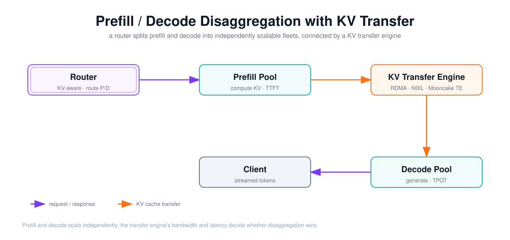

# Mooncake KV-centric 架构与 Dynamo / llm-d 的 P/D 解耦对照

> 目标：把「P/D 解耦」从口号落到架构——prefill 与 decode 各成独立集群，中间靠 KV 传输连接；再对照 Mooncake、NVIDIA Dynamo、llm-d 三个实现各自的传输引擎、调度和适用条件。

上图由 `$fireworks-tech-graph` 生成并通过 XML、箭头碰撞、语义几何和构图质量检查。它画的是 P/D 解耦的通路：**Router** 做 KV 感知路由、决定请求去 prefill 还是 decode → **Prefill Pool** 计算 KV（计算受限、决定 TTFT）→ **KV Transfer Engine** 用 RDMA/NIXL/Mooncake TE 搬运 KV → **Decode Pool** 逐 token 生成（内存受限、决定 TPOT）→ 返回 Client。阅读顺序如下：

1. 请求先到 Router，按 KV 位置与负载特征路由；
2. Prefill 集群算好输入 KV，交给传输引擎；
3. 传输引擎把 KV 从 prefill 节点搬到 decode 节点；
4. Decode 集群生成 token 返回，prefill/decode 各自独立扩缩容。

---

## 1. 阅读前术语表

| 术语 | 说明 |
|---|---|
| P/D 解耦 | Prefill/Decode Disaggregation：把推理拆成 prefill 集群与 decode 集群 |
| Prefill 集群 | 计算受限的输入编码节点，决定 TTFT |
| Decode 集群 | 内存带宽受限的生成节点，决定 TPOT/吞吐 |
| KV Transfer Engine | 在 prefill 与 decode 之间搬运 KV Cache 的传输层 |
| RDMA / InfiniBand / RoCE | 低延迟高带宽网络，KV 传输的首选介质 |
| NIXL | NVIDIA Inference Xfer Library，Dynamo/llm-d 用的 KV 传输库 |
| Mooncake TE | Mooncake 的 Transfer Engine，TCP/RDMA/NVMe-oF 统一传输 |
| KV-aware Routing | 按「哪个节点已持有该 KV」路由请求，避免重复 prefill |
| xPyD | llm-d 的异构并行：prefill 低 TP 多副本，decode 高 TP 少副本 |

---

## 2. 为什么要把 Prefill 和 Decode 拆开

同构部署里 prefill 和 decode 共用节点，两个阶段的资源需求错配：

- **Prefill** 是计算受限（FLOPs 密集），吃的是算力，瞬时拉高 GPU 利用率；
- **Decode** 是内存带宽受限，吃的是 KV 读带宽，单步算力需求低。

把两者混在一个 batch 里，长输入的 prefill 会**抢占**正在 decode 的请求的算力，抬高别人的 TTFT 和 ITL；而 prefill 的 burst 性又让算力利用率不稳。拆开后：

- prefill 集群、decode 集群**独立扩缩容**（长输入占比高就多扩 prefill）；
- prefill 的算力 burst 不再打断 decode 的生成节奏，ITL/TTFT 更稳；
- 代价是 KV 要从 prefill 节点**传**到 decode 节点——这条传输路径成了新的关键瓶颈。

所以 P/D 解耦的收益条件很清晰：**当 prefill/decode 的资源错配足够大（长输入、高 ISL:OSL、MoE 大模型、需要独立扩缩），且 KV 传输够快时，解耦才划算**；短输入、低并发、网络差的场景，传输开销会吃掉解耦的收益。

---

## 3. Mooncake：KV-centric 的 disaggregated 架构

Mooncake 是 Kimi（Moonshot AI）的 serving 平台，核心主张是**以 KV Cache 为中心**做解耦：

- **架构**：prefill 集群和 decode 集群分离，中间用一个 **KVCache-centric** 的传输层连接；
- **Transfer Engine（TE）**：统一传输框架，一套接口搬 DRAM/VRAM/NVMe 数据，支持 TCP、RDMA（InfiniBand/RoCEv2/eRDMA/GPUDirect）、NVMe-oF，多网卡聚合、拓扑感知选路、网络故障自动切换；实测可达 **87 GB/s**（4×200G RoCE）与 **190 GB/s**（8×400G RoCE），约为 TCP 的 2.4～4.6 倍；
- **Mooncake Store / P2P Store**：建在 TE 之上，把 CPU DRAM、NVMe SSD 甚至空余 GPU 显存组织成一个多级、可复制、可淘汰的分布式 KV 池；
- **调度**：KVCache-centric scheduler 在吞吐和 TTFT/TBT 的 SLO 之间做权衡，过载时用**基于预测的早拒绝**，避免为注定超 SLO 的请求白算；
- **落地**：对接 vLLM（MooncakeConnector）和 SGLang，论文报告在长上下文负载下吞吐提升可达 **525%**、真实负载下 Kimi 多承接 **75%**（A800/H800 集群上更高）。

一句话概括 Mooncake：**把 KV 传输做成一个高速、多协议的独立层，把分布式 KV 池做成核心抽象**，prefill/decode 只是这个 KV 池两端的生产者/消费者。

---

## 4. NVIDIA Dynamo：disaggregated serving 与 KV Router

NVIDIA Dynamo 是分布式推理框架，其 disaggregated serving 提供一套解耦组件：

- **Prefill Worker / Decode Worker**：专用 worker，各自独立扩缩；
- **KV Router**：做 **KV-aware routing**——跟踪每个 worker 已持有哪些 KV 块，把请求路由到「最可能已缓存其前缀」的 worker，避免跨节点重复 prefill。Router 状态通过事件（AddRequest/MarkPrefillCompleted/Free）同步，并持久化到 NATS JetStream 以便恢复；
- **NIXL**：NVIDIA 的 KV 传输库，作为 KV 搬运底座（也支持 UCX 等后端）；
- **部署模板**：`agg`（聚合单 worker）、`disagg`（分离 P/D）、`disagg_router`（分离 + KV 路由）、`disagg_planner`（分离 + 基于 SLA 自动扩缩）。

Dynamo 的定位与 Mooncake 不同：Mooncake 强调「KV 传输引擎 + 分布式 KV 池」，Dynamo 强调「**KV-aware 路由 + 编排 + 自动扩缩**」的集群控制面。LMCache（文档 04）能在 Dynamo 里接入三个层面：引擎层（vLLM/SGLang/TRT-LLM）、路由层（缓存局部性感知路由）、存储层（NIXL/插件接口）。

---

## 5. llm-d：Kubernetes 原生的 P/D 解耦

llm-d 是 Kubernetes 原生的分布式 LLM 推理系统，P/D 解耦的实现路径：

- **Worker 舰队**：prefill pods 与 decode pods 分属不同工作负载，用 `LeaderWorkerSet`（大模型/宽并行）组织；
- **Router**：Proxy + Endpoint Picker 同时选 prefill 与 decode 候选；`llm-d-inference-scheduler` 里的 PD scheduler 按 prompt 长度阈值判断「要不要解耦」；
- **KV 传输**：默认用 **NIXL** 的 `NixlConnector`（`kv_role=kv_both`），生产推荐 RDMA（InfiniBand/RoCE），采用「动态 lazy」握手，decode 按需发起连接；
- **异构并行 xPyD**：prefill 用低 TP、多副本（如 8×TP1），decode 用高 TP、少副本（如 2×TP4），按 ISL:OSL 调 P:D 比例；
- **回退**：`kv_load_failure_policy=recompute`——KV 加载失败时回退重算 prefill；scale-down 时 decode 先通知 prefill 释放 KV 块；
- **适用条件**：中等偏大模型、长输入（如 10k ISL/1k OSL）、稀疏 MoE 宽专家并行；**短 prompt（200/200）不建议解耦**。

llm-d 的价值在于把「解耦」做成了 K8s 上的**可编排、可回退、与 KServe/LMCache 集成**的一等公民，而非只是引擎里一个开关。

---

## 6. 三者对照

| 维度 | Mooncake | NVIDIA Dynamo | llm-d |
|---|---|---|---|
| 核心抽象 | KV 传输引擎 + 分布式 KV 池 | KV Router + 编排/自动扩缩 | K8s worker 舰队 + P/D 调度 |
| KV 传输 | 自研 Transfer Engine（TCP/RDMA/NVMe-oF，87–190 GB/s） | NIXL / UCX | NIXL（`NixlConnector`） |
| 路由 | KVCache-centric scheduler + 预测早拒绝 | KV-aware routing（NATS 持久化） | Proxy + EPP + PD 阈值 |
| 弹性 | 集群内独立扩缩 | disagg_planner 基于 SLA 自动扩缩 | K8s 原生、LeaderWorkerSet、xPyD |
| 引擎对接 | vLLM（MooncakeConnector）、SGLang | vLLM/SGLang/TRT-LLM | vLLM（多后端）、SGLang、TPU/XPU/HPU |
| 最佳负载 | 长上下文、高并发、SLO 严 | 缓存局部性强的多 worker | 长输入、MoE、需要 K8s 编排 |

共同点是：**都把 KV 传输当一等公民，都用 KV 感知路由避免重复 prefill**。差异在控制面的归属——Mooncake 押在传输层，Dynamo 押在路由/编排，llm-d 押在 K8s 编排。

---

## 7. 本文结论

P/D 解耦的本质是「用一条 KV 传输路径，换取 prefill 与 decode 的独立扩缩与互不干扰」。三个实现的共同答案都是：**高速 KV 传输（RDMA/NIXL/TE）+ KV-aware 路由 + 按负载特征决定是否解耦**。判断「何时解耦反而更慢」要看两个硬约束：**KV 传输的带宽与延迟**（传输比 prefill 还慢就亏）和**ISL:OSL / 缓存命中率**（短输入、低命中时解耦只有开销）。Mooncake/Dynamo/llm-d 的区别不在「要不要解耦」，而在控制面侧重点：传输层、路由编排层、还是 K8s 编排层。

---

## 参考资料

- [Mooncake: A KVCache-centric Disaggregated Architecture（arXiv:2407.00079 / FAST'25）](https://arxiv.org/abs/2407.00079)
- [Mooncake GitHub（Transfer Engine）](https://github.com/kvcache-ai/Mooncake)
- [NVIDIA Dynamo — Disaggregated Serving](https://docs.dynamo.nvidia.com/dynamo/design-docs/disaggregated-serving)
- [NVIDIA Dynamo — KV-Aware Routing](https://docs.dynamo.nvidia.com/dynamo/dev/cli/kv-aware-routing/overview)
- [llm-d — P/D Disaggregation 指南](https://github.com/llm-d/llm-d/blob/main/guides/pd-disaggregation/README.md)
