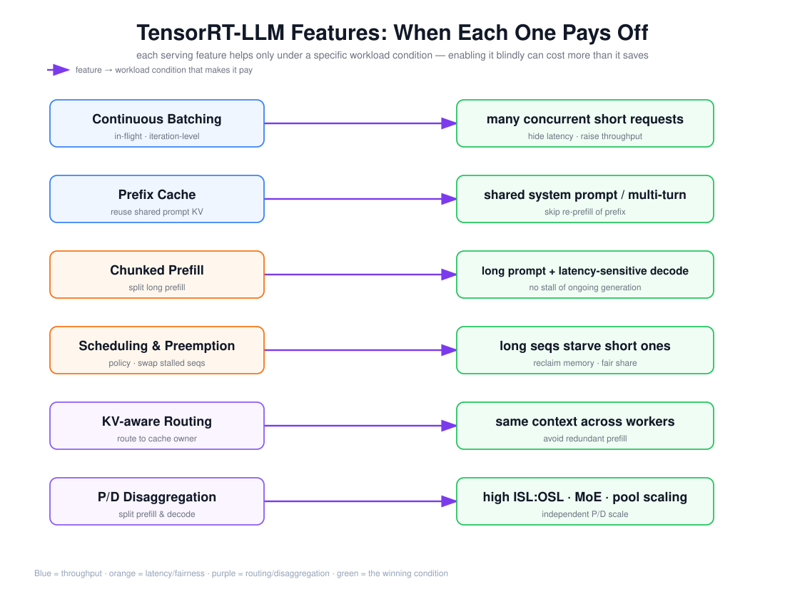

# TensorRT-LLM：Continuous Batching、Chunked Prefill、调度、抢占、KV 路由与 P/D 解耦

> 目标：逐项掌握 TensorRT-LLM 的 6 个 serving 特性——每个特性解决什么问题、在什么负载下才收益，以及「特性开错场景」的代价。

上图由 `$fireworks-tech-graph` 生成并通过 XML、箭头碰撞、语义几何和构图质量检查。它是一张「特性 → 收益条件」的映射图：左侧 6 个特性（蓝=吞吐类、橙=延迟/公平类、紫=路由/解耦类），右侧是对应「什么负载下才划算」的条件。阅读顺序如下：

1. Continuous Batching / Prefix Cache 是吞吐类，靠并发与共享前缀收益；
2. Chunked Prefill / 调度与抢占是延迟/公平类，解决长请求饿死短请求；
3. KV-aware Routing / P/D 解耦是路由/解耦类，靠缓存局部性与 P/D 资源错配收益。

---

## 1. 阅读前术语表

| 术语 | 说明 |
|---|---|
| In-flight Batching | TensorRT-LLM 的连续批处理：请求完成即离队、新请求即进队 |
| Chunked Context | 分块上下文：把长 prefill 切成多个 chunk，与 decode 交错执行 |
| Prefix Cache / KV reuse | 复用共享前缀的 KV，跳过重复 prefill |
| Scheduler Policy | 调度策略：MAX_UTILIZATION / GUARANTEED_NO_EVICT / STATIC_BATCH |
| Preemption | 抢占：换出在途序列腾显存给新请求 |
| KV-aware Routing | 按 KV 位置路由请求到已持有其前缀的 worker |
| P/D Disaggregation | prefill/decode 分离成独立 worker，经 cache transceiver 传 KV |
| cache transceiver | KV 传输通道，后端 UCX/NIXL/LIBFABRIC/MPI |

---

## 2. In-Flight Batching（连续批处理）

TensorRT-LLM 把 batch 抽象成「在途请求集合」，每步 Decode 后动态增减成员，而不是等整批结束。收益是吞吐：短请求结束立刻让位，GPU 每步都被填满。收益条件是**多并发短请求**——并发低时（单请求）连续批处理没有意义，反而有调度开销。

## 3. Prefix Cache / KV Cache Reuse

`--enable_kv_cache_reuse` 让引擎复用共享前缀的 KV。对比 vLLM（块粒度）和 SGLang（token 粒度），TensorRT-LLM 的复用也是块/前缀粒度的。收益条件是**请求间共享前缀高**（system prompt、多轮历史、few-shot）；前缀不重叠时缓存只有查表开销。

## 4. Chunked Prefill（分块上下文）

`--enable_chunked_context` 把一个长输入切成多个 chunk，**把 prefill chunk 与 decode step 交错**。这解决的是「长 prefill 饿死短请求」：一个 100k token 的 prefill 若一次性算完，会阻塞所有在途 decode 很久，抬高别人的 ITL。切块后，长 prefill 的每一小块和别的请求的 decode 轮流跑。收益条件是**长输入与延迟敏感的 decode 共存**；全是短请求时切块只有额外开销。

## 5. 调度与抢占

调度策略 `--scheduler_policy`：

- `MAX_UTILIZATION`：每步尽量多排请求，吞吐优先，可能饿死长请求；
- `GUARANTEED_NO_EVICT`：在途请求不被抢占，公平但可能阻塞新请求；
- `STATIC_BATCH`：静态批处理，退化到「整批同进同出」。

抢占则是在显存不够时换出低优先级/长序列（交换到 CPU 或重算），腾 KV 块给新请求。收益条件是**长短序列混杂、显存紧张**；独占单请求时抢占用不上。

## 6. KV-aware Routing

在 disaggregated 或多 worker 部署里，`trtllm-serve disaggregated` 的前端以 KV 路由模式运行，跟踪各 worker 持有哪些 KV 块，把请求路由到**前缀命中最多的 worker**，避免跨节点重复 prefill。收益条件是**同一上下文被多个 worker 服务**（缓存局部性强）；命中率低时路由判断只是额外一跳。NVIDIA 的实测（DeepSeek V3.2 WideEP，2P+2D）里约 44% 缓存命中率、57% 输入 token 来自共享前缀时，KV-aware routing 省掉了大量冗余长上下文 prefill。

## 7. P/D Disaggregation 与收益条件

TensorRT-LLM 的 disaggregated serving 用 `TRTLLMPrefillWorker` + `TRTLLMDecodeWorker`（`decode_first` 策略），经 `cache_transceiver_config`（UCX/NIXL/LIBFABRIC/MPI）传 KV，`trtllm-serve disaggregated` 编排 context/generation 两类 server 并暴露 OpenAI 兼容端点。收益条件与文档 05 一致：**高 ISL:OSL、MoE、需要 P/D 独立扩缩**时才划算；短输入、低命中、网络差的场景传输开销反噬。

---

## 8. 本文结论

TensorRT-LLM 的 6 个特性可以归成三类、各配一条「何时收益」的判断：**吞吐类**（连续批处理、前缀缓存）靠并发与共享前缀；**延迟/公平类**（chunked prefill、调度/抢占）靠长短混杂与显存紧张；**路由/解耦类**（KV-aware routing、P/D 解耦）靠缓存局部性与 P/D 资源错配。核心教训是：**这些特性没有「默认更好」，只有「匹配负载才更好」**——开错场景的 chunked prefill 或 P/D 解耦，会比不开更慢。

---

## 参考资料

- [TensorRT-LLM 文档](https://nvidia.github.io/TensorRT-LLM/)
- [TensorRT-LLM — Disaggregated Serving (Beta)](https://nvidia.github.io/TensorRT-LLM/features/disagg-serving.html)
- [NVIDIA Dynamo — KV-Aware Routing](https://docs.dynamo.nvidia.com/dynamo/dev/cli/kv-aware-routing/overview)
- [NVIDIA Dynamo — Disaggregated Serving](https://docs.dynamo.nvidia.com/dynamo/dev/cli/disaggregated-serving/overview)
