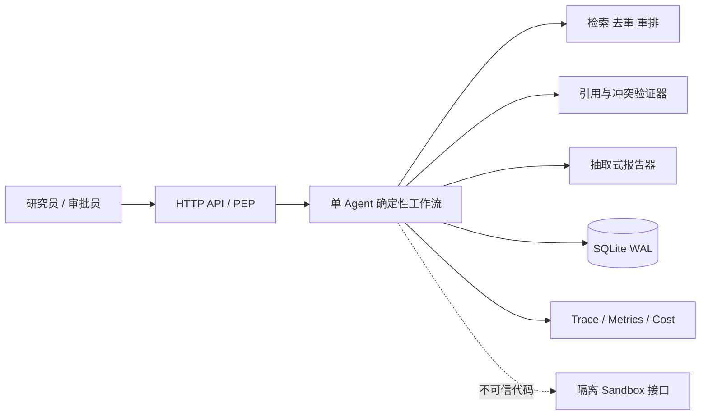
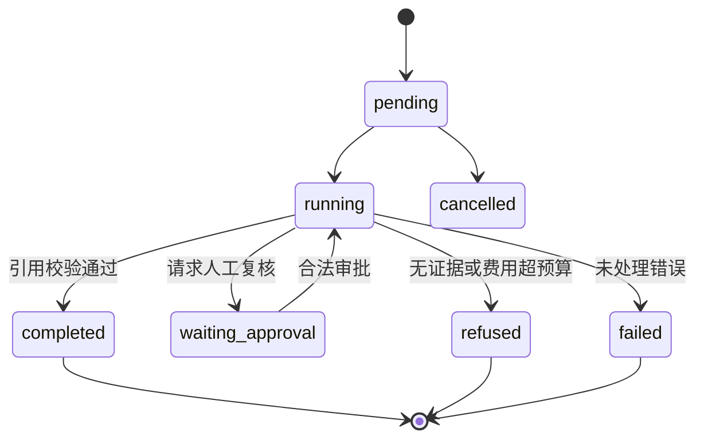
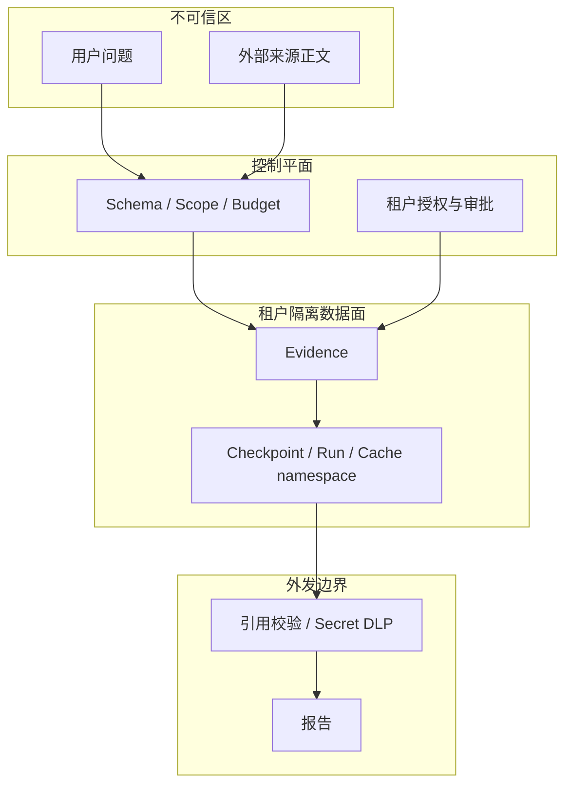

# 架构与状态设计

## 组件图

单 Agent 已覆盖当前固定流水线，不引入 Manager、Handoff 或多 Agent 通信。报告器是可替换边界，但存储、授权、预算、引用和审批均由确定性运行时强制。

## 状态图

每次迁移以 `(tenant_id, run_id, version)` 做 CAS，并在同一事务写入 Checkpoint。恢复从已持久化证据继续，不重放检索；审批是独立、可审计的记录。

## 数据流与信任边界

不变量：外部正文的 `instruction_authority=none`；身份来自受信网关而非来源文本；所有持久查询包含 `tenant_id`；Trace 默认不采集问题、正文、报告或凭证；没有引用的报告不能完成。

## 核心 Schema

- Run：租户、用户、问题、状态、当前步骤、版本、预算、费用、证据、冲突、报告；
- Evidence：稳定引用 ID、来源 ID/URL/标题、脱敏摘录、分数、结构化声明；
- Checkpoint：完整 Run 快照和单调版本；
- Idempotency：租户、业务键、规范化请求哈希、run_id；
- Span：trace/span ID、低基数名称、耗时、状态和无正文属性。

长期记忆选择“自建基线”：当前不写入跨任务事实，只保存租户隔离的运行记录，因此避免把未经确认的网页事实升级为长期记忆。若未来加入记忆，必须单独实现 provenance、版本、删除和污染恢复测试。

