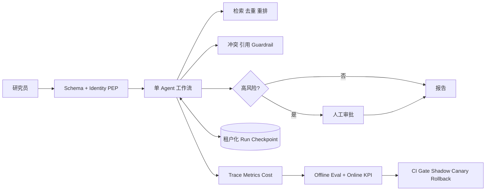

# 可上线深度研究 Agent：强化证据与作品集

本目录把 [第 15 周运行时](../15-w/README.md) 从“能运行”提升为“可展示、可回归、可解释上线边界”的作品集。目标用户是基于授权材料生成带引用草稿的研究员；系统不自动联网、不自动发布，也不把模型或 Prompt 当权限边界。

## 结果先行

在 2026-08-20 的本机确定性基线上：55 个业务任务各运行 3 次，共 165 Trial，成功率均值 100%、任务间标准差 0；平均延迟 0.545 ms、标准差 0.206 ms、p95 0.839 ms，平均估算费用 US$0.0000229。21/21 安全攻击和 10/10 故障场景通过。以上只证明本地抽取式基线，不代表开放域模型质量或生产 SLO。

四类消融给出清晰决策：

- 双路 Agent 代理没有提升这组任务的质量，却把成本提高到 2 倍、平均延迟由 0.672 ms 增至 1.061 ms，因此保留单工作流；
- 不安全硬截断将成本降至约 26%，但证据支持率从 100% 降到 0%，因此上下文压缩必须由任务级回归验证；
- 风险路由把 40% 任务送人工审批，自动完成率为 60%；这是安全边界，不应被当作普通失败；
- 10 倍重复来源压力下去重保持质量与费用不变，平均延迟仅从 0.620 ms 增至 0.651 ms。

## 架构



状态仍由 `15-w` 运行时强制：`pending → running → completed/refused`，高风险路径经过 `waiting_approval`；每次迁移都写 Checkpoint 并做版本 CAS。详细设计见 [系统设计评审](docs/SYSTEM-DESIGN-REVIEW.md)。

## 快速开始

只需 Python 3.11+，无第三方运行时依赖：

```bash
cd 16-w
PYTHONPATH=src:../15-w/src python3 -m unittest discover -s tests -v
PYTHONPATH=src:../15-w/src python3 -m portfolio.strengthening
PYTHONPATH=src:../15-w/src python3 -m portfolio.verify
PYTHONPATH=src:../15-w/src python3 -m portfolio.feedback
PYTHONPATH=src:../15-w/src python3 -m portfolio.release
python3 ci/run_ci.py
```

最后一条命令会运行第 15 周测试与 Eval Gate、第 16 周所有强化实验、攻击/故障集、反馈闭环、回滚演练和公开材料敏感信息扫描。完整 API 与 Docker 双实例启动方式见 [第 15 周 README](../15-w/README.md)。

## 证据索引

| 证据 | 文件 |
|---|---|
| 165 Trial、均值/波动与四类消融 | `results/strengthening.json` |
| tau3 v1.0.1 五题契约 Smoke | `results/tau3-adapter/summary.json` |
| 21 个安全攻击、10 个故障场景 | `results/security-fault.json` |
| 模拟反馈分类、抽检和回流 | `results/feedback-loop.json` |
| CI 劣化阻断、Canary 自动回滚及人工回滚 | `results/release-drill.json` |
| 技术与业务综合结论 | [技术与业务报告](docs/TECHNICAL-BUSINESS-REPORT.md) |
| 5–10 分钟演示 | [演示脚本](docs/DEMO.md) |
| 30 分钟架构评审 | [评审提纲](docs/SYSTEM-DESIGN-REVIEW.md) |
| 技术选型复核 | [技术雷达](docs/TECH-RADAR.md) |
| 120 道第一轮回答 | [面试答案索引](docs/interview/README.md) |
| 两次模拟面试 | [模拟面试索引](docs/mock-interviews/README.md) |

## 安全、性能与限制

身份参考实现校验 issuer、audience、expiry、scope 和撤销列表，只向 Agent 传结构化身份与凭证引用。长期记忆只接受已审批、有来源的事实，租户缓存/记忆支持更新、导出和整租户删除。公开材料扫描覆盖常见 API Key、云凭证、Bearer 值和邮箱形式。

当前“100%”来自合成且确定性的业务回归集，不能外推到真实用户。另已运行官方来源的 tau3 `banking_knowledge` v1.0.1 五题适配子集，5/5 只代表 Gold Action contract replay 验证通过，不是 Agent 能力分数，也不可和排行榜比较。独立 Sandbox、真实 IdP、PostgreSQL RLS、联网检索、真实模型路由和 200 个真实影子任务仍是正式上线前置条件，详见 [限制与风险](docs/LIMITATIONS-RISKS.md)。
