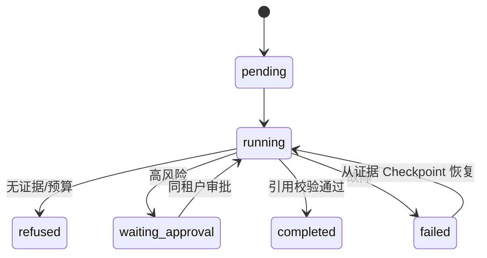

# 30 分钟资深系统设计评审

## 0–4 分钟：用户价值与边界

研究员需要从授权材料生成带引用草稿。核心 KPI 是一次通过率、任务时间、人工升级率、错误成本和单位成功任务成本。非目标是开放域自治、自动发布和任意外部写操作。

## 4–9 分钟：需求、SLO 与约束

- 质量：业务任务成功率 >=98%，引用集合正确率 100%；
- 安全：跨租户和未审批执行为零；
- 可用性：99.9%，恢复成功率 >=99%；
- 成本：单位成功任务 <= US$0.05；
- 约束：外部内容不可信、原始凭证不进模型、起步 10,000 任务/月。

## 9–15 分钟：架构和状态

同步入口完成 Schema、身份、Scope 和预算检查。单 Agent 固定工作流负责分解、检索、去重、验证、报告。每步把完整恢复状态写入租户化 Checkpoint，并以版本 CAS 防陈旧写。高风险任务进入等待审批；Evidence ID 与来源 URL 绑定，输出只能引用当前集合。



核心轨迹示例：

```json
{
  "trace_id": "synthetic-trace-01",
  "spans": [
    {"name": "plan research-agent", "status": "ok"},
    {"name": "retrieval supplied-corpus", "tenant_filter": true, "result_count": 2},
    {"name": "verify evidence", "conflict_count": 1},
    {"name": "invoke_agent report-writer", "citation_count": 2}
  ],
  "content_captured": false
}
```

## 15–20 分钟：容量与故障

10 倍峰值约 0.158 task/s，平均 5 秒时在途约 0.79，两个实例足够初始滚动替换。SQLite 达到持续 2 writes/s 或 5 GB 即迁移 PostgreSQL。故障策略涵盖重复投递、陈旧写、锁竞争、超时、中断恢复、无证据和费用终止；外部副作用未来必须增加 Effect Ledger 与补偿。

## 20–25 分钟：权衡与证据

双路代理在消融中质量不变而成本翻倍，所以不采用。硬截断让证据支持率归零，所以压缩按任务 Gate。风险路由带来 40% 人工升级，是质量/安全与自动化率的显式交换。确定性抽取器作为可复现降级路径，真实 LLM 路由须固定模型快照后另评。

## 25–28 分钟：安全与治理

OAuth/OIDC 在网关验证签名，PEP 复验 issuer/audience/expiry/scope/撤销。RBAC 与 ABAC 同时绑定租户、资源、风险和审批。外部工具结果没有指令权限。记忆要求 provenance 与审批，缓存和导出删除按租户。Trace 默认无 Prompt、正文、输出和凭证。

## 28–30 分钟：发布、风险与演进

CI 确定性测试和 Eval Gate 后进入 Shadow、5% Canary 和逐级扩量。安全硬门槛零容忍，质量下降 2 个百分点自动回滚。近期演进顺序：真实业务影子集 → 正式 OTel/IdP/Sandbox → PostgreSQL → 真实模型路由 → 官方 Benchmark；没有实验证据前不引入多 Agent。

