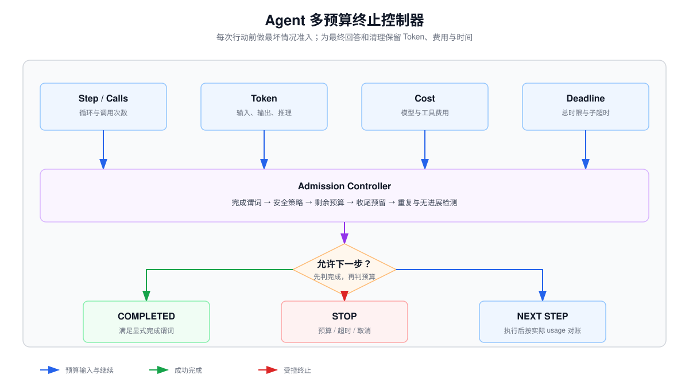

# Agent 最大步数、Token/费用预算、超时与显式完成条件



## 1. 为什么只设置最大步数不够

Agent 是带反馈的循环。一次 Step 可能包含一次模型调用、多个并行工具调用、Observation 压缩和下一轮状态更新。只限制 `max_steps=10` 仍可能出现：

- 每步输入上下文越来越长，Token 和费用爆炸；
- 某个工具单次运行很久，虽然步数很少但超时；
- 一步并行调用大量工具，绕过步数限制；
- Agent 在预算耗尽前没有机会整理结果；
- 模型输出“完成”，但业务验收条件其实没有满足。

可靠控制器需要同时维护多维预算与显式终止谓词。

## 2. 把预算建模成向量

设 Run 的预算为：

$$
B=(S, C_m, C_t, T_{in}, T_{out}, M, D)
$$

其中：

- $S$：最大 Agent Step 数；
- $C_m$：最大模型调用次数；
- $C_t$：最大工具调用次数；
- $T_{in}$：累计输入 Token 上限；
- $T_{out}$：累计输出与推理 Token 上限；
- $M$：最大货币费用；
- $D$：总体 Deadline。

每次行动消耗向量 $\Delta B_t$。只要任一硬预算不足以支付下一步和收尾预留，就不应开始下一步。

## 3. Step 的定义必须固定

推荐定义：

```text
一个 Step = 模型基于当前状态作出一次决策，随后执行该决策产生的全部受控动作，并把 Observation 写回状态。
```

如果模型一次返回三个并行 Tool Call，它们通常属于一个 Agent Step，但消耗三个工具调用额度。这样 `step_count` 和 `tool_call_count` 各自表达不同风险。

除总量之外，还应设置 `max_tool_calls_per_step`、`max_retries_total` 和 `max_repeats_per_action_fingerprint`，防止模型通过单步大扇出或底层重试绕过 `max_steps`。

失败重试是否计步也要明确：

- 模型 API 的传输级重试不增加 Agent Step，但增加模型尝试次数和时间；
- 模型收到 Observation 后重新规划，增加 Agent Step；
- 工具内部的幂等重试不增加 Step，但增加工具尝试次数；
- 换参数再次调用工具，是新 Action，应计入 Step 或工具额度。

## 4. Token 预算要做“预留”，不能事后统计

在调用模型前，已知输入 Token 估计 $I_t$，并设置最大输出 $O_t$。只有满足下式才允许调用：

$$
used_{in}+I_t \le B_{in}
$$

$$
used_{out}+O_t+R_{final} \le B_{out}
$$

$R_{final}$ 是为最终说明、错误摘要或交接信息预留的 Token。若不预留，Agent 可能把预算全用在中间步骤，最后只能突然中断。

上下文窗口是另一项约束：

$$
prompt_t + max\_output_t \le context\_window
$$

累计 Token 预算限制总成本，Context Window 限制单次调用；二者不能混为一谈。

多轮 Agent 会把历史和工具结果带入下一轮。若上下文每轮增加 $\Delta T$，累计输入成本可能近似二次增长：

$$
\sum_{t=1}^{N}T_{input}^{(t)}
\approx NT_0+\Delta T\frac{N(N-1)}{2}
$$

因此应裁剪或摘要大型 Observation、保存证据指针而非重复正文，并把当前决策状态与完整审计日志分开。

## 5. 费用预算的计算

不同模型、缓存输入、输出、推理 Token 和工具可能使用不同计价。通用估算为：

$$
cost_t=
I_t P_{in}+
I^{cached}_t P_{cached}+
O_t P_{out}+
cost_{tools,t}
$$

生产系统应保存“调用前最大费用估计”和“调用后实际 usage 费用”。准入判断使用保守上界：

$$
spent + estimated\_worst\_case + reserve_{final} \le budget_{money}
$$

价格属于动态配置，不能散落在 Prompt 或代码常量中。价格表应带供应商、模型快照、生效时间和币种版本。

## 6. 时间预算使用单调时钟与 Deadline

不要通过不断递减整数秒来管理时间，应在 Run 开始时记录单调时钟 Deadline：

```python
deadline = monotonic() + run_timeout_s
remaining = deadline - monotonic()
```

单调时钟不会因系统时间校准而跳变。每个子操作的超时应根据剩余时间动态裁剪：

```python
child_timeout = min(configured_timeout, remaining - cleanup_reserve)
```

建议同时配置：总体 Run Deadline、单次模型调用超时、单次工具超时、流式 Idle Timeout 和重试累计上限。

## 7. 完成条件必须是可判定的谓词

仅让模型输出 `done=true` 不够。应该定义：

$$
complete(state)=
goal\_satisfied(state)
\land required\_evidence(state)
\land no\_pending\_actions(state)
\land output\_valid(state)
$$

需要区分协议结束和业务完成：EOS 只表示本次生成结束；Stop Sequence 只表示客户端要求停止生成；Tool Call 表示模型要求外部动作；这些都不等于目标已经完成。模型给出的 `done=true` 也只能作为候选声明，最终应由 Runtime 的确定性谓词复核。

不同任务需要不同完成谓词：

### 信息检索任务

- 已回答所有子问题；
- 每个关键事实都有可验证来源；
- 来源时间满足新鲜度要求；
- 没有未解决的矛盾证据。

### 写操作任务

- 目标资源和动作已得到授权；
- 工具返回稳定成功回执；
- 幂等记录已落库；
- 用户需要的结果或失败说明已生成。

### 代码任务

- 请求范围内的修改已经完成；
- 指定测试或验证命令通过；
- 没有因本次修改产生的未处理错误；
- 交付物路径和验证结果已记录。

## 8. 终止原因应该是枚举，不是模糊字符串

```python
class StopReason(Enum):
    COMPLETED = "completed"
    NEEDS_USER_INPUT = "needs_user_input"
    MAX_STEPS = "max_steps"
    MODEL_CALL_BUDGET = "model_call_budget"
    TOOL_CALL_BUDGET = "tool_call_budget"
    TOKEN_BUDGET = "token_budget"
    COST_BUDGET = "cost_budget"
    DEADLINE = "deadline"
    CANCELLED = "cancelled"
    STALLED = "stalled"
    POLICY_BLOCKED = "policy_blocked"
    UNRECOVERABLE_ERROR = "unrecoverable_error"
```

这使监控、测试和用户提示可以稳定依赖状态，而不是解析自然语言。

## 9. 停止检查的优先顺序

每轮开始前建议按以下顺序检查：

1. 用户取消或系统关闭；
2. 安全/权限策略阻断；
3. 显式完成谓词；
4. 总体 Deadline；
5. 费用和 Token 硬预算；
6. 模型/工具调用额度；
7. 最大 Step；
8. 重复动作和无进展检测；
9. 下一步是否仍有足够的收尾预留。

先检查完成条件可以避免“任务已经完成，但因为刚好达到 max_steps 被错误标记失败”。取消和安全策略优先级更高，因为它们要求立即停止副作用。

## 10. 预算控制器示例

```python
from dataclasses import dataclass
from time import monotonic


@dataclass
class Budget:
    max_steps: int
    max_model_calls: int
    max_tool_calls: int
    max_input_tokens: int
    max_output_tokens: int
    max_cost_usd: float
    deadline: float
    final_token_reserve: int = 512
    cleanup_time_reserve_s: float = 2.0


def admission(state, budget, estimate):
    if state.cancel_requested:
        return "cancelled"
    if state.policy_blocked:
        return "policy_blocked"
    if state.is_complete():
        return "completed"
    if monotonic() >= budget.deadline - budget.cleanup_time_reserve_s:
        return "deadline"
    if state.steps >= budget.max_steps:
        return "max_steps"
    if state.model_calls >= budget.max_model_calls:
        return "model_call_budget"
    if state.tool_calls + estimate.tool_calls > budget.max_tool_calls:
        return "tool_call_budget"
    if state.input_tokens + estimate.input_tokens > budget.max_input_tokens:
        return "token_budget"
    if (
        state.output_tokens
        + estimate.max_output_tokens
        + budget.final_token_reserve
        > budget.max_output_tokens
    ):
        return "token_budget"
    if state.cost_usd + estimate.max_cost_usd > budget.max_cost_usd:
        return "cost_budget"
    if state.is_stalled():
        return "stalled"
    return None
```

这里的 `estimate` 在动作发生前计算。调用结束后再用 API 返回的实际 usage 对账。

## 11. 无进展与循环检测

最大步数是最后防线，应该更早识别 Stalled：

### 重复调用检测

对工具名和规范化参数计算指纹：

$$
fingerprint=hash(tool,canonical\_json(args))
$$

连续出现相同指纹且 Observation 没有变化，说明循环。

### 状态进展检测

定义可度量进展，例如：

- 未完成子目标数量下降；
- 新增独立证据；
- 不确定字段减少；
- 环境状态版本发生预期变化；
- 测试失败数下降。

连续 $k$ 步没有进展时，应换策略、请求用户输入或终止，而不是继续消耗预算。

## 12. 软预算与硬预算

硬预算绝不能超过；软预算用于提前降级：

| 阶段 | 剩余预算 | 策略 |
|---|---:|---|
| 正常 | > 40% | 完整规划和验证 |
| 收敛 | 15%–40% | 停止扩展探索，只解决必要子目标 |
| 收尾 | < 15% | 禁止新探索，整理已有证据并生成结果 |
| 耗尽 | 不足以支付安全收尾 | 返回明确终止状态 |

这比在预算归零时突然截断更可控。

## 13. 预算耗尽时应该返回什么

不要伪装成成功，也不要只返回“失败”。建议输出：

```json
{
  "status": "incomplete",
  "stop_reason": "cost_budget",
  "completed_subgoals": ["确认订单存在"],
  "pending_subgoals": ["确认退款资格"],
  "verified_evidence": ["tool-call-3"],
  "side_effects": [],
  "resume_token": "run_abc:step_4",
  "user_action_required": "提高预算或缩小问题范围"
}
```

如果已经发生副作用，必须单独列出其确认状态，不能因为最终回答失败就隐去。

## 14. 推荐的状态模型

```text
RUNNING
  ├─ COMPLETED
  ├─ NEEDS_USER_INPUT
  ├─ BUDGET_EXHAUSTED
  ├─ DEADLINE_EXCEEDED
  ├─ CANCELLED
  ├─ STALLED
  ├─ POLICY_BLOCKED
  └─ FAILED
```

`NEEDS_USER_INPUT` 是可恢复暂停，不应与失败混为一谈；`BUDGET_EXHAUSTED` 表示控制器正常工作，也不等同于异常崩溃。

## 15. 测试矩阵

| 场景 | 期望终态 | 关键断言 |
|---|---|---|
| 第一步直接满足目标 | COMPLETED | 不再调用工具 |
| 最后一步恰好完成 | COMPLETED | 完成优先于 max_steps |
| 达到最大步数仍未完成 | BUDGET_EXHAUSTED | 无额外模型调用 |
| 输入 Token 超预算 | BUDGET_EXHAUSTED | 请求未发出 |
| 剩余费用不足最坏情况 | BUDGET_EXHAUSTED | 保留收尾额度 |
| 工具超过子超时 | 可恢复或 DEADLINE | Observation 含稳定错误码 |
| 用户取消与工具完成竞争 | CANCELLED 或 COMPLETED | 状态唯一且可解释 |
| 重复同一动作 | STALLED | 不等到 max_steps 才停止 |
| 缺少必要用户参数 | NEEDS_USER_INPUT | 保留可恢复状态 |
| 已产生写操作后预算耗尽 | BUDGET_EXHAUSTED | 回执中列出副作用状态 |

预算初值应从正常任务拓扑推导，并根据 Trace 中成功任务的 P50/P95 Step、Token、工具延迟、错误率以及预算增加后的边际成功率持续校准。预算越大不必然越好：更长轨迹也会增加错误累积、上下文污染和副作用风险。

## 16. 设计检查清单

- [ ] Step、模型调用和工具调用分别计数；
- [ ] Token、费用和时间在调用前做最坏情况预留；
- [ ] 使用单调时钟和全局 Deadline；
- [ ] 为最终答复和清理保留资源；
- [ ] 完成条件由确定性谓词复核；
- [ ] 终止原因使用稳定枚举；
- [ ] 重复动作和无进展可以提前终止；
- [ ] 预算耗尽返回部分进展、证据和副作用状态；
- [ ] 取消会传播到模型流、工具任务和队列；
- [ ] Trace 能还原每次预算估计、实际消耗和停止决策。

## 参考资料

- [OpenAI Responses API Reference](https://developers.openai.com/api/reference/resources/responses)
- [OpenAI：Rate limits](https://developers.openai.com/api/docs/guides/rate-limits)
- [OpenAI：Function calling](https://developers.openai.com/api/docs/guides/function-calling)
- [ReAct: Synergizing Reasoning and Acting in Language Models](https://arxiv.org/abs/2210.03629)

## 准确性边界

Token 计数、推理 Token 的暴露方式、工具计费和价格因供应商与模型而异。本文给出的是预算控制结构，不提供会快速过时的具体价格。实现时应以 API 返回的实际 usage 对账，并给估算误差留出安全余量。
