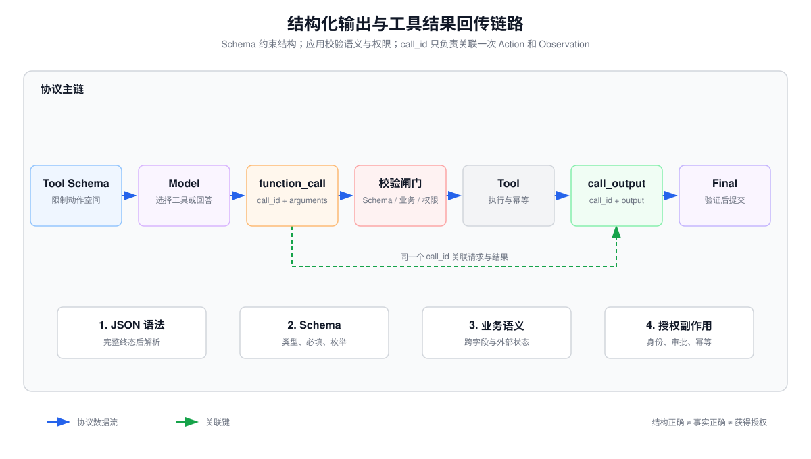

# JSON Schema、结构化输出校验与 Tool Call ID 结果回传



## 1. 核心结论

可靠的工具调用不是“让模型输出一段看起来像 JSON 的文本”，而是一条由多层约束组成的协议：

```text
模型约束生成
  → JSON 解析
  → JSON Schema 校验
  → 业务语义校验
  → 权限与副作用检查
  → 工具执行
  → 使用原 call_id 回传结果
  → 模型基于 observation 继续生成
```

必须区分四个概念：

| 概念 | 保证什么 | 不保证什么 |
|---|---|---|
| JSON 语法 | 字符串能被 JSON Parser 解析 | 字段是否齐全、类型是否正确 |
| JSON Schema | 结构、类型、枚举、范围等约束 | 订单是否存在、用户是否有权限 |
| Structured Outputs | 模型输出服从受支持的 Schema | 业务事实正确、操作安全、工具成功 |
| Tool Call ID | 一次工具请求与结果之间的相关性 | 幂等性、分布式事务、重试去重 |

因此，即使开启 `strict: true`，应用仍必须保留业务校验、鉴权、幂等和错误处理。

## 2. JSON Schema 是数据协议，不只是格式提示

JSON Schema 把“希望模型返回什么”变成机器可检查的契约。一个适合工具调用的 Schema 应尽量收窄状态空间：

```json
{
  "type": "object",
  "properties": {
    "order_id": {
      "type": "string",
      "pattern": "^ORD-[0-9]{6}$"
    },
    "action": {
      "type": "string",
      "enum": ["query", "cancel"]
    },
    "reason": {
      "type": ["string", "null"]
    }
  },
  "required": ["order_id", "action", "reason"],
  "additionalProperties": false
}
```

这里的关键设计不是字段名称，而是：

- 使用 `enum` 代替任意字符串动作，阻止模型发明未知操作；
- 使用 `pattern`、`minimum`、`maximum`、`minItems` 等缩小参数范围；
- 所有对象都设置 `additionalProperties: false`，避免静默接受拼错或注入字段；
- 将“可选字段”建模成必填的 `null` 联合类型，使状态显式；
- 把互斥状态建模为清晰的判别字段，而不是依赖自然语言解释；
- Schema 名称和版本进入日志，便于回放和兼容性分析。

OpenAI Structured Outputs 支持 JSON Schema 的一个子集。当前官方文档要求根节点是对象、字段全部列入 `required`、对象设置 `additionalProperties: false`；根节点不能直接使用 `anyOf`。实现前应以目标模型和当前文档核对支持范围。

## 3. 三种输出方式的边界

### 3.1 普通文本后自行解析

模型返回文本，应用尝试提取 JSON。这种方式兼容性最好，但失败面最大：Markdown Fence、前后解释、截断、非法转义和字段漂移都要自行处理。它适合原型，不适合直接驱动副作用工具。

### 3.2 JSON Mode

JSON Mode 主要保证输出是合法 JSON，不保证符合具体 Schema。合法的下面结果仍可能违反业务协议：

```json
{"order": 42, "operation": "do_anything"}
```

因此 JSON Mode 之后仍要执行完整 Schema 校验；发生截断、拒答或内容过滤时还可能没有完整对象。

### 3.3 Structured Outputs

Structured Outputs 将解码限制到受支持 Schema。它适合两类场景：

- `text.format`：模型最终回答需要成为结构化数据；
- Function Calling：模型需要选择应用工具并产生强类型参数。

结构正确不等于语义正确。例如 `order_id="ORD-000001"` 可以满足正则，但订单可能不存在；`action="cancel"` 可以满足枚举，但当前用户可能无权取消。

## 4. 校验应分成四层

### 第一层：传输与 JSON 语法

检查响应是否完整、编码是否正确、是否到达终态，再进行 JSON 解析。流式参数必须等到 `arguments.done` 或对应 Item 完成事件后再执行；单个 delta 通常不是完整 JSON。

### 第二层：Schema 校验

验证类型、必填字段、枚举、长度、格式、范围和多余字段。Schema 校验失败应作为可观察的协议错误记录，而不是悄悄补默认值后执行工具。

### 第三层：业务语义校验

JSON Schema 无法独立表达很多跨字段和外部状态约束，例如：

- `start_time < end_time`；
- 商品属于当前租户；
- 退款额不超过已支付金额；
- 文件路径位于允许目录；
- URL 域名在白名单内；
- 状态机允许从 `PAID` 转到 `REFUNDING`。

### 第四层：授权与副作用校验

校验调用者身份、权限、审批状态、幂等键、资源版本和风险等级。这一层必须由确定性代码完成，不能把“用户似乎同意了”当成授权证明。

## 5. Tool Call ID 到底解决什么

Responses API 的 `function_call` Item 包含：

- `id`：该输出 Item 自身的标识；
- `call_id`：工具调用与回传结果的关联键；
- `name`：工具名；
- `arguments`：JSON 编码的参数字符串。

相关标识符不能混为一谈：

| 字段 | 作用 |
|---|---|
| `response.id` | 标识一次模型响应 |
| `function_call.id` | 标识响应中的这个输出 Item |
| `call_id` | 关联工具调用与之后的 `function_call_output` |
| `output_index` | 在流式事件中定位输出项，不应作为持久关联键 |
| 业务 `idempotency_key` | 由应用生成，用于阻止写操作被重复执行 |

执行完成后，应用回传：

```json
{
  "type": "function_call_output",
  "call_id": "call_12345xyz",
  "output": "{\"status\":\"ok\",\"temperature\":18}"
}
```

这里必须复用模型产生的同一个 `call_id`。它回答的是：“这份 Observation 属于哪一次 Action？”

### Call ID 不是幂等键

如果网络在工具执行成功后断开，Agent 重试同一个业务动作，仅凭 `call_id` 未必能阻止重复扣款或重复发信。生产系统应另设业务幂等键，例如：

```text
idempotency_key = hash(run_id, step_id, tool_name, canonical_arguments)
```

工具服务在持久化层记录幂等键和结果。相同键再次到达时返回原结果，而不是重复执行副作用。

## 6. 多工具调用与并发关联

一次模型响应可能包含零个、一个或多个 `function_call`。实现时不能只读取 `response.output[0]`。正确过程是：

1. 遍历全部输出 Item；
2. 过滤 `type == "function_call"`；
3. 分别解析和校验每个参数；
4. 判断工具之间是否可安全并行；
5. 为每个调用保存独立的 `call_id → execution record`；
6. 将每个结果用原 `call_id` 回传。

并行只适用于无依赖或明确可交换的动作。两个读操作通常可以并行；“创建订单”与“支付订单”存在数据依赖，不能仅因模型同时返回就并行执行。

## 7. 建议的工具执行记录

```python
from dataclasses import dataclass
from typing import Any, Literal


@dataclass
class ToolExecution:
    run_id: str
    step_id: int
    call_id: str
    tool_name: str
    raw_arguments: str
    validated_arguments: dict[str, Any] | None
    status: Literal[
        "received", "invalid", "denied", "running", "succeeded", "failed"
    ]
    idempotency_key: str | None
    output: dict[str, Any] | None
    error_code: str | None
```

这份记录同时服务于审计、重放、错误恢复和费用归因。日志中应避免写入密钥、完整个人信息或工具返回的敏感正文。

## 8. 一个最小而完整的处理循环

```python
import json


def handle_model_output(response, registry, validator, authorize):
    next_input = list(response.output)

    for item in response.output:
        if item.type != "function_call":
            continue

        if item.name not in registry:
            result = {"ok": False, "error": "UNKNOWN_TOOL"}
        else:
            try:
                args = json.loads(item.arguments)
                validator[item.name](args)          # Schema + 业务约束
                authorize(item.name, args)          # 身份、权限、审批
                value = registry[item.name](**args) # 工具仍需自行鉴权
                result = {"ok": True, "data": value}
            except json.JSONDecodeError:
                result = {"ok": False, "error": "INVALID_JSON"}
            except ValidationError as exc:
                result = {
                    "ok": False,
                    "error": "INVALID_ARGUMENTS",
                    "details": exc.safe_details,
                }
            except PermissionError:
                result = {"ok": False, "error": "PERMISSION_DENIED"}
            except Exception:
                result = {"ok": False, "error": "TOOL_FAILED"}

        next_input.append({
            "type": "function_call_output",
            "call_id": item.call_id,
            "output": json.dumps(result, ensure_ascii=False),
        })

    return next_input
```

错误结果也应结构化回传，让模型有机会换参数、换工具、向用户澄清或显式失败。不要把内部堆栈、数据库连接串或敏感记录交给模型。

推荐使用稳定的错误信封，而不是只返回一段自然语言：

```json
{
  "ok": false,
  "error": {
    "code": "INVALID_ORDER_ID",
    "message": "order_id does not exist",
    "retryable": false,
    "field": "order_id"
  }
}
```

`code` 供程序分支和统计使用，`message` 帮助模型解释，`retryable` 由编排器决定是否允许重试。模型不能自行把永久错误改判为可重试错误。

## 9. 失败状态必须是协议的一部分

| 状态 | 是否执行工具 | 建议处理 |
|---|---:|---|
| 模型拒答 | 否 | 识别 refusal，向用户说明或转人工 |
| 输出因 Token 上限截断 | 否 | 标记 incomplete；不要尝试执行半个 JSON |
| Schema 不支持 | 否 | 开发期失败，修正 Schema |
| 参数校验失败 | 否 | 回传稳定错误码，限制修复次数 |
| 权限不足 | 否 | 不允许模型反复猜参数绕过权限 |
| 工具暂时失败 | 视幂等性 | 有界重试并使用退避 |
| 工具已成功但回传失败 | 不应盲目重做 | 先按幂等键查询原执行结果 |

## 10. 测试清单

- 合法单工具调用能够正确回传；
- 未知工具名被拒绝；
- 缺字段、多字段、错误枚举和越界数值被拒绝；
- 语法合法但业务非法的参数被拒绝；
- 两个并行调用的 `call_id` 不串结果；
- 工具失败被转换成稳定错误协议；
- 重放同一幂等键不会重复产生副作用；
- 截断参数和未完成流不会触发工具；
- refusal 与普通结构化结果被分开处理；
- 日志可以通过 `run_id / step_id / call_id` 重建完整轨迹。

## 参考资料

- [OpenAI：Structured model outputs](https://developers.openai.com/api/docs/guides/structured-outputs)
- [OpenAI：Function calling](https://developers.openai.com/api/docs/guides/function-calling)
- [JSON Schema 官方文档](https://json-schema.org/docs)

## 准确性边界

本文示例采用 OpenAI Responses API 当前的 Item 和 `call_id` 语义。不同供应商可能使用 `tool_call_id`、消息数组或其他关联字段；实现时必须以对应 API Schema 为准。Structured Outputs 的受支持 JSON Schema 子集也可能演进，应在上线前核对官方文档并用真实请求做契约测试。
