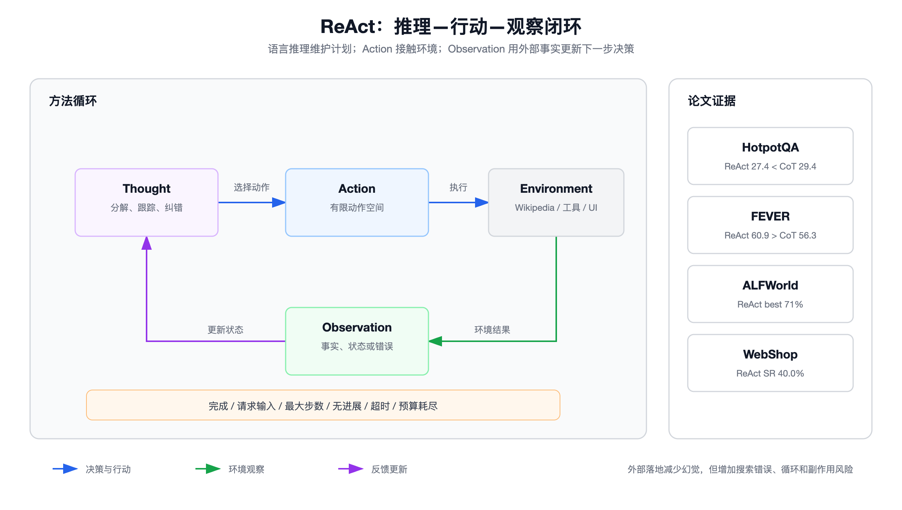

# ReAct：方法、实验与“推理—行动—观察”循环



## 1. 论文解决了什么问题

ReAct（Reasoning and Acting）由 Yao 等人在 2022 年提出，后发表于 ICLR 2023。论文观察到两条此前常被分开研究的路线：

- Chain-of-Thought 让语言模型产生中间推理，但不能主动获取外部事实或改变环境；
- Acting / Policy 让模型执行动作，但缺少显式的目标分解、状态追踪和异常处理。

ReAct 的核心不是“先写一份完整计划”，而是在轨迹中交错产生语言推理与环境动作，使每次观察都能修正下一步决策。

## 2. 形式化描述

在时刻 $t$，Agent 收到环境观察 $o_t\in\mathcal{O}$，历史上下文为：

$$
c_t=(o_1,a_1,\ldots,o_{t-1},a_{t-1},o_t)
$$

普通策略直接选择环境动作：

$$
a_t\sim\pi(a_t\mid c_t),\quad a_t\in\mathcal{A}
$$

ReAct 将动作空间扩展为环境动作与语言思考的并集：

$$
\hat{\mathcal{A}}=\mathcal{A}\cup\mathcal{L}
$$

其中 $\mathcal{L}$ 是自由形式语言空间。模型既可以产生不会直接改变环境的 Thought，也可以产生由环境执行的 Action。环境只对 Action 返回 Observation。

工程上可把一轮写成：

```text
Thought: 当前已知什么、缺什么、下一步为何有信息增益
Action:  tool_name({validated_arguments})
Observation: {trusted envelope + untrusted payload}
```

然后重复，直到产生 `Finish` 或触发外部终止条件。

## 3. Thought 在论文中承担的功能

论文中的 Thought 不是统一长度的解释，而是按需出现，主要承担：

- 分解问题和建立子目标；
- 从 Observation 中提取关键信息；
- 使用常识、比较或算术推理；
- 跟踪已经完成的子目标和环境状态；
- 发现检索失败后改写查询；
- 综合证据并决定何时结束。

对于 HotpotQA 和 FEVER，轨迹采用密集的 Thought–Action–Observation 交替；对于 ALFWorld、WebShop 这类动作可能很多的任务，Thought 更稀疏，只在规划、异常或状态切换处出现。这个差异很重要：ReAct 不是要求每个微动作前都输出冗长思考。

现代生产系统也不应把私有推理过程直接展示给最终用户。更合适的实现是保存结构化的“决策摘要、证据引用、子目标状态和下一动作原因”，而不是依赖或泄露完整内部 Chain-of-Thought。

## 4. 论文实验设置

论文主要使用冻结的 PaLM-540B，通过少量人工编写的轨迹进行 In-Context Learning。

### 知识密集型任务

- **HotpotQA**：多跳问答，仅提供问题，不提供支持段落；
- **FEVER**：事实验证，标签为 SUPPORTS、REFUTES 或 NOT ENOUGH INFO；
- 工具是一个受限 Wikipedia API：`search[entity]`、`lookup[string]`、`finish[answer]`；
- HotpotQA 使用 6 个 ReAct Few-shot 示例，FEVER 使用 3 个；
- 基线包括 Standard、CoT、CoT-SC、Act-only 以及组合方法。

### 交互式决策任务

- **ALFWorld**：文本化家庭环境，包含导航、拿取、加热、清洁等长程任务；在 134 个未见评测游戏上测试；
- **WebShop**：基于 118 万真实产品和 1.2 万条人类指令构建的购物环境，在 500 条测试指令上评估；
- ALFWorld 使用两条上下文轨迹的不同排列构造 6 组 Prompt；WebShop 使用 One-shot ReAct。

## 5. 关键实验结果

### HotpotQA 与 FEVER

| 方法 | HotpotQA EM | FEVER Accuracy |
|---|---:|---:|
| Standard | 28.7 | 57.1 |
| CoT | 29.4 | 56.3 |
| CoT-SC | 33.4 | 60.4 |
| Act | 25.7 | 58.9 |
| ReAct | 27.4 | 60.9 |
| CoT-SC → ReAct | 34.2 | 64.6 |
| ReAct → CoT-SC | 35.1 | 62.0 |

这里不能简单总结成“ReAct 全面优于 CoT”：

- FEVER 上 ReAct 为 60.9，优于 CoT 的 56.3；
- HotpotQA 上 ReAct 为 27.4，略低于 CoT 的 29.4，也低于 CoT-SC；
- ReAct 与 CoT-SC 组合在两项任务上取得更高结果，说明外部检索与灵活的内部推理具有互补性。

论文对 HotpotQA 轨迹进行人工错误分析：CoT 成功轨迹中的假阳性/幻觉比例高于 ReAct（14% 对 6%）；在 CoT 失败样本中，幻觉占 56%，而采样到的 ReAct 失败样本中对应项为 0%。但 ReAct 的推理错误更多，常见原因包括重复此前 Thought/Action、无法跳出循环，以及检索没有返回有效信息。

### ALFWorld

最佳 ReAct Trial 的总体成功率为 71%，高于最佳 Act 的 45% 和最佳 BUTLER 的 37%；即使最差 ReAct Trial（48%）也高于两者最佳结果。论文强调 Thought 对子目标分解、完成状态追踪和常识位置推断的帮助。

### WebShop

| 方法 | Average Score | Success Rate |
|---|---:|---:|
| Act | 62.3 | 30.1 |
| ReAct | 66.6 | 40.0 |
| IL | 59.9 | 29.1 |
| IL + RL | 62.4 | 28.7 |
| Human Expert | 82.1 | 59.6 |

ReAct 相比此前最佳自动方法取得约 10 个百分点的绝对成功率提升，但仍明显落后于人类。这说明 ReAct 改善了导航和决策，却没有消除长程探索与查询改写的困难。

## 6. 为什么交错循环有效

### 推理帮助行动

Thought 把隐式策略拆成可维护的子目标，使 Agent 能解释“为什么现在要调用这个工具”。这尤其适合稀疏奖励和长轨迹：没有中间状态时，模型容易忘记已经完成什么或反复执行同一动作。

### 行动帮助推理

Action 把内部猜测转换为可观察证据。新的 Observation 可以否定旧计划，降低仅依赖参数记忆造成的幻觉，并允许处理时效性信息。

### 观察构成闭环反馈

Observation 不是简单附加上下文，而是下一次状态转移的输入：

$$
s_{t+1}=U(s_t,a_t,o_{t+1})
$$

如果实现中没有显式状态更新，轨迹只是越来越长的文本，模型仍可能忽略关键 Observation。

## 7. 从论文 Prompt 到生产 Agent

论文的文本轨迹适合研究，但生产实现应把边界结构化：

```json
{
  "step": 4,
  "goal": "verify the launch year",
  "known_facts": [
    {"claim": "A launched in 1998", "source": "tool:search", "confidence": 0.9}
  ],
  "next_action": {
    "tool": "lookup",
    "arguments": {"entity": "A", "term": "launched"}
  },
  "completion": {"done": false, "reason": "missing second-hop evidence"}
}
```

生产化至少需要补上：

- Tool Schema 与参数校验；
- 工具结果的来源、时间和不可信数据边界；
- 最大步数、Token、成本和时间预算；
- 重复动作检测与无进展检测；
- 写操作审批、幂等键和补偿；
- 明确的 `success / partial / refused / budget_exhausted / failed` 终止状态；
- 完整 Trace，而不是只保存最终答案。

## 8. 典型失败模式与防护

| 失败模式 | 原因 | 工程防护 |
|---|---|---|
| 重复调用同一工具 | 状态未更新、贪心解码形成循环 | 动作指纹、重复计数、No-progress Guard |
| 检索漂移 | 查询逐步偏离原目标 | 每步保留目标与缺失证据列表 |
| Observation 污染 | 工具结果含恶意指令 | 当作数据，隔离并过滤 Prompt Injection |
| 轨迹膨胀 | 每轮把全部原始结果回填 | 摘要、结构化状态、证据指针 |
| 过早 Finish | 模型把“有答案”误作“已验证” | 显式完成谓词与证据要求 |
| 无休止探索 | 没有边际收益判断 | 最大步数、预算和信息增益阈值 |
| 副作用重复 | 超时后盲目重试 | 幂等键、状态查询和人工对账 |

## 9. 对 ReAct 的准确理解

ReAct 是一种把推理和交互交错起来的通用范式，不是一个完整的 Agent Runtime。论文证明少样本 Prompt 就能在多个任务上获得强结果，也暴露了循环、检索失败和轨迹约束带来的问题。真正可靠的系统必须把 ReAct 放进确定性的执行外壳：模型负责提出候选动作，程序负责验证、执行、计费、记录和终止。

## 参考资料

- [ReAct: Synergizing Reasoning and Acting in Language Models](https://arxiv.org/abs/2210.03629)
- [ReAct 项目主页与代码](https://react-lm.github.io/)

## 研究复现信息

```text
workflow: firecrawl-research-papers
paper: arxiv:2210.03629
verified: metadata, method, HotpotQA/FEVER, ALFWorld/WebShop, error analysis
publication: ICLR 2023
```
