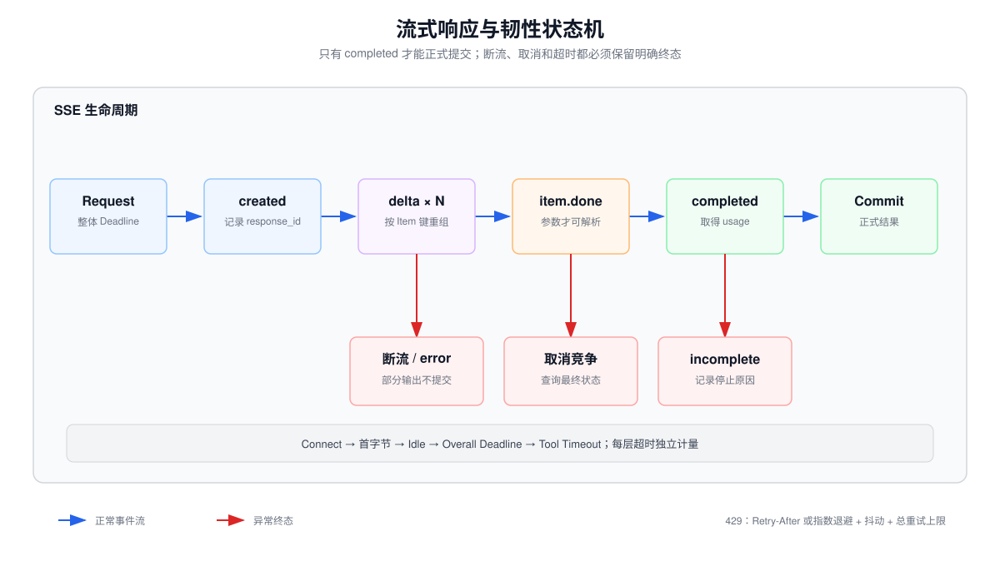

# 流式响应、超时、取消、速率限制与非确定性



## 1. 流式不是“把完整字符串切小块”

Responses API 的流是带类型的语义事件序列。常见文本生命周期包括：

```text
response.created
  → response.in_progress
  → response.output_item.added
  → response.output_text.delta × N
  → response.output_text.done
  → response.output_item.done
  → response.completed
```

这些事件对应三个嵌套层级：

```text
Response（一次 API 响应）
└── Output Item（一个输出项，例如 assistant message 或 function_call）
    └── Content Part（输出项中的一段内容，例如 output_text）
        └── Delta（这段内容本次新增的数据片段）
```

各事件的职责如下：

| 事件 | 所属层级 | 语义 |
|---|---|---|
| `response.created` | Response | 服务端已经创建响应对象并分配响应 ID；不表示模型已经产生正文 |
| `response.in_progress` | Response | 响应正在生成，期间可能进行推理、文本生成或工具调用参数生成 |
| `response.output_item.added` | Output Item | 新增一个输出项；`item.type` 可能是 `message`、`function_call` 等 |
| `response.output_text.delta` | Content Part | 当前文本内容新增一个字符串片段，消费者应按索引追加到对应缓冲区 |
| `response.output_text.done` | Content Part | 当前文本内容已经完整，不会再收到它的文本 Delta |
| `response.output_item.done` | Output Item | 当前整个输出项已经完成；但 Response 中仍可能出现其他输出项 |
| `response.completed` | Response | 整个 Response 成功终止，可以读取最终输出、状态和 Usage |

`delta` 是应用层增量字符串，不等于模型 Token，也不对应 TCP 数据包。一次 Delta 可能是一个字、半个英文单词、多个 Token 或一段标点；客户端只能把它视为需要按顺序追加的字符串片段。

例如最终文本为“北京今天晴朗。”时，事件可能按如下方式到达：

```text
response.output_item.added    item.type = "message"
response.output_text.delta    delta = "北京"
response.output_text.delta    delta = "今天"
response.output_text.delta    delta = "晴朗"
response.output_text.delta    delta = "。"
response.output_text.done     text = "北京今天晴朗。"
response.output_item.done
response.completed
```

流式传输主要降低用户感知的首字延迟，不意味着总生成时间、Token 或费用按同样比例下降。至少应分别测量：

$$
TTFT=t_{first\_delta}-t_{request\_sent}
$$

$$
T_{total}=t_{terminal\_event}-t_{request\_sent}
$$

$$
TPS=\frac{output\_tokens}{t_{last\_token}-t_{first\_token}}
$$

只记录总耗时，会掩盖“排队或首事件慢”和“模型持续生成慢”的差异。

实际事件流通常还可能包含 `response.content_part.added` 和 `response.content_part.done`。上面的生命周期省略了这两个 Content Part 边界事件，以突出文本增量的主干。

三个结束事件不能互相替代：

```text
response.output_text.done   当前一个文本 Content Part 结束
response.output_item.done   当前一个 Message 或 Tool Call Item 结束
response.completed          整个 Response 成功结束
```

因此，客户端不能在第一次收到 `response.output_text.done` 或 `response.output_item.done` 时就关闭流。一个 Response 可以包含多个 Item；正常成功应以 `response.completed` 为准。

异常路径可能出现 `response.failed` 或 `error`。消费者必须以事件类型驱动状态机，而不是假定每个 SSE `data:` 都是可直接拼接的正文。

### 流式消费者需要维护的状态

```python
state = {
    "response_id": None,
    "status": "INIT",
    "items": {},          # output_index -> item accumulator
    "text_parts": {},     # (output_index, content_index) -> string buffer
    "tool_args": {},      # output_index -> JSON string buffer
    "terminal_event": None,
}
```

必须按 `output_index`、`item_id` 和必要时的 `content_index` 聚合，因为并行工具调用会产生多个独立 Item。网络数据包边界、SSE 事件边界和 JSON Token 边界没有一致关系。

## 2. 工具参数的 Delta 不能边到边执行

流式 Function Calling 会先发送 `response.output_item.added`，随后发送多个 `response.function_call_arguments.delta`，最后发送 `response.function_call_arguments.done` 和 `response.output_item.done`。

例如参数可能被切成：

```text
{"loc
ation":"Par
is, France"}
```

中途缓冲区不是合法 JSON。安全规则是：

1. Delta 只用于 UI 展示或缓冲；
2. 收到 Done 事件后再解析完整参数；
3. 解析后再做 Schema、业务与权限校验；
4. 只有校验全部通过才执行工具。

对写工具尤其不能“看到足够参数就抢跑”，否则后续 Delta 可能改变收件人、金额或其他关键字段。

工具调用场景还要区分“模型这一轮结束”和“业务动作结束”。典型流程是：

```text
模型流式生成 function_call
  → response.function_call_arguments.done
  → response.output_item.done
  → response.completed
  → Host 校验参数并执行工具
  → Host 携带匹配的 call_id 回传 function_call_output
  → 发起下一轮 Response
  → 模型根据工具结果生成最终回答
```

这里第一个 `response.completed` 只表示模型已完整给出 Tool Call，并不表示工具已经执行，更不表示整个 Agent 任务已经完成。Agent 的显式完成条件通常应是：工具结果已经回传，并且后续模型响应产生最终消息且不再要求调用工具。

## 3. 完成、失败和连接断开是不同状态

| 现象 | 能否认定生成完成 | 建议处理 |
|---|---:|---|
| 收到 `response.completed` | 是 | 提交缓冲区并记录 usage |
| 收到 `response.incomplete` | 否 | 检查 `incomplete_details`，保留可诊断的部分结果 |
| 收到 `response.failed` / `error` | 否 | 记录错误分类，按策略重试或失败 |
| 客户端主动取消 | 否 | 停止消费；传播取消到下游 |
| TCP/SSE 断开且无终止事件 | 未知 | 视为结果不完整，不直接展示为完整回答 |
| 已收到部分文本但超时 | 否 | 可标记 partial，仅用于诊断或明确的部分展示 |

“连接断开”意味着客户端不知道最终状态，并不严格等于服务端停止计算。对于可能触发副作用的后续步骤，未知状态必须进入对账或幂等恢复流程。

### 部分输出的提交边界

UI 可以即时显示 Delta，但正式业务记录应等到成功终态并通过校验后再提交：

```text
Streaming Preview：允许追加、撤销，并明确标记“生成中”
Commit Record：仅在 response.completed 且校验通过后写入正式结果
```

如果流在中途失败，可以展示“未完成草稿”，但不能把它标记为正式答案、解析半个 Tool JSON，或因为没有收到回执就盲目重复写操作。高风险内容还可先缓冲一个审核窗口，再逐步展示。

## 4. 超时应拆成多层截止时间

只设置一个 `timeout=30` 难以定位问题，也难以给各阶段分配预算。至少区分：

- **连接超时**：建立 TCP/TLS 连接的上限；
- **首字节/首事件超时**：等待模型开始返回的上限，直接影响 TTFT；
- **空闲读取超时**：连续多长时间没有新事件；
- **单次模型调用截止时间**：整个请求允许占用的墙钟时间；
- **工具调用超时**：每个外部动作的上限；
- **Agent 总截止时间**：包含模型、工具、退避和队列等待的端到端上限。

使用绝对 Deadline 比在每层重新给一个完整 Timeout 更可靠：

```python
remaining = deadline_monotonic - time.monotonic()
if remaining <= 0:
    raise BudgetExceeded("deadline")

call_timeout = min(tool_timeout_cap, remaining)
```

否则模型调用 30 秒、工具调用 30 秒、重试再 30 秒，会悄悄突破用户以为的 30 秒总 SLA。

## 5. 取消必须传播

取消不是简单 `break` 流读取循环。一个健壮的调用链需要传播取消信号：

```text
用户关闭页面
  → HTTP handler / task 被取消
  → 停止读取模型流
  → 取消尚未开始的工具任务
  → 对运行中的可取消工具发送 abort
  → 对不可取消写操作记录“状态未知”，之后对账
```

还要区分客户端停止消费、传输连接中断和服务端任务取消。关闭页面或中断 SSE 只证明客户端不再接收，不能据此假设服务端已经停止计算、费用为零或写操作没有发生。若 API 支持显式取消，应发出取消请求并查询最终状态，同时处理“任务在取消生效前已经完成”的竞态。

取消后的数据处理规则：

- 不把未完成缓冲区缓存成正常响应；
- 不自动重试非幂等写操作；
- 保留 Trace ID、最后事件序号和已知调用 ID；
- 若业务需要恢复，使用检查点从安全边界继续，而不是重放整个历史。

## 6. 速率限制是多维约束

常见的四个速率限制指标是：

| 缩写 | 全称 | 含义 |
|---|---|---|
| RPM | Requests Per Minute | 每分钟允许发起的最大请求数 |
| RPD | Requests Per Day | 每天允许发起的最大请求数 |
| TPM | Tokens Per Minute | 每分钟允许处理的最大 Token 数 |
| TPD | Tokens Per Day | 每天允许处理的最大 Token 数 |

这些限制需要同时满足，任一维度先耗尽都可能触发 `429 Too Many Requests`。例如某模型限制为 `RPM = 100`、`TPM = 20,000`：

- 如果每次请求平均消耗 1,000 Token，TPM 最多支持约 20 次请求/分钟，因此瓶颈是 TPM；
- 如果每次请求平均消耗 100 Token，TPM 理论上支持 200 次请求/分钟，但 RPM 只允许 100 次，因此瓶颈是 RPM。

所以吞吐规划不能只看请求数：

$$
\text{effective throughput}
\le
\min\left(
L_{RPM},
\frac{L_{TPM}}{\mathbb{E}[T_{in}+T_{out}]}
\right)
$$

其中 $\mathbb{E}[T_{in}+T_{out}]$ 表示单次请求输入与输出 Token 总量的期望值。具体哪些 Token 计入额度、缓存 Token 如何计算、限制是否由多个模型共享，由服务商、模型和账户等级决定，应以控制台及响应头为准。

### 推荐的客户端调度

1. 入队时估算输入与最大输出 Token；
2. 同时从本地请求桶和 Token 桶预留容量；
3. 容量不足时排队，而不是先把请求打到 `429`；
4. 收到真实 Usage 后修正预留差额；
5. 使用响应头校准本地限流器；
6. 按租户隔离配额，避免单个用户耗尽全局额度。

响应头可提供请求和 Token 的 limit、remaining、reset 信息；临时 `429` 还可能包含 `Retry-After`。正确策略是：

1. 优先遵守合法的 `Retry-After`；
2. 否则使用指数退避并加入随机抖动；
3. 同时限制重试次数和总重试时间；
4. 计算 SDK 已有重试，避免双层重试放大流量；
5. 不重试额度、计费、权限等需要人工处理的错误；
6. 记住失败请求也可能消耗速率额度。

带 Full Jitter 的一次等待可写为：

$$
d_k \sim U\left(0,\min(d_{max},d_0 2^k)\right)
$$

若 100 个 Worker 都固定等待相同秒数，它们会在重置点形成新的惊群；Jitter 用于打散这个同步峰值。

## 7. 重试矩阵必须考虑幂等性

| 失败类型 | 读操作 | 幂等写操作 | 非幂等写操作 |
|---|---|---|---|
| 连接前失败 | 通常可重试 | 可重试 | 谨慎可重试 |
| 429 / 503 | 有界退避 | 使用幂等键后重试 | 默认不自动重试 |
| 读取中断 | 可重新请求但输出可能变化 | 先查询操作状态 | 进入人工或对账流程 |
| 参数验证失败 | 不原样重试 | 不原样重试 | 不原样重试 |
| 权限失败 | 不重试 | 不重试 | 不重试 |

“模型请求是读操作”不代表整个 Agent Step 可安全重试：该 Step 之前可能已成功发送邮件、创建工单或扣款。

## 8. 非确定性来自多层系统

即使 Temperature 很低，也不能把一次模型调用当成纯函数：

- 采样和数值并行可能造成输出差异；
- 模型快照、路由和服务实现可能演进；
- 工具返回的数据随时间变化；
- 并行工具完成顺序不同会改变上下文；
- 重试会在新时间点重新采样；
- 上下文截断、缓存命中和隐藏状态管理可能不同。

因此测试应验证**不变量**，而不是整段字符串逐字相等：

- 输出满足 Schema；
- 工具名属于 Allowlist；
- 参数满足业务边界；
- 最终状态属于预期集合；
- 最大调用次数和成本没有突破；
- 关键事实有证据支持。

需要高可复现性时，固定模型版本、提示、工具快照、数据时间点和采样参数，并记录完整 Trace；仍应允许语义等价的差异。

## 9. 可观测性字段

每次请求至少记录：

- `trace_id`、客户端请求 ID、服务端请求 ID 和模型快照；
- `ttft_ms`、`total_latency_ms`、`stream_idle_max_ms`；
- 输入、输出、推理与缓存 Token；
- 终止事件、`incomplete_reason`、取消来源和取消结果；
- 重试次数、累计退避时间和速率限制等待时间；
- `call_id`、工具名、参数摘要、幂等键、工具延迟和结果状态；
- Schema 校验失败率以及同一测试集的成功率、费用和延迟分布。

## 10. 测试清单

- Delta 被任意分片后仍能正确重组；
- 两个并行 Tool Call 的参数不会串流；
- 流在首事件前、正文中间和终态前断开时都有明确状态；
- Idle Timeout 与 Overall Deadline 分别生效；
- 用户取消能够传播到模型请求、队列和工具任务；
- `429` 遵循 `Retry-After`，无该 Header 时使用带抖动退避；
- SDK 重试和应用重试不会相乘形成重试风暴；
- 部分输出不会被提交成完成结果；
- 多次相同输入使用结构与语义断言，而不是脆弱的全文匹配。

## 参考资料

- [Streaming API responses](https://developers.openai.com/api/docs/guides/streaming-responses)
- [Function calling：Streaming](https://developers.openai.com/api/docs/guides/function-calling#streaming)
- [Rate limits](https://developers.openai.com/api/docs/guides/rate-limits)
- [API Overview：Debugging requests](https://developers.openai.com/api/reference/overview#debugging-requests)

## 准确性边界

超时和取消的默认行为取决于 SDK、HTTP 客户端与部署环境；生产实现应显式配置并通过故障注入验证。速率限制数值会随服务商、模型和账户等级变化，应读取当前控制台与响应头，而不是写死示例额度。
