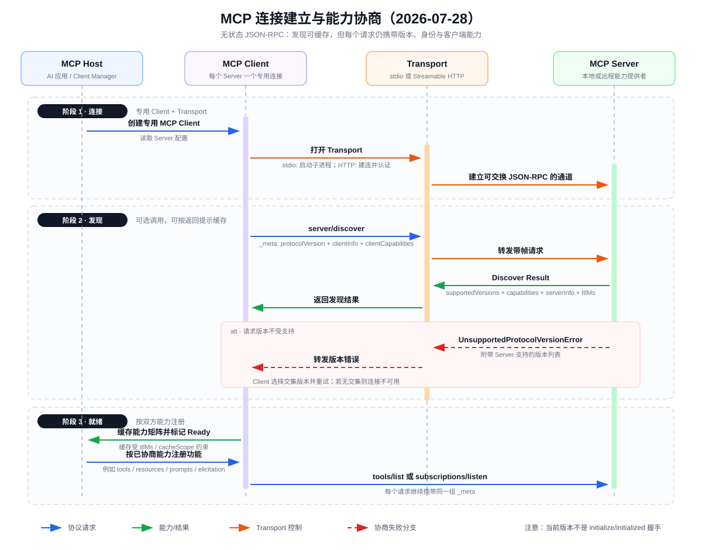

 # MCP 架构、连接与能力协商

> 阅读对象：[MCP Architecture（2026-07-28）](https://modelcontextprotocol.io/docs/2026-07-28/learn/architecture)  
> 本文按官网当前版本整理。该版本采用无状态请求元数据与 `server/discover`，不要与旧版 `initialize → notifications/initialized` 生命周期混用。

## 一、先给出核心结论

MCP（Model Context Protocol）不是 Agent 框架，也不是让模型直接访问外部系统的“魔法接口”。它是一套基于 JSON-RPC 2.0 的上下文交换协议，规定 AI 应用如何发现并调用外部能力，以及双方如何描述版本、能力、输入和结果。

这篇架构文档最重要的内容可以压缩为八点：

1. **Host 负责统筹，Client 负责连接，Server 负责提供能力。** 一个 Host 可以连接多个 Server，但通常为每个 Server 创建独立的 MCP Client。
2. **协议分为数据层和传输层。** 数据层规定 JSON-RPC 方法与语义；传输层负责通道、消息帧、流式传输和认证。
3. **MCP 是无状态协议。** Server 不能假设版本和客户端能力只在连接开始时声明一次；每个请求都要携带与本次处理相关的 `_meta`。
4. **`server/discover` 用于集中发现。** 它一次返回 Server 支持的协议版本、能力、身份和缓存提示，但 Client 调用它是可选的。
5. **能力协商是双向的。** Client 声明自己能承接什么，Server 声明自己提供什么；Host 只能启用双方共同支持且自身策略允许的功能。
6. **Server 侧核心 Primitives 是 tools、resources、prompts；Client 侧核心能力是 elicitation。** `sampling` 和 `logging` 在 2026-07-28 版本中已弃用。
7. **工具调用真正发生在 Host 侧运行时。** LLM 只生成结构化调用意图；Host 校验、路由到 MCP Client，Client 再向 Server 发出 `tools/call`。
8. **通知是显式订阅且尽力而为。** 收到列表变化通知后仍要重新调用 `tools/list`；断线期间可能丢事件，因此不能只依赖通知维持缓存一致性。

## 二、三个参与者及职责边界

| 参与者 | 主要职责 | 不应承担的职责 |
|---|---|---|
| MCP Host | 管理多个 Client；维护统一能力注册表；把工具描述交给 LLM；执行权限、审批、预算与上下文策略 | 不应把 Server 的能力声明直接当作授权，也不应无校验执行模型参数 |
| MCP Client | 与一个 Server 建立专用通信关系；封装 JSON-RPC；发送请求、关联响应、维护发现结果与订阅 | 不负责决定用户意图，也不应自行扩大 Host 授权范围 |
| MCP Server | 暴露 tools、resources、prompts；处理请求并返回结构化结果；按能力支持通知 | 不等于 LLM，也不负责整个 Agent Loop 或最终用户体验 |

例如 VS Code 同时接入本地文件系统 Server 和远程 Sentry Server 时，VS Code 是 Host；它会创建两个独立 Client，分别维护对应 Server 的通信与能力状态。这种一对一 Client 关系有助于隔离协议版本、认证信息、订阅和错误。

## 三、两层架构：协议语义与通信机制解耦

### 3.1 数据层

数据层建立在 JSON-RPC 2.0 之上，关心的是“消息是什么意思”：

- 请求、响应、错误和无需响应的通知；
- 协议版本、双方身份和能力声明；
- tools、resources、prompts、elicitation 等 Primitives；
- 列表变更通知、进度和缓存等通用机制。

### 3.2 传输层

传输层关心的是“消息如何到达”：

- **stdio**：Host 通常启动本地 Server 子进程，通过标准输入输出交换消息；适合单个本地 Client，进程边界本身不是安全边界。
- **Streamable HTTP**：Client 使用 HTTP POST 发送消息，可结合 SSE 接收流式内容或服务器事件；适合远程、多个 Client 的场景。认证可以采用 Bearer Token、API Key 或自定义 Header，官方建议通过 OAuth 获取令牌。

两层解耦意味着：切换 stdio 与 HTTP 不应改变 `tools/list`、`tools/call` 等方法的业务语义。但“认证成功”只说明某个主体可以访问传输端点，不等于它已经获得调用任意工具的业务授权。

## 四、连接建立与能力协商时序图

### 4.1 阶段一：建立通信关系

1. Host 读取一个 Server 的配置，并为它创建专用 MCP Client。
2. Client 打开对应 Transport：stdio 场景通常启动子进程；Streamable HTTP 场景建立可认证的远程通信路径。
3. Transport 使 Client 与 Server 能交换 JSON-RPC 消息。

此时只能说“通道可用”，不能说“能力协商完成”。Transport 解决的是可达性、帧和认证；Server 究竟支持 tools、resources 还是通知，要由数据层说明。

### 4.2 阶段二：发现版本、身份和能力

Client 可以先发送 `server/discover`。请求的 `_meta` 至少涉及以下三类信息：

| `_meta` 字段 | 含义 | 为什么每次请求都需要 |
|---|---|---|
| `io.modelcontextprotocol/protocolVersion` | 本次请求采用的协议版本 | Server 无需依赖连接内的历史握手即可解释请求 |
| `io.modelcontextprotocol/clientInfo` | Client 名称和版本，通常应发送 | 用于兼容性判断、诊断和审计，而非用户身份授权 |
| `io.modelcontextprotocol/clientCapabilities` | Client 对本次请求相关能力的声明 | Server 可判断 Client 能否处理 elicitation 等反向能力 |

发现响应集中给出：

- `supportedVersions`：Server 可接受的协议版本；
- `capabilities`：Server 支持的 Primitives 以及相应子能力；
- `serverInfo`：Server 名称与实现版本；
- `ttlMs`、`cacheScope`：发现结果的缓存新鲜度和复用范围提示。

如果请求版本不受支持，Server 返回 `UnsupportedProtocolVersionError` 并附带支持的版本。Client 应从双方版本集合中选择交集后重试；没有交集时，应把该连接判定为不可用，而不是猜测一个版本继续调用。

一个容易忽略的细节是：**Server 必须实现 `server/discover`，但 Client 不一定先调用它。** Client 可以直接发送其他请求，并在收到版本错误后降级重试。集中发现的价值是减少试错，并一次得到身份、能力和缓存信息。

### 4.3 阶段三：按交集启用功能

Client Manager 缓存发现结果，Host 根据能力交集注册功能。例如：

- 只有 Server 声明 `tools`，Host 才应调用 `tools/list`；
- 只有 Server 的 tools 能力声明列表变化支持，Client 才有理由订阅相应事件；
- 只有 Client 声明 `elicitation`，Server 才能安全发起 `elicitation/create`；
- 即使协议双方都支持某能力，仍要通过 Host 的权限、用户确认、租户策略和预算约束。

随后 Client 可以调用 `tools/list` 获取具体工具，或调用 `subscriptions/listen` 建立通知流。后续请求仍继续携带 `_meta`；发现结果可缓存不等于协议从无状态变成有状态。

## 五、能力声明不等于具体能力清单

需要区分两层“发现”：

1. `server/discover` 回答“Server 支持哪一类协议能力”，例如是否支持 tools、resources、prompts 以及工具列表变化通知。
2. `tools/list` 回答“当前有哪些具体工具”，返回工具的 `name`、`title`、`description` 和 `inputSchema` 等元数据。

因此，`capabilities.tools` 不能代替 `tools/list`。前者是协议特性开关，后者是动态业务目录。工具清单还可以携带自己的 `ttlMs` 和 `cacheScope`，其生命周期不必与 Server 发现结果一致。

`inputSchema` 是 JSON Schema，用于约束工具参数。Host 至少要在调用前完成：

- 工具名必须存在于当前注册表；
- 参数通过 JSON Schema 校验；
- 调用满足应用侧权限和审批规则；
- 超时、取消、最大并发和结果大小受到限制。

这些校验属于 Host 的执行治理，不能只依赖模型“按格式输出”，也不能因为 Server 提供了 Schema 就默认 Server 可信。

## 六、从 LLM 决策到 MCP 工具执行

MCP 与模型推理的典型衔接如下：

1. Host 从多个 Server 调用 `tools/list`，形成带命名空间或路由信息的统一工具注册表。
2. Host 把允许使用的工具描述提供给 LLM。
3. LLM 返回“调用某工具及其参数”的结构化意图；模型本身不执行网络请求或本地命令。
4. Host 校验工具名、参数、权限与预算，再把调用路由给对应 MCP Client。
5. Client 发送 `tools/call`，Server 执行业务逻辑并返回 `content` 等结果。
6. Host 把结果作为 observation 放回模型上下文，由模型生成最终答案或决定下一步。

所以，“模型会调用 MCP 工具”是一种工程简称。更准确的说法是：**模型选择工具，Host 执行工具，MCP 标准化 Host 与能力提供者之间的交换。** MCP 不规定 Host 必须如何裁剪上下文、选择模型、限制 Agent 步数或生成最终回答。

## 七、动态通知与缓存一致性

通知不是默认广播，而是显式订阅：

1. Server 在能力中声明某类变化通知可用，例如 tools 的 `listChanged`。
2. Client 通过长生命周期的 `subscriptions/listen` 指定希望接收的通知类型。
3. Server 先发送订阅确认，并在 `_meta` 中携带订阅 ID。
4. 工具列表变化时，Server 发送 `notifications/tools/list_changed`；JSON-RPC 通知没有 `id`，因此不期待响应。
5. Client 收到事件后重新调用 `tools/list`，刷新本地注册表。

通知采用 best-effort 语义，网络重连期间可能丢失。因此稳健客户端应组合使用：缓存 TTL、重连后的主动刷新、必要的周期轮询，以及通知触发的快速刷新。通知告诉客户端“可能变了”，列表请求才给出“现在是什么”。

## 八、信任边界与实现风险

### 8.1 Server 返回的内容是不可信输入

资源文本、工具结果和 Prompt 模板都可能包含错误数据或提示注入内容。Host 应区分系统策略与外部内容，限制外部文本对工具权限、目标和完成条件的影响。

### 8.2 能力声明是兼容性信息，不是授权证明

`capabilities` 只表达协议支持。真实授权仍取决于凭证作用域、用户身份、租户、工具级 ACL 和应用策略。对有副作用的工具，应在执行点进行鉴权和必要的用户确认。

### 8.3 缓存提示不是永久承诺

`ttlMs` 是新鲜度提示，`cacheScope` 约束可复用范围。Host 不应跨用户、跨租户误用缓存；通知丢失时，也要能靠过期与刷新恢复一致性。

### 8.4 连接隔离不能替代资源隔离

每个 Server 一个 Client 有利于错误、认证和能力状态隔离，但 Server 进程本身仍可能访问文件、网络或凭证。部署时还需要操作系统权限、容器、密钥管理和出站网络策略。

## 九、阅读后的整体理解

MCP 架构的真正价值不是“增加一个工具调用格式”，而是建立稳定的协议边界：Host 不需要理解每个外部系统的私有 SDK，Server 也不需要绑定某个模型厂商。双方通过版本化的 JSON-RPC 方法、能力声明、Schema 和通知机制协作。

当前架构尤其强调无状态：每个请求都具备独立解释所需的版本和客户端能力，集中发现只是可缓存的优化。这让负载均衡、重试和远程 HTTP 部署更自然，但也把更多责任交给 Host——它必须正确维护能力矩阵、参数校验、权限、缓存和失败恢复。

从 Agent 工程视角，可以把边界概括为：

> LLM 负责提出行动意图；Host 负责决策治理和执行编排；MCP Client/Server 负责标准化能力发现与调用；Transport 负责把消息可靠、可认证地送达。

## 参考资料

- [MCP Architecture](https://modelcontextprotocol.io/docs/2026-07-28/learn/architecture)
- [Server Discovery](https://modelcontextprotocol.io/specification/2026-07-28/server/discover)
- [Statelessness](https://modelcontextprotocol.io/specification/2026-07-28/basic/index#statelessness)
- [Subscriptions](https://modelcontextprotocol.io/specification/2026-07-28/basic/patterns/subscriptions)
- [Caching Utility](https://modelcontextprotocol.io/specification/2026-07-28/server/utilities/caching)
