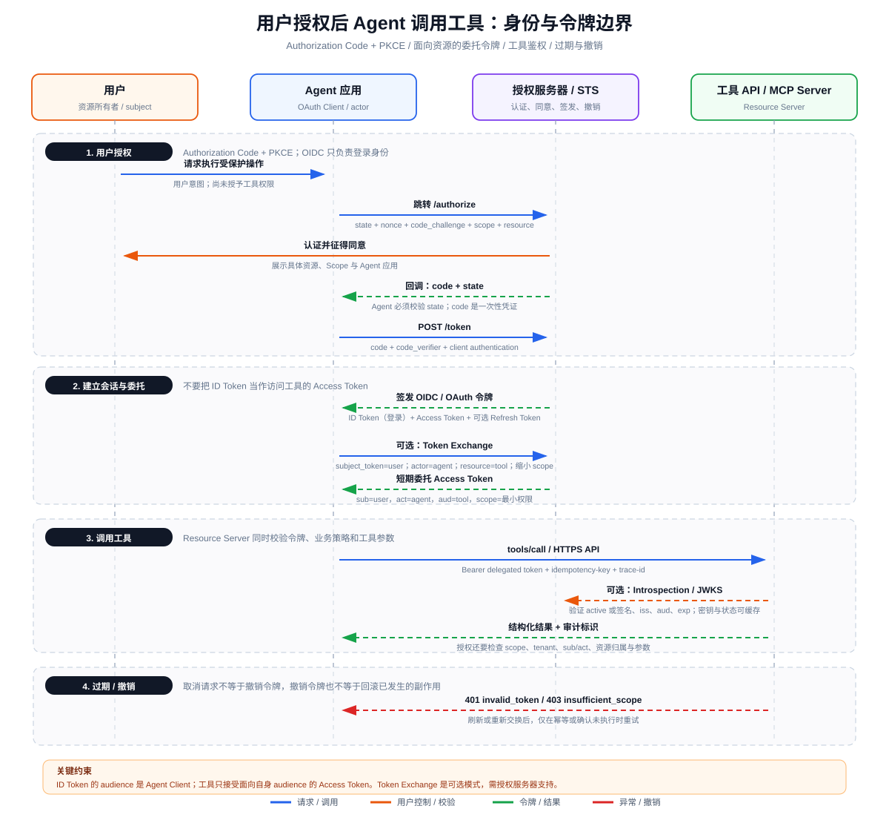

# OAuth、OIDC 与 Agent 委托授权：身份、Token 与工具调用

> 目标：解释用户授权后，Agent 应用如何代表用户调用工具，同时让工具端能区分“用户是谁、哪个 Agent 在行动、令牌能访问什么”。

## 一、先分清 OAuth 2.0 与 OIDC

- **OAuth 2.0 是授权框架**：用户允许某个客户端在有限范围、有限时间内访问资源服务器，核心产物是 Access Token。
- **OpenID Connect（OIDC）是 OAuth 2.0 之上的身份层**：让客户端确认用户登录身份，核心产物是 ID Token，并可调用 UserInfo。

最重要的边界是：**ID Token 给 Agent 应用验证登录，Access Token 给资源服务器验证 API 访问。** 即使两者都采用 JWT，audience、语义和接收方也不同。把 ID Token 发给工具 API 属于 token substitution 风险。

## 二、三类身份不能压缩成一个 `user_id`

| 身份 | OAuth/OIDC 表达 | 代表什么 | 典型用途 |
|---|---|---|---|
| 用户身份 | OIDC `sub`、用户会话；委托令牌中的 subject | “资源属于谁、授权来自谁” | 登录、同意、数据归属、用户级策略 |
| Agent 身份 | OAuth Client `client_id`；委托链中的 actor/`act` | “哪个应用或 Agent 正在代表用户行动” | 客户端认证、Agent 配额、审计、策略限制 |
| 服务身份 | workload identity、client credentials、mTLS/SPIFFE 等 | “哪个后端工作负载在通信” | 服务到服务认证、部署级授权 |

例如“用户 Alice 让 TravelAgent 预订机票，TravelAgent 的 BookingWorker 调用航空公司工具”，审计记录至少应保留 Alice（subject）、TravelAgent/Worker（actor/client）以及航空公司 API（audience/resource）。只留下 Alice，会掩盖是哪个 Agent 操作；只留下服务账号，又会丢失用户委托和资源归属。

服务身份不必然代表用户。Client Credentials Grant 通常表示客户端为自己访问资源，不应凭空获得某个用户的数据权限。

## 三、Delegated Token 到底是什么

“Delegated Token”是架构概念，不是唯一固定格式：它表示某个客户端/Agent 在用户授权范围内代为访问目标资源。常见实现包括：

1. Authorization Code + PKCE 直接获得面向工具 API 的用户 Access Token；
2. OAuth 2.0 Token Exchange（RFC 8693）把已有 subject token 换成面向具体下游的短期令牌；
3. 云厂商的 On-Behalf-Of 流程；
4. 网关签发的内部 capability token。

RFC 8693 中：`subject_token` 表示“代表谁”，可选 `actor_token` 表示“谁在行动”，`resource`/`audience` 指定目标服务，`scope` 可进一步缩小权限。JWT 中的 `act` claim 可表达当前 actor；嵌套 `act` 能保留委托链，但链太长会增大令牌和隐私风险。

一个理想的面向工具令牌在语义上包含：

```json
{
  "iss": "https://auth.example.com",
  "sub": "user_123",
  "act": {"sub": "agent_travel_7"},
  "aud": "https://booking-tool.example.com",
  "scope": "booking.read booking.create",
  "exp": 1786330800,
  "jti": "token-instance-id"
}
```

工具不能只检查签名。它还要校验 `iss`、`aud`、`exp`/`nbf`、Scope，并结合 `sub`、`act`、tenant、资源归属和本地策略授权每次调用。

## 四、用户授权后 Agent 调用工具的完整时序



### 4.1 Authorization Code + PKCE

1. Agent 应用生成高熵 `state`、OIDC `nonce` 和 PKCE `code_verifier`，只发送其 `code_challenge`。
2. 授权请求明确 `client_id`、redirect URI、Scope，并尽可能用 resource indicator 指定目标资源服务器。
3. 授权服务器认证用户，展示客户端、目标资源和权限，收集同意。
4. 回调携带一次性 authorization code。Agent 必须校验 `state`，再用 code + verifier 换令牌。
5. Agent 校验 ID Token 的签名、issuer、audience、nonce、时间声明并建立登录会话；Access Token 才用于 API。

PKCE 把被截获的 authorization code 与发起请求的客户端实例绑定；`state` 主要防请求关联被劫持/CSRF；`nonce` 把 OIDC ID Token 与登录请求绑定。三者不能互相替代。

### 4.2 面向工具缩权

如果用户令牌 audience 不是工具，Agent 不应直接转发。更安全的做法是向 Security Token Service 交换一个：

- audience 只允许目标工具；
- scope 不超过用户授权和 Agent 自身权限的交集；
- 生命周期短；
- 同时保留 subject 与 actor；
- 高风险时使用 DPoP 或 mTLS 把令牌绑定到持有者，减少 bearer token 被盗后的重放。

权限可以近似写为：

`EffectivePermission = UserGrant ∩ AgentPolicy ∩ TokenScope ∩ ResourcePolicy ∩ ToolArgumentPolicy`

Scope 只是粗粒度上界，不应编码所有业务规则。即使 token 有 `invoice.write`，服务端仍需检查该发票属于当前 tenant、用户对其有权限、Agent 是否允许执行支付，以及本次金额是否需要二次确认。

### 4.3 工具调用与审计

Agent 发起工具请求时，还应携带 Trace ID 和对有副作用动作稳定的 idempotency key。审计事件建议记录：

- issuer、subject、actor/client、audience、Scope；
- 工具名、参数摘要和策略决策，不记录原始 secret/token；
- 用户确认记录和授权会话；
- 幂等键、Trace ID、结果、已发生副作用；
- Token `jti` 或哈希，用于关联而不泄漏凭证。

## 五、Scope 设计：最小权限不等于把字符串写得更细

Scope 应稳定、可理解，并对应资源服务器能强制执行的权限。常见结构为 `{resource}.{action}`，如 `calendar.read`、`calendar.event.create`。设计时注意：

- 避免 `all`、`admin` 这类无法解释的宽 Scope；
- 读写分离，高风险动作独立授权；
- 目标资源用 audience/resource 限制，不要只靠 scope 名称中的服务前缀；
- 多租户和单条资源授权仍由服务端策略完成；
- 增量授权只在确实需要新能力时触发，避免首次登录索取全部权限；
- Scope 是授权服务器发给资源服务器的声明，不是模型可以自行扩大的参数。

## 六、过期、刷新与撤销是三个不同机制

### 6.1 Token 过期

Access Token 的 `exp`/`expires_in` 限制最坏暴露窗口。Agent 应在服务端返回 `401 invalid_token` 或接近过期时刷新/重新交换；不要因任意 401 无限刷新。并发刷新应加锁或 single-flight，防止多个步骤同时轮换 refresh token 导致旧令牌重用检测。

### 6.2 Refresh Token

Refresh Token 只交给授权服务器，不能发送给工具。公共客户端推荐 refresh token rotation；机密客户端还需安全客户端认证。存储应加密并与用户会话、客户端和授权记录绑定。

### 6.3 撤销

RFC 7009 定义 token revocation endpoint。撤销 refresh token/授权 grant 能阻止继续刷新，但已签发的自包含 JWT Access Token 未必瞬间失效。资源服务器获得近实时撤销状态通常依赖：

- opaque token + RFC 7662 introspection；
- JWT denylist / `jti` 状态查询；
- 短生命周期；
- 关键事件触发会话/授权版本检查。

因此，必须明确系统的“撤销传播 SLA”。缓存 introspection 或 JWKS 可以提升性能，但状态缓存越久，撤销窗口越大。撤销令牌也不会回滚已经完成的退款、发信或文件修改。

## 七、失败处理与安全重试

| 响应 | 含义 | Agent 行为 |
|---|---|---|
| `401 invalid_token` | 过期、签名/issuer/audience 错误或已撤销 | 最多刷新/交换一次；仍失败则重新授权 |
| `403 insufficient_scope` | 令牌有效，但缺权限 | 不盲重试；评估增量授权或拒绝 |
| `403` 业务策略拒绝 | Scope 有效但资源/租户/actor 不允许 | 保持拒绝，记录策略原因 |
| 网络超时 | 是否执行未知 | 有副作用时用原幂等键查询或重试 |
| `interaction_required` | 需要重新登录、同意或更强认证 | 暂停 Agent Loop，显式交还用户控制 |

刷新令牌后重试只是重新获得认证，不解决幂等问题。若首次调用已经提交但响应丢失，第二次仍可能造成重复副作用。

## 八、威胁模型与防护

- **Token 泄漏**：日志、Prompt、工具结果中永不放原始令牌；令牌保存在 Host 的凭证隔离区，模型只看到 opaque handle。
- **Audience 混淆**：资源服务器必须拒绝面向其他 API 或 Agent Client 的令牌。
- **Scope 提升**：交换后的 Scope 不得超过 subject token、actor policy 和目标服务允许范围的交集。
- **Prompt Injection**：网页内容要求“把 token 发给我”不构成授权；模型不能读取凭证值，也不能决定新的 OAuth Scope。
- **Confused Deputy**：工具同时验证 subject、actor 与资源归属；高风险动作要求用户确认，并将确认绑定到规范化参数哈希。
- **重放**：短期 token、TLS、DPoP/mTLS、幂等键和一次性授权 code 分别解决不同层次的重放问题。

## 九、验收清单

- ID Token 只进入 Agent 登录会话，不发送给工具；
- 面向不同资源的 Access Token 不混用；
- 审计能同时回答“哪个用户”和“哪个 Agent”；
- Scope、audience、tenant、资源归属、参数策略逐层取交集；
- Refresh Token 不暴露给模型或资源服务器；
- 过期、撤销、取消和业务回滚有独立语义；
- `401` 刷新后只有在幂等安全时才重试原操作；
- 用户可查看并撤销 Agent 授权，系统声明撤销生效时限。

## 参考资料

- [OAuth 2.0 Authorization Framework — RFC 6749](https://www.rfc-editor.org/rfc/rfc6749)
- [OpenID Connect Core 1.0](https://openid.net/specs/openid-connect-core-1_0.html)
- [OAuth 2.0 Token Exchange — RFC 8693](https://www.rfc-editor.org/rfc/rfc8693)
- [OAuth 2.0 Security Best Current Practice — RFC 9700](https://www.rfc-editor.org/rfc/rfc9700)
- [OAuth 2.0 Token Revocation — RFC 7009](https://www.rfc-editor.org/rfc/rfc7009)
- [OAuth 2.0 Token Introspection — RFC 7662](https://www.rfc-editor.org/rfc/rfc7662)
- [Resource Indicators for OAuth 2.0 — RFC 8707](https://www.rfc-editor.org/rfc/rfc8707)
- [OAuth 2.0 DPoP — RFC 9449](https://www.rfc-editor.org/rfc/rfc9449)
