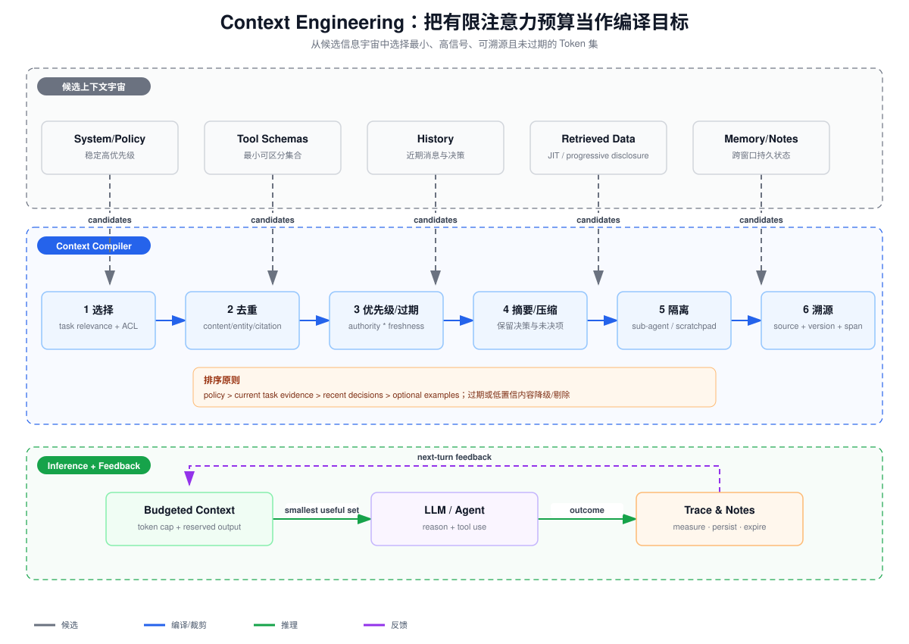

# Anthropic Context Engineering：选择、压缩、隔离与上下文治理

> 阅读对象：[Effective context engineering for AI agents](https://www.anthropic.com/engineering/effective-context-engineering-for-ai-agents)  
> 本文先还原 Anthropic 原文观点，再把选择、去重、摘要、压缩、隔离、溯源、优先级和过期组织成可实施的 Context Compiler。

## 一、核心结论

Anthropic 对 Context Engineering 的定义不是“写一个更长的 Prompt”，而是：

> 在每次模型推理前，持续策划和维护最可能产生期望行为的 Token 集合。

它覆盖 system instructions、Tool definitions、examples、message history、MCP/外部数据、memory 与当前任务状态。文章的指导原则是：在有限注意力预算中，找到**最小的、高信号的 Token 集**。

这里的“最小”不是追求 Token 数越少越好，而是删除边际价值低、重复、过期或会干扰决策的内容，同时保留目标、约束、证据、未决问题和必要操作接口。

## 二、为什么长上下文不是免费容量

即使模型的最大 Context Window 很大，也存在：

- Context rot：Token 增加时，相关信息的精确召回和利用能力下降；
- 注意力稀释：更多无关内容竞争模型有限注意力；
- 位置影响：关键信息处于长上下文中间时可能被忽略；
- 延迟和成本：Prefill Token 增加；
- 冲突：旧决策、过期文档和新事实同时存在；
- 工具歧义：过多相似 Tool definitions 增加错误选择。

Transformer 理论上允许 Token 相互注意，但“能够放入”不等于“能够同等可靠地利用”。Context 应视为带成本和递减收益的运行时资源。

## 三、Prompt Engineering 与 Context Engineering

| 维度 | Prompt Engineering | Context Engineering |
|---|---|---|
| 主要对象 | 指令的措辞和结构 | 一次推理中的全部 Token |
| 时间 | 设计时为主 | 每个 Agent Step 动态执行 |
| 内容 | system/user Prompt | Prompt、Tools、History、Retrieval、Memory、状态 |
| 目标 | 清晰表达任务 | 在预算内选择最有用的当前状态 |
| 典型失败 | 指令模糊、格式不稳 | 过期、重复、污染、冲突、信息缺失 |

两者不是替代关系。好的指令仍是 Context 的高优先级组成部分。

## 四、Anthropic 原文的关键方法

### 4.1 正确高度的 System Prompt

文章指出两个极端：

- 把复杂 if/else 行为全部硬编码到 Prompt，脆弱且难维护；
- 只给模糊高层目标，假设模型拥有不存在的共同背景。

合适高度应提供具体目标、关键约束和判断启发，但把确定性的权限、预算、Schema 与终止条件交给代码。

Prompt 可用 Markdown heading 或 XML tag 分区，让背景、指令、工具指导和输出要求边界清晰。格式本身不是目标，减少歧义才是目标。

### 4.2 最小可用工具集

Tool definitions 也占 Context。工具太多、描述重叠时，模型面临模糊决策点。文章提出一个实用判断：

> 如果工程师都不能明确某种情形该用哪个工具，就不能期望 Agent 稳定做对。

工具返回也应 Token-efficient：

- 默认返回摘要、稳定 ID 和分页句柄；
- 需要时再通过 ID 读取详情；
- 大结果提供 head/tail/filter；
- 不重复回传调用参数和无用元数据；
- 结构化错误让 Agent 修正，而不是塞入巨大异常栈。

### 4.3 Just-in-time Retrieval

Anthropic 描述了从“推理前把所有相关内容塞入”转向 JIT：

- Context 中保留轻量引用，如路径、URL、stored query；
- Agent 使用 grep、glob、head/tail 或查询工具按需探索；
- 每一步结果帮助决定下一步；
- 通过 progressive disclosure 逐层展开。

优点是避免预加载大量可能无关内容，并减少陈旧索引问题；代价是运行时延迟和探索成本。实际常用混合策略：稳定高价值信息预加载，动态数据按需读取。

### 4.4 Compaction

长任务接近窗口上限时，把历史压缩为高保真摘要，再在新窗口继续。文章建议保留：

- 架构和业务决策；
- 尚未解决的 Bug/问题；
- 关键实现细节；
- 当前目标、进度和下一步；
- 最近仍相关的文件或 Artifact。

删除低价值内容：

- 很久以前的原始 Tool 输出；
- 已被结论覆盖的探索过程；
- 重复消息和中间格式噪声。

文章强调先优化 Recall，再优化 Precision：过度压缩丢掉微妙约束后很难恢复。

### 4.5 Structured Note-taking

Agent 把进度、目标、依赖和策略写到 Context Window 之外的 NOTES/TODO/Memory，在重置后重新加载。这不是完整聊天历史复制，而是面向未来继续工作的结构化状态。

好的笔记应区分：

~~~text
goal
completed
decisions + rationale
open_questions
failed_attempts
next_actions
source references
updated_at / expires_at
~~~

### 4.6 Sub-agent 隔离

主 Agent 保留高层计划，子 Agent 使用干净窗口完成聚焦研究，最后只返回压缩结果。这样详细搜索噪声留在子上下文，主 Agent只接收结论、证据和不确定性。

隔离的价值不仅是并行，还包括：

- 防止一个子任务的巨大 Tool 输出污染主线；
- 让不同任务使用不同 Tool/指令集合；
- 限制敏感数据传播；
- 对每个子任务独立设置预算和过期。

## 五、把八项能力实现为 Context Compiler

需要说明：Anthropic 文章没有把“选择、去重、摘要、压缩、隔离、溯源、优先级、过期”作为一张正式八步清单。下面是基于文章原则的工程化组织。

### 5.1 选择 Selection

选择函数不能只有向量相似度。候选项可评分：

~~~
utility(item, task) =
  relevance
  * authority
  * freshness
  * actionability
  * confidence
  / token_cost
~~~

先执行硬过滤：

- ACL/tenant；
- 内容安全策略；
- 已删除、已撤销；
- 不兼容版本；
- 超出时间有效区间。

再按效用和预算选择。权限永远不能作为软分数被相关性抵消。

### 5.2 去重 Deduplication

上下文重复来自：

- overlap Chunk；
- 同一事实同时出现在 History、Memory 和 Retrieved Data；
- Tool Call 参数、Tool Result、模型复述三次表达；
- 文档新旧版本并存；
- 多个子 Agent 返回相同来源。

去重层次：

1. exact hash：完全相同文本；
2. source/version/span：相同证据引用；
3. entity/fact key：相同主体-属性；
4. semantic similarity：近义重复。

近似去重不能简单保留第一条。应优先保留权限更严格、来源更权威、版本更新、证据更完整的一条，并把其他来源合并到 provenance。

### 5.3 摘要 Summarization

摘要是信息变换：原文仍可通过引用找回，但 Context 使用短表示。适合：

- 大文档概览；
- 多个 Tool Result 的归纳；
- 子 Agent 结果；
- 已结束对话阶段。

摘要必须显式标记是 derived，而不是 source of truth，并保留 source IDs、版本和覆盖范围。

### 5.4 压缩 Compaction

压缩比摘要更关注整个 Agent Trace 的续航。一个可恢复的 compaction 应保留：

~~~text
当前任务和完成定义
不可违反的系统/用户约束
已经做出的决策及原因
当前文件/资源的准确状态
未决问题和失败尝试
工具副作用与幂等句柄
引用和可重新读取的 Artifact ID
~~~

不能把“工具调用是否已经提交”压缩成一句“调用失败”；这会导致下个窗口重复扣款或重复发信。

### 5.5 隔离 Isolation

隔离单位可以是：

- 子 Agent；
- per-tool scratchpad；
- tenant/security zone；
- 内容类型；
- 敏感度级别；
- 任务阶段。

隔离后只通过明确输出 Schema 传递结论和证据。主 Agent 不应无条件合并子 Agent 全部历史。

### 5.6 溯源 Provenance

每个外部 Context Item 至少带：

~~~text
source_id / URI
source_version / content_hash
retrieved_at
span/page/section
principal/tenant or policy reference
transformation chain: source → chunk → summary
confidence
~~~

生成答案时 Claim 引用可回到具体 span。若只保存一段无来源摘要，后续无法验证、刷新或删除。

### 5.7 优先级 Priority

建议把优先级分成硬序和软序。

硬序：

~~~text
安全/系统策略 > 用户当前明确约束 > 业务不变量
~~~

软序：

~~~text
当前任务直接证据 > 最近已确认决策 > 高权威长期记忆
> 相关示例 > 探索性背景
~~~

优先级冲突不能只靠内容出现顺序。Context metadata 应记录 authority_class，Compiler 按策略装配。

### 5.8 过期 Expiration

TTL 不是唯一过期机制：

- 时间过期：缓存、临时状态；
- 版本过期：新文档/策略取代旧版本；
- 事件过期：任务完成后 scratchpad 失效；
- 条件过期：用户偏好被显式更改；
- 权限过期：Group/tenant/Token 变化；
- 置信过期：来源撤回或证据被反驳。

Context Item 可携带 valid_from、valid_to、supersedes、policy_version。读取时判定，不要等待离线清理后才停止使用。

## 六、Token 预算算法

先预留不可压缩预算：

~~~text
window
- output reserve
- system/security policy
- tool call/result overhead
- current user request
= discretionary context budget
~~~

再按类别分配软配额，例如：

| 类别 | 策略 |
|---|---|
| 当前任务证据 | 高配额，按证据充分性停止 |
| History | 近期原文 + 早期 compaction |
| Long-term Memory | Top-N，去重后装载 |
| Examples | 只选最相似且可区分行为的少量示例 |
| Tool Schemas | 动态暴露当前阶段需要的最小集合 |

装配时保留 output reserve。如果把窗口全部用于输入，模型可能无法生成完整结构化结果。

## 七、在线可观测与评估

每个 Step 记录：

- 各来源候选数、选中数、Token 数；
- 去重/过期/ACL 剔除原因；
- compaction 前后 Token 与事实保留率；
- 每个 Context Item 是否被答案引用；
- Context 中冲突事实数量；
- Tool 选择准确率；
- 答案忠实度和完成率；
- 延迟与 Prompt Cache 命中。

关键实验不是“更长还是更短”，而是在代表性任务上绘制：

~~~text
task success / faithfulness / latency / cost
vs
context tokens and composition
~~~

## 八、失败模式

- 把所有 Conversation History 永久追加；
- 只根据 Embedding 选择，不看 authority/freshness/ACL；
- 摘要覆盖旧原文，却不保留来源和版本；
- compaction 丢失未完成副作用和幂等键；
- 让子 Agent 把完整搜索轨迹回传主 Agent；
- Tool definitions 全量常驻，造成工具选择歧义；
- Memory 与当前用户明确指令冲突时仍使用 Memory；
- 只在写入时设置 TTL，读取时不检查过期；
- Prompt Cache 命中被误认为 Context 内容仍然正确。

## 九、文章核心总结

1. Context Engineering 是对推理时全部 Token 的动态治理，不只是 Prompt 措辞。
2. 长窗口仍受注意力稀释、Context rot、成本与冲突影响。
3. System Prompt 应处于具体但不僵硬的正确高度。
4. Tools 应最小、可区分且返回 Token-efficient 结果。
5. JIT Retrieval 和 progressive disclosure 让 Agent 按需展开世界。
6. 长任务依赖 compaction、结构化笔记和子 Agent 上下文隔离。
7. 最终目标始终是：最小、高信号、足以可靠完成任务的 Context。

## 十、验收清单

- [ ] 每次模型调用前都运行显式 Context 装配；
- [ ] ACL、删除和版本是硬过滤；
- [ ] History、Retrieval、Memory、Tool Result 跨来源去重；
- [ ] 摘要/压缩保留决策、未决项、副作用状态和 provenance；
- [ ] 子 Agent 只回传结构化结论、证据和不确定性；
- [ ] 优先级区分 authority 与 relevance；
- [ ] 读取时执行过期/撤销判断；
- [ ] 预留输出和工具开销预算；
- [ ] 可解释每个 Token 类别为何进入 Context；
- [ ] 用任务成功、忠实度、延迟和成本共同评估。
