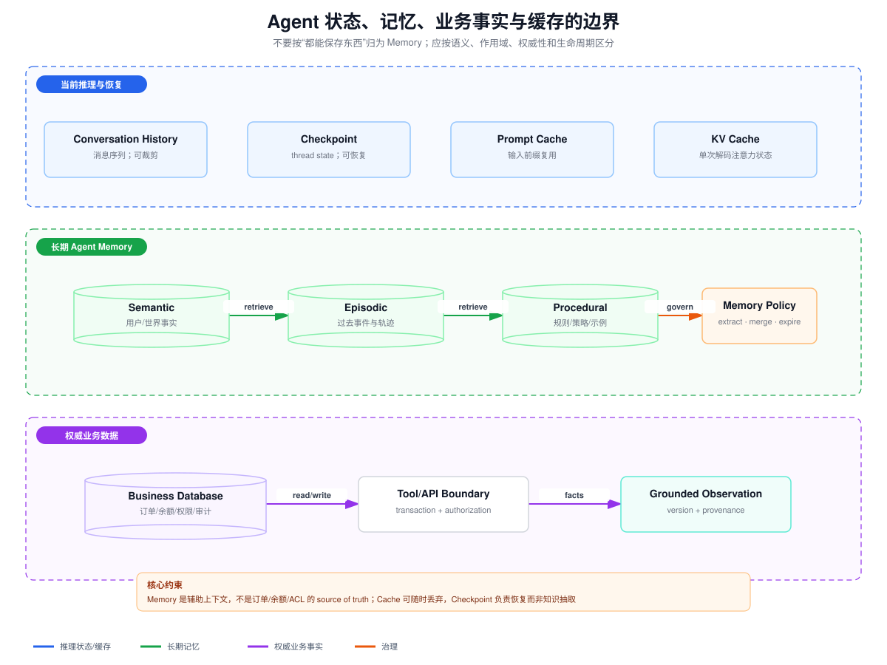

# Conversation、Checkpoint、Agent Memory、业务数据库与缓存边界

> 目标：区分 Conversation History、Checkpoint、Semantic/Episodic/Procedural Memory、业务数据库、Prompt Cache 和 KV Cache，避免把所有“能保存信息”的组件都叫作 Memory。

## 一、判断存储类型的五个问题

面对一个新组件，先问：

1. 保存的语义是什么：消息、执行状态、事实、经历、规则还是计算中间量？
2. 作用域是什么：request、thread、user、agent、tenant 还是全局？
3. 生命周期是什么：单次解码、一次会话、跨会话还是永久业务记录？
4. 它是不是 source of truth？
5. 丢失后是性能下降、体验下降、无法恢复，还是业务数据损坏？

这些问题比“它用 Redis 还是 PostgreSQL”更能决定边界。同一个数据库可以承载多类数据，但它们仍需要不同 Schema、权限、保留期和一致性。

## 二、总览对比

| 类型 | 保存内容 | 典型作用域 | 权威性 | 丢失后果 |
|---|---|---|---|---|
| Conversation History | user/assistant/tool 消息序列 | thread/session | 对话事实，但可裁剪 | 连贯性下降 |
| Checkpoint | 图/Agent 的完整可恢复状态 | thread + checkpoint | 执行恢复依据 | 不能续跑/回滚 |
| Semantic Memory | 用户、组织、世界的稳定事实 | user/agent/tenant namespace | 辅助事实，需验证 | 个性化下降 |
| Episodic Memory | 过去事件、轨迹、成功/失败经验 | user/agent/task 类别 | 经验，不是业务事实 | 学习与示例选择下降 |
| Procedural Memory | 规则、策略、技能、示例、Prompt | agent/version | 行为指导 | 行为退化或不一致 |
| Business Database | 订单、余额、权限、审计等 | tenant/resource | source of truth | 业务损坏 |
| Prompt Cache | 可复用输入前缀或处理结果 | provider/project/cache key | 纯优化 | 延迟/成本上升 |
| KV Cache | Transformer 已计算 K/V 状态 | 单请求/会话解码 | 纯计算状态 | 重新 Prefill |

## 三、Conversation History

Conversation History 是按时间排序的消息事件：

~~~text
system/developer instructions
user messages
assistant messages
tool calls
tool results
~~~

它的价值是保留对话语用：代词指向、当前目标、用户纠正和工具观察。它不是自动提炼的长期记忆，也不是 Agent 完整状态。

### 3.1 为什么消息列表不足以恢复 Agent

消息中通常没有可靠表达：

- 剩余预算和绝对 Deadline；
- 当前 graph node；
- 已批准但尚未执行的 Action；
- 幂等键和提交状态；
- 并行分支完成水位；
- 重试次数和 backoff；
- 人工审批句柄。

因此 Conversation History 可以是 Checkpoint 的一个字段，但不能替代 Checkpoint。

### 3.2 管理策略

- 保留最近 N 轮原文；
- 更早历史做 compaction；
- 清除很久以前的大型 Tool Result，保留结论与 Artifact ID；
- 系统/用户未撤销约束不能被普通摘要覆盖；
- 重要用户事实抽取到长期 Memory，但仍保留 provenance；
- 删除或权限请求应同步影响 History 导出和 Memory 派生面。

## 四、Checkpoint

Checkpoint 是某个 thread 在一个执行边界上的状态快照，目标是恢复、重放、time travel 或 human-in-the-loop。

可能包含：

~~~json
{
  "thread_id": "thread-42",
  "checkpoint_id": "cp-18",
  "graph_position": ["review_node"],
  "state": {
    "messages": [],
    "artifacts": [],
    "pending_approval": "approval-7"
  },
  "step": 12,
  "created_at": "2026-08-10T10:00:00Z",
  "parent_checkpoint_id": "cp-17"
}
~~~

### 4.1 一致性

Checkpoint 的写入边界应与 Node/Step 的副作用模型一致：

- 在执行前 checkpoint：恢复后可能重放当前步骤；
- 在执行后 checkpoint：必须确保外部副作用和状态更新已正确关联；
- exactly-once 难以跨外部系统实现，仍需要业务幂等键；
- Checkpoint 不能证明远程工具没有执行。

### 4.2 Checkpoint 不做什么

- 不自动判断哪些用户事实值得长期保存；
- 不自动合并跨线程信息；
- 不应直接作为所有用户的语义检索库；
- 不替代业务审计日志；
- 不等于数据库事务快照。

## 五、Semantic Memory

Semantic Memory 保存事实和概念，例如：

~~~text
用户偏好中文回答
用户常驻时区为 Asia/Shanghai
项目默认 Python 版本为 3.12
~~~

注意“Semantic Memory”是记忆类型，不等于“Semantic Search”。前者描述存什么，后者是怎么检索。

### 5.1 Profile vs Collection

Profile：

~~~json
{
  "language": "zh-CN",
  "timezone": "Asia/Shanghai",
  "coding_style": ["type hints", "pytest"]
}
~~~

优点是装配简单、整体一致；缺点是 Profile 变大后更新容易覆盖未提及字段，冲突合并困难。

Collection 把每个事实作为独立记录。优点是 Recall 高、单项更新/过期容易；缺点是重复、矛盾和检索复杂。

### 5.2 事实生命周期

事实应包含：

~~~text
subject, predicate, value
source/provenance
confidence
valid_from/valid_to
created_at/updated_at
supersedes
tenant/user namespace
~~~

“用户喜欢咖啡”不能永不过期，也不能在用户当前明确说“不再喝咖啡”时覆盖当前输入。

## 六、Episodic Memory

Episodic Memory 保存过去的事件和执行经历：

- 某次部署为何失败；
- 一个 Tool Call 的成功轨迹；
- 用户完成过的任务；
- 某类问题经过哪些步骤解决；
- 人工反馈和最终修正。

常见使用方式是检索相似过去案例作为 few-shot example。

### 6.1 与日志/Trace 的区别

原始 Trace 是审计和诊断证据，可能包含大量细节；Episodic Memory 是从 Trace 中选择或摘要出的、面向未来决策的经验。

~~~text
Trace: 每个 span、参数、时间、错误栈
Episode: 问题特征 + 有效策略 + 失败陷阱 + 结果 + 来源 Trace ID
~~~

不能为了节省空间删掉 Trace 后只保留 LLM 摘要，尤其在合规和资金场景。

## 七、Procedural Memory

Procedural Memory 指“如何做”：

- System Prompt 和策略；
- Tool 使用规则；
- 成功示例；
- 规划模板；
- Agent 代码和模型权重也可视为广义程序性能力。

它通常比用户事实更接近配置/发布资产，应版本化、评测、审批和回滚。

### 7.1 反思更新的风险

让 Agent 根据反馈自动重写自身指令可能提升表现，但必须：

- 只修改允许区段；
- 使用结构化 Patch；
- 经过离线 Eval；
- 防止用户内容把安全策略写入低优先级 Memory；
- 保留旧版本和变更原因；
- 高风险策略人工审批。

Procedural Memory 不能由一次恶意对话直接永久改变。

## 八、Business Database

业务数据库保存订单、余额、库存、ACL、合同、审计等权威事实。模型 Memory 不能代替它：

~~~text
错误：Memory 说余额 100 元 → 直接允许支付
正确：Memory 只帮助理解意图 → Tool 实时查询账本 → 授权/事务执行
~~~

Business Database 的特征：

- 强 Schema 和业务约束；
- transaction/locking/idempotency；
- tenant 和资源级授权；
- 审计与保留要求；
- 明确的 owner 和变更 API；
- 读取结果带 version/provenance。

Memory 可以缓存“用户偏好付款方式”，但不能成为账户余额 source of truth。

## 九、Prompt Cache

Prompt Cache 复用相同或相似输入前缀的处理结果，以降低 Prefill 延迟或成本。常见可缓存部分：

- 稳定 System Prompt；
- 大型 Tool definitions；
- 很少变化的参考文档前缀；
- 共享示例。

它是性能优化，不是语义 Memory：

- Cache miss 不能改变正确性；
- Cache 可以随时淘汰；
- Cache key 必须包含模型、Prompt 内容、版本和关键配置；
- 不能跨 tenant 复用含私有内容的前缀；
- 命中 Cache 不表示缓存内容仍然新鲜或权限仍有效。

如果把当前 ACL 或动态业务数据放入长 TTL Prompt Cache，可能在权限撤销后继续使用旧上下文。

## 十、KV Cache

Transformer 自回归解码中，每一层为历史 Token 计算 Key/Value。KV Cache 保存这些张量，避免每生成一个新 Token 都重新计算全部历史。

近似容量：

~~~
KV bytes
  ≈ layers × sequence_length × 2(K+V)
    × kv_heads × head_dim × bytes_per_element
~~~

KV Cache 的特征：

- 属于模型推理引擎，不是应用数据库；
- 与模型层数、KV heads、序列长度和精度强相关；
- 通常绑定一次请求/会话和精确 Token 前缀；
- 不能做语义搜索；
- 不能直接跨不同 Prompt 修改后复用；
- 丢失后可重新 Prefill，代价是延迟/算力。

MHA、GQA、MQA/MLA 的一个核心工程差异正是 KV Cache 大小和读取带宽。

## 十一、容易混淆的边界

### 11.1 Conversation History vs Semantic Memory

History 是事件原文；Semantic Memory 是从事件中提炼出的事实。事实必须带来源，用户删除 History 时要定义派生 Memory 是否同步删除。

### 11.2 Checkpoint vs Episodic Memory

Checkpoint 为恢复某个 thread；Episode 为帮助未来相似任务。Checkpoint 强调完整状态，Episode 强调可复用经验。

### 11.3 Prompt Cache vs KV Cache

Prompt Cache 是 API/应用可见的输入前缀缓存概念；KV Cache 是推理引擎内部注意力张量。某些供应商的 Prompt Cache 底层可能复用 KV 或其他表示，但应用语义仍不同。

### 11.4 Memory vs Business DB

Memory 是概率性抽取、可能过期的辅助 Context；Business DB 是权威事实。Memory 读取也要经过 tenant/ACL，不能因为“只是记忆”就放宽隔离。

## 十二、数据治理矩阵

| 类型 | 推荐 key | 删除触发 | TTL | 访问边界 |
|---|---|---|---|---|
| History | tenant/thread/message | 用户删除、保留策略 | 中 | thread participant |
| Checkpoint | tenant/thread/checkpoint | thread 删除、运行保留 | 中 | run owner/operator |
| Semantic | tenant/user/fact | 用户纠正、来源删除 | 长但可过期 | subject + policy |
| Episodic | tenant/agent/episode | Trace 删除、策略 | 中长 | agent/team |
| Procedural | agent/version | 新发布、回滚 | 版本化 | developer/admin |
| Business DB | tenant/resource | 业务事务 | 法规决定 | resource policy |
| Prompt Cache | model/prefix hash/tenant | 内容或策略版本变化 | 短 | cache partition |
| KV Cache | request/model/prefix | 请求结束/淘汰 | 极短 | inference session |

## 十三、验收问题

能否逐项回答：

1. 用户关闭对话后，哪个数据仍应保留？
2. 服务重启后，哪个状态用于恢复当前 Agent Step？
3. 用户纠正偏好后，旧事实如何 supersede？
4. 删除一次对话是否必须删除从中抽取的 Memory？
5. 余额查询为什么不能从 Semantic Memory 读取？
6. Prompt Cache 跨 tenant 复用会有什么风险？
7. KV Cache 丢失为什么只影响性能？
8. Checkpoint 重放写工具时怎样避免重复副作用？

如果这些问题没有明确答案，说明数据边界尚未设计完成。
