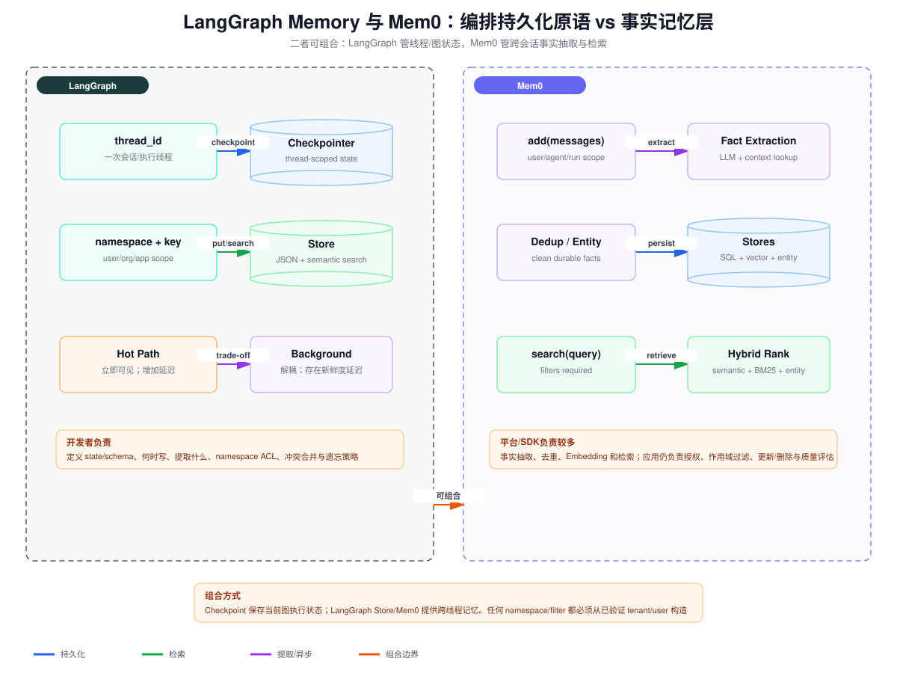

# LangGraph Memory 与 Mem0：线程状态、事实记忆与租户隔离对比

> 目标：理解 LangGraph 与 Mem0 分别解决什么问题，并能设计线程状态、跨会话记忆、热路径/后台写入、事实抽取、冲突处理和租户隔离。本文依据 [LangGraph Memory](https://docs.langchain.com/oss/python/concepts/memory)、[Mem0 Introduction](https://docs.mem0.ai/introduction) 及 Mem0 当前的 [How It Works](https://docs.mem0.ai/core-concepts/how-it-works) 文档整理。具体 SDK 接口可能演进，文中的边界与设计原则比某一版方法签名更重要。

## 1. 先给结论：它们不处在同一抽象层

LangGraph Memory 更像一组**编排持久化原语**：

- Checkpointer 把 Agent 当前线程的图状态保存下来，使一次执行可以暂停、恢复、重放和容错。
- Store 使用 `namespace + key` 保存跨线程数据，并提供过滤或语义搜索能力。
- Semantic、Episodic、Procedural 是开发者可以在 Store 上实现的记忆模式，并不意味着框架会自动把对话提炼成可靠事实。

Mem0 更像一个**有主见的长期记忆子系统**：

- 接收消息或事实，执行事实抽取、去重、Embedding 和持久化。
- 使用 `user_id`、`agent_id`、`run_id` 等维度组织和检索记忆。
- 将结构化事实、向量表示和实体关系组合起来，为应用返回与当前查询相关的记忆。

因此，二者不是简单的“二选一”：LangGraph 可以保存当前 Agent 的可恢复状态，而 Mem0 可以作为图节点调用的跨会话事实记忆服务。真正需要避免的是：让两套系统都不加区分地写同一份长期事实，最终形成双写冲突和不清晰的 source of truth。



## 2. 三种状态必须分开建模

### 2.1 当前线程状态：回答“这次执行进行到哪里”

线程状态通常包含：

- 当前消息列表或已经压缩的会话上下文；
- 图节点执行位置、待处理工具调用和工具结果；
- 本轮中间产物、重试次数、审批状态；
- 为恢复执行所需的确定性控制字段。

这类状态的主键通常是 `thread_id`，生命周期与一次会话或一条业务流程绑定。它需要较强的一致性和可恢复性，但未必适合被其他线程检索。LangGraph Checkpointer 正是这个层次。

一个常见错误是把线程里的所有消息都当长期记忆。这样做会带来三个问题：

1. 工具原始输出、重复确认和临时推理会污染未来检索。
2. 对话中的旧事实可能已被后续消息纠正，却仍以多个互相矛盾的片段存在。
3. 消息记录是事件日志，不是经过合并的事实模型。

### 2.2 跨线程 Agent 记忆：回答“以后值得记住什么”

长期记忆可分为三类：

- Semantic：稳定事实，如用户偏好、项目术语、资源标识。
- Episodic：过去发生的事件或成功轨迹，如“上次部署因数据库迁移失败”。
- Procedural：以后应采用的规则、流程和少量高质量示例。

LangGraph Store 能承载这些数据，但提取、合并、冲突处理和遗忘策略由应用定义。Mem0 则进一步封装了事实抽取和去重流程，适合希望快速得到“从对话自动形成事实记忆”的应用。

### 2.3 权威业务数据：回答“现在真实状态是什么”

订单、余额、权限、合同状态、库存和审计记录不应把记忆系统当作权威来源。即使 Mem0 或 Store 中保存了“用户是管理员”，调用敏感工具前也必须从身份系统或业务数据库重新验证。

可以把三者写成一个约束：

```text
Checkpoint = 可恢复的执行状态
Long-term memory = 可检索、可遗忘的辅助上下文
Business DB / IAM = 当前业务事实与授权的 source of truth
```

## 3. LangGraph：Checkpointer 与 Store 的语义差异

### 3.1 Checkpointer：线程级快照，而不是知识库

Checkpointer 在图执行过程中保存 state。它的关键价值包括：

- Durable execution：进程崩溃后从已提交检查点继续。
- Human-in-the-loop：执行暂停等待批准，之后在同一线程恢复。
- Time travel / replay：检查某一步状态，必要时从历史快照分叉。
- Observability：关联输入、节点输出和状态演化。

设计时至少需要明确：

```text
checkpoint_key = (tenant_id, thread_id, checkpoint_id)
```

如果数据库只按 `thread_id` 查询，而线程 ID 可被客户端猜测或不同租户重复使用，就可能产生跨租户读取。`thread_id` 是定位键，不是访问凭证。

状态 Schema 也应限制大小。工具返回的大文件、网页全文和向量不应直接塞入 Checkpoint；保存对象引用、摘要、哈希和版本即可，否则每一步快照会导致写放大和恢复延迟。

### 3.2 Store：跨线程命名空间与键值记忆

LangGraph Store 使用 namespace 将记忆组织到逻辑空间中，并以 key 定位 JSON 文档。一个稳妥的命名空间可以是：

```python
namespace = (tenant_id, user_id, "assistant-preferences")
key = memory_id
```

Store 可支持语义搜索，但它并不知道字段的业务含义，也不会自动保证“这是一条不矛盾的用户事实”。应用仍要定义：

- 写什么：原始事件、事实 profile，还是事实 collection；
- 何时写：同步写、任务结束写，还是后台提取；
- 如何合并：覆盖、追加、版本化或保留冲突；
- 如何删除：用户删除、保留期到期和租户注销的传播；
- 如何授权：谁可以访问哪个 namespace。

### 3.3 Profile 与 Collection 的取舍

Semantic Memory 常见两种模型：

**Profile** 使用一个结构化对象保存用户状态：

```json
{
  "language": "zh-CN",
  "preferred_style": "technical",
  "current_project": "16w-study"
}
```

优点是读取一次即可得到完整画像，字段约束明确；缺点是每次更新都要正确重写整个对象，LLM 容易遗漏旧字段，且并发更新存在 lost update。应使用版本号或 compare-and-swap：

```text
UPDATE profile
SET body = new_body, version = version + 1
WHERE id = ? AND version = expected_version
```

**Collection** 把事实拆成多个独立条目：

```json
{"kind":"preference", "fact":"偏好技术深度较高的中文文档"}
```

它更适合增量写入、单条删除和语义检索，但会出现重复、冲突和召回预算问题。需要 canonical fact、相似度去重、时间戳和状态字段，例如 `active/superseded/deleted`。

## 4. Mem0：从消息到可检索事实

### 4.1 `add` 不是简单地把整段对话写入向量库

在自动推断模式下，Mem0 的核心流程可以概括为：

```text
messages
  -> 查找已有上下文
  -> LLM 抽取值得长期保存的原子事实
  -> 与已有事实比较、去重
  -> 生成向量和实体信息
  -> 写入结构化存储、向量存储及实体层
```

例如用户说“我已经不喝咖啡了，改喝茶”，理想的记忆操作不是再追加一条孤立文本，而是识别它与旧事实“喜欢咖啡”冲突，并把旧事实标记为 superseded 或显式更新。不过，不能假设任何自动抽取器都能稳定完成纠错。Mem0 当前文档强调自动抽取偏向新增，准确修正和删除应使用显式 update/delete 操作。

当使用 `infer=False` 时，保存的是应用提供的原始内容，而非自动抽取出的事实。它适合应用已经拥有结构化事实、不希望 LLM 改写语义的场景。

### 4.2 存储层不是“一份向量”

Mem0 的逻辑架构可以包含：

- 结构化/SQL 层：保存事实、元数据、ID 和生命周期，是操作层面的事实记录；
- 向量层：通过 Embedding 支持语义近邻召回；
- 实体层：表达人物、地点、项目等实体及关系，为查询增加实体信号。

搜索可能综合 semantic、keyword/BM25 和 entity signals，但具体能力取决于使用托管平台还是开源部署，以及已配置的 vector store、reranker 和实体能力。架构评审时不能只看到接口叫 `search` 就假设所有部署都有相同的混合检索质量。

### 4.3 `user_id`、`agent_id`、`run_id` 的含义

- `user_id`：属于某个终端用户的长期个性化记忆。
- `agent_id`：属于某种 Agent 或角色的记忆，如特定助手的程序性经验。
- `run_id`：属于一次运行或任务的局部记忆。

这些字段解决的是**作用域和检索过滤**，不是身份认证。正确路径是：

```text
verified access token
  -> API gateway 验证 issuer/audience/expiry/scope
  -> 服务端得到 tenant_id、subject_id
  -> 服务端构造 Mem0 filters
  -> 执行 search/add/update/delete
```

错误路径是允许模型输出：

```json
{"tenant_id":"another-company", "user_id":"victim", "query":"password"}
```

然后直接把这组参数传给记忆服务。模型和客户端提交的 ID 都是不可信输入；必须用服务端认证上下文覆盖它们。

## 5. 热路径写入与后台写入

### 5.1 热路径写入

热路径是在用户请求返回前完成事实抽取和持久化：

```text
request -> agent response -> memory extraction/write -> return response
```

优点：

- 下一轮立即可见，read-your-writes 语义清楚；
- 错误可同步返回，便于用户知道是否保存成功；
- 实现简单，Trace 容易关联。

代价：

- 增加 LLM 抽取和存储延迟；
- 记忆服务故障会扩大为主链路故障；
- 同一请求同时负责回答与记忆维护，Token/费用增加。

适合必须立即生效的显式命令，例如“请记住以后都用中文回答”。显式记忆操作应返回 memory ID 和结果状态，而不是悄悄失败。

### 5.2 后台写入

后台写入把事件投递到队列，由 Worker 异步提取：

```text
request -> append memory event -> return response
                         |
                         v
                worker extract/dedup/write
```

优点是主链路延迟低、易批处理和重试，缺点是存在最终一致性窗口。工程上必须补齐：

- Outbox：业务事务和记忆事件至少做到不丢失；
- Idempotency key：`tenant_id + conversation_id + message_id + extractor_version`；
- Watermark：记录处理到哪个事件；
- Dead-letter queue：隔离反复失败的任务；
- Freshness SLO：例如 99% 的记忆在 60 秒内可检索；
- Delete priority：删除事件优先于新增/重建，避免被延迟写入复活。

适合对实时性要求较低的事实归纳、轨迹反思和批量记忆压缩。

### 5.3 推荐的混合策略

- 用户明确说“记住/忘记”：热路径执行，返回可核验结果。
- 对话隐式产生的候选事实：后台抽取。
- 当前线程继续执行所需状态：同步写 Checkpoint。
- 高风险业务事实：不写入长期记忆作为权威依据，只保存引用 ID。

## 6. 事实抽取不是一次 LLM 调用，而是一条受治理的数据管道

### 6.1 原子化与可验证性

坏记忆：

```text
用户讨论了项目、喜欢 Python、下周可能上线，团队似乎担心性能。
```

较好的记忆条目：

```json
{
  "subject": "user:123",
  "predicate": "preferred_language",
  "object": "Python",
  "confidence": 0.92,
  "source": {"conversation_id":"c7", "message_id":"m18"},
  "valid_from": "2026-08-10T10:00:00Z",
  "status": "active",
  "extractor_version": "fact-v3"
}
```

原子化能支持单条更新、去重、冲突检测和溯源。`confidence` 不能代替证据，关键事实仍需保留 source pointer。

### 6.2 去重、冲突与时间语义

去重至少需要三个层次：

1. 精确去重：规范化文本或 payload hash。
2. 语义近重复：Embedding 相似度召回候选，再用规则或模型判断是否同义。
3. 槽位冲突：同一 `subject + predicate` 的 object 不同，如城市从北京变成上海。

不要把“不同”自动判为冲突。`favorite_food` 可以是多值，而 `current_city` 在同一时刻通常单值。Schema 应定义 cardinality 和更新策略：

```text
single-valued + newer valid_from -> supersede old value
multi-valued -> merge unless explicit removal
uncertain conflict -> preserve both and lower retrieval priority
```

### 6.3 删除与遗忘

删除不仅是从向量库删一个点，还包括：

- 结构化记录和向量索引；
- 实体关系；
- 检索缓存、摘要和派生画像；
- 后台队列中尚未处理的旧事件；
- 审计记录中的合规保留与内容脱敏。

可采用 tombstone 防止旧事件或索引重建把数据重新写回：

```text
delete_version >= incoming_event_version -> reject stale write
```

## 7. 租户隔离：过滤条件不等于授权

### 7.1 威胁模型

需要防御的不只是恶意用户，还包括：

- 模型幻觉出错误的 `user_id`；
- Prompt Injection 诱导模型读取其他租户；
- 后台任务丢失 tenant context；
- 缓存 key 未包含 tenant，造成跨租户命中；
- 管理员工具使用宽 Scope 后把结果回传给普通用户；
- 重建或迁移脚本遗漏 ACL 条件。

### 7.2 服务端强制作用域

建议把认证上下文设计为不可由模型构造的对象：

```python
auth_context = {
    "tenant_id": token_claims["tenant_id"],
    "subject_id": token_claims["sub"],
    "scopes": verified_scopes,
}

namespace = (
    auth_context["tenant_id"],
    auth_context["subject_id"],
    "long-term-memory",
)
```

LangGraph Store 的 namespace、Checkpointer 的查询条件以及 Mem0 的 filters 都由这份上下文生成。模型只提供查询语义，例如“查找用户的编辑器偏好”，不能提供越界 identity。

### 7.3 两层校验

仅在向量查询里加过滤还不够，建议使用两层校验：

```text
candidate recall with tenant/user filter
  -> fetch records
  -> final authorization check against current IAM/ACL
  -> only allowed memories enter model context
```

第一层减少不应出现的候选，第二层防止索引元数据陈旧、过滤器缺陷和权限撤销延迟。敏感数据还应使用数据库 Row-Level Security 或按租户物理分区，避免只依赖应用代码。

### 7.4 缓存与可观测性也要带租户

```text
cache_key = tenant_id + subject_id + query_hash + memory_version
trace = trace_id + tenant_id + actor_id + operation + result_count
```

日志不得记录 Access Token 和完整敏感记忆；可以记录哈希、memory ID、过滤器摘要和授权结果。安全测试必须包含：跨租户相同 `user_id`、撤销权限后的旧缓存、后台 Worker 缺 tenant context、模型伪造 filter 等用例。

## 8. 详细对比

| 维度 | LangGraph Checkpointer | LangGraph Store | Mem0 |
|---|---|---|---|
| 核心职责 | 保存线程图状态、暂停与恢复 | 跨线程 JSON 记忆与搜索 | 自动事实抽取、去重、持久化与检索 |
| 主要作用域 | `thread_id` | 自定义 `namespace + key` | `user_id/agent_id/run_id` 加 filters |
| 数据形态 | 图 state、消息、中间控制字段 | 开发者定义的 JSON | 抽取事实、元数据、向量、可选实体信号 |
| 是否自动抽取事实 | 否 | 否 | 是；也可 `infer=False` 原样保存 |
| 写入时机 | 图执行期间同步检查点 | 热路径或后台，开发者决定 | `add` 可同步调用，也可由后台任务调用 |
| 一致性重点 | 恢复点和状态版本 | 合并、冲突、索引新鲜度 | 抽取幂等、事实更新/删除、索引同步 |
| 典型查询 | 按线程恢复状态 | 按 namespace/key 或语义搜索 | 按 query 和身份 filters 搜索事实 |
| 租户隔离 | 查询必须组合 tenant/thread | namespace 与存储 ACL | 服务端强制 filters；ID 不是授权 |
| 最适合 | Agent 编排、审批、容错 | 自定义长期记忆模型 | 快速构建个性化事实记忆层 |
| 主要风险 | Checkpoint 膨胀、线程 ID 越权 | 抽取与治理全由应用负责 | 自动事实错误、作用域误用、平台能力假设 |

## 9. 二者组合时的参考架构

```text
Authenticated Request
  -> Agent API derives tenant/user context
  -> LangGraph thread runs
       -> Checkpointer: save recoverable graph state
       -> Memory read node: query Mem0 with server-owned filters
       -> Model receives allowed, cited memory subset
       -> Tools read authoritative business systems
       -> Memory event emitted after result
  -> Background worker
       -> extract/dedup/write Mem0
       -> update freshness watermark
```

组合时应明确唯一职责：

- Checkpointer 只保存恢复所需状态。
- Mem0 保存经过提炼的长期事实。
- 如果同时使用 LangGraph Store，可让它保存程序性规则或应用配置，不再重复保存同一用户事实；或者把 Store 作为自建记忆层，完全不引入 Mem0。
- 业务数据库继续负责订单、权限等权威数据。

不要在一个事务里盲目双写 Store 和 Mem0。若确有两份派生索引，先写唯一事实源，再通过 Outbox 异步投影，并用版本水位监控一致性。

## 10. 选型问题

优先使用 LangGraph Checkpointer，如果主要问题是：

- Agent 执行需要暂停、恢复、重试和人工审批；
- 要保存图节点状态，而不是抽取用户事实；
- 希望用同一线程重放和调试完整轨迹。

优先使用 LangGraph Store，如果：

- 记忆 Schema 和更新规则非常业务化；
- 团队愿意自行实现事实抽取、冲突处理和遗忘；
- 需要与 LangGraph 编排紧密集成，减少外部组件。

考虑 Mem0，如果：

- 需要快速把对话转为可检索的长期事实；
- 希望复用现成的抽取、去重、Embedding 和搜索流程；
- 能接受额外服务，并愿意对自动抽取质量、数据治理和部署能力做验证。

二者都不应替代 IAM、业务数据库和文档权限索引。

## 11. 验收与测试清单

### 功能与一致性

- 进程在任意节点崩溃后，是否从正确 Checkpoint 恢复而不重复执行副作用？
- 同一消息被消费两次，是否只产生一条有效事实？
- 新事实与旧事实冲突时，是否按字段 cardinality 和时间语义处理？
- 后台写入的 freshness lag 是否达到 SLO？
- update/delete 是否同步到结构化、向量、实体和缓存层？

### 安全

- 模型伪造 `tenant_id/user_id` 时，服务端是否忽略并覆盖？
- 两个租户使用相同本地 user ID 时，是否完全隔离？
- Token 过期、撤销或 Scope 不足时，是否在读取记忆前拒绝？
- 权限撤销后，旧缓存和旧索引是否仍可能泄漏？
- Trace 和错误响应是否避免暴露 Token 与敏感记忆正文？

### 质量

- Fact extraction precision：抽出的事实中真正值得保存且语义正确的比例。
- Fact recall：Gold facts 中成功抽取的比例。
- Update accuracy：纠正事实时旧值被正确 supersede 的比例。
- Retrieval Recall@K / MRR：相关且有权限的记忆能否靠前返回。
- Memory usefulness：加入记忆后任务成功率是否提升，而非仅增加 Token。
- Stale-memory rate：返回的记忆中已过期或被否定的比例。

## 12. 核心总结

1. LangGraph Checkpointer 面向线程执行恢复，Store 面向跨线程自定义记忆；Mem0 面向自动化事实记忆管道。
2. 热路径保证立即可见但增加延迟，后台写入降低延迟但必须补齐 Outbox、幂等、freshness SLO 和删除优先级。
3. 事实抽取需要原子 Schema、溯源、去重、冲突、版本和删除治理，不能把一次 LLM 输出直接当真相。
4. `thread_id`、namespace、`user_id/agent_id/run_id` 都是定位或作用域键，不是授权凭证。
5. 租户和用户过滤必须由服务端从已验证 Token 构造，并在召回后执行最终权限校验。
6. 最稳妥的组合是：Checkpoint 管当前执行，长期记忆层管辅助事实，业务数据库/IAM 管权威事实和访问权限。

