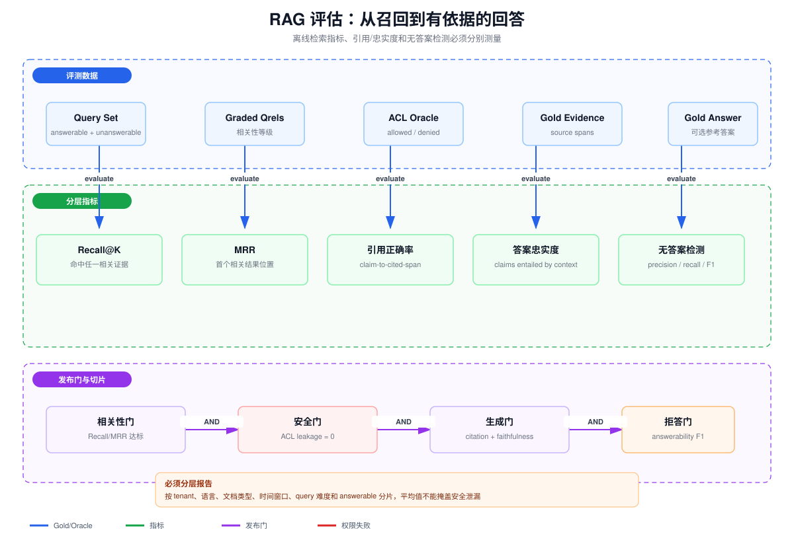

# RAG 评估：Recall@K、MRR、引用正确率、答案忠实度与无答案检测

> 目标：把“感觉回答不错”拆成可诊断、可复现的检索、引用、生成和拒答指标，并将访问权限作为独立的零容忍发布门。

## 一、为什么必须分层评估

RAG 至少包含四个可能独立失败的阶段：

~~~
Query → Retrieval → Ranking/Context → Generation/Citation → Answer/Abstain
~~~

只评最终答案无法定位：

- 没召回正确证据；
- 召回了但排得太后；
- Context 有证据但模型没有使用；
- 回答正确但引用指向错误段落；
- 数据库没有答案，模型却编造；
- 结果相关但用户无权访问。

因此应同时保存 retrieval run、最终 Context、逐条 Claim、引用 span、最终答案与拒答决策。

## 二、评测集和标注模型

### 2.1 Query 类型

评测集至少包含：

- answerable：语料中存在足够证据；
- unanswerable：语料中没有答案；
- permission-unanswerable：全局有答案，但当前测试主体无权访问；
- stale-answer：旧版本有答案，新版本已删除或修订；
- multi-hop：必须组合多个证据；
- exact-identifier：依赖 ID、代码或精确短语；
- paraphrase：Query 与文档表达差异较大。

permission-unanswerable 不能算普通 Recall 失败。正确行为是拒答或说明无权限，而不是为了提高相关性泄露证据。

### 2.2 Qrels

Qrels 是 query-document/chunk 相关性判断：

~~~text
q1 → chunk-A: 2（直接、充分证据）
q1 → chunk-B: 1（相关但不充分）
q1 → chunk-C: 0（不相关）
~~~

应明确标注单位是 Chunk、Parent Document 还是 Source。Overlap 会产生多个等价 Chunk；如果把它们都算独立相关结果，指标会被重复证据虚高。

建议同时维护：

- relevance grade；
- gold source/version/span；
- 当前 subject 的 ACL oracle；
- answerability label；
- 可选 gold answer 和 required claims。

## 三、Recall@K

对单个 Query，二值 Recall@K：

~~~
Recall@K(q) =
  number of relevant items in top K
  / total relevant items for q
~~~

如果任务只要求命中任一充分证据，也常报告 Hit@K：

~~~
Hit@K(q) = 1 if top K contains any sufficient evidence else 0
~~~

两者不要混名。一个 Query 有 5 个相关 Chunk，Top-5 只命中 1 个时，Hit@5=1，但 Recall@5=0.2。

### 3.1 Macro 与 Micro

- Macro Recall：先算每个 Query，再平均；每个 Query 权重相同；
- Micro Recall：汇总命中数和相关总数；相关文档多的 Query 权重更高。

RAG 通常优先 Macro，并按 Query 类型切片。还应报告置信区间，避免 50 条样本上 2% 的变化被误认为真实提升。

### 3.2 ACL-aware Recall

正确相关集合应依当前身份计算：

~~~
R_allowed(q, subject) =
  relevant(q) AND authorized(subject)
~~~

检索到无权文档不应增加 Recall，而应记为安全泄漏。可同时报告：

~~~text
Authorized Recall@K
Unauthorized Exposure@K
~~~

后者发布阈值通常必须为 0。

## 四、MRR：首个相关结果有多靠前

单个 Query 的 Reciprocal Rank：

~~~
RR(q) = 1 / rank(first relevant result)
~~~

若 Top-K 内没有相关结果则为 0：

~~~
MRR@K = average over queries of RR@K(q)
~~~

例子：

| Query | 首个相关位置 | RR |
|---|---:|---:|
| q1 | 1 | 1.0 |
| q2 | 2 | 0.5 |
| q3 | 5 | 0.2 |
| q4 | 未命中 | 0 |

MRR 偏好“第一个正确结果”，不关心后面是否还有其他证据。因此：

- 单证据 QA 很适合 MRR；
- 多跳问题不能只看 MRR，应结合 Recall、evidence set coverage；
- 有 graded relevance 时可补充 nDCG；
- Context 会装入多个 Chunk 时，MRR 提升不一定转化为答案提升。

## 五、引用正确率

“答案有链接”不代表引用正确。应先把答案拆成可验证 Claims：

~~~text
Claim 1：版本 3.2 于 8 月发布 → citation [doc-1, span 20:35]
Claim 2：该版本移除了旧接口      → citation [doc-2, span 8:18]
~~~

### 5.1 Citation Correctness

引用正确性判断被引用 span 是否真正支持对应 Claim：

~~~
Citation Precision =
  supported cited claims / all cited claims
~~~

需要区分：

- entailment：证据直接支持；
- contradiction：证据明确冲突；
- neutral/insufficient：主题相关但不能推出 Claim；
- wrong-version：文本曾经正确，但不是回答时要求的版本。

### 5.2 Citation Completeness

另一个维度是重要 Claim 是否都有引用：

~~~
Citation Completeness =
  important claims with valid citation / all important claims
~~~

一个系统可以 Precision 很高但 Completeness 很低：只给一个正确引用，却生成很多无引用事实。因此“引用正确率”最好拆成 precision 与 completeness。

### 5.3 Span 级验证

只验证文档 URL 太粗。长文档中任意位置有相似词并不表示引用段落支持 Claim。推荐记录：

~~~text
source_id + source_version + page/section + start/end offset + content_hash
~~~

评测时用固定版本读取 span，防止在线文档更新后引用漂移。

## 六、答案忠实度

Faithfulness 问的是：

> 答案中的事实性 Claim 是否能由提供给模型的 Context 推出？

它不等于答案正确性：

- 忠实但错误：Context 本身过期或错误，模型忠实复述；
- 正确但不忠实：模型依靠参数知识答对，但 Context 没有证据；
- 相关但不忠实：Context 主题相关，却不足以支持具体数字。

Claim-level Faithfulness：

~~~
Faithfulness =
  entailed answer claims / all verifiable answer claims
~~~

### 6.1 自动 Judge 的风险

LLM-as-Judge 可用于规模化，但要：

- 给出严格 entailment rubric，而不是笼统“相关吗”；
- 让 Judge 只看 Claim 与证据，避免参考答案诱导；
- 对数字、否定、时间、主体、条件特别检查；
- 在人工标注集上校准 Judge 与专家的一致性；
- 固定 Judge 版本和 Prompt，升级时重跑基线；
- 对高风险领域使用规则/结构化核验补充。

### 6.2 忠实度与引用的关系

引用正确率检查 claim-citation 映射，忠实度检查所有答案 Claims 对整个 Context。两者相关但不等价：

- 模型可能引用 A，却实际从未引用的 B 推出结论；
- Citation span 正确，但答案还有无引用幻觉；
- Context 支持答案，但引用标号挂错。

所以要分别报告。

## 七、无答案检测

无答案检测是一个分类问题：

~~~text
answerable → 应回答
unanswerable / unauthorized / insufficient evidence → 应拒答或澄清
~~~

混淆矩阵要先约定正类。若把“应该拒答”定义为 positive：

| 实际/预测 | 拒答 | 回答 |
|---|---:|---:|
| 应拒答 | TP | FN（危险幻觉/泄漏） |
| 应回答 | FP（过度拒答） | TN |

~~~
Precision_abstain = TP / (TP + FP)
Recall_abstain    = TP / (TP + FN)
F1_abstain       = harmonic_mean(Precision, Recall)
~~~

高风险系统通常更重视 Recall_abstain，宁可多拒答，也不要在证据不足或无权限时回答。但过度拒答会严重损害可用性，所以仍需查看 Precision 和覆盖率。

### 7.1 拒答信号

不要只用向量相似度阈值。可组合：

- Top-1/Top-K 检索分数和 score gap；
- Dense/Sparse 是否一致；
- Reranker 充分性分数；
- 是否覆盖 Query 所需实体/时间/条件；
- ACL 过滤后是否仍有充分证据；
- 证据间是否冲突；
- 生成后的 Claim 是否全部可支持。

阈值必须在开发集选择，在独立测试集报告，不能在测试集上调参。

### 7.2 三种拒答语义

对用户文案也应区分：

- 没找到：当前知识库没有足够证据；
- 无权限：不能确认或展示该信息；
- 需要澄清：Query 条件不足。

安全上不要通过“无权限”透露某个秘密文档一定存在；外部文案可能统一，但内部状态和审计要区分。

## 八、端到端评估协议

### 8.1 固定输入

一次可复现运行必须记录：

~~~text
corpus snapshot / source versions
index generation / embedding model / chunker version
retriever parameters / K / filters
reranker version
LLM + system prompt + temperature
subject/tenant/group claims and ACL oracle version
~~~

### 8.2 分层产物

每条 Query 保存：

1. Dense 与 Sparse 原始排名；
2. 融合后候选；
3. Rerank 后顺序；
4. ACL 过滤原因；
5. 最终 Context 与 Token 数；
6. 答案 Claims；
7. Claim-citation 映射；
8. answer/abstain 决策与置信信号。

这样 Recall 下降时能判断是 Chunking、Embedding、Filter 还是 Rerank 导致。

### 8.3 切片与置信区间

至少按以下维度切片：

- tenant/权限模型；
- 语言；
- 文档类型；
- 文档新鲜度；
- Query 长度和难度；
- answerable/unanswerable；
- 单跳/多跳；
- 精确 ID/语义改写。

使用 bootstrap 给 Macro 指标置信区间。版本对比使用同一 Query 的 paired bootstrap，减少样本差异噪声。

## 九、发布门

示例门禁：

~~~text
Authorized Recall@20 >= 0.92
MRR@10             >= 0.70
Citation Precision >= 0.95
Citation Complete  >= 0.90
Faithfulness       >= 0.95
Abstain Recall     >= 0.97
Unauthorized Exposure@K == 0
Deletion regression     == 0 leaked resources
~~~

阈值必须基于业务风险和基线确定。关键是使用 AND，而不是用一个高平均分抵消权限泄漏。

## 十、常见反模式

- 用最终答案 Exact Match 代替检索诊断；
- 把 Hit@K 叫作 Recall@K；
- Qrels 不固定 corpus/version；
- overlap Chunk 重复计为多个独立证据；
- 只检查 citation URL，不检查具体 span；
- Judge 同时看到参考答案，产生结论诱导；
- 无答案集只包含胡乱 Query，没有“有答案但无权限”；
- 只报告全局平均，不看语言、tenant 和时效切片；
- 在线 A/B 前没有零权限泄漏门禁。

## 十一、验收清单

- [ ] answerable、unanswerable、unauthorized 三类样本齐全；
- [ ] Recall@K 与 Hit@K 名称和分母明确；
- [ ] MRR 的截断 K 和无命中处理明确；
- [ ] 引用正确性、完整性和答案忠实度分别评估；
- [ ] 无答案检测报告 Precision、Recall、F1 和回答覆盖率；
- [ ] ACL Oracle 进入 Qrels，unauthorized exposure 独立为 0 门禁；
- [ ] 固定数据快照、索引/模型/Prompt 版本；
- [ ] 指标按关键维度切片并带置信区间；
- [ ] 每条失败能追溯到检索、权限、引用或生成阶段。
