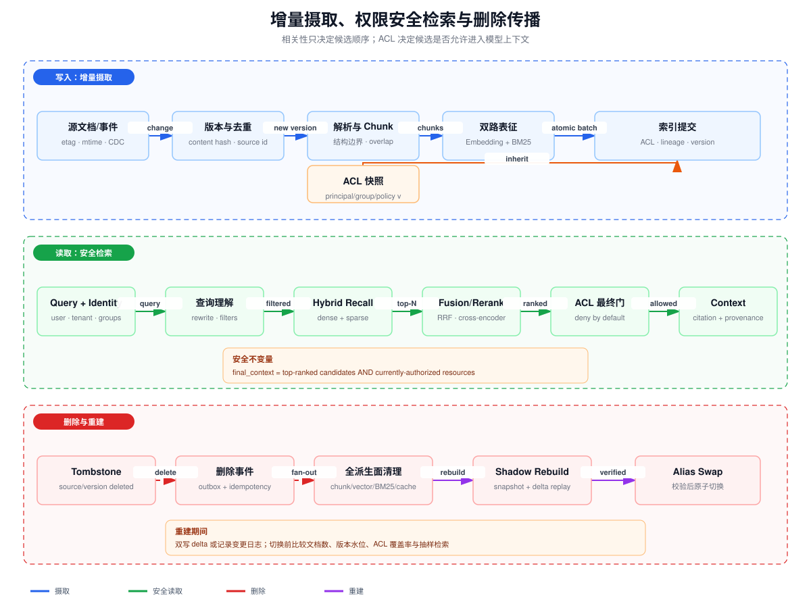

# 文档增量摄取、混合检索与权限安全索引

> 目标：设计一条能够持续接收文档变更、稳定去重、正确删除，并保证“检索相关且当前用户有权访问”的生产级 RAG 数据链路。

## 一、先定义系统不变量

生产 RAG 的目标不是“向量相似度最高”，而是：

~~~
final_context(query, subject, now)
  = rank(relevant candidates)
    AND authorized(subject, resource, now)
    AND not_deleted(resource, now)
    AND acceptable_freshness(resource, now)
~~~

至少应满足五个不变量：

1. 同一 source/version 的事件重复投递不会产生重复 Chunk；
2. 新版本可见后，旧版本不会继续与新版本混排；
3. 用户无权限的内容不会进入模型上下文、引用或日志；
4. 源文档删除后，所有派生 Chunk、向量、倒排项、缓存与引用都能收敛删除；
5. 重建索引期间继续接收的增量不会丢失。

如果只测试“能搜到”，而不测试“不能搜到”和“删除后搜不到”，系统尚未完成。

## 二、文档与版本数据模型

不要把向量数据库的随机 ID 当作业务身份。推荐区分：

| 标识 | 语义 | 稳定性 |
|---|---|---|
| source_id | 外部数据源中的逻辑文档，如 Drive file ID | 跨版本稳定 |
| source_version | etag、revision、commit SHA 或单调版本 | 每次有效修改变化 |
| content_hash | 规范化内容摘要 | 相同内容稳定 |
| chunk_id | source_id + version + chunk boundary 的稳定摘要 | 同版本重跑稳定 |
| index_generation | 一次完整索引构建代号 | 重建时变化 |
| acl_version | 权限快照或策略水位 | 权限变化时变化 |

建议保存摄取 Manifest：

~~~json
{
  "source_id": "drive:file-123",
  "source_version": "rev-18",
  "content_hash": "sha256:...",
  "status": "indexed",
  "chunk_count": 37,
  "acl_version": "acl-42",
  "index_generation": "gen-20260810",
  "observed_at": "2026-08-10T10:00:00Z",
  "committed_at": "2026-08-10T10:00:03Z"
}
~~~

Manifest 是控制面事实；向量索引是派生面。仅依赖向量数据库查询“是否已经处理”会把重试、版本切换和删除语义绑死在某个后端。

## 三、增量摄取：从变更发现到原子提交

### 3.1 变更发现

数据源优先级通常是：

1. CDC、Webhook、对象存储 Event 等原生变更流；
2. 可增量拉取的 change token / cursor；
3. 基于 etag、mtime、size 的周期扫描；
4. 最后才是全量扫描。

事件必须按“至少一次”设计。Webhook 可能重复、乱序或漏投，所以消费者仍需要定期 reconciliation，把源系统清单与 Manifest 对账。

### 3.2 规范化与精确去重

计算 content_hash 前应先做稳定规范化：

- 统一换行和 Unicode；
- 去除抓取时间、随机 ID 等非语义字段；
- HTML 保留标题、列表、表格等结构，去除导航噪声；
- 对 PDF 区分文本层与 OCR 版本；
- 不要盲目去掉空白，因为代码、Markdown 和表格的空白可能有语义。

去重分三层：

| 层次 | 方法 | 风险 |
|---|---|---|
| 事件去重 | event_id/source_version 唯一约束 | 只能去掉重复投递 |
| 内容去重 | 规范化 SHA-256 | 无法识别轻微改写 |
| 近似去重 | MinHash/SimHash/Embedding 相似度 | 可能把模板相似但事实不同的文档误合并 |

近似去重不应直接删除原文。更安全的做法是建立 duplicate_group，并保留 canonical source、版本与 ACL。两份内容相同但 ACL 不同的文档不能简单合并为一个无权限边界的 Chunk。

### 3.3 幂等提交

推荐使用摄取 job key：

~~~
(source_id, source_version, pipeline_version)
~~~

pipeline_version 必须进入 key，因为解析器、Chunking 或 Embedding 模型变化时，相同源版本需要重新派生。

提交顺序可以采用：

1. 生成 Chunk 和派生记录，状态 staged；
2. 批量写向量/倒排索引，并带 source/version/generation；
3. 校验写入数量和 Schema；
4. 原子切换该 source 的 active_version；
5. 将旧版本标记 superseded，并异步回收；
6. Manifest 状态改为 committed。

无法跨多个索引做分布式事务时，使用 outbox + 幂等消费者 + 可对账 Manifest 达到最终一致。

## 四、Chunking 不是固定字符切片

Chunk 是检索、重排和引用的基本单元。它必须同时服务三件事：可被召回、保留足够语义、能映射回原文证据。

### 4.1 常见策略

| 策略 | 适用内容 | 主要问题 |
|---|---|---|
| 固定 Token + overlap | 无结构长文本、快速基线 | 可能切断标题、表格和定义 |
| 标题/段落结构切分 | 文档、Wiki、规范 | 超长章节还需二次切分 |
| 语义边界切分 | 主题变化明显的内容 | 计算成本高，边界可能不稳定 |
| Parent-Child | 小 Chunk 召回，大 Parent 提供上下文 | 需要维护父子版本与 ACL |
| 特殊类型切分 | 代码函数、表格行组、FAQ 对 | 解析器复杂但质量通常更高 |

### 4.2 overlap 的代价

overlap 增加边界事实的 Recall，但也会：

- 增加索引和 Embedding 成本；
- 让 Top-K 被同一段的相邻 Chunk 占满；
- 在 Context 中重复相同文本；
- 夸大引用数量。

所以检索后应做 source-aware 或 parent-aware 去重，并评估“唯一证据 Recall”，而不是只看 Chunk 命中。

### 4.3 Chunk 元数据

每个 Chunk 至少携带：

~~~text
chunk_id, source_id, source_version, parent_id
start_offset/end_offset 或 page/section
content_hash, parser_version, chunker_version
created_at, valid_from, valid_to
tenant_id, ACL snapshot/policy reference, acl_version
~~~

引用必须能够从 chunk_id 回到 source/version/span；否则答案中显示的 URL 可能已经指向另一版本内容。

## 五、Embedding 与混合检索

### 5.1 Embedding 生命周期

记录 embedding_model、维度、归一化方式和输入前缀。更换模型不是在线更新一个字段，而是新的 index generation。不同模型的向量通常不能放在同一空间直接比较。

Embedding 失败要进入可重试队列；不能把零向量或空文本写入索引。对敏感数据还需确认 Embedding 服务的数据驻留和训练策略。

### 5.2 Dense 与 Sparse 互补

- Dense/向量检索擅长语义改写、同义表达和自然语言问题；
- BM25/稀疏检索擅长产品 ID、错误码、人名、精确短语和稀有词；
- Metadata filter 负责 tenant、类型、时间、语言和 ACL 候选约束。

一个稳健候选集通常是：

~~~
C = dense_top_N UNION sparse_top_N
~~~

分数尺度不同，不能直接相加。可使用 Reciprocal Rank Fusion：

~~~
RRF(d) = SUM over retrievers r of 1 / (k0 + rank_r(d))
~~~

k0 是平滑常数。若使用加权归一化，应在代表性 Query 上校准，并监控模型或索引升级后的分布漂移。

### 5.3 Reranking

第一阶段追求高 Recall，取几十到几百个候选；第二阶段用 cross-encoder 或 LLM reranker 对 query-document 对进行精排，再选择 Context。

Reranker 输入应包含：

- Chunk 文本及必要标题/父级路径；
- freshness、source authority 等可解释特征；
- 但不能把无权查看的正文送进远程 reranker。

如果 ACL 只能在精排后判断，就已经可能把敏感内容泄露给 Reranker。至少要先做粗粒度权限预过滤，最终组装 Context 前再做一次实时授权。

## 六、时效性：索引时间不等于事实时间

建议区分：

- event_time：源系统事实发生时间；
- observed_at：摄取器看到变更的时间；
- indexed_at：索引可查询时间；
- valid_from/valid_to：该版本事实的有效区间；
- query_time：用户发起查询时间。

索引延迟：

~~~
freshness_lag = indexed_at - event_time
~~~

对政策、库存、权限等高时效数据，检索分数可加入 freshness decay，但不能让“新”覆盖“权威”。常见组合是：

~~~
score = relevance * authority_weight * freshness_decay
~~~

必须把 freshness 作为可观测 SLO，例如 P95 索引延迟，而不是只显示“最后同步成功”。

## 七、ACL 继承与双重授权门

### 7.1 ACL 快照

文档可能继承站点、文件夹、空间或组织权限。索引时应解析有效权限：

~~~
effective_allow = direct_allow UNION inherited_allow
effective_deny  = direct_deny  UNION inherited_deny
effective_access = effective_allow MINUS effective_deny
~~~

实际规则依源系统而定，必须保留 policy_id、acl_version 和 inheritance_path。Group membership 频繁变化时，不宜把所有用户 ID 完全展开到每个 Chunk；可索引 group/principal，再在查询时根据已验证身份展开。

### 7.2 两道门

1. 检索前过滤：限制 tenant、principal/group、资源状态，减少泄漏面和无效候选；
2. Context 前最终授权：用当前用户和当前策略重新校验 Top 候选，deny by default。

为什么需要第二道门：索引 ACL 可能有延迟、Group 已变化、资源被临时封禁，或者检索后授权在竞态窗口中改变。

权限失败不能降级成“为了相关性先返回”。安全指标是 hard constraint：

~~~
ACL leakage rate = unauthorized returned chunks / all returned chunks = 0
~~~

## 八、删除传播

删除不是从向量库删一行。一个源文档的派生面可能包括：

- 原始对象缓存、解析文本；
- Chunk 表、Parent/Child 关系；
- Dense vectors、BM25 posting；
- Rerank cache、query cache、Prompt/context cache；
- Citation/lineage 表；
- Memory 或离线训练导出；
- 备份和审计保留副本。

推荐流程：

1. 源删除或权限撤销产生 Tombstone；
2. Tombstone 写入 durable outbox；
3. 各派生消费者按 deletion_id 幂等处理；
4. 在线查询先通过 tombstone/status filter 隔离；
5. 异步物理删除所有派生项；
6. deletion ledger 记录各存储完成水位；
7. 定期扫描 orphan chunks 和 stale vectors。

权限撤销通常要比普通内容删除更快生效，可以先写 deny/tombstone 立即阻断读取，再异步回收物理数据。

## 九、索引重建与原子切换

触发重建的典型原因：

- Embedding/Chunker/Parser 版本升级；
- Schema 或 ACL 表达变化；
- 索引损坏、距离度量变化；
- 大规模回填、去重算法升级。

不要原地清空再重建。使用 shadow generation：

~~~
snapshot watermark W
  → build generation G2 from snapshot
  → capture or dual-write changes after W
  → replay delta to G2
  → validate G2
  → atomically move read alias G1 → G2
  → retain G1 for rollback window
~~~

切换前检查文档数、Chunk 数、版本水位、ACL 覆盖率、删除水位、Embedding 维度、抽样 Query Recall 与 unauthorized leakage。

## 十、生产验收清单

- [ ] source/version/chunk/index generation 身份明确；
- [ ] 事件、写索引和删除消费者均幂等；
- [ ] Chunk 保留结构、版本、span、ACL 和 lineage；
- [ ] Dense + Sparse 候选经过融合与 Rerank；
- [ ] ACL 在召回前和 Context 前分别检查；
- [ ] 有 freshness lag SLO 和 stale-version 告警；
- [ ] 删除覆盖所有派生存储与缓存；
- [ ] 重建使用 shadow index、delta replay 和原子 alias swap；
- [ ] 评测同时覆盖相关性、权限撤销和删除后不可见；
- [ ] 任何失败默认不把未知权限内容送入模型。
