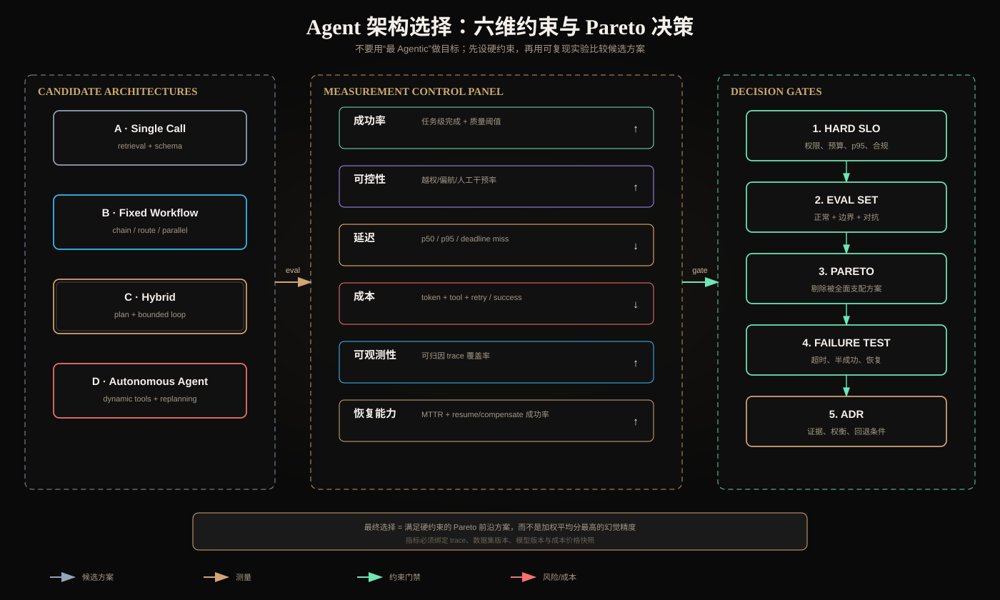

# Agent 架构选择：成功率、可控性、延迟、成本、可观测性与恢复能力



## 一、架构选择是约束优化，不是模式偏好

候选方案可能包括：增强单调用、固定 Workflow、Hybrid Agent 和高自治 Agent。不存在脱离业务约束的“最佳架构”。决策应写成：

```text
maximize    task_success, recoverability, observability
minimize    latency, cost, unsafe/deviant behavior
subject to  authz, compliance, deadline, budget, quality SLO
```

硬约束必须先于综合评分。例如越权率必须为 0 的场景，不能让“成功率高 2%”抵消越权。

## 二、成功率：以任务完成而非文本相似为中心

### 2.1 定义

```text
Task Success Rate = 满足全部完成谓词的任务数 / 总任务数
```

完成谓词应来自外部可验证状态：测试通过、订单状态更新、所需来源齐全、输出 Schema 合法，而不是模型自评。

对于多条件任务，可以同时记录：

- strict success：全部谓词满足；
- partial completion：已满足谓词比例；
- quality score：语义质量；
- unsafe success：表面完成但违反权限/约束，必须计为失败。

### 2.2 分层定位

端到端失败需要分解：

```text
route → plan → retrieve → tool selection → tool execution
      → state update → synthesis → completion verification
```

只看总成功率无法判断应该改 Prompt、工具、数据还是 Runtime。

### 2.3 数据集设计

至少包含：常规请求、边界输入、无答案、冲突证据、工具超时、部分成功、身份越权、Prompt Injection、长任务和取消。按真实流量权重报告，同时保留高风险 Slice 的独立 SLO。

## 三、可控性：系统是否遵守边界

可控性不是“输出看起来稳定”，而是行为受目标、权限和预算约束。

建议指标：

```text
policy_violation_rate
unauthorized_tool_attempt_rate
scope_escape_rate
premature_completion_rate
unnecessary_action_rate
human_override_rate
budget_overrun_rate
```

还要区分：

- 模型提出越权动作但 Runtime 拦截：模型行为失败，安全控制成功；
- Runtime 实际执行越权动作：系统安全失败；
- 模型因边界明确而未尝试越权：理想结果。

三者不能混在一个“无事故”指标里。

### 确定性门禁

以下控制不应只靠 Prompt：

- tenant/user/Scope/ACL；
- Tool allowlist 与参数 Schema；
- 写操作 dry-run、确认和幂等；
- Token/费用/步骤/超时上限；
- 数据脱敏和输出策略；
- 显式完成谓词。

## 四、延迟：平均值会掩盖 Agent 的长尾

报告至少包含 p50、p95、p99 和 deadline miss rate。Agent 的延迟由随机步骤数、工具长尾、重试和排队共同决定：

```text
L_task = Σ_t(L_model_t + L_tool_t + L_runtime_t) + L_queue
```

并行模式：

```text
L_parallel ≈ max(L_worker_i) + L_aggregate
```

因此并行能降低墙钟时间，但尾延迟由最慢 Worker 决定。

需要分开记录：

- TTFT：用户首次看到流式输出的时间；
- Time-to-action：首个有效工具动作时间；
- Time-to-completion：业务完成时间；
- Tool wait：外部依赖时间；
- Human wait：审批等待，不应混进模型性能。

优化方式包括缓存稳定前缀、减少 Context、并行独立工具、提前取消无用 Worker、为不同节点设置 deadline，以及让简单请求走短路径。

## 五、成本：使用 Cost per Successful Task

总成本包括：

```text
C_task = model_input + model_output + cached_tokens
       + retrieval/rerank + tool/API + storage
       + retries + evaluator + human_review
```

单次调用便宜但失败率高，可能需要人工返工；多轮 Agent 单任务贵但完成率高。更有意义的指标是：

```text
Cost per Successful Task = 总运行成本 / 成功任务数
```

同时报告失败成本和预算耗尽率。若只统计成功轨迹，会系统性低估 Agent 的真实费用。

价格随时间变化，报告必须绑定模型版本、计价快照、缓存策略和实验日期。

## 六、可观测性：能否回答“为什么发生”

日志多不等于可观测。系统应能从最终失败沿 Trace 还原：

```text
request
  → model decision
  → tool_call_id
  → policy decision
  → execution attempt
  → observation/artifact
  → state transition
  → completion result
```

### 6.1 Trace 最小字段

```text
trace_id / span_id / parent_span_id
tenant_id / user_id_hash / policy_version
model / prompt_version / tool_schema_version
step / attempt / start / end / status
input_artifact_ids / output_artifact_ids
tool_call_id / idempotency_key_hash
tokens / cost / deadline_remaining
error_type / retryable / recovery_action
```

Token、授权 Token 原文、个人敏感数据和完整 Chain-of-Thought 不应写入日志。

### 6.2 可观测性指标

- trace completeness：关键节点是否都有 Span；
- causal linkage：Tool Result 能否关联原 Tool Call；
- artifact lineage coverage：答案能否追溯来源；
- unknown failure rate：无法归因的失败比例；
- replayability：使用固定 Artifact 能否重放状态转移；
- redaction correctness：敏感数据是否正确脱敏。

## 七、恢复能力：失败后能否安全继续

恢复不是简单 `retry()`。先区分失败类型：

| 失败 | 正确策略 |
|---|---|
| 模型暂时 429/5xx | 指数退避，保留 deadline |
| 读工具超时 | 可重试或切换副本 |
| 写工具超时、提交状态未知 | 先用幂等键查询状态，不盲重放 |
| 参数校验失败 | 把结构化字段错误返回模型修正 |
| 权限失败 | 不重试，请求授权或终止 |
| 部分成功 | 记录已提交子操作，补偿或从 Checkpoint 恢复 |
| 模型拒答 | 区分安全拒答和能力失败 |
| 用户取消 | 传播取消，停止新动作，处理在途副作用 |

### 7.1 恢复指标

```text
recovery_success_rate
checkpoint_resume_rate
mean_time_to_recover (MTTR)
duplicate_side_effect_rate
compensation_success_rate
cancel_propagation_latency
```

Checkpoint 至少保存结构化状态、计划版本、Artifact ID、预算、已提交动作和幂等键。不要把完整聊天记录误当成可恢复状态。

## 八、六个维度之间的冲突

常见权衡：

- 增加 Evaluator 可能提高成功率和可控性，但增加延迟与成本；
- 并行 Worker 降低墙钟时间，却增加总成本和聚合复杂度；
- 更长 Context 可能保留更多信息，却增加延迟并降低信号密度；
- 更多 Trace 提高可观测性，但带来存储、隐私和性能开销；
- 更频繁 Checkpoint 提高恢复性，但增加 I/O；
- 更高自治可能提高开放任务成功率，也扩大行为方差。

不能简单把六维归一化后求平均，因为这允许一个维度补偿另一个不可补偿的安全维度。

## 九、Hard Constraints + Pareto Frontier

推荐决策流程：

### 第一步：定义硬约束

例如：

```text
cross_tenant_leak = 0
unauthorized_side_effect = 0
p95_latency ≤ 12s
cost_per_task ≤ $0.03
strict_success ≥ 90%
```

任何违反硬约束的方案直接淘汰。

### 第二步：比较 Pareto 前沿

若方案 A 在所有维度不差于 B，且至少一维更好，则 B 被 A 支配。只在未被支配的候选中讨论业务偏好。

### 第三步：保留回退条件

架构决策记录 ADR 应包含：

- 候选与版本；
- 数据集和流量 Slice；
- 六维指标及置信区间；
- 已知失败案例；
- 选择理由；
- 何种指标退化时回退到哪个方案。

## 十、示例评测矩阵

下面是格式示例，不是实测结论：

| 方案 | 成功率 | 可控性 | p95 延迟 | 成本/成功 | Trace | 恢复 |
|---|---:|---:|---:|---:|---:|---:|
| Single Call | 78% | 高 | 2.1s | $0.006 | 高 | 简单重试 |
| Fixed Workflow | 89% | 很高 | 5.8s | $0.014 | 很高 | 节点恢复 |
| Hybrid Agent | 93% | 高 | 10.6s | $0.027 | 高 | Checkpoint |
| Autonomous Agent | 94% | 中 | 31.4s | $0.091 | 中 | 高方差 |

如果业务硬约束是 p95≤12s、成功率≥90%，Hybrid 是候选；Autonomous 即使成功率略高也因延迟和成本被淘汰。若任务是离线研究，约束不同，结论也可能不同。

## 十一、实验方法

1. 固定任务集、工具快照、模型版本与最大预算；
2. 每种方案运行多次，捕捉非确定性；
3. 同时报告均值、分位数和置信区间；
4. 将正常、无答案、安全、恢复和长任务分 Slice；
5. 保存逐题 Trace，而非只保存汇总；
6. 对失败做分类，禁止事后修改 Gold 迎合输出；
7. 在 Shadow/沙箱流量验证后再逐步放量；
8. 上线后监控数据漂移、模型版本变化和成本价格变化。

## 十二、上线 Gate

| Gate | 必须证明 |
|---|---|
| Correctness | 完成谓词满足，来源/工具结果正确 |
| Safety | 越权和未确认副作用为 0 |
| Resource | p95 延迟、Token、费用不越界 |
| Observability | 每次状态转移和副作用可追溯 |
| Recovery | 超时、取消、部分成功可安全恢复 |
| Regression | Prompt/模型/工具 Schema 升级有回归集 |
| Rollback | 能切回简单 Workflow 或旧版本 |

## 十三、核心总结

1. 六维是相互制约的系统指标，不能只追求任务准确率；
2. 安全、权限和硬预算应作为约束，而不是可被平均分抵消的权重；
3. 成本应按成功任务计算，延迟应关注 p95/p99；
4. 可观测性的目标是因果归因，恢复能力的目标是避免重复副作用；
5. 选择满足硬约束的 Pareto 前沿方案，并记录证据、失败和回退条件。

