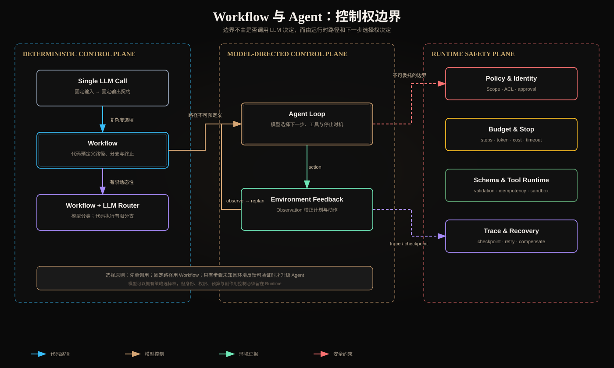

# Building Effective Agents：Workflow 与 Agent 的边界

> 阅读对象：[Anthropic — Building effective agents](https://www.anthropic.com/engineering/building-effective-agents)（2024-12-19）。原文已注明工具生态此后发生变化；本文关注仍然稳定的架构原则，而不是绑定某个框架版本。



## 一、先给结论：边界是“下一步由谁决定”

Anthropic 把两者都归入 agentic systems，但用控制权区分：

- **Workflow**：LLM 和工具沿代码预定义的路径运行。模型可以生成内容、分类或抽取参数，但状态转移集合及终止逻辑由程序给定；
- **Agent**：模型根据目标、当前状态和环境反馈，动态选择下一步、工具、参数以及是否继续。

所以“是否调用多个模型”“是否使用工具”“是否包含循环”都不是充分条件。一个含十个模型节点的固定 DAG 仍是 Workflow；一个只有 `model → tool → observation → model` 的小循环，如果下一步由模型动态决定，就是 Agent。

更精确地说，系统状态为 `s_t`、可选动作为 `A(s_t)`：

```text
Workflow: next = transition_table[s_t, event]
Agent:    action_t ~ π_model(action | goal, s_t, observation_t, tools)
```

二者真正的差异是控制策略 `π` 位于确定性代码还是概率模型。

## 二、不要把“Agent”当能力等级

Agent 不是一定比 Workflow 高级。增加自治会同时扩大：

- 可解决任务空间：能处理步骤数、工具和顺序事前未知的问题；
- 运行时分支数：相同输入可能产生不同轨迹；
- 风险面：错误选择会影响后续 Observation，形成复合错误；
- 资源方差：步骤数、Token、延迟和工具费用更难预测；
- 验证难度：不能只测试一个静态 happy path。

Anthropic 的建议是从能完成任务的最简单方案开始。很多任务经过 Retrieval、few-shot 和结构化输出增强后，一次模型调用就足够；只有评测证明简单方案达不到目标，才增加 Workflow 或 Agent 复杂度。

这是一种**证据驱动的复杂度升级**：

```text
single call
  └─ 若固定拆分可提升质量 → deterministic workflow
       └─ 若输入类别决定有限分支 → routed workflow
            └─ 若步骤/工具/顺序不可预测 → bounded agent
```

## 三、控制权不是二元开关，而是分层分配

生产系统通常是 Hybrid，而非完全固定或完全自治。

| 控制项 | Workflow 常见控制方 | Agent 可拥有的控制 | 必须留在 Runtime |
|---|---|---|---|
| 下一步骤 | 代码/DAG | 根据 Observation 选择 | 最大步骤和可用状态集合 |
| 工具选择 | 固定节点或有限路由 | 动态选择注册工具 | allowlist、Schema、Scope |
| 参数生成 | 模型或代码 | 模型生成 | 类型、范围、业务规则校验 |
| 重试 | 固定策略 | 可建议修正后重试 | 次数、退避、幂等约束 |
| 完成判断 | 固定节点 | 模型提出完成 | 显式证据谓词和输出 Schema |
| 副作用 | 固定调用 | 可提出动作 | 用户确认、授权、幂等、审计 |
| 预算 | 配置 | 可在预算内分配 | Token、费用、时间硬上限 |

关键原则是：**自治的是任务策略，不是安全边界**。模型不能通过在文本里声称“已获授权”来改变 Scope，也不能自行扩大工具集合或绕过确认。

## 四、Augmented LLM 是共同积木，不等于 Agent

原文把带 Retrieval、Tools 和 Memory 的模型称为 augmented LLM。它是 Workflow 和 Agent 的共同基础：

```text
LLM + retrieval + tools + memory + structured output
```

这些能力只说明模型能看到或请求什么，并没有回答谁编排调用。

- 固定执行 `retrieve → answer`：RAG Workflow；
- 模型判断是否检索、改写查询、再决定是否调用数据库：Agentic RAG；
- 模型提出 `tool_call`，Host 总是只允许一个固定工具：仍接近 Workflow；
- 模型能根据多个 Observation 动态改计划：Agent。

MCP 解决工具/资源接入的协议标准化，也不自动把系统变成 Agent。MCP Client、权限代理和 Tool Runtime 都属于 Host 基础设施。

## 五、何时选择 Workflow

适合 Workflow 的信号：

1. 任务可稳定拆成固定步骤；
2. 分支种类有限且可测试；
3. 合规要求必须证明执行顺序；
4. p95 延迟和费用需要严格上界；
5. 失败补偿逻辑明确；
6. 业务规则比环境探索更重要。

例如退款处理：

```text
验证身份 → 查询订单 → 校验退款规则 → dry-run → 用户确认 → 执行 → 对账
```

LLM 可以解释政策或分类原因，但不应决定跳过身份验证或对账。这是 Workflow 的典型场景。

Workflow 的主要优势不是“不会出错”，而是**错误集合更封闭**：每个节点可设置输入输出 Schema、超时、重试和补偿，状态空间更容易枚举。

## 六、何时选择 Agent

适合 Agent 的信号：

1. 所需步骤数事前未知；
2. 工具及调用顺序依赖中间结果；
3. 环境能持续提供可验证反馈；
4. 错误大多可逆，或不可逆动作有确认门；
5. 任务有明确完成标准；
6. 自治带来的成功率提升足以覆盖成本和风险。

代码修复是较好的 Agent 场景：要修改多少文件、先读哪个模块通常由代码库状态决定；测试结果又能作为 ground truth 反馈。但即使如此，删除数据、发布生产和发送外部消息仍需 Runtime/人工授权。

不适合 Agent 的反例：没有可靠 Observation、完成标准主观、动作不可逆、错误代价极高且无法沙箱化。此时 Agent 只是把不确定性藏进多轮生成。

## 七、Agent 最小运行时

一个可控 Agent 不需要庞大框架，但至少需要：

```python
state = initialize(goal, identity, budgets)

while not completion_predicate(state):
    enforce_deadline_and_step_budget(state)
    context = compile_context(state)
    decision = model(context, tools=authorized_tools(state.identity))

    if decision.kind == "final":
        return validate_final(decision, state)

    call = validate_tool_call(decision)
    observation = execute_with_timeout_idempotency_and_trace(call)
    state = reduce(state, decision, observation)

raise BudgetExceeded(state.trace_id)
```

这里 `completion_predicate`、`authorized_tools`、`validate_tool_call` 和预算控制均不应由模型文本替代。

### 最小状态模型

```text
goal
constraints
identity: tenant_id / user_id / scopes
completed_artifacts
pending_work
evidence_refs
failed_attempts
budgets: steps / tokens / cost / deadline
status: running | waiting_approval | completed | failed | cancelled
```

如果状态只是一串无限增长的聊天消息，系统很快会遇到轨迹膨胀、旧信息污染和难以恢复的问题。

## 八、终止与完成不是一回事

常见错误是把“模型返回自然语言答案”当成任务完成。需要区分：

- **模型停止生成**：一次 API 调用结束；
- **Agent 终止**：循环因完成、拒绝、预算、超时、取消或错误退出；
- **业务完成**：外部世界满足可验证谓词。

例如“修复 Bug”的完成谓词可能是：目标测试通过、无新增静态检查错误、修改范围符合约束，并生成变更摘要。模型说“已经修复”不是证据。

建议终止状态至少包含：

| 状态 | 含义 | 是否成功 |
|---|---|---:|
| `completed` | 完成谓词满足 | 是 |
| `needs_input` | 缺少用户决策 | 否，等待恢复 |
| `refused` | 模型或策略拒绝 | 否 |
| `budget_exhausted` | 步数/Token/费用耗尽 | 否 |
| `timed_out` | 全局或工具截止时间到达 | 否 |
| `cancelled` | 用户或上游取消 | 否 |
| `failed` | 不可恢复系统/业务错误 | 否 |

## 九、框架抽象的真实代价

原文提醒框架能简化调用、工具定义和链式连接，但也可能遮蔽 Prompt、响应与状态转移。工程上要特别检查：

- 是否能取得原始 request/response 和 usage；
- Tool Call ID 与 Observation 是否一一对应；
- 重试到底发生在模型层、节点层还是整个任务层；
- Checkpoint 是否包含副作用提交状态；
- 取消是否真正传播到下游工具；
- 框架升级是否改变默认 Prompt、序列化或停止条件。

如果无法画出框架下面的真实循环，就还没有获得可观测性。

## 十、选择检查表

| 问题 | 是 | 否 |
|---|---|---|
| 单次增强调用能达到目标吗？ | 停在单调用 | 继续 |
| 路径和步骤能预先列举吗？ | Workflow | 继续 |
| 只是有限类别不同吗？ | Routing Workflow | 继续 |
| 中间环境反馈是否可靠？ | 可考虑 Agent | 不应自治 |
| 动作是否可逆或有确认？ | 继续 | 收紧为 Workflow |
| 是否有机器可判完成条件？ | 继续 | 先定义验收 |
| 是否有硬预算、Trace、恢复？ | 可上线试验 | 先补运行时 |
| Agent 相对基线有显著增益吗？ | 保留复杂度 | 降级简化 |

## 十一、面试回答模板

> Workflow 和 Agent 都可以调用模型与工具，边界在控制流所有权。Workflow 的路径由代码预定义，适合稳定、可枚举、强合规任务；Agent 让模型根据环境反馈动态决定下一步，适合步骤和工具顺序不可预测的开放任务。生产系统通常是 Hybrid：模型获得策略自治，但身份、权限、预算、Schema、副作用确认和显式完成条件由 Runtime 强制。选择时应先建立单调用和 Workflow 基线，只有评测证明 Agent 的成功率增益覆盖延迟、成本与错误累积，才升级自治。

## 十二、核心总结

1. Agent 的本质不是“多轮”，而是模型拥有动态控制策略；
2. Workflow 的价值不是简单，而是可枚举、可测试、可恢复；
3. Retrieval、Tools、Memory 和 MCP 是增强能力，不决定控制权归属；
4. 自治策略可以交给模型，安全边界必须由确定性 Runtime 执行；
5. 复杂度必须由任务级评测证明，而不是由架构潮流驱动。

