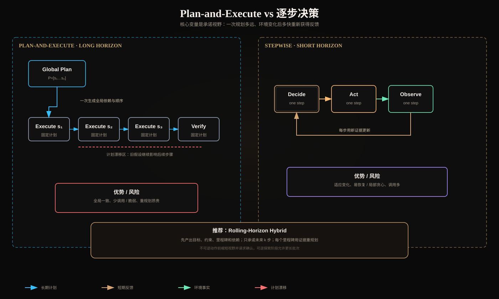

# Plan-and-Execute 与逐步决策：长任务规划权衡



## 一、真正的差异是“承诺视野”

Plan-and-Execute 先生成较完整的全局计划，再按计划执行；逐步决策每获得一次 Observation 就决定下一步。二者不是“有计划”和“没计划”的区别，而是一次对未来承诺多远：

```text
Plan-and-Execute:  commitment horizon k ≈ remaining task
Stepwise:          commitment horizon k = 1
Rolling Horizon:   1 < k << remaining task
```

长任务的挑战是同时满足全局一致性和局部适应性。视野太长会依赖尚未验证的假设；视野太短会局部贪心、忘记依赖和完成条件。

## 二、Plan-and-Execute 的工作模型

```text
goal + initial state
  → planner produces P=[step₁...stepₙ]
  → executor runs P
  → final verifier
```

计划至少应是结构化 DAG，而非自然语言清单：

```json
{
  "plan_version": 3,
  "assumptions": ["tests are runnable"],
  "milestones": [
    {
      "id": "m1",
      "depends_on": [],
      "completion_predicate": "failing test reproduced",
      "artifacts": ["test_report"]
    }
  ],
  "replan_triggers": ["assumption_invalid", "scope_changed"]
}
```

### 优势

- 先识别依赖、关键路径和全局资源；
- 容易展示预计步骤、预算和审批点；
- 模型调用较少，成本和延迟更可预测；
- 多 Worker 可基于 DAG 并行；
- 适合目标稳定、环境变化少的批处理任务。

### 风险

- 初始信息不足时，计划建立在虚假假设上；
- 执行器可能机械遵循已失效步骤；
- 计划更新成本高，局部变化触发大规模重写；
- 计划过细会产生“规划税”，过粗又无法指导执行；
- 完成清单可能替代真实环境验证。

## 三、逐步决策的工作模型

```text
while not done:
    decide one action from current state
    execute
    observe
    update state
```

### 优势

- 每一步都使用最新环境信息；
- 异常后能立刻调整；
- 不必预知全部工具和步骤；
- 适合搜索、调试、交互式 UI 等高不确定环境。

### 风险

- 局部贪心：下一步合理，但偏离最终目标；
- 重复探索：缺少全局去重和已失败策略记录；
- 依赖遗漏：晚期才发现必须先完成的前置项；
- 步骤、Token 和延迟高方差；
- 长轨迹导致上下文膨胀和完成条件遗忘。

逐步决策不是“无计划”。它仍需保留目标、约束、里程碑和当前状态，只是不一次承诺所有动作。

## 四、长任务中的计划漂移

设计划时环境为 `E₀`，第 t 步真实环境为 `E_t`。计划有效性依赖 `distance(E₀,E_t)`。当外部代码、数据、权限或用户目标变化时，继续执行旧计划的期望损失增加。

计划漂移的典型信号：

- Observation 与计划假设冲突；
- 连续重试仍无进展；
- 新 Artifact 改变依赖图；
- 预计成本或时间超过预算；
- 用户修改目标/范围；
- 工具能力或权限变化。

不要每步都完整重规划，也不要永不重规划。应定义触发器：

```text
replan if assumption invalid
       or milestone blocked
       or deviation_score > threshold
       or remaining_budget cannot cover current critical path
```

## 五、错误如何沿计划传播

### 长计划的错误传播

一个早期错误假设可能被多个后续步骤共同引用，影响范围大。但全局计划让依赖可见，也更容易发现某假设的下游消费者。

### 逐步决策的错误传播

错误可能快速通过摘要成为“当前事实”，随后连续选择错误动作。影响通常是逐步发生的，但轨迹越长越难追溯。

可用三个量描述风险：

```text
blast_radius  = 依赖错误状态的后续步骤数
detection_lag = 错误发生到被验证器发现的步骤数
rollback_cost = 恢复到最近正确状态的代价
```

架构目标不是消灭所有错误，而是缩小 blast radius、缩短 detection lag，并保证 rollback/compensation 可执行。

## 六、成本与延迟模型

Plan-and-Execute：

```text
C_PE = C_plan + ΣC_execute_i + C_verify + C_replan
L_PE = L_plan + critical_path(P) + L_verify
```

逐步决策：

```text
C_step = Σ(C_decide_t + C_tool_t + C_state_update_t)
L_step = Σ(L_decide_t + L_tool_t)
```

Plan-and-Execute 的一次规划成本较高，但执行中模型调用可少；逐步决策单轮小，却会反复 Prefill 状态。应使用任务级 cost/success，而非只比较单次模型价格。

并行只能缩短无依赖节点的墙钟时间，不能降低总 Token，且会引入聚合和冲突成本。

## 七、推荐架构：Rolling-Horizon Hybrid

长任务通常更适合滚动视野：

1. 先生成 Goal、Constraints、Milestones、Dependencies；
2. 只把未来 `k` 步具体化；
3. 每步执行后更新 Typed State；
4. 里程碑处验证完成谓词和计划假设；
5. 触发器满足时局部重规划；
6. 不可逆动作前把 `k` 缩到 1 并请求确认。

这里 `k` 可以动态调整：

- 稳定、可逆、低风险阶段：扩大 `k`，减少模型调用；
- 环境不确定或错误率上升：缩小 `k`，增加反馈频率；
- 不可逆动作：`k=1`，先 dry-run/approval；
- 高延迟工具：可批量规划独立调用并行执行。

## 八、Planner 与 Executor 的契约

### Planner 不应做什么

- 不应假设未查询的数据为真；
- 不应自行扩大权限或作用域；
- 不应把“模型认为完成”写成完成谓词；
- 不应生成无法被工具表达的动作；
- 不应在预算外无限添加任务。

### Executor 不应做什么

- 不应机械执行已失效计划；
- 不应改变里程碑语义而不升版本；
- 不应重放状态未知的写操作；
- 不应把部分成功当完整成功；
- 不应丢弃 Observation lineage。

计划每次修改都应生成 `plan_version`，已执行动作引用具体版本，便于 Trace 还原。

## 九、对比实验怎么做

用同一组长任务比较：

1. 固定 Plan-and-Execute；
2. 纯 Stepwise；
3. Rolling-Horizon Hybrid。

数据集要包含：环境不变、早期假设错误、中途状态变化、工具超时、权限不足、用户修改目标和不可逆动作审批。

记录：

| 指标 | 说明 |
|---|---|
| Task success | 最终完成谓词满足率 |
| Plan validity | 执行时仍有效的计划步骤比例 |
| Replan rate | 每任务重规划次数及原因 |
| Wasted actions | 未贡献有效 Artifact 的动作 |
| Detection lag | 错误到发现的步数 |
| Recovery rate | Checkpoint 后恢复成功率 |
| Steps/Token/cost | 均值和 p95 |
| Human intervention | 请求澄清/审批的次数与正确性 |

平均成功率相同的情况下，应优先 p95 更稳、恢复更强且失败更可解释的方案。

## 十、场景决策表

| 场景 | 推荐 | 原因 |
|---|---|---|
| 固定报表生成 | Plan-and-Execute/Workflow | 依赖稳定、可预测 |
| 多文件代码修复 | Rolling Horizon | 需要全局依赖，也需测试反馈 |
| 开放网页研究 | Stepwise + Milestones | 信息源随发现变化 |
| 数据迁移 | Plan DAG + 严格 Checkpoint | 副作用大、需审计恢复 |
| UI 操作 | Stepwise | 页面状态每步变化 |
| 长期客户支持 | Hybrid | 对话动态，但业务动作需固定门禁 |

## 十一、核心总结

1. Plan-and-Execute 优化全局一致性，逐步决策优化环境适应性；
2. 长计划主要风险是计划漂移，短视野主要风险是局部贪心和轨迹膨胀；
3. 评价应关注错误爆炸半径、发现延迟和回滚成本；
4. Rolling Horizon 用里程碑保持全局方向，用短期动作吸收新证据；
5. 计划、状态和完成条件必须结构化、版本化并可由环境验证。

