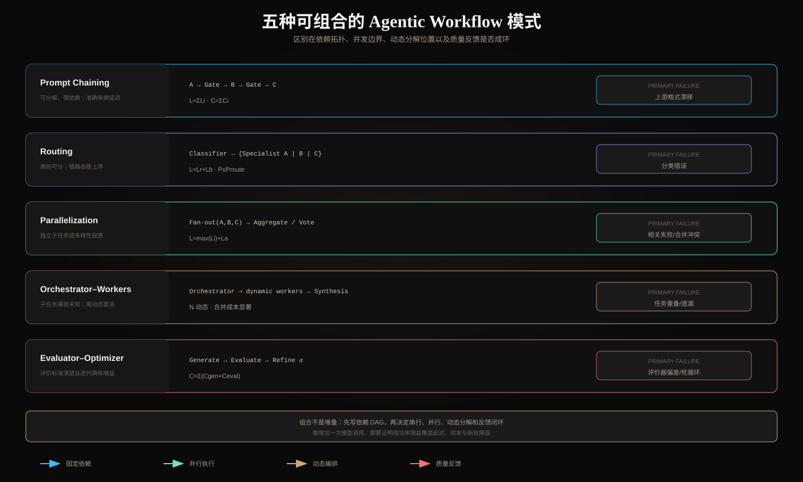

# Prompt Chaining、Routing、并行、Orchestrator-Workers 与 Evaluator-Optimizer

> 模式来源：[Anthropic — Building effective agents](https://www.anthropic.com/engineering/building-effective-agents)。本文把五种模式从示意图推进到依赖拓扑、成本模型、失败传播、适用条件和组合方法。



## 一、先画依赖 DAG，再选择模式

这五个名字不是五套框架，而是五种控制拓扑：

- Chaining：强依赖的串行 DAG；
- Routing：互斥分支选择；
- Parallelization：可并发的 fan-out/fan-in；
- Orchestrator-Workers：运行时动态生成子任务图；
- Evaluator-Optimizer：以质量反馈为边的迭代环。

选择前先回答四个结构问题：

1. 子任务之间是否存在数据依赖？
2. 分支是事前已知还是运行时才知道？
3. 多个结果是合并、投票，还是相互反馈？
4. 质量是否有可执行的评价函数？

如果没有先回答这些问题，只是“套模式”，通常会得到多余模型调用和模糊责任边界。

## 二、Prompt Chaining：把难题变成一组窄任务

### 2.1 拓扑与语义

```text
x → LLM₁ → gate₁ → LLM₂ → gate₂ → ... → LLMₙ → y
```

第 `i+1` 步依赖第 `i` 步的结构化产物。Gate 是确定性检查或独立评价，不应只是“再问同一个模型是否正确”。

典型例子：需求抽取 → 大纲 → 约束校验 → 正文 → 引用校验。

### 2.2 为什么可能提升质量

单次调用需要同时优化多个目标，会产生注意力竞争。Chaining 让每一步的条件分布更窄，并允许在中间阻断错误。收益成立的前提是拆分边界清晰，且中间表示保留后续所需信息。

### 2.3 成本和可靠性

串行延迟近似：

```text
L_chain ≈ Σ(L_model_i + L_gate_i)
C_chain ≈ Σ(C_model_i + C_tool_i)
```

若每一步独立成功率为 `p_i`，没有恢复时端到端上界约为 `Πp_i`。拆分能提高单步 `p_i`，但步骤过多也增加乘法损失，所以“更多链”并不自动更准确。

### 2.4 主要失败

- 上游输出格式漂移，导致下游误读；
- 中间摘要丢失关键约束；
- 每步局部正确但整体目标偏移；
- 重试整条链导致重复副作用。

防线：每步 JSON Schema、内容不变量、Artifact ID、节点级幂等和从最近 Checkpoint 恢复。

## 三、Routing：优化异质输入，而非制造万能 Prompt

### 3.1 拓扑

```text
input → classifier → branch_i(input) → normalized result
```

Router 可以是规则、传统分类器或 LLM。分支应有明确互斥/覆盖策略和统一返回协议。

### 3.2 系统上界由路由质量决定

设路由准确率为 `r`，正确分支成功率为 `p_c`，错分支仍能成功的概率为 `p_w`：

```text
P(success) = r·p_c + (1-r)·p_w
```

即使专家模型非常强，低 `r` 仍会限制整体成功率。必须单独测混淆矩阵，而不是只看最终平均准确率。

### 3.3 设计要点

- 定义 `unknown/ambiguous`，不要强迫所有输入进入某一类；
- 高风险分支优先 Precision，低风险检索分支可优先 Recall；
- 输出分类标签、置信度、依据特征和路由版本；
- 低置信度时走通用模型或请求澄清；
- 用真实流量类别分布测成本，避免实验集失真。

典型失败是类别漂移、新意图无分支、Prompt Injection 操纵路由，以及 Easy/Hard Router 把难题错误交给小模型。

## 四、Parallelization：区分 Sectioning 与 Voting

### 4.1 Sectioning

把独立关注点分给不同调用：

```text
task → {security, correctness, performance} → aggregator
```

并行延迟近似：

```text
L_parallel ≈ max(L_i) + L_aggregate
```

不是 `ΣL_i`，但尾延迟受最慢 Worker 支配。应配置 per-worker deadline 和部分成功策略。

适用条件是子任务相互独立或只读共享输入。若 B 需要 A 的结果，强行并行只会制造推测和返工。

### 4.2 Voting

对同一任务运行多次或多种 Prompt，以多数、阈值或加权评分聚合。Voting 只有在错误不完全相关时才增加可靠性。三个相同模型、相同 Prompt、相同检索上下文的错误高度相关，不能按独立伯努利投票计算。

提高多样性的方式包括不同角色 Prompt、不同检索证据、不同模型族或不同采样种子。但多样性也可能降低可控性，需要校准聚合规则。

### 4.3 聚合器不是附属步骤

Aggregator 必须处理：

- 冲突事实及证据优先级；
- 重复发现去重；
- 缺失 Worker 和超时；
- 不同输出 Schema 版本；
- 每条结论的来源 Worker/证据。

部分成功应显式返回 `completed_workers`、`failed_workers` 和 `coverage`，不能把缺失结果静默当成空结论。

## 五、Orchestrator-Workers：动态分解而不是静态并行

### 5.1 与 Parallelization 的关键区别

两者图形都可能是“一对多”，但控制权不同：

- Parallelization：Worker 集合在设计时确定；
- Orchestrator-Workers：Orchestrator 根据具体输入动态决定子任务数量、边界和委派。

例如代码修改时，涉及哪些文件必须先探索仓库才知道；搜索研究时，信息源和追问也依赖早期结果。

### 5.2 Worker Contract

动态委派不能只传一句自然语言。任务包至少包含：

```json
{
  "task_id": "...",
  "objective": "...",
  "scope": {"allowed_paths": [], "tenant_id": "..."},
  "inputs": [{"artifact_id": "...", "version": 3}],
  "constraints": {"deadline_ms": 5000, "max_tokens": 4000},
  "expected_output_schema": "FindingV2",
  "completion_criteria": ["..."],
  "parent_trace_id": "..."
}
```

### 5.3 动态分解的失败模式

- 任务重叠：两个 Worker 修改同一 Artifact；
- 任务遗漏：分解不覆盖完成条件；
- 上下文泄漏：Worker 获得不必要的租户数据；
- 合并冲突：各自正确但假设不同；
- Fan-out 失控：Worker 数随探索指数增长；
- Orchestrator 单点偏差：错误分解污染所有分支。

需要全局 Worker/Token/费用预算、作用域最小化、任务依赖图、去重键和冲突检测。Worker 的输出是候选 Artifact，不应无条件成为最终事实。

## 六、Evaluator-Optimizer：只有可判质量才值得成环

### 6.1 拓扑

```text
candidate₀ → evaluator → feedback₀ → optimizer → candidate₁ → ...
```

适合条件不是“第一次生成不完美”，而是：

1. 评价标准足够明确；
2. 反馈能定位可修改问题；
3. 修改后质量可测量地提高；
4. 有停止条件防止循环。

### 6.2 Evaluator 的四种类型

| 类型 | 示例 | 优点 | 风险 |
|---|---|---|---|
| 确定性 | 单元测试、Schema、编译器 | 稳定可复现 | 覆盖面有限 |
| 规则评分 | 引用覆盖、字数、禁用项 | 便宜 | 易被指标投机 |
| 模型 Judge | 忠实度、风格、完整性 | 覆盖语义 | 偏差、位置效应、自我偏爱 |
| 人工 | 合规、审美、高风险审批 | 判断丰富 | 慢且昂贵 |

优先使用确定性评价，把模型 Judge 用在无法形式化的维度，并通过人工标注集校准。

### 6.3 停止规则

```text
stop if score ≥ target
     or improvement < ε for m rounds
     or iterations ≥ N
     or token/cost/deadline exhausted
```

还应检测来回振荡：候选 A→B→A 说明评价器目标冲突或反馈不可操作。

## 七、五种模式的工程对比

| 维度 | Chaining | Routing | Parallel | O-W | E-O |
|---|---:|---:|---:|---:|---:|
| 拓扑是否预定义 | 是 | 分支预定义 | 是 | 否 | 环预定义 |
| 子任务是否动态 | 否 | 否 | 否 | 是 | 反馈动态 |
| 主要性能收益 | 降低单步难度 | 专家化 | 降低墙钟时间/增信 | 处理未知分解 | 迭代提质 |
| 首要风险 | 错误串联 | 错路由 | 相关失败/合并 | 遗漏、重叠、失控 | Judge 偏差/死循环 |
| 成本形态 | 线性累加 | 路由+单分支 | 多分支总和 | 动态高方差 | 轮数累加 |
| 最关键指标 | 节点/端到端成功率 | 混淆矩阵 | 尾延迟、相关性 | 覆盖率、重复率 | 单轮增益、收敛率 |

## 八、组合模式：以依赖关系为依据

现实系统可以组合，但每层要有明确目的：

```text
Router
  ├─ simple → single call
  ├─ known complex → prompt chain
  └─ open-ended → orchestrator-workers
                       ├─ workers in parallel
                       └─ evaluator validates synthesis
```

好的组合会让简单请求走短路径，复杂请求才承担高成本。坏的组合是所有请求都经过 Router、Planner、多个 Worker、Judge 和 Optimizer，只因为框架提供这些节点。

## 九、最小可观测模型

每次运行至少记录：

```text
trace_id / pattern / graph_version
node_id / parent_node_id / attempt
model / prompt_version / input_tokens / output_tokens
start / end / status / error_type
artifact_in / artifact_out / schema_version
route_label / confidence
worker_coverage / duplicate_ratio
evaluator_score / feedback / improvement
```

只有端到端 Trace，才能判断成本来自哪里、失败在哪一层传播，以及复杂模式是否真的优于简单基线。

## 十、核心总结

1. Chaining 解决强依赖分解，Gate 防止错误无条件下传；
2. Routing 的上限受分类质量约束，必须允许 unknown；
3. Parallelization 的价值来自独立任务或不相关误差，而非单纯多调用；
4. Orchestrator-Workers 用于子任务事前未知，必须限制动态 Fan-out；
5. Evaluator-Optimizer 依赖可执行评价与收敛条件；
6. 组合前先画 DAG，并用成功率、延迟、成本和故障面证明每个新增节点。

