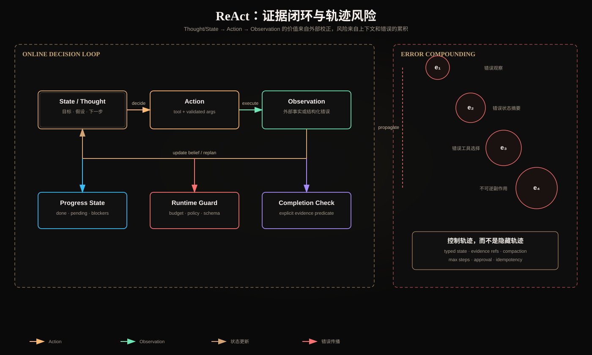

# ReAct：优势、轨迹膨胀与错误累积

> 方法来源：[ReAct: Synergizing Reasoning and Acting in Language Models](https://arxiv.org/abs/2210.03629)。论文把推理轨迹与环境动作交错起来；本文进一步讨论其生产化状态模型、复杂度和安全边界。



## 一、ReAct 不是“让模型多想几步”

ReAct 的核心是交错循环：

```text
Thought/State_t → Action_t → Observation_t → Thought/State_{t+1}
```

推理部分用于维护目标、计划和当前假设；动作把系统连接到搜索、数据库、代码执行或其他环境；Observation 将外部事实带回下一步决策。

与纯 Chain-of-Thought 的根本区别是：纯推理只能在模型已有上下文里继续推演，ReAct 可以通过动作获取新证据并纠正假设。与一次性 Action Plan 的区别是：ReAct 在每个环境反馈后都可更新计划。

论文在 HotpotQA、FEVER、ALFWorld 和 WebShop 等任务中验证了这种推理—行动协同，并报告了相对不含相应组件的基线更好的可解释轨迹与任务表现。但这些基准结论不等价于“任意真实系统使用 ReAct 都会提升”：生产结果还取决于工具设计、Observation 质量、权限和终止条件。

## 二、ReAct 的三个工程优势

### 2.1 用外部证据降低封闭式幻觉

当问题依赖当前库存、文档或执行结果时，模型不能只凭参数记忆回答。Action 把未知命题转换为查询，Observation 成为后续推理依据。

```text
假设：订单可退款
Action：get_order(order_id)
Observation：status=shipped, refund_window_expired=true
更新：不可直接退款，转人工流程
```

关键不是工具“存在”，而是模型能把 Observation 写回决策状态，并且最终结论能够引用它。

### 2.2 处理异常与局部恢复

静态计划假设环境按预期响应；ReAct 能根据 `not_found`、`rate_limited`、参数校验失败等结构化错误调整动作。例如搜索无结果时改写查询，而不是把空结果当成“不存在”。

恢复能力要求工具错误具备稳定结构：

```json
{
  "status": "error",
  "error": {
    "type": "rate_limited",
    "retryable": true,
    "retry_after_ms": 800
  }
}
```

巨大异常栈不是好的 Observation；它浪费 Token，也很难让模型选择正确恢复策略。

### 2.3 轨迹提供调试线索

ReAct 轨迹能揭示是错误假设、错误工具、错误参数还是错误 Observation 导致失败。但“有自然语言 Thought”不等于可观测性。生产 Trace 应记录动作和状态转换的结构化原因，不要求暴露模型私有推理。

建议记录：

```text
step_id / parent_step_id
goal_state_before / decision_summary
tool_call_id / tool_name / validated_args_hash
observation_status / evidence_refs
goal_state_after / completion_status
token / latency / cost / policy_decision
```

## 三、形式化运行时

把 Agent 状态写作 `s_t`，模型策略为 `πθ`，环境转移为 `E`：

```text
a_t ~ πθ(a | g, s_t, o_t, T_authorized)
o_{t+1} = E(a_t)
s_{t+1} = reduce(s_t, a_t, o_{t+1})
```

其中：

- `T_authorized` 必须由身份和 Scope 过滤，而不是把所有工具交给模型；
- `E` 在执行前做 Schema、权限、幂等、确认和超时检查；
- `reduce` 应更新结构化状态，而非无限追加聊天文本；
- 完成条件 `done(s_t, evidence)` 应由 Runtime 验证。

## 四、轨迹膨胀：为什么上下文会越来越差

每一步都可能加入 Thought 摘要、Tool Call、Observation 和框架元数据。若平均每步新增 `r` 个 Token，初始上下文为 `C₀`：

```text
C_T ≈ C₀ + Σ(r_thought_t + r_action_t + r_observation_t)
```

若工具返回规模随探索扩大，增长甚至不是线性的。长轨迹导致：

- Prefill 延迟和费用持续增加；
- 旧的、已失效 Observation 与新事实冲突；
- 相似工具调用重复出现，模型难以辨别最新状态；
- 关键完成条件埋在中间；
- Context Window 截断使早期约束消失。

因此“模型支持更长 Context”只是提高上限，不会自动解决信息密度下降。

### 4.1 不应粗暴删除全部旧轨迹

直接保留最近 N 条会丢失长期任务的目标、不可逆动作记录和用户约束。需要把轨迹拆成不同保留策略：

| 内容 | 策略 |
|---|---|
| 目标、权限、完成条件 | 每步固定保留 |
| 当前任务状态 | 结构化覆盖更新 |
| 已确认事实 | 保存稳定证据引用和版本 |
| 原始大工具结果 | 外置 Artifact，仅保留摘要/句柄 |
| 失败尝试 | 去重后保留原因与禁止重试条件 |
| 低价值对话 | 压缩或淘汰 |
| 副作用提交记录 | 持久保存，不得仅靠摘要 |

### 4.2 Context Compaction 的不变量

压缩前后必须保持：

```text
goal
hard_constraints
identity_and_scope
committed_side_effects
open_subtasks
evidence_lineage
failed_attempts_that_must_not_repeat
budget_remaining
```

可以对摘要做 Schema 校验和 Gold 状态回归，检查关键信息是否丢失。

## 五、错误累积：不是简单的单步错误相加

若每一步独立正确率为 `p`，完成 T 步且全部正确的粗略概率为：

```text
P(all correct) = p^T
```

例如单步 95% 并不意味着 20 步任务仍有 95%；独立假设下约为 35.8%。实际情况可能更糟，因为错误往往相关：错误 Observation 会污染状态，导致后续动作分布整体偏移。

可以把错误分为：

1. **感知错误**：工具返回不完整、过期或权限过滤后的结果被误解；
2. **状态错误**：摘要把假设写成事实；
3. **决策错误**：选择错误工具、参数或顺序；
4. **执行错误**：工具部分成功、超时但结果状态不清；
5. **完成错误**：模型过早声称完成；
6. **不可逆错误**：错误动作已改变外部世界。

这些错误形成因果链，而非互相独立。

## 六、Observation 不是天然可信

Tool Result 可能包含：

- Prompt Injection 文本；
- 过期缓存；
- 部分成功却标记为成功；
- 跨租户数据；
- 不稳定排序或分页缺失；
- 上游服务的自然语言错误页。

Runtime 应为 Observation 附加信任元数据：

```json
{
  "status": "success",
  "data": {},
  "provenance": {"source": "orders-db", "version": 17},
  "authz": {"tenant_id": "t1", "policy": "orders.read@v4"},
  "freshness": {"observed_at": "...", "expires_at": "..."},
  "completeness": {"partial": false, "next_cursor": null}
}
```

模型可以解释 Observation，但不能自行提升其信任等级。

## 七、控制错误累积的七道防线

### 7.1 Typed State

区分 `hypotheses`、`verified_facts`、`pending_actions` 和 `committed_actions`。禁止摘要器把未验证假设晋升为事实。

### 7.2 Evidence-first Completion

完成谓词检查 Artifact、测试、业务状态或引用，不接受纯文本自报完成。

### 7.3 Step/Token/Cost/Deadline Budget

预算应由 Runtime 在调用前预留，在调用后结算。达到软阈值时压缩或降级，达到硬阈值时终止。

### 7.4 Idempotency 与提交协议

读操作可安全重试；写操作必须有幂等键。超时后状态未知时先查询，而不是盲目重放。高风险动作使用 `prepare/dry-run → confirm → commit`。

### 7.5 Checkpoint 与恢复

Checkpoint 保存结构化状态、Artifact 引用、预算及副作用提交点。恢复时验证外部世界是否已变化，不能简单从旧消息继续。

### 7.6 独立验证器

Schema、编译器、测试、权限引擎和业务数据库优先于模型自评。模型 Judge 只能补充语义维度。

### 7.7 Human Checkpoint

在不可逆、高价值、权限扩大或证据冲突处暂停。Human-in-the-loop 是风险门，不应成为每一步都要人工操作的伪自动化。

## 八、评估 ReAct 不能只看最终答案

| 层级 | 指标 |
|---|---|
| 任务 | success rate、完成质量、无答案/拒答正确率 |
| 轨迹 | 平均/分位步骤数、重复动作率、无效工具率 |
| 证据 | Observation 利用率、引用正确率、过期证据率 |
| 恢复 | 可恢复错误恢复率、Checkpoint resume 成功率 |
| 安全 | 越权工具尝试率、确认绕过率、跨租户泄漏率 |
| 资源 | input/output Token、工具费用、p50/p95 延迟 |
| 完成 | premature completion、budget exhaustion |

需要比较至少三个基线：single call、固定 Workflow、bounded ReAct。否则无法判断收益来自更多 Token、更多检索，还是闭环决策本身。

## 九、何时不应使用 ReAct

- 路径完全固定且每步可枚举；
- 没有可靠环境反馈，Action 只返回另一段生成文本；
- 动作不可逆且缺少确认、幂等和补偿；
- 完成条件无法定义；
- 延迟/费用要求不允许多轮；
- 一次 Retrieval + structured output 已达到目标。

## 十、核心总结

1. ReAct 的优势来自外部证据校正，而非更长的自然语言推理；
2. 轨迹应还原为 Typed State、Evidence 和 Artifact，而不是无限聊天历史；
3. 单步小错误会通过状态和 Observation 形成相关性累积；
4. 权限、Schema、预算、幂等和完成判断必须由 Runtime 强制；
5. 评价需要同时覆盖最终成功、轨迹效率、恢复、安全和资源成本。

