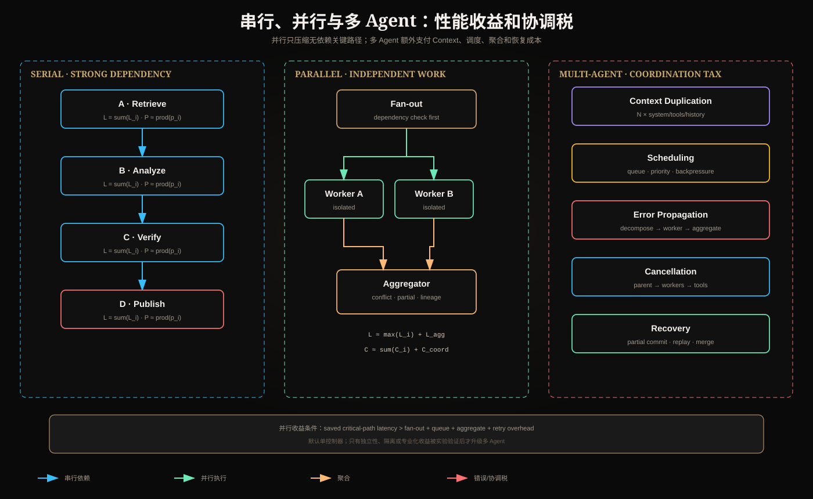

# 串行/并行编排与多 Agent 的上下文、错误、调度和成本



## 一、先看依赖，再谈并行

串行或并行不是审美选择。若 B 消费 A 的 Artifact，则 `A→B` 必须串行；只有没有数据、控制和资源依赖的任务才能安全并行。

```text
serial latency:   Ls = Σ Li
parallel latency: Lp ≈ max(Li) + Lfanout + Laggregate
```

并行降低墙钟时间，但通常不降低总工作量：

```text
parallel cost ≈ Σ Ci + coordination cost
```

当任务很短时，Fan-out、排队和聚合开销可能大于节省。

## 二、串行编排

优势：上下文自然传递、状态一致、调试简单、资源可预测。风险：延迟累加，上游错误沿链传播，下游可能消费错误 Artifact。

若各步条件成功率近似为 `p_i`，无恢复时：

```text
P(end-to-end success) ≈ Π p_i
```

步骤越多不一定越准确。拆分只有在降低每步难度带来的 `p_i` 提升超过新增乘法故障面时才有价值。

防线包括节点 Schema、Gate、Artifact 版本、局部重试和从最近 Checkpoint 恢复。

## 三、并行编排

### Sectioning

把不同独立维度分开，例如安全、性能、正确性审查。Aggregator 处理冲突和 coverage。

### Voting

多个调用处理同一问题。只有错误不高度相关时才提升可靠性。相同模型、Prompt 和证据的多次生成可能一致犯错。

### Speculative Execution

并行运行快速低成本路径和较慢高质量路径，若快速结果通过 Gate 就取消慢路径。必须真实传播取消，否则只是双倍付费。

## 四、多 Agent Context 重复

若 N 个 Worker 都收到同一 System Prompt、工具定义和历史：

```text
T_input ≈ N × (T_system + T_tools + T_shared_history) + ΣT_task_i
```

这是多 Agent 常见隐藏成本。更糟的是共享历史包含大量无关内容，会同时稀释每个 Worker 的注意力。

降低方式：

- Worker 只接收 Goal Slice、最小权限和 Artifact 引用；
- 稳定公共前缀使用服务端 Prompt Cache；
- 大结果外置，传 ID、版本和查询句柄；
- 不复制父 Agent 完整聊天历史；
- 每个 Worker 有独立 Context Budget；
- Aggregator 获取结构化结果，不获取全部内部轨迹。

Prompt Cache 降低计费/Prefill，不消除上下文污染和泄露风险。

## 五、错误传播图

多 Agent 的成功链不只包含 Worker：

```text
decomposition
  → assignment
  → worker execution
  → result serialization
  → aggregation
  → final verification
```

粗略表示：

```text
P_success ≈ P_decompose × ΠP_worker × P_aggregate × P_verify
```

真实错误并不独立。错误任务分解可能同时污染所有 Worker；共享过期证据会产生相关失败；Aggregator 可能把多数一致误判为正确。

### 错误隔离

- Worker 不直接修改共享状态；先输出 Artifact；
- 每个 Artifact 有来源、版本和置信边界；
- Aggregator 检查矛盾，不静默 last-write-wins；
- 副作用通过单一 Commit Coordinator；
- 对可选 Worker 支持 partial success；
- 对必需 Worker 失败阻断完成谓词。

## 六、调度问题

### Worker 池与背压

无限 Fan-out 会触发模型 RPM/TPM、工具连接池和业务服务限流。Scheduler 应设置：

```text
global_max_workers
per_tenant_concurrency
per_model_rate_limit
per_tool_concurrency
queue_depth_limit
deadline_aware_admission
```

当预计关键路径无法在 deadline 内完成时，应拒绝接纳、降级或请求延期，而不是让任务进入必然超时的队列。

### 公平性与优先级

只按 FIFO 可能让长任务阻塞短任务；只按业务优先级可能导致低优先级饥饿。可以使用 weighted fair queue、aging 和 tenant quota。

### Straggler

并行总延迟由最慢 Worker 决定。处理方式：per-worker deadline、备用 Worker、提前聚合 quorum、取消低价值分支。Hedged request 会增加成本，需要只对长尾异常启用。

## 七、聚合器是核心组件

Aggregator 必须处理：

- Schema 和版本兼容；
- 重复结果与语义去重；
- 来源冲突和权威性；
- 缺失 Worker；
- partial/failed 状态；
- 每条最终结论的 lineage；
- 已取消但晚到的结果。

建议结果：

```json
{
  "status": "partial",
  "completed_workers": ["security", "correctness"],
  "failed_workers": ["performance"],
  "coverage": 0.67,
  "conflicts": [],
  "artifact_id": "review-v4"
}
```

## 八、取消和超时传播

取消链：

```text
User → Orchestrator → Queue/Workers → Tools
```

父任务取消后：停止创建新 Worker，取消尚未领取任务，向在途调用发信号，忽略晚到结果，并 reconcile 已提交副作用。仅在 UI 上停止流式显示并不等于系统已取消。

全局 deadline 必须向下传递剩余时间，而不是每层重新获得完整超时：

```text
child_deadline = min(parent_deadline, now + child_limit)
```

## 九、成本模型

```text
C_total = C_orchestrator
        + Σ(C_model_worker + C_tool_worker)
        + C_queue + C_storage
        + C_aggregate + C_verify
        + C_retry + C_wasted_cancelled_work
```

关键指标不是 cost/call，而是：

```text
cost_per_success = total_cost / successful_tasks
```

失败和取消的费用必须计入。否则高失败多 Agent 系统会因只看成功轨迹显得虚假便宜。

## 十、何时并行、多 Agent 才值得

需要满足至少一种可测收益：

- 独立子任务并行显著缩短关键路径；
- 不同 Worker 需要隔离 Context 或权限；
- 不同领域需要专用模型和工具；
- 错误多样性经过测量，投票真正增益；
- 单 Agent Context 无法承载数据，但 Artifact 分区自然存在。

若多个 Worker 使用相同模型、相同 Context 做高度相似工作，应先尝试单 Agent、批处理工具调用或普通并发函数。

## 十一、评测方法

对 Single Agent、并行 Workflow、Manager-Workers 使用同一任务集比较：

- task success；
- wall-clock p50/p95/p99；
- total Token 和 cached Token；
- tool calls、model calls、worker count；
- decomposition overlap/gap；
- aggregation conflict rate；
- context duplication ratio；
- straggler rate；
- cancellation wasted cost；
- recovery success 和 duplicate side effect。

至少多次运行并轮换执行顺序，避免服务负载漂移造成不可比。

## 十二、架构评审问题

1. 哪些边证明任务可以并行？
2. Worker 是否收到不必要的历史或权限？
3. 错误是否相关，Voting 假设是否成立？
4. 谁解决冲突，依据什么来源优先级？
5. 最慢 Worker 如何影响 p95？
6. 全局预算如何分配和回收？
7. 取消是否传播到 Tool Runtime？
8. 部分成功能否被上层理解？
9. 写操作由谁统一提交？
10. 多 Agent 相对单 Agent 的增益是否有数据？

## 十三、核心总结

串行适合强依赖，并行适合独立工作；多 Agent 不只增加推理能力，也增加 Context 重复、调度、聚合和恢复成本。并行化必须以依赖图和关键路径为依据，多 Agent 必须用任务级数据证明协调税值得支付。

