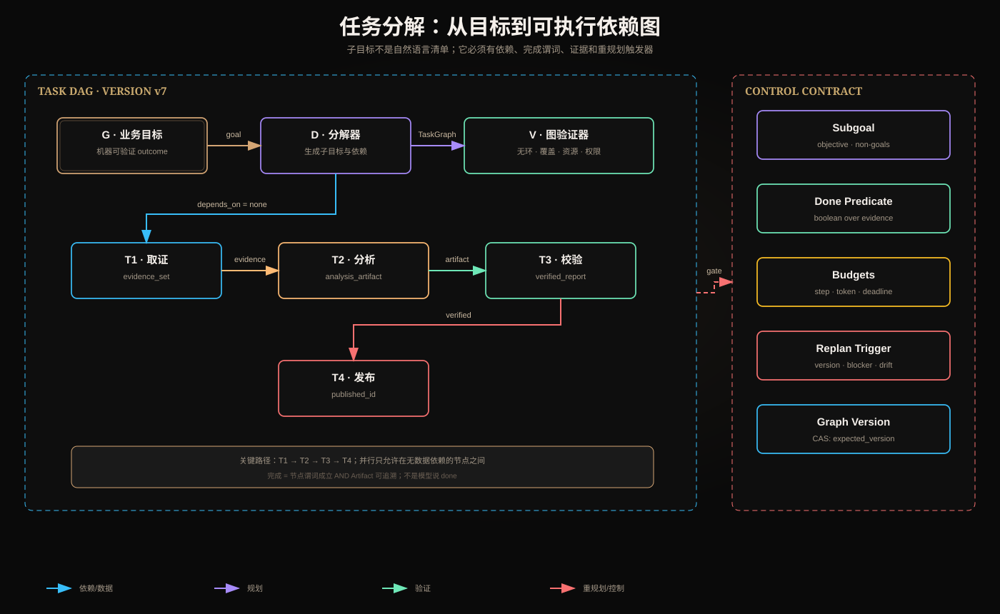

# 任务分解、依赖图、子目标、完成条件与重规划触发器



## 一、核心结论

任务分解不是把用户请求改写成更长的待办列表，而是把业务目标编译成一个**可执行、可验证、可恢复、可版本化**的任务图。一个合格子任务至少包含目标、输入、输出 Artifact、依赖、完成谓词、预算、权限和失败语义。

如果子任务只有一句“分析数据”，调度器无法判断何时运行、是否完成、失败后从哪里继续；模型也容易把“生成了一段文本”误当作业务完成。

## 二、从目标到 Task Graph

设任务图为：

```text
G = (V, E, C, B, P)
```

- `V`：子任务集合；
- `E`：依赖边，`u → v` 表示 v 消费 u 的 Artifact；
- `C`：每个节点的完成谓词；
- `B`：步骤、Token、费用、时间和并发预算；
- `P`：身份、Scope、ACL、确认和副作用策略。

图不仅描述执行顺序，还承载数据血缘和控制约束。没有 Artifact 的箭头只是视觉顺序，不是真正的数据依赖。

## 三、子目标的最小契约

```json
{
  "task_id": "research.verify.v3",
  "objective": "验证候选结论并输出带来源报告",
  "non_goals": ["修改原始数据"],
  "depends_on": ["research.retrieve.v2"],
  "inputs": [{"artifact_id": "evidence-set", "version": 8}],
  "output_schema": "VerifiedReportV2",
  "completion_predicate": "report.valid && citations.coverage >= 0.9",
  "budgets": {"deadline_ms": 10000, "max_tokens": 4000},
  "authz": {"tenant_id": "t1", "scopes": ["docs.read"]},
  "retry_policy": {"max_attempts": 2},
  "replan_triggers": ["input_version_changed", "evidence_conflict"]
}
```

### Objective 与 Non-goals

Objective 描述可观察结果，不写“思考一下”。Non-goals 限制模型顺手扩大范围，例如研究任务不得修改源文档。它们共同定义任务边界。

### 输入与输出

输入使用稳定 Artifact ID 和版本，不把巨大自然语言结果层层复制。输出必须有 Schema、来源和状态：`success`、`partial` 或 `failed`。

### 完成谓词

完成谓词是能返回真假的条件：

```text
done(v) = schema_valid(output_v)
       AND required_evidence_present(output_v)
       AND policy_passed(output_v)
```

“Agent 认为完成”不是谓词。代码任务可以检查测试，支付任务查询权威流水，研究任务检查来源覆盖和引用正确性。

## 四、依赖图与普通 Todo List 的区别

| 维度 | Todo List | Task DAG |
|---|---|---|
| 顺序 | 文本暗示 | 显式边 |
| 输入输出 | 常缺失 | Artifact 契约 |
| 并行判断 | 靠直觉 | 无依赖节点可并行 |
| 完成判断 | 勾选 | 谓词 + 证据 |
| 失败影响 | 难定位 | 可计算下游影响 |
| 恢复 | 重跑整个列表 | 从安全 Checkpoint 恢复 |
| 版本 | 通常没有 | graph/task/artifact version |

任务 A 和 B 即使在列表中相邻，也不一定存在依赖。反过来，隐藏依赖会导致错误并行：B 在 A 的数据尚未提交时开始，用猜测填补输入。

## 五、分解的四类边

1. **数据依赖**：下游消费上游 Artifact；
2. **控制依赖**：必须通过审批或 Gate 才能继续；
3. **资源依赖**：共享锁、额度或稀缺执行器；
4. **补偿依赖**：失败后按逆序执行 Saga 补偿。

不要把这四类都画成无标签箭头。数据依赖决定可用输入，控制依赖决定合法性，资源依赖决定调度，补偿依赖只在失败路径生效。

## 六、如何验证任务图

Planner 的输出必须经过确定性图验证器：

```text
acyclic(G)
all_dependencies_exist(G)
all_nodes_have_completion_predicate(G)
all_outputs_have_schema(G)
budget_sum_within_limit(G)
scopes_subset_of_parent(G)
side_effects_have_idempotency_and_approval(G)
terminal_nodes_cover_business_goal(G)
```

### 无环不是绝对禁止循环

主任务依赖通常用 DAG 表达；重试、ReAct 或优化循环作为一个**有界复合节点**存在，内部有最大轮数和退出条件。把任意循环直接塞进 DAG 会破坏拓扑排序和关键路径计算。

## 七、分解粒度

粒度太粗：上下文过大、完成难验证、失败只能整块重跑。粒度太细：模型调用、序列化、调度和 Trace 成本超过收益。

一个实用子任务边界通常满足：

- 只有一个主要结果；
- 可由一个明确执行器完成；
- 输入输出能结构化；
- 失败可局部重试；
- 预算可估计；
- 不与其他节点共享未显式声明的可变状态。

可以用“失败后是否值得只重跑这一块”判断拆分价值。

## 八、关键路径与并行

节点持续时间为 `d(v)`，DAG 总延迟下界是关键路径：

```text
L_min = max_path Σ d(v)
```

并行只能压缩不在同一依赖链上的节点，不能让 `retrieve → analyze → verify` 同时运行。并发还受 Worker 数、Rate Limit 和共享资源限制。

调度优先级不应只看任务创建时间，可以综合：

```text
priority = critical_path_slack
         + business_priority
         + deadline_urgency
         - retry_penalty
```

## 九、重规划触发器

重规划不是“模型不满意就再计划一次”，应由可观察事件触发：

| 触发器 | 证据 | 动作 |
|---|---|---|
| 输入版本变化 | expected ≠ current | 废弃受影响下游，升 graph version |
| 假设失效 | Observation 与 assumption 冲突 | 更新假设并局部重规划 |
| 节点阻塞 | 依赖长期不可用 | 选择降级路径或请求输入 |
| 预算偏差 | remaining < estimated critical path | 缩小范围或终止 |
| 连续无进展 | 相同状态/动作重复 | 切换策略，避免死循环 |
| 用户改目标 | goal_version 变化 | 重新计算覆盖，不复用错误结果 |
| 安全策略变化 | policy_version 变化 | 重新授权所有未执行节点 |
| 新证据冲突 | 多来源互斥 | 增加验证节点，而非静默覆盖 |

### 局部重规划优于全图推倒

计算从变化节点可达的下游集合，只使这些节点失效：

```text
invalidated = descendants(changed_node)
```

未受影响且 Artifact 版本仍有效的节点可以复用。全量重规划更简单，但会增加成本并可能重复副作用。

## 十、计划版本与并发修改

```text
graph_version: 7
task_version: 3
artifact_version: 8
expected_graph_version: 7
```

更新使用 Compare-and-Swap：只有数据库当前版本等于 `expected_version` 才提交新计划。否则说明另一个 Planner 或用户已经修改状态，当前写入必须拒绝并重新读取。

计划版本更新不应改变已提交业务事实；它只改变未来执行图。若需撤销已有副作用，必须走补偿协议。

## 十一、失败传播

节点失败不等于整个任务必然失败。需要声明边的容错语义：

- required：上游失败则下游阻塞；
- optional：允许缺失，输出标记 coverage；
- fallback：切换备用节点；
- quorum：满足 N-of-M 即可继续；
- compensate：触发逆向业务动作。

部分成功必须进入数据模型，不能把缺失 Artifact 当成空内容：

```json
{"status":"partial","completed":["A","B"],"failed":["C"],"coverage":0.67}
```

## 十二、评估指标

- goal completion rate；
- decomposition coverage：子目标是否覆盖全部完成谓词；
- dependency precision/recall：边是否多余或遗漏；
- critical-path prediction error；
- replan rate 及触发原因；
- reused artifact ratio；
- wasted action ratio；
- premature completion rate；
- graph validation rejection rate；
- recovery success rate。

## 十三、设计检查表

1. 最终业务谓词是否可验证？
2. 每个节点是否有单一、明确产物？
3. 每条边是否标出数据或控制语义？
4. DAG 是否无环且覆盖目标？
5. 权限是否只缩小不扩大？
6. 哪些节点可并行，是否真的无依赖？
7. 哪些错误可重试，哪些必须重规划？
8. 版本变化会使哪些下游 Artifact 失效？
9. 已提交副作用如何避免重复？
10. 报告能否还原某次重规划的因果链？

## 十四、核心总结

任务分解的产物不是步骤文本，而是带版本和证据契约的执行图；子目标必须有完成谓词；依赖决定并行与失败传播；重规划由环境变化触发，并优先只使受影响的下游失效。

