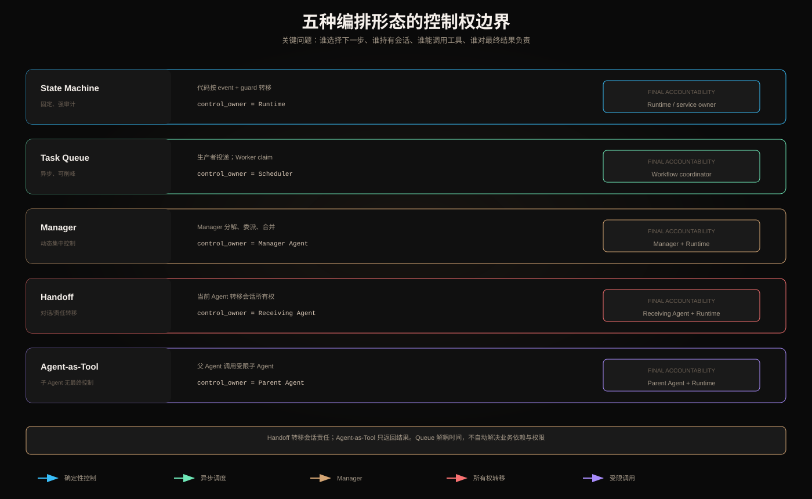

# 状态机、任务队列、Manager、Handoff 与 Agent-as-Tool 控制权边界



## 一、先用四个问题识别控制权

1. 谁选择下一步？
2. 谁持有当前会话/任务所有权？
3. 谁可以调用哪些工具？
4. 谁对最终完成和副作用负责？

五种形态可能同时存在于一个系统，但不能混淆其语义。Queue 是传输与调度机制；State Machine 是确定性控制；Manager 是动态编排者；Handoff 转移控制权；Agent-as-Tool 保留父 Agent 控制权。

## 二、状态机：控制权在代码

状态机定义：

```text
(state, event) --[guard] / action--> next_state
```

例如：

```text
DRAFT → VALIDATED → WAITING_APPROVAL → COMMITTED
              └────[reject]────→ CANCELLED
```

Guard 检查权限、版本和业务规则；Action 执行工具；Runtime 决定合法转移。LLM 可以生成 event 候选或动作参数，但不能发明状态和跳过 Guard。

优势：状态空间可枚举、审计强、易于恢复。限制：面对步骤未知的开放任务灵活性不足。可把有界 Agent Loop 封装成一个复合状态，同时保持外层安全状态机。

### 最小事件记录

```json
{
  "entity_id": "task-1",
  "from": "VALIDATED",
  "event": "REQUEST_COMMIT",
  "guard_version": 4,
  "to": "WAITING_APPROVAL",
  "state_version": 9
}
```

## 三、任务队列：解耦时间，不拥有业务决策

Queue 解决生产者与消费者的时间、吞吐和故障隔离：

```text
Producer → Queue → Worker
```

Queue 可以提供 visibility timeout、ack、重投递、优先级和死信队列，但通常不知道业务任务是否真正完成。消息被 ack 只表示消费协议完成，不代表订单或研究目标完成。

关键设计：

- at-least-once 投递下 Worker 必须幂等；
- lease 超时后消息可能被其他 Worker 领取；
- retryable 与 permanent failure 分离；
- backpressure 防止下游过载；
- dead-letter 需要人工/自动修复和重放策略；
- payload 只传 Artifact ID，不复制巨大 Context 或 Token。

控制权属于生产 Workflow/Scheduler，Worker 只执行被声明的任务契约。

## 四、Manager：集中式动态委派

Manager Agent 根据输入分解任务、创建 Worker、跟踪依赖和聚合结果：

```text
goal → Manager → worker tasks → artifacts → Manager synthesis
```

它拥有动态任务图控制权，但 Runtime 仍拥有：最大 Worker 数、预算、权限、Tool allowlist、取消和副作用门禁。

Manager 的主要风险：

- 错误分解成为单点偏差；
- 子任务重叠或遗漏；
- Worker Fan-out 失控；
- Aggregator 接受没有来源的结果；
- Manager Context 变成所有 Worker 输出的垃圾场。

需要 TaskGraph 验证、Worker Contract、全局预算、Artifact Registry 和冲突检测。

## 五、Handoff：转移会话与责任

Handoff 的语义是：当前 Agent 将后续控制权交给另一个 Agent，接收方成为新的 active owner。

```text
Support Agent --handoff--> Refund Specialist
```

一个合格 Handoff 包含：

```json
{
  "conversation_id": "c1",
  "from_agent": "support",
  "to_agent": "refund",
  "reason": "refund intent verified",
  "summary": "...",
  "artifact_refs": ["order-123@v7"],
  "pending_commitments": [],
  "authorization_context_ref": "authctx-9",
  "handoff_id": "h-18"
}
```

接收方必须显式 accept，失败或超时要返回原 owner 或进入人工队列。不能只改变 Prompt 中的角色名称就声称完成 Handoff。

### Handoff 的安全边界

- 不传原始 Access Token 给模型；
- 接收方重新计算可用工具和 Scope；
- 用户承诺、未完成副作用和 deadline 必须传递；
- 防止 A→B→A 无限乒乓，设置 handoff budget；
- Trace 保留所有权转移链。

## 六、Agent-as-Tool：父 Agent 保留最终控制

父 Agent 把子 Agent 当成一个具有 Schema 的能力调用：

```text
Parent Agent → research_agent({query, scope}) → ResearchArtifact
```

子 Agent 可以在内部执行有界循环，但它：

- 不接管用户会话；
- 不决定父任务是否完成；
- 不默认继承父 Agent 的全部上下文和权限；
- 只返回契约化结果、证据、状态和成本。

它比 Handoff 更像函数调用。父 Agent 负责是否调用、如何使用结果和最终综合。

### 最小返回契约

```json
{
  "status": "success|partial|failed",
  "artifact_id": "research-7",
  "summary": "...",
  "evidence_refs": [],
  "limitations": [],
  "usage": {"steps": 5, "tokens": 3200}
}
```

## 七、五者的精确比较

| 维度 | 状态机 | 任务队列 | Manager | Handoff | Agent-as-Tool |
|---|---|---|---|---|---|
| 下一步决策 | 代码转移表 | 上游/Scheduler | Manager 模型 | 接收 Agent | 父 Agent |
| 会话 owner | Runtime | 通常不涉及 | Manager | 转移给接收方 | 父 Agent |
| 子任务动态性 | 低 | 取决于生产者 | 高 | 中 | 子 Agent 内部可高 |
| 时间解耦 | 可选 | 强 | 可结合 Queue | 通常同步/交互 | 调用式 |
| 最终完成判断 | Runtime | Coordinator | Manager + Runtime | 当前 owner + Runtime | 父 Agent + Runtime |
| 典型优势 | 可审计 | 削峰、重投递 | 动态分解 | 专业会话接管 | 上下文与能力隔离 |
| 主要风险 | 状态爆炸 | 重复投递 | 集中偏差 | 乒乓/责任丢失 | 隐藏内部成本 |

## 八、常见误区

### Queue 不是 Workflow

Queue 不知道任务依赖、完成谓词或业务补偿。它只是承载 Task Envelope。Workflow Coordinator 才负责业务状态。

### Manager 不等于普通 Router

Router 从预定义分支中选择；Manager 可以动态创建子任务及依赖。动态性更强，也更需要预算和图验证。

### Handoff 不等于 Agent-as-Tool

Handoff 改变 active owner；Agent-as-Tool 调用结束后控制权回到父 Agent。这是面试中最重要的边界。

### 多 Agent 不等于 A2A

同一 Runtime 内的 Manager/Worker 可以只是内部函数或队列。只有独立 Agent 通过标准协议发现能力、交换任务和状态时，才可能使用 A2A；多 Agent 是架构，A2A 是协议选择。

## 九、组合示例

```text
外层 State Machine
  READY → RUNNING → WAITING_APPROVAL → COMMITTED
                │
                └─ Manager creates TaskGraph
                       ├─ Queue → Worker A
                       ├─ Queue → Agent-as-Tool B
                       └─ Handoff → Human Specialist
```

外层状态机负责不可协商业务边界；Manager 提供动态分解；Queue 提供异步调度；Agent-as-Tool 提供受限能力；只有真正需要接管交互时才 Handoff。

## 十、观测字段

```text
root_trace_id
control_owner
conversation_owner
task_id / queue_message_id / lease_id
manager_plan_version
handoff_id / from / to / accepted_at
parent_agent_id / child_call_id
authorization_context_ref
completion_verdict_source
```

如果无法从 Trace 回答“这一刻谁拥有控制权”，架构边界就没有真正落地。

## 十一、选择决策

```text
路径是否可枚举？ → State Machine
需要异步削峰和重投递？ → Task Queue
子任务事前未知且需动态分解？ → Manager
是否要转移会话和后续责任？ → Handoff
只是需要一个受限专家结果？ → Agent-as-Tool
```

这些选择可叠加，但每一层只解决对应问题，不要用 Manager 替代权限，不要用 Queue 替代业务状态机。

## 十二、核心总结

状态机拥有确定性控制，Queue 解耦执行时间，Manager 动态生成任务图，Handoff 转移会话责任，Agent-as-Tool 保留父控制权。清楚描述 owner、权限和完成责任，比给系统贴“多 Agent”标签更重要。

