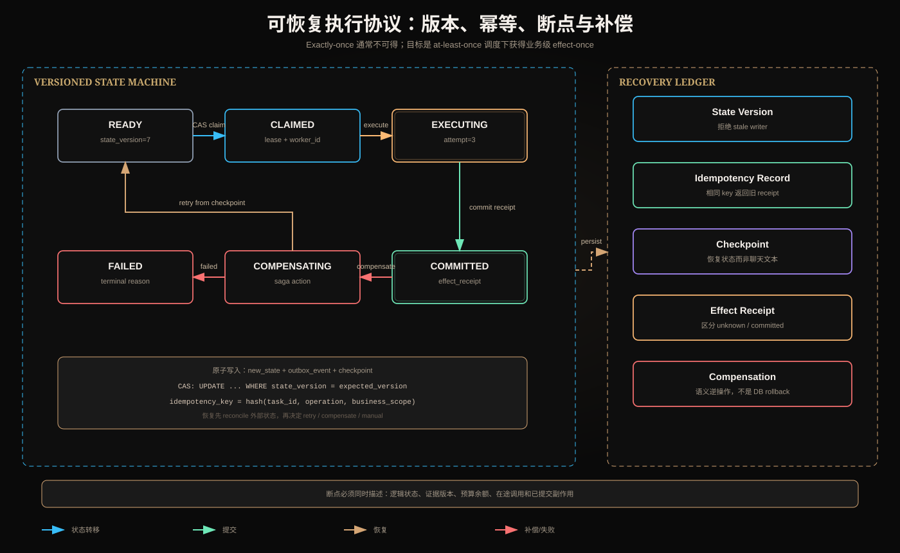

# 状态版本、幂等执行、断点与补偿动作



## 一、核心目标：业务效果只发生一次

分布式系统很难保证端到端 Exactly-once。网络超时时，调用方不知道请求未到达、执行失败，还是已经提交但响应丢失。

更实际的目标是：

```text
at-least-once delivery
+ idempotent execution
+ durable state/effect ledger
= effect-once business semantics
```

Agent 的重试、恢复和重规划必须围绕这一事实设计。

## 二、状态版本：阻止陈旧写入

任务状态：

```json
{
  "task_id": "t-1",
  "state": "EXECUTING",
  "state_version": 7,
  "plan_version": 3,
  "artifact_versions": {"evidence": 8},
  "updated_at": "..."
}
```

更新采用 Optimistic Concurrency Control：

```sql
UPDATE task
SET state = 'COMMITTED', state_version = 8
WHERE task_id = 't-1' AND state_version = 7;
```

影响行数为 0，说明另一个 Worker 或 Planner 已修改状态，当前执行者是 stale writer。它必须重新读取，不能覆盖新状态。

### 三种版本不能混用

- state_version：运行状态每次修改递增；
- plan_version：任务依赖图改变；
- artifact_version：输入/输出事实版本。

计划不变不表示外部数据不变；Artifact 更新也不一定需要全图重规划。

## 三、幂等键

幂等键标识“同一个业务意图”，而不是同一次网络请求：

```text
idempotency_key = hash(
  tenant_id,
  task_id,
  operation,
  business_scope,
  semantic_input_version
)
```

例如退款键应绑定订单和退款意图，不能每次重试随机生成新键。否则下游会认为是两个不同退款。

### 幂等记录

```json
{
  "key": "idem-...",
  "request_hash": "...",
  "status": "COMMITTED",
  "result_ref": "refund-889",
  "created_at": "...",
  "expires_at": "..."
}
```

相同 key、相同 request hash 返回历史结果；相同 key、不同内容必须报冲突，不能默默复用。

## 四、执行状态机

推荐状态：

```text
READY
  → CLAIMED
  → EXECUTING
  → COMMITTED
       └→ COMPENSATING → COMPENSATED

任意非终态 → FAILED / CANCELLED / UNKNOWN
```

### UNKNOWN 必不可少

写操作超时后不能假设失败：

```text
timeout ≠ not committed
```

进入 `UNKNOWN`，使用幂等键查询 Effect Ledger 或权威业务状态。确认未提交才重试；确认已提交则恢复本地状态；无法确认时人工处理。

## 五、断点 Checkpoint

Checkpoint 不是保存聊天历史，而是保存安全恢复所需状态：

```json
{
  "checkpoint_id": "cp-19",
  "task_id": "t-1",
  "state_version": 7,
  "plan_version": 3,
  "current_node": "verify",
  "verified_artifacts": [{"id": "ev", "version": 8}],
  "pending_nodes": ["publish"],
  "committed_effects": ["ticket-created:44"],
  "inflight_calls": [{"call_id": "c8", "idempotency_key": "i9"}],
  "budget_remaining": {"steps": 4, "deadline": "..."},
  "failed_attempts": []
}
```

恢复时重新验证：授权是否过期、Artifact 是否仍新鲜、lease 是否失效、在途调用是否已经提交、预算是否仍足够。

## 六、Checkpoint 的原子性

若状态更新成功但事件没发出，会丢任务；事件发出但状态未提交，会重复执行。可以用 Transactional Outbox：

```text
one database transaction:
  update task state
  insert checkpoint
  insert outbox event
commit
```

独立 Publisher 读取 Outbox 并发布；发布可能重复，所以消费者仍需幂等。

Checkpoint 频率是权衡：太少导致大量重放，太多增加 I/O。不可逆动作前后、长工具调用后和里程碑处通常必须保存。

## 七、补偿动作不是数据库回滚

外部副作用通常无法 ACID 回滚。Saga 为每个已提交步骤定义语义逆操作：

```text
reserve_inventory  ↔ release_inventory
charge_payment     ↔ refund_payment
create_ticket      ↔ close_ticket_with_reason
```

补偿本身也会失败，需要幂等键、重试、状态和人工升级。它不能保证世界回到完全相同状态，例如退款发生汇率差、通知已被用户看到。

因此 Compensation 应输出业务事实，不声称“仿佛从未发生”。

## 八、Saga 编排

### Orchestration

中央 Coordinator 记录已完成步骤并按逆序补偿。可观测强，但 Coordinator 是关键组件。

### Choreography

服务通过事件触发下一步和补偿。耦合较松，但全局因果链和循环更难理解。

Agent 系统通常适合外层 Orchestrated Saga：模型可以提出补偿建议，Runtime 根据已提交 Effect Ledger 决定合法动作。

## 九、租约与 Worker 崩溃

Queue Worker claim 任务时获得 lease：

```text
lease_owner
lease_expires_at
attempt
```

Worker 需要 heartbeat。lease 到期后其他 Worker 可以领取，但旧 Worker 可能仍在运行，因此提交必须检查 lease token/state version。只有超时重投递而没有 fencing token，会产生双写。

## 十、取消语义

取消状态需要区分：

- requested：收到取消意图；
- stopping：不再启动新动作，等待在途调用；
- cancelled：无未处理副作用；
- cancel_failed/needs_compensation：已有提交需要处理。

取消不是删除任务记录。审计、Effect Ledger 和幂等记录仍需保留。

## 十一、恢复算法

```text
1. load checkpoint with version
2. refresh identity/policy
3. reconcile every inflight call by call_id/idempotency_key
4. refresh external artifact versions
5. classify state: committed / not_committed / unknown
6. CAS claim task with new lease
7. choose resume / retry / replan / compensate / manual
8. persist new state + checkpoint + outbox atomically
```

恢复前不 reconcile 就直接重放，是最危险的实现。

## 十二、保留时间与安全

幂等记录 TTL 必须覆盖最大重试和业务争议窗口。TTL 太短会让迟到重试产生重复副作用；永久保存又增加隐私和存储成本。

Checkpoint 不保存原始 Access Token。保存身份上下文引用，并在恢复时重新获取最小权限 Token。日志中的幂等键可哈希，避免暴露业务标识。

## 十三、测试矩阵

至少覆盖：

1. 相同幂等键重复调用只产生一次效果；
2. 相同 key 不同 payload 被拒绝；
3. 提交成功但响应丢失；
4. 状态提交后、Outbox 发布前崩溃；
5. 两个 Worker 同时 claim，只有一个 CAS 成功；
6. lease 过期后旧 Worker 晚提交被 fencing；
7. Checkpoint 的 Artifact 版本过期触发重规划；
8. 补偿失败后可重试；
9. 取消发生在提交前、提交中和提交后；
10. 权限在恢复期间撤销。

## 十四、指标

- duplicate side-effect rate；
- stale write rejection count；
- checkpoint restore success rate；
- replayed work ratio；
- UNKNOWN reconciliation latency；
- compensation success/latency；
- lease conflict rate；
- outbox lag；
- manual intervention rate；
- MTTR。

## 十五、核心总结

状态版本防止旧执行者覆盖新状态；幂等键把重复网络请求折叠为一个业务意图；Checkpoint 保存可恢复事实；补偿用新业务动作修复已提交副作用。四者组合，才能让 Agent 在超时、崩溃和重规划后安全继续。

