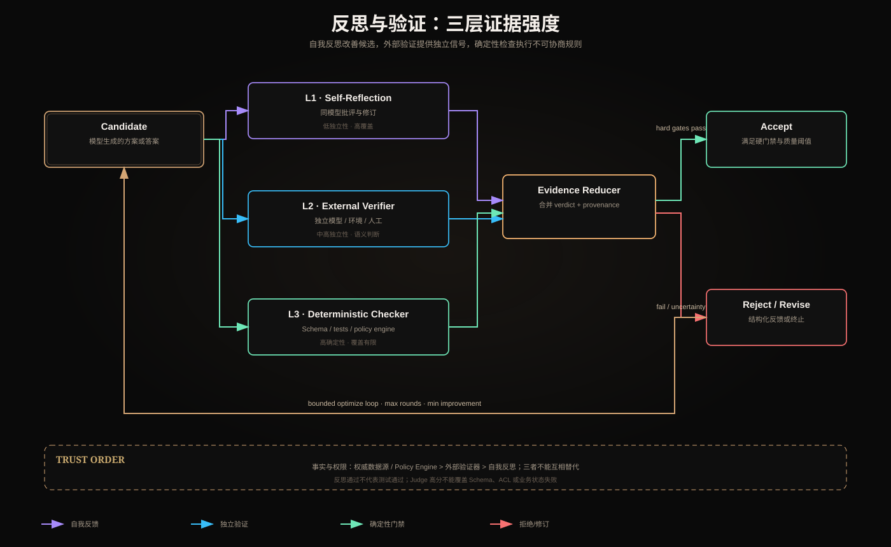

# 自我反思、外部验证器与确定性检查器



## 一、三者不是同义词

- **自我反思**：生成者或同源模型重新阅读候选，提出批评与修订；
- **外部验证器**：与生成过程相对独立的模型、环境、人工或权威服务给出验证信号；
- **确定性检查器**：相同输入必然产生相同 verdict 的代码、Schema、编译器、测试或 Policy Engine。

它们解决不同问题。反思擅长寻找语义遗漏，外部验证增加独立证据，确定性检查执行不可协商规则。把三者都叫“Evaluator”会掩盖信任等级。

## 二、自我反思的真实能力边界

基本循环：

```text
candidate₀ → critique₀ → revision₁ → critique₁ → ...
```

适合发现：论证不完整、表达不清、约束遗漏、潜在反例。它便宜、覆盖面广，但生成者与批评者共享模型、Prompt 或训练偏差，错误高度相关。

主要失败：

- 自我确认：错误答案被更流畅地解释；
- 评价漂移：每轮标准变化；
- 振荡：A→B→A；
- 奖励投机：优化 Judge 风格而非真实质量；
- 轨迹膨胀：反馈和修订持续占用 Context。

因此自我反思只能生成“改进候选”，不能替代事实验证、权限或测试。

## 三、外部验证器的独立性

外部验证器可以是：

1. 不同模型/Prompt 的语义 Judge；
2. 检索权威来源的 Fact Checker；
3. 代码执行、浏览器或仿真环境；
4. 人工审批者；
5. 下游业务服务的查询结果。

“第二次调用模型”不自动等于独立。独立性来自不同信息源、工具、模型族、权限或评价机制。两个实例读取同一错误摘要，仍然可能一致地犯错。

验证器输出应包含：

```json
{
  "verdict": "pass|fail|uncertain",
  "criteria_version": "faithfulness.v3",
  "findings": [],
  "evidence_refs": [],
  "confidence": 0.82,
  "limitations": []
}
```

`uncertain` 是必要状态。强迫二分类会把证据不足伪装成确定判断。

## 四、确定性检查器

典型检查包括：

- JSON Schema / 类型 / 范围；
- 单元测试、编译器和静态分析；
- Scope、ACL、租户与策略规则；
- 数据库唯一约束和状态机 Guard；
- 引用 ID 是否存在；
- Token、费用、步骤和 deadline；
- 幂等键和确认票据。

其优势是可复现、低歧义、容易审计；弱点是只能检查被编码的规则。测试通过不代表需求正确，Schema 合法不代表事实真实。

## 五、信任顺序与组合

对事实和权限，一般信任顺序为：

```text
权威业务数据 / Policy Engine
  > 环境执行结果与确定性检查
  > 有来源的独立验证器
  > 模型自我反思
```

推荐流水线：

```text
generate
  → deterministic pre-check
  → external semantic/factual verification
  → self-reflection with structured findings
  → revise
  → deterministic final gate
```

前置确定性检查可以快速淘汰格式和权限失败，避免为非法候选支付 Judge 成本。最终门禁防止修订过程重新破坏硬约束。

## 六、硬门禁与软评分

硬门禁：任何一项失败即拒绝，例如越权、Schema 不合法、测试失败。软评分用于可交换质量，例如清晰度、覆盖度、风格。

```text
accept = all(hard_gates)
     AND weighted_quality_score >= threshold
```

绝不能让高语言质量抵消越权：

```text
0.98 helpfulness + permission_violation  # 仍然失败
```

## 七、Evaluator-Optimizer 的停止条件

```text
stop if hard_gates_pass AND score >= target
     OR rounds >= max_rounds
     OR improvement < epsilon for m rounds
     OR candidate_hash repeats
     OR budget/deadline exhausted
```

每轮反馈需要定位 criterion、证据和修复建议；“再好一点”不是可执行反馈。对同一问题的冲突 Judge 应进入仲裁或人工复核，不宜无限加票。

## 八、防止评价器偏差

- 用人工标注集校准 Judge；
- 随机化候选顺序，减少位置偏差；
- 隐藏模型身份，减少品牌偏好；
- 将事实正确、引用、风格分开评分；
- 定期测试自我偏爱和长度偏好；
- 保存 Prompt/模型/criteria 版本；
- 报告与人工的一致率、假阳性和假阴性。

Voting 只有在误差不高度相关时才有效。相同模型的多次投票不能简单按独立伯努利计算置信度。

## 九、失败分类

| 层 | 失败例子 | 正确响应 |
|---|---|---|
| 反思 | 没发现自己的事实错误 | 外部查证，不盲目多轮 |
| 外部 Judge | 证据不足却给高分 | 返回 uncertain，检查校准 |
| 确定性 | 规则覆盖不足 | 增加测试/策略，不能让模型补规则 |
| 组合器 | 用平均分覆盖硬失败 | 硬门禁优先 |
| 优化循环 | 指标投机或振荡 | 候选哈希、最小增益、最大轮数 |

## 十、观测与 Trace

```text
candidate_id / version
generator_model / prompt_version
checker_name / criteria_version
verdict / score / evidence_refs
started_at / ended_at / cost
revision_parent / changed_fields
final_policy_decision
```

不要记录完整私有 Chain-of-Thought。保存结构化 decision summary、finding 和证据即可支持审计。

## 十一、评估指标

- checker precision/recall；
- Judge-human agreement；
- false accept / false reject；
- hard-gate escape rate；
- average quality improvement per round；
- convergence rate 和 oscillation rate；
- cost/latency per accepted candidate；
- regression introduced by revision；
- unknown/uncertain rate。

## 十二、选择表

| 需求 | 首选 |
|---|---|
| JSON 格式、权限、预算 | 确定性检查器 |
| 代码是否可运行 | 编译器/测试环境 |
| 事实是否符合当前订单 | 权威业务服务 |
| 论证是否覆盖反例 | 外部 Judge + 证据 |
| 文本是否可进一步改进 | 自我反思 |
| 高风险最终审批 | 确定性 Gate + 人工 |

## 十三、核心总结

反思是生成策略，外部验证是独立证据，确定性检查是规则执行。生产系统应按证据强度组合它们：软质量可以迭代，权限和业务不变量必须 fail closed。

