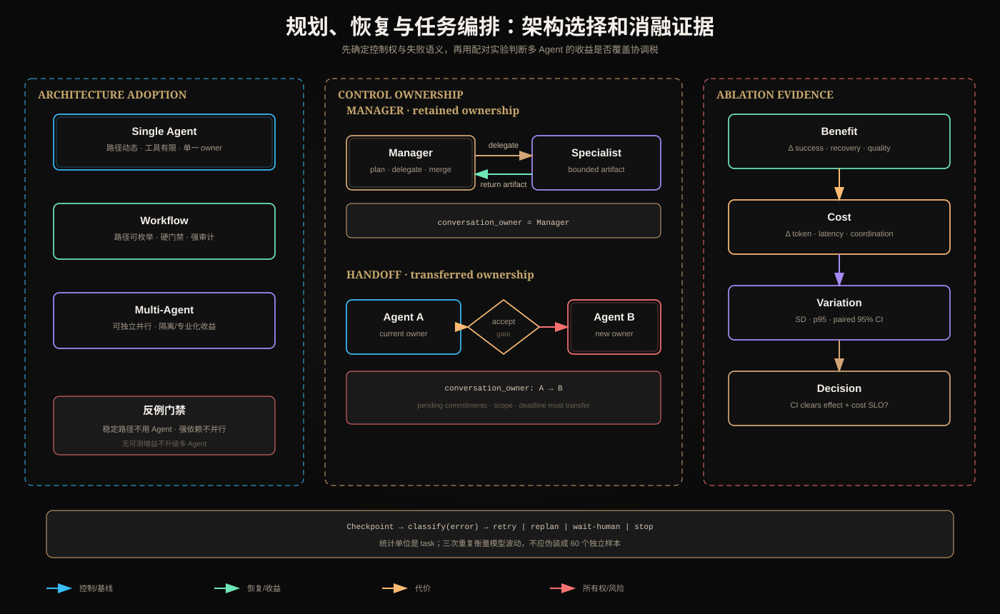

# 规划、恢复与任务编排：面试及消融验收总结



这份材料不是概念速记，而是一套面试答题与工程验收框架。核心判断顺序是：先定义完成条件和控制权，再设计失败恢复，最后用消融实验判断复杂架构是否真的产生净收益。

## 一、先建立统一分析模型

一个可恢复任务系统至少包含五类状态：

```text
TaskSpec       用户目标、约束、完成谓词、预算
Plan           子目标、依赖、执行状态、plan_revision
Artifact       证据、工具结果、版本与来源
Execution      attempt、幂等键、lease、checkpoint
ControlOwner   谁决定下一步、谁判断完成、谁承担最终责任
```

可以将计划表示为有向图：

```text
G = (V, E)
V = 可独立执行和验证的子目标
E = 数据依赖、控制依赖、资源依赖或补偿顺序
```

节点完成不是模型返回 `done`，而是确定性完成谓词成立：

```text
complete(v) = output_schema_ok
           ∧ required_evidence_exists
           ∧ authorization_ok
           ∧ side_effect_receipt_persisted
```

## 二、规划、恢复与任务编排面试题

下面给出 10 道题。面试回答应先说结论，再说机制、风险和验证方法。

### 题 1：如何把一个模糊目标分解成可执行计划？

先把目标改写为机器可判定的完成条件，然后识别必要产物，再反向生成子目标和依赖。每个子目标必须包含输入引用、输出 Schema、完成谓词、预算、失败策略和证据要求。

不能只生成自然语言待办清单，因为清单无法判断依赖是否缺失、输出是否真实存在，也无法在中断后准确恢复。计划生成后还要做图验证：检查环、孤立节点、不可满足依赖、权限不足、资源冲突和未覆盖的最终条件。

### 题 2：什么时候应该重试，什么时候必须重规划？

判断依据不是“动作失败了”，而是原计划中的假设是否仍然成立。

- 网络抖动、临时限流、工具短暂不可用：输入和计划仍有效，可以有界重试。
- 数据版本变化、关键证据被删除、能力或权限改变：旧路径不再可靠，必须重规划。
- 缺少用户授权、审批或业务判断：进入人工介入状态。
- 非法参数、未知工具、违反不可协商约束：不可恢复地终止当前节点或计划。

盲目重试计划失效错误，会重复执行一个已经过期的决策。

### 题 3：怎样设计可恢复的 Agent Loop？

每个可重放边界前后都持久化结构化 Checkpoint，其中至少有：`plan_id`、`plan_revision`、`state_version`、逐项状态、证据引用、预算余额、幂等记录、在途调用和副作用 receipt。

恢复过程是：加载最后一个有效版本，核对外部副作用，重新领取 lease，跳过已经提交的步骤，从第一个未完成节点继续。不能仅保存 Conversation History，因为聊天文本无法可靠表达副作用是否已经发生。

### 题 4：如何处理“工具已执行，但响应在返回前丢失”？

这是 `UNKNOWN`，不是普通失败。立即重试可能制造重复扣款、重复发信或重复创建资源。

正确顺序是：用幂等键向外部系统查询或重放；检查业务记录和 effect receipt；能够确认未执行才重试；确认已执行则补记本地状态；仍无法确认时进入人工核对。业务目标是 at-least-once 调度下的 effect-once，而不是宣称跨系统实现了绝对 exactly-once。

### 题 5：状态版本和幂等键分别解决什么问题？

状态版本解决并发写入：`UPDATE ... WHERE state_version = expected_version`，失败说明本执行器基于旧状态，必须重新加载。

幂等键解决重复执行：相同业务操作被重放时返回既有结果，而不是再次产生副作用。一个控制“谁能提交状态”，一个控制“同一效果是否重复发生”，不能互相替代。

### 题 6：串行和并行编排如何选择？

先分析依赖，再讨论并行。若 B 必须读取 A 的产物，强行并行会引入猜测、返工或冲突。只有子任务在输入、状态和副作用上足够独立，并且满足：

```text
节省的关键路径延迟
> fan-out + 排队 + 聚合 + 重试 + 冲突处理开销
```

并行还必须定义部分成功、截止时间、取消传播、聚合规则和一致性要求。仅仅能同时启动，不代表值得并行。

### 题 7：Manager 为什么不能替代 Runtime？

Manager 可以动态分解、委派和合并，但它仍是概率模型，不能成为权限、预算、状态版本、幂等和不可逆动作确认的唯一执行者。

Runtime 必须限制最大 Worker 数、Tool allowlist、Token/费用、deadline、Scope 和副作用门禁。Manager 提供动态决策，Runtime 执行不可协商规则。

### 题 8：部分成功应该返回成功还是失败？

两者都不准确，应保留独立的 `partial` 状态，并声明已完成产物、缺失产物、受影响结论、可否降级、后续恢复动作和证据完整性。

如果缺失内容违反硬完成条件，则整个任务不能标记成功；如果剩余证据仍满足一个降级完成谓词，可以交付部分结果，但必须让上游显式接受这种状态。

### 题 9：如何避免重复委派和 Worker 重复执行？

Manager 为委派生成稳定键：

```text
delegation_key = hash(plan_id, plan_revision, subgoal_id, specialist_role)
```

委派注册表先以 CAS 创建工作单；重复请求返回原工作单。Worker 的工具副作用还要有独立幂等键，因为“没有重复工作单”不等于“工具执行一定没有重放”。同时记录 attempt、lease 和 fencing token，防止过期 Worker 晚到提交。

### 题 10：上下文丢失时如何恢复？

从 Artifact Store 和 Checkpoint 重建最小执行上下文，而不是凭模型重新回忆。重建内容包括任务契约、当前计划版本、未完成节点、已验证证据、预算和权限上下文引用。

如果一个系统只能依靠完整聊天记录恢复，它缺少真正的运行状态模型。上下文是模型输入，Checkpoint 才是执行真相源。

## 三、单 Agent、Workflow 和多 Agent 的采用条件

### 1. 单 Agent

适用条件：

- 步骤无法完全预定义，但工具空间有限；
- 环境 Observation 能持续纠偏；
- 任务由一个清晰 owner 负责；
- 上下文可以放入一个受控窗口或从 Artifact 引用；
- 有最大步骤、预算、完成谓词和 Runtime 门禁；
- 串行执行已经满足延迟 SLO。

反例清单：

- 路径稳定且可枚举，却用 Agent 动态选择每一步；
- 强监管审批流程让模型决定是否跳过状态；
- 任务需要数十个长时间独立工作流，单循环成为调度瓶颈；
- 所有事实都必须回到确定性业务系统，却让模型“记忆”事实；
- 没有外部反馈、完成条件和步数上限的开放循环。

### 2. Workflow

适用条件：

- 路径及异常分支可枚举；
- 每一步有明确 Schema 和完成条件；
- 延迟、审计、合规和可预测性优先；
- 副作用顺序严格，需审批、补偿或事务边界；
- 模型只在局部完成分类、抽取、生成或评分。

反例清单：

- 开放研究任务事前无法知道要搜索哪些来源，却穷举大量静态分支；
- 环境持续变化，但 Workflow 不允许重新选择路径；
- 为每个罕见异常新增状态，导致状态爆炸；
- 把 Queue 当 Workflow，以为消息 ACK 等于业务完成；
- 把所有模型输出直接传给下一步而没有 Schema、证据和门禁。

### 3. 多 Agent

适用条件：

- 子任务确实独立，可以缩短关键路径；
- 专家之间需要不同工具、权限或隔离上下文；
- 单 Agent 出现可测量的上下文干扰或能力瓶颈；
- 聚合规则、冲突处理和来源追踪明确；
- 成功率或延迟收益经过同任务配对消融验证；
- 新增成本、调度、取消和恢复机制仍满足 SLO。

反例清单：

- 只是为了“角色扮演”把一个顺序任务拆成多个 Agent；
- Worker 复制相同系统提示、工具定义、历史和文档；
- 子任务有强数据依赖，却同时执行后在聚合阶段返工；
- Manager 没有 TaskGraph 验证，重复或遗漏委派；
- Specialist 返回无证据自然语言，Aggregator 无法校验；
- 没有全局预算、最大并发、背压、取消传播和故障隔离；
- 没有单 Agent 基线，无法证明复杂度带来收益。

## 四、无笔记解释 Manager 与 Handoff

### 30 秒版本

Manager 是“我仍然负责，但把子任务委派给专家”。Specialist 返回结果后，控制权回到 Manager，用户会话和最终完成责任始终没有转移。

Handoff 是“这件事接下来由你负责”。接收 Agent 显式接受后成为新的 active owner，后续对话、未完成承诺和责任一起转移。两者最关键的区别不是有没有多个 Agent，而是会话所有权是否改变。

### 2 分钟版本

可以从四个问题展开：

| 问题 | Manager + Specialist | Handoff |
|---|---|---|
| 谁决定下一步 | Manager | 接收方接受后由接收 Agent |
| 谁持有用户会话 | Manager | 从发送方转给接收方 |
| 子 Agent 返回什么 | 有界 Artifact | 不一定立即返回；它接管后续交互 |
| 谁判断最终完成 | Manager + Runtime | 当前 owner + Runtime |

Manager 模式像调用一个有内部自治能力的工具。Manager 发送明确子任务、输入引用、预算和返回 Schema；Specialist 不默认获得完整会话或全部权限，只返回证据化 Artifact。

Handoff 则必须有所有权转移协议，包括 `from_agent`、`to_agent`、reason、summary、Artifact 引用、pending commitments、deadline、授权上下文引用和 `accept/reject`。如果接收方没有显式接受，只是 Prompt 中把角色名换了，不算可靠 Handoff。

最后补充安全边界：两种模式中 Runtime 都不把原始 Token 暴露给模型，都要重新计算 Scope。Manager 不能借 Specialist 绕过权限；Handoff 也不能因为换了 owner 就继承发送方全部能力。

### 容易答错的地方

- “Manager 是主 Agent，Handoff 是子 Agent”：错误。区别是控制权语义，不是层级名称。
- “Handoff 调用完还会回到原 Agent”：这更接近 Agent-as-Tool，而不是所有权转移。
- “用了路由就是 Handoff”：Router 选择处理者；只有状态和责任真正转移才是 Handoff。
- “Manager 拥有所有权限”：模型拥有决策能力，不等于拥有授权能力。

## 五、消融实验必须同时呈现收益、代价和波动

现有实验设计比较：

```text
Baseline: Recoverable Single Agent
Ablation: Manager + Specialist
20 tasks × 3 repetitions × 2 architectures = 120 trajectories
```

两组必须共享模型版本、温度、工具、任务、故障注入、评分器、预算和运行环境。执行顺序交替或随机化，避免服务负载和缓存造成系统性顺序偏差。

### 1. 收益指标

| 指标 | 含义 | 推荐比较 |
|---|---|---|
| 任务成功率 | 完成谓词和证据要求同时满足 | 配对成功差值 |
| 故障恢复率 | 注入故障后仍完成 | 按失败类型分层 |
| 部分成功质量 | 降级结果是否仍满足约定 | 不与完整成功混为一类 |
| 结果正确性 | 答案和引用满足 Gold | 每任务配对评分 |
| 关键路径延迟 | 并行是否真的缩短耗时 | p50、p95 和配对差值 |

### 2. 代价指标

| 指标 | 需要暴露的额外成本 |
|---|---|
| Token | Manager Prompt、委派上下文、Worker 输出和聚合输入 |
| 模型调用 | 分解、Specialist 和聚合调用数 |
| 工具调用 | 重复检索、重复读取和失败重放 |
| Checkpoint | 更多执行主体带来的状态写入 |
| 调度开销 | Fan-out、排队、合并、取消和超时 |
| 工程复杂度 | 委派注册表、冲突处理、Trace 关联和恢复路径 |

关键派生指标是每成功任务成本：

```text
cost_per_success = total_cost / successful_tasks
```

若成功率微升，但每成功任务成本、p95 延迟和故障面大幅增加，不能只展示成功率得出“多 Agent 更好”。

### 3. 统计波动

三次重复首先用于观察模型非确定性，不足以支持夸大的普遍性结论。每个任务是主要实验单位，同一任务的两种架构是配对样本。

报告至少提供：

```text
每个架构：mean、standard deviation、median、p95、min/max
架构差值：Δ = Manager - Single
配对差值：每个 task/repetition 内计算 Δ
不确定性：paired bootstrap 95% CI
```

成功率差可同时报告配对四格：

| Single | Manager | 解释 |
|---|---|---|
| 成功 | 成功 | 无增益 |
| 失败 | 成功 | Manager 净收益 |
| 成功 | 失败 | Manager 回归 |
| 失败 | 失败 | 两者共同失败 |

如果进行显著性检验，配对二元结果可使用 McNemar 检验；Token 和延迟通常偏态，更适合报告配对 bootstrap 区间，而不是只给均值和普通 t 检验。

### 4. 避免伪重复

`20 × 3 = 60` 条运行不是 60 个完全独立任务。三次重复共享相同任务语义，因此报告应：

1. 先计算每个任务内三次重复的均值或成功比例；
2. 再跨 20 个任务估计总体差异；
3. Bootstrap 时以任务为重采样单位，保留任务内重复；
4. 同时展示逐任务结果，避免总体均值掩盖特定故障回归。

只有 20 个任务、每任务 3 次时，置信区间可能较宽。结论应写成“在当前任务集和模型版本下观察到”，不能外推成通用架构排名。

### 5. 决策规则

消融结果应预先定义接受规则，例如：

```text
采用 Manager + Specialist，当且仅当：
1. 硬安全与恢复测试无回归；
2. 成功率配对差的 95% CI 下界达到预设最小效果；
3. p95 延迟和每成功任务成本不超过 SLO；
4. 收益集中在确实需要专业化或并行的任务，而非随机波动；
5. 新增故障路径可以被监控、取消和恢复。
```

否则保留可恢复单 Agent。复杂架构需要证明自己，而不是让简单架构证明为什么不该被替换。

### 6. 当前实验状态必须如实表述

第 5 周代码已经实现 20 条任务、三次重复、结构化 Plan、故障注入、单 Agent 基线和 Manager + Specialist 消融入口，确定性测试已通过。真实 DeepSeek 运行涉及把本地任务、语料和提示内容发送给外部服务，目前尚未生成正式外部模型数据。

因此当前文档定义的是完整的报告和统计验收口径，不填写虚构的收益、代价或置信区间。真实运行完成后，应由逐轨迹 JSON 生成数值表，并在报告中记录模型标识、时间、参数、失败样本和原始 Trace 引用。

## 六、15 分钟验收陈述提纲

### 0—3 分钟：计划为何必须结构化

- 展示 TaskSpec、Plan、Artifact、Execution 和 ControlOwner；
- 用完成谓词解释为什么“模型说完成”不等于完成；
- 说明 DAG、版本和依赖验证。

### 3—6 分钟：四类失败如何改变控制流

- retryable：有界重试；
- replan_required：提升 revision 并重置受影响节点；
- human_required：停止自动推进；
- unrecoverable：保存原因并终止。

结合进程中断、部分成功和 UNKNOWN 副作用说明恢复。

### 6—9 分钟：架构采用边界

- 稳定可枚举路径优先 Workflow；
- 动态但单 owner 的任务优先有界单 Agent；
- 只有独立并行、上下文隔离或专业能力产生可测收益时采用多 Agent。

### 9—12 分钟：Manager 与 Handoff

- Manager 委派后回收 Artifact，控制权未转移；
- Handoff 需要 accept，接收者成为新会话 owner；
- Runtime 始终保留权限、预算和副作用门禁。

### 12—15 分钟：用消融而不是直觉选架构

- 固定所有变量，只改变委派控制面；
- 同时报告收益、代价和统计波动；
- 按任务配对，避免伪重复；
- 置信区间和 SLO 不满足时保留单 Agent。

## 七、最终验收清单

- [ ] 能从目标推导结构化子目标、依赖和完成谓词；
- [ ] 能解释重试与重规划的本质差异；
- [ ] 能说明版本、幂等、Checkpoint 和补偿各解决什么问题；
- [ ] 能说出单 Agent、Workflow、多 Agent 的采用条件和反例；
- [ ] 能在不看笔记时用“所有权是否转移”区分 Manager 与 Handoff；
- [ ] 能解释部分成功和 UNKNOWN 副作用；
- [ ] 能说明为什么三次重复不等于三个新任务；
- [ ] 消融报告同时包含收益、代价、波动、失败样本和适用边界；
- [ ] 不用测试替身结果冒充真实模型实验数据；
- [ ] 架构升级有预先定义的最小效果和成本 SLO。

## 八、核心结论

规划质量取决于完成谓词和依赖是否可验证；恢复能力取决于结构化状态和副作用账本；编排选择取决于控制权和任务独立性。Manager 不会天然提高质量，Handoff 也不是普通子调用。只有在严格可比的消融实验中，收益稳定超过 Token、延迟、调度和恢复代价时，多 Agent 才值得进入主架构。
