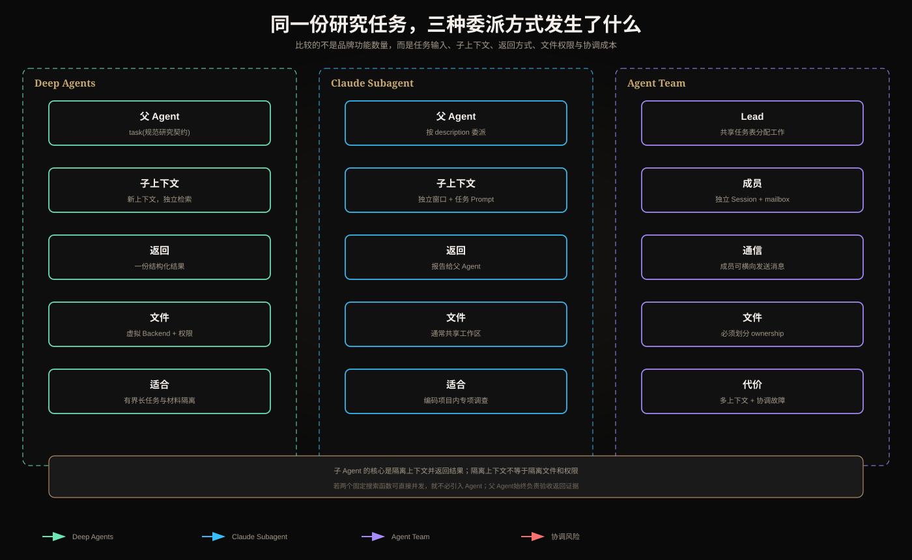

# Deep Agents、Claude Code Subagents 与 Claude Agent SDK Subagents：一次委派究竟发生了什么



“支持 Subagent”这句话信息量很低。真正需要问的是：父 Agent 交出了什么、子 Agent 看见什么、能做什么、怎样返回、失败由谁负责、双方是否共享文件和身份。

本文用一个任务贯穿比较：

> 主 Agent 要完成一份“Agent 工具授权安全”报告，将“规范研究”和“事故案例研究”分别委派，最后自己综合结论。

## 1. 不使用子 Agent 时发生什么

单 Agent 会把全部内容放进同一个上下文：

```text
用户要求
→ 搜索规范的查询、网页和笔记
→ 搜索事故的查询、网页和笔记
→ 中间失败与重试
→ 最终综合
```

问题不是单 Agent 一定做不到，而是长任务中大量局部材料会挤占最终推理所需的 Context。子 Agent 的首要价值通常是**隔离上下文**，其次才是并行。

## 2. 一次有界委派的完整数据流

父 Agent 不应该只说“研究一下授权”。它需要构造委派契约：

```json
{
  "objective": "找出两条说明授权必须在资源服务器执行的规范依据",
  "scope": ["OAuth/OIDC 官方资料", "MCP 安全文档"],
  "non_goals": ["不修改仓库", "不提出无来源结论"],
  "required_output": {
    "claims": "array",
    "source_urls": "array",
    "uncertainties": "array"
  },
  "budget": {"max_steps": 8, "timeout_s": 120}
}
```

运行链：

```text
父 Agent 当前上下文
  → 只选取目标、范围、证据要求和预算
  → 创建子 Agent 的新上下文
  → 子 Agent 独立调用模型和工具
  → 子 Agent 将过程压缩为结构化结果
  → 父 Agent 校验证据后合并
```

子 Agent 通常没有自动继承父对话中所有隐含决定。父 Agent 如果遗漏“只用官方来源”，子 Agent不会可靠地猜出来。

## 3. Subagent 和 Agent Team 不是一回事

### 3.1 Subagent：父子调用关系

```text
Parent
  ├─ task(spec research) → Child A → result A
  └─ task(case research) → Child B → result B
Parent validates and synthesizes
```

典型性质：

- 父 Agent 创建任务；
- 子 Agent 有隔离的上下文；
- 子 Agent 自主运行一段时间；
- 通常只把最终结果返回父 Agent；
- 父 Agent仍拥有总任务和最终输出控制权。

### 3.2 Agent Team：多个持续参与者的协作关系

```text
Lead ↔ Researcher A
  ↕       ↕
共享任务表 / 消息箱
  ↕       ↕
Reviewer B ↔ Writer C
```

Team 通常还需要稳定成员身份、共享任务状态、成员间消息、任务领取和依赖管理。它引入的是一个协调控制面，不只是多开几个上下文。

如果并行执行两个固定搜索函数即可完成，就不需要 Subagent，更不需要 Team。

## 4. Deep Agents：建立在 LangGraph Runtime 上的通用 Harness

Deep Agents 可以理解为：在模型工具循环外，预装文件系统、上下文管理、委派、长期规则和人工控制的运行 Harness。它使用 LangGraph Runtime 获得持久执行、流式和 Interrupt 等能力。

### 4.1 Planning 到底做什么

当前文档中任务规划是可选能力，可通过 Todo Middleware 给 Agent 一个 `write_todos` 工具，维护：

```text
pending → in_progress → completed
```

这是一份由 Agent 更新的工作清单，不自动等于严格的依赖图。它不会天然保证：

- B 必须在 A 的验证通过后开始；
- “完成”满足业务验收谓词；
- 重复任务不会执行；
- 计划失效时一定重规划。

这些仍需 Runtime 状态和确定性检查器约束。

### 4.2 Subagent 怎样运行

Deep Agents 的 `task` 工具让主 Agent 创建临时子 Agent。一次调用通常是新上下文，子 Agent运行到完成后返回一份结果。适合把搜索、大文件阅读或局部实现从父上下文隔离。

“新上下文”不等于“新机器”或“新权限域”。子 Agent能访问哪些文件和工具，取决于 Backend、Middleware 和权限配置。

### 4.3 Filesystem Context 为什么重要

长工具输出不必全部塞回对话：

```text
搜索结果 200 KB
  → 子 Agent 写入 /artifacts/sources.md
  → 父 Agent只接收摘要 + 路径 + 内容哈希
  → 需要核查时再局部 read_file
```

这叫 Context Offloading：文件是外置工作材料，不是模型“记住了”文件。模型只有在工具读取后才看到相应内容。

### 4.4 Skills、Memory、Filesystem 的边界

| 对象 | 解决什么问题 | 何时进入上下文 | 例子 |
|---|---|---|---|
| Skill | 怎样完成某类任务 | 匹配任务后按需加载 | 绘图流程、测试规范 |
| Memory/项目规则 | 跨任务持续遵守什么 | 通常启动或规则发现时 | 代码风格、目录约定 |
| Filesystem artifact | 大材料放在哪里 | 读取相关片段时 | 报告草稿、检索原文 |
| Thread state | 当前任务执行到哪里 | Runtime 恢复时 | Todo、审批状态 |

不要把四者都叫“记忆”。业务订单、权限和库存仍应回到权威 API 查询。

## 5. Claude Code Subagents：编码产品内的有界委派

Claude Code 的自定义 Subagent 可以有自己的描述、系统提示、工具、模型、权限和 Skills。主 Agent依据描述决定何时委派。

### 5.1 description 是路由接口

```yaml
name: security-reviewer
description: 审查认证、授权和秘密处理；只读，不修改文件
tools: Read, Grep, Glob
```

描述过宽，例如“处理所有代码问题”，会抢走不适合的任务；描述过窄又难以触发。它不是营销文案，而是父 Agent选择能力时使用的接口说明。

### 5.2 上下文隔离不等于文件隔离

子 Agent有独立 Context Window，但通常仍在同一个项目工作区。两个写入型子 Agent 同时编辑一个文件，可能互相覆盖；即使聊天内容互相不可见，文件副作用仍共享。

并行写入需要：

- 给每个 Agent 明确文件所有权；
- 或分配独立 Worktree；
- 返回 Patch，由父 Agent统一合并；
- 合并前重新读取最新版本并测试。

### 5.3 权限收窄必须是实际能力约束

对研究子 Agent，只给 Read/Search 类工具比在 Prompt 中写“不要修改”更可靠。Prompt 是行为指令，工具 allowlist 和沙箱才是能力边界。

## 6. Claude Agent SDK Subagents：由应用代码定义委派

Agent SDK 把类似能力暴露给应用程序。宿主应用声明 Agent Definition、可用工具和模型，并消费流式事件、审批与最终结果。

与 Claude Code 产品内配置相比，SDK 更适合嵌入自己的服务，但也意味着应用要负责：

- 子 Agent定义从哪里加载、是否可信；
- 当前用户能调用哪些定义；
- 父子 Trace 如何关联；
- 超时和取消如何传播；
- 工具凭证如何由 Runtime 注入；
- 返回结果怎样做 Schema 和证据校验；
- 会话与 Artifact 如何持久化。

SDK 提供执行接口，不会自动把一次调用变成可靠任务队列或持久团队。

## 7. 同一委派在三套方案中的差异

| 问题 | Deep Agents | Claude Code Subagent | Claude Agent SDK Subagent |
|---|---|---|---|
| 主要使用者 | Python Agent 应用 | Claude Code 用户/项目 | 构建 Agent 产品的开发者 |
| 委派入口 | 主 Agent调用 `task` 类工具 | 主 Agent按定义选择子 Agent | 宿主代码注册定义，模型/应用触发 |
| 子上下文 | 临时隔离上下文 | 独立 Context Window | 每次 SDK 委派的隔离运行 |
| 文件能力 | 虚拟 FS + 可插拔 Backend | 项目工作区工具 | 由 SDK 宿主和工具配置决定 |
| 持久执行 | 借助 LangGraph Runtime | 产品会话能力 | 宿主应用负责组合 |
| 返回模型 | 通常单次结果回父 Agent | 返回父 Agent | 事件与结果回宿主/父流程 |
| 权限边界 | Middleware、Backend、沙箱 | tools/permissions/产品沙箱 | Agent Definition + 宿主授权 |

版本行为会变化，选择时应核对当前官方文档，不应假设不同产品的“Subagent”具有相同生命周期。

## 8. 父 Agent 如何校验子 Agent 结果

“专家说了”不是证据。父 Agent应按契约验证：

```python
class ResearchResult(BaseModel):
    claims: list[Claim]
    source_urls: list[HttpUrl]
    uncertainties: list[str]

def accept(result: ResearchResult) -> bool:
    return (
        len(result.claims) >= 2
        and all(claim.source_id for claim in result.claims)
        and sources_are_allowed(result.source_urls)
    )
```

必要时再用确定性工具验证 URL、测试代码或检查 Artifact 哈希。父 Agent不能因为委派给“Reviewer”就放弃验收责任。

## 9. 失败、取消和预算怎样传播

父任务预算不能简单地在每个子 Agent中复制：

```text
父预算：10 分钟 / 100k tokens
  子任务 A：3 分钟 / 30k
  子任务 B：3 分钟 / 30k
  父整合保留：4 分钟 / 40k
```

需要明确：

- 子任务超时是返回部分结果，还是让父任务失败；
- 父任务取消时是否取消所有子任务；
- 一个并行分支失败是否取消其他分支；
- 重试是在同一子 Agent上下文还是创建新运行；
- 已完成的文件写入是否保留；
- 部分结果是否标记来源和完整性。

多 Agent 常见成本不是模型调用次数本身，而是上下文重复、结果复核、调度等待和冲突解决。

## 10. 什么时候不该使用子 Agent

- 两个确定性 API 可以直接并发调用；
- 子任务少于几步，结果很短；
- 子任务强依赖父 Agent每一步的最新隐含上下文；
- 多个执行者必须频繁写同一文件；
- 权限无法可靠收窄；
- 父 Agent无法验证返回结果；
- 延迟和 Token 预算紧张。

先使用单 Agent 或普通 Workflow 建立基线。只有隔离、并行或专业权限带来的收益可测量时，再引入 Subagent。

## 11. 设计一条可靠委派必须回答的问题

1. 子任务的完成条件是什么？
2. 子 Agent需要父上下文中的哪些事实，哪些不需要？
3. 它能使用哪些工具和文件路径？
4. 身份和 Token 是否留在 Runtime，而非 Prompt？
5. 输出是否有结构化 Schema、证据和不确定性？
6. 谁验证结果，失败后谁重试或重规划？
7. 父任务取消时子任务怎样停止？
8. 并行写入如何避免冲突？
9. Trace 是否保留父子关系和预算消耗？
10. 为什么普通并行函数不足以完成该任务？

## 12. 最终记忆

> Subagent 是父 Agent控制下的有界委派：它用隔离上下文完成子任务并返回结果；Agent Team 则增加持续成员、共享任务和横向通信。Deep Agents 提供通用 Harness 与 LangGraph 持久运行能力；Claude Code Subagent 是编码产品内的配置式委派；Claude Agent SDK 让应用用代码集成委派。上下文隔离不代表文件、身份或权限自动隔离。

## 参考资料

- [Deep Agents overview](https://docs.langchain.com/oss/python/deepagents/overview)
- [Deep Agents subagents](https://docs.langchain.com/oss/python/deepagents/subagents)
- [Claude Code subagents](https://code.claude.com/docs/en/sub-agents)
- [Claude Agent SDK subagents](https://code.claude.com/docs/en/agent-sdk/subagents)
- [Claude Code Agent Teams](https://code.claude.com/docs/en/agent-teams)
