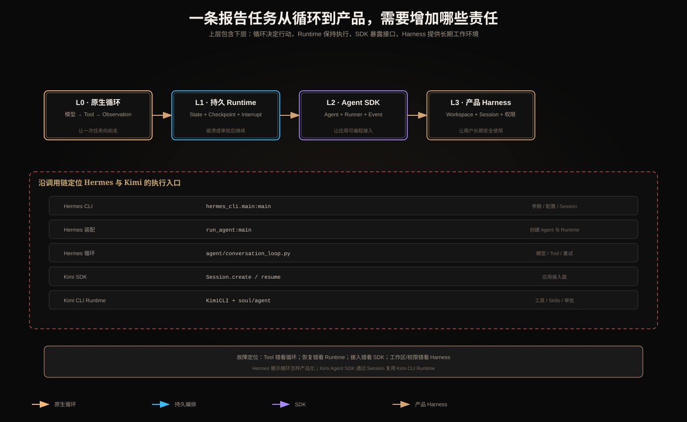

# 从原生循环到产品 Harness：怎样读懂 Hermes Agent 与 Kimi Agent SDK



看到一个 Agent 仓库时，最容易犯的错误是找到一个 `while` 循环，就把它当成整个系统。模型—工具循环只是发动机；用户真正使用的产品还需要会话、工作区、权限、配置、恢复、审批、日志和 UI。

本文用同一个任务贯穿四层：用户要求研究资料、读取项目文件、生成报告、审批后保存。目标是理解每层增加了什么责任，再定位 Hermes 和 Kimi 的入口。

> 仓库结构会变化。下述定位按 2026-08-13 核对的官方仓库组织编写；实际阅读时应以当前 `pyproject.toml`、公共导出和测试为准。

## 1. 先看最小 Agent Loop

不依赖框架时，核心只有：

```python
messages = [user_message]

for step in range(max_steps):
    response = model.generate(messages, tools=tool_schemas)

    if response.tool_calls:
        messages.append(response.assistant_item)
        for call in response.tool_calls:
            result = dispatch_tool(call.name, call.arguments)
            messages.append(tool_result(call.id, result))
        continue

    if response.final_text:
        return response.final_text

raise MaxStepsExceeded()
```

这层必须自己处理：Tool Call ID、参数 Schema、未知工具、超时、错误回传、最大步数和最终完成条件。

它还没处理长期任务：进程崩溃后消息在哪里、写文件是否可重放、Token 怎样保密、用户怎样审批、不同会话怎样隔离。

## 2. 四个层次不是四种互斥产品

```text
L0 原生循环
   模型 ↔ 工具 ↔ 观察

L1 持久编排 Runtime（如 LangGraph）
   State + Node + 路由 + Checkpoint + Interrupt

L2 Agent SDK
   Agent 配置 + Runner + Tool + Handoff + Guardrail + Trace

L3 产品 Harness
   CLI/UI + Session + Workspace + Skills + Memory
   + Permissions + Approval + Sandbox + Provider 配置
```

高层可以包含低层。Harness 内部仍然有模型循环；它只是把循环放进了一个可长期、安全使用的产品环境。

## 3. 同一任务在四层分别由谁负责

| 需求 | 原生循环 | LangGraph | Agents SDK | 产品 Harness |
|---|---|---|---|---|
| 模型调用工具 | 手写 dispatch | Node/ToolNode | Runner 内置循环 | 内部 Runtime 提供 |
| 检索后条件分支 | `if/else` | Conditional Edge | 模型/应用逻辑 | 策略与 Agent 循环 |
| 状态合并 | 手写对象更新 | Reducer | Run items/Session | transcript、Artifact、Session |
| 暂停等待审批 | 手写持久化协议 | Interrupt | approval/Run state 机制 | UI + 持久化审批流 |
| 崩溃恢复 | 手写 | Checkpointer + Thread | 取决于会话组合 | Session/Checkpoint/任务恢复 |
| 文件工作区 | 手写路径工具 | 作为 Node/Store 组合 | Tool 提供 | 一等产品能力 |
| 权限和密钥 | 应用实现 | 应用实现 | 应用实现 | 权限、沙箱、Secrets 系统 |
| 可观测性 | 手写 | Stream/Trace 集成 | Trace/Span | 日志、指标、审计、回放 |

这张表的重点是：框架替你实现某种执行机制，不会替你定义业务授权和完成条件。

## 4. 什么叫产品 Harness

Harness 是包围 Agent Loop 的运行环境。以“生成研究报告”为例：

```text
CLI/UI 接收请求
→ 发现项目规则和 Skills
→ 恢复 Session
→ 选择模型与 Provider
→ 构造工具表和权限
→ 启动 Agent Loop
→ 处理文件、Shell、MCP、子 Agent 和审批
→ 压缩过长 Context
→ 保存 Transcript、Artifact 和 Trace
→ 向 UI 流式返回进度
```

没有这些外围能力，Agent Loop 仍能回答一次问题，却很难成为可持续使用的编码或研究产品。

## 5. 怎样定位一个陌生 Agent 仓库的入口

按执行因果链阅读，而不是按目录名称漫游：

```text
1. 安装入口：console scripts / package exports
2. 用户入口：CLI main、HTTP handler、SDK public API
3. 装配入口：模型、工具、权限、Session 在哪里汇合
4. 循环入口：何时请求模型、何时执行工具、何时结束
5. 持久化入口：消息、Checkpoint、Artifact 写到哪里
6. 控制入口：取消、审批、重试、预算怎样传播
7. 测试：故障语义通常在测试里最清楚
```

每找到一个函数，都问：谁调用它？它创建什么长期对象？失败向谁返回？仅看函数名不能确认控制权。

## 6. Hermes Agent：从 CLI 进入产品，再下钻到循环

官方仓库的打包配置暴露多种入口，例如用户 CLI、Agent 兼容入口和 ACP 适配入口。阅读路径可从：

```text
pyproject.toml 的 project.scripts
  → hermes_cli.main:main       用户 CLI
  → run_agent:main             Agent 装配兼容入口
  → acp_adapter.entry:main     协议适配入口
```

### 6.1 CLI 入口解决什么

CLI 负责解析参数、加载配置和凭证、选择会话、初始化界面，再创建 Runtime。它回答“用户怎样启动产品”，却不一定包含真正的模型循环。

### 6.2 循环入口解决什么

核心对话执行逻辑可继续追到 `agent/conversation_loop.py` 一类模块。这里应寻找：

- 外层迭代预算；
- Provider 调用和 fallback；
- Tool Call 解析与 ID；
- Tool 执行和 Observation 回传；
- Context 压缩；
- 中断、取消和持久状态；
- 错误分类与重试。

真实循环不会只有 `while tool_calls`。例如模型流在 Tool Call 参数中途断开，Runtime要判断 transcript 是否可修复；Tool 已成功而结果回传失败，则必须处理重复执行风险。

### 6.3 Hermes 的学习价值

Hermes 适合观察：一个透明的模型工具循环如何逐渐承担 Provider 兼容、Tool Registry、会话、压缩、审批和多种产品表面。它说明“自己写循环”并不难，难的是让循环在失败、重启和权限边界下仍可靠。

## 7. Kimi Agent SDK：SDK Session 包装 Kimi CLI Runtime

Kimi Agent SDK 提供多语言程序接口，但官方定位表明它复用了 Kimi CLI 的 Runtime 能力。应用侧入口与真正执行引擎要分开看。

### 7.1 应用公共入口

Python 使用者通常从包导出的 Session 和 prompt 类接口进入：

```text
kimi_agent_sdk
  → Session.create(...)
  → prompt / stream
  → approval events
  → result
```

这里回答“我的程序怎样调用 Kimi Agent”。

### 7.2 Session 不是重新实现一套 Agent

Session 创建链路会进入 Kimi CLI 的 Session/KimiCLI Runtime。工作目录、模型、审批模式、MCP、Skills、最大步骤和重试等配置最终交给 CLI Runtime 执行。

因此：

- SDK 是稳定的程序接入面；
- CLI Runtime 才汇合模型、工具、工作区、规则、审批和会话；
- Session 代表可延续运行，不等于单次模型响应。

### 7.3 继续下钻 Kimi CLI

仓库版本变化时，按责任搜索这些入口：

```text
CLI __main__        命令行怎样启动
app / KimiCLI       Runtime 怎样装配
session             会话怎样创建、恢复、保存
soul / agent        Agent 和循环怎样构造
tools               工具怎样注册和执行
subagents           子 Agent怎样创建和跟踪
```

AGENTS.md、Skills、MCP、Approval 和 Toolset 在哪里合流，通常比某一个 `generate()` 调用更能说明产品结构。

## 8. Hermes 与 Kimi 不应只按“功能有没有”比较

| 追踪问题 | Hermes Agent | Kimi Agent SDK / CLI |
|---|---|---|
| 用户从哪里进入 | Hermes CLI 等产品入口 | 多语言 SDK 或 Kimi CLI |
| 应用怎样嵌入 | CLI/服务/ACP 等路径 | SDK Session 是明确接入面 |
| 真正循环在哪 | conversation loop 相关模块 | Kimi CLI 内部 Runtime |
| 会话由谁管理 | Hermes 状态与产品层 | SDK Session 包装 CLI Session |
| 工作区规则 | Skills、Memory、Session Context | AGENTS.md、Skills、工作目录 |
| 审批如何出现 | Runtime/产品审批路径 | SDK 暴露事件，CLI Runtime 执行 |
| 最适合学习什么 | 原生 Loop 产品化 | 复用 CLI Harness 的 SDK 设计 |

这不是“哪个更先进”的排名。二者的公共边界和产品目标不同。

## 9. 贯穿案例：一次报告任务怎样穿过 Harness

以 Kimi/Hermes 这类 Harness 为抽象对象：

```text
1. CLI/SDK 收到用户任务与 workspace
2. Session 层选择新建或恢复
3. Context 层发现项目规则、Skills 和历史
4. Runtime 建立允许的工具和权限
5. Agent Loop 调模型
6. 模型提出 search/read_file
7. Tool Runtime 校验并执行，结果回模型
8. 上下文过长时摘要或外置到文件
9. 发布前产生 approval 事件
10. 用户批准后恢复 Session
11. 保存 Artifact、最终消息和 Trace
```

若第 7 步文件读取失败，属于 Tool 层；第 9 步等待审批，不是模型“卡住”；第 10 步恢复失败，要检查 Session/Checkpoint，而不是改 Prompt。分层能直接帮助故障定位。

## 10. Framework、Runtime、SDK、Harness 的清楚边界

| 名词 | 最直接的意思 | 典型责任 |
|---|---|---|
| Agent Loop | 一次次让模型决定行动并回传观察 | 模型、工具、结束循环 |
| Runtime | 实际调度和维持执行状态的引擎 | 状态、并发、取消、恢复 |
| Framework | 构建执行逻辑的编程抽象 | Graph、Node、Agent、Tool |
| SDK | 应用调用某套能力的程序接口 | Session、事件、类型、配置 |
| Harness | 包围循环的完整工作环境 | 工作区、规则、权限、会话、UI |

同一个产品可以同时是“对外提供 SDK、内部使用 Runtime、向用户呈现 Harness”。这些词描述不同观察角度，不是互斥标签。

## 11. 选择架构的实际依据

- 只需验证模型工具协议：写最小原生循环；
- 分支复杂、需要 Checkpoint/HITL：使用 LangGraph 类持久编排；
- 希望快速获得 Runner、Tool、Handoff、Guardrail：使用 Agent SDK；
- 要做长期编码/研究产品：需要 Harness；
- 路径固定、步骤确定：普通 Workflow 往往更简单。

高层抽象不会消除授权、幂等、评测、租户隔离和业务完成条件，只会改变这些责任放在哪里实现。

## 12. 阅读源码时必须验证的十件事

1. 最大步数和最大 Token 在哪一层执行；
2. Tool Call ID 怎样与结果配对；
3. Tool 超时后是否可能已经产生副作用；
4. Session 保存的是消息还是完整运行状态；
5. 进程中断后从哪里恢复；
6. 取消是否传播到子 Agent和外部 Tool；
7. Token 和 Secrets 是否会进入模型或日志；
8. AGENTS.md/Skills 的发现优先级和大小限制；
9. 多个 Agent是否共享文件系统；
10. Trace 能否跨 CLI、Runtime、Tool 和子 Agent关联。

## 13. 最终记忆

> 原生循环解决“模型下一步做什么”；持久 Runtime 解决“任务怎样跨步骤和故障继续”；Agent SDK 提供可编程的 Agent 抽象；产品 Harness 再补上工作区、会话、权限、审批和用户界面。Hermes 适合观察原生循环如何产品化；Kimi Agent SDK 展示应用如何通过 Session 复用 Kimi CLI Harness。定位入口时要沿调用链验证，不能只凭文件名猜测。

## 参考资料

- [Hermes Agent](https://github.com/nousresearch/hermes-agent)
- [Kimi Agent SDK](https://github.com/MoonshotAI/kimi-agent-sdk)
- [Kimi CLI](https://github.com/MoonshotAI/kimi-cli)
- [LangGraph overview](https://docs.langchain.com/oss/python/langgraph/overview)
- [OpenAI Agents SDK](https://openai.github.io/openai-agents-python/)
