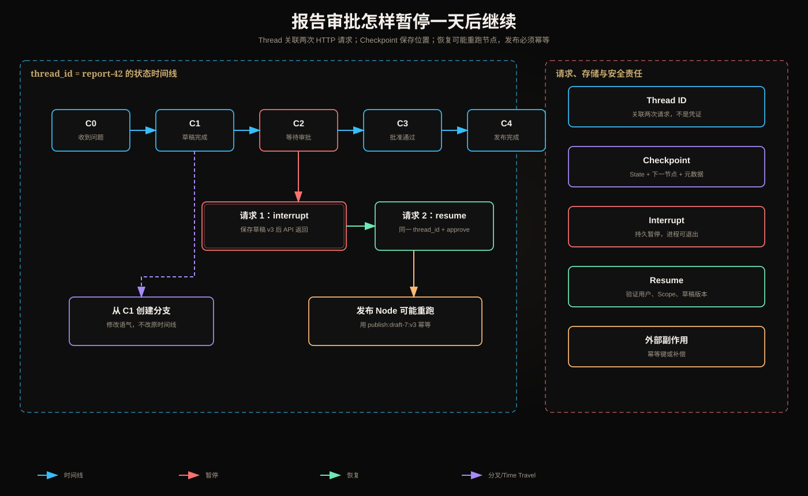

# LangGraph Checkpoint、Thread、Interrupt、HITL、恢复与 Time Travel：一次审批任务怎样暂停并继续



本文继续使用“研究并发布报告”的任务，但加入一个生产约束：报告发布前必须由用户审批，而且用户可能第二天才回复。服务进程在等待期间可以重启。

这不是普通的 `input()` 问答。系统必须回答：暂停数据存在哪里、回复属于哪条任务、恢复从哪里开始、重复回复会怎样、历史分支是否会撤销已发生的外部动作。

## 1. 先看一次完整生命周期

```text
请求 1（今天）
  用户提交任务
  → research
  → draft
  → approval 节点调用 interrupt()
  → 保存 Checkpoint
  → API 返回“等待审批”

请求 2（明天）
  用户携带同一个 thread_id 提交 approve
  → Runtime 读取 Checkpoint
  → 从暂停点恢复 approval 节点
  → publish
  → 保存新 Checkpoint
  → 完成
```

这里的关键不是“暂停了 Python 进程”。进程早已可以退出；被保存的是**足以重建图执行位置和状态的数据**。

## 2. Thread：把多次请求认作同一条任务时间线

### 2.1 Thread 解决什么问题

HTTP 请求通常几秒结束，审批却可能跨小时。第二次请求必须告诉 Runtime：“这不是新任务，而是继续昨天那一条。”这个关联键就是 `thread_id`。

```python
config = {"configurable": {"thread_id": "report-2026-0813-42"}}
graph.invoke(initial_input, config=config)
```

恢复时仍使用相同 ID：

```python
graph.invoke(Command(resume={"decision": "approve"}), config=config)
```

可以把 Thread 理解为一条逻辑任务的状态时间线：

```text
thread_id = report-42
  checkpoint C0：收到问题
  checkpoint C1：检索完成
  checkpoint C2：草稿完成，等待审批
  checkpoint C3：审批通过
  checkpoint C4：发布完成
```

### 2.2 Thread ID 不是授权凭证

知道 `thread_id` 不代表有权恢复它。应用在调用 LangGraph 前仍要验证：

- 当前用户是否属于该 tenant；
- 是否是任务所有者或审批人；
- Token 是否有效且 Scope 足够；
- 此人是否有权执行 `approve`，而不仅是查看。

Thread ID 负责关联状态，不负责证明身份。

## 3. Checkpoint：某个执行边界上的可恢复快照

Checkpoint 通常包含：

- 当前 State 的各个通道值；
- 下一步待运行的 Node；
- 本轮产生的更新和元数据；
- 与 Thread、Checkpoint 版本相关的标识；
- Interrupt 等需要恢复的运行信息。

它让进程重启后不必从用户输入重新计算全部步骤。

```python
from langgraph.checkpoint.memory import InMemorySaver

checkpointer = InMemorySaver()  # 教学用；生产需持久化实现
graph = builder.compile(checkpointer=checkpointer)
```

内存 Checkpointer 随进程消失，只适合测试。生产中应使用持久存储，并处理租户隔离、加密、TTL、备份和迁移。

### 3.1 Checkpoint 不是什么

- 不是数据库事务日志；
- 不会自动撤销已经发送的邮件或已扣款；
- 不保证任意 Node 只执行一次；
- 不等于长期语义记忆；
- 不替代业务数据库中的订单、权限和发布状态。

它保存的是图运行状态，不是外部世界的完整镜像。

## 4. Interrupt：把“现在不能继续”变成可持久化协议

审批 Node 可以这样写：

```python
from langgraph.types import interrupt

def approval(state: ReportState):
    decision = interrupt({
        "kind": "publish_approval",
        "draft_id": state["draft_id"],
        "draft_version": state["draft_version"],
        "summary": state["draft_summary"],
        "allowed_actions": ["approve", "reject"],
    })
    return {"approval": decision}
```

第一次运行到 `interrupt()` 时：

1. Runtime 产生中断信息；
2. Checkpointer 保存当前 Thread 的状态；
3. 本次调用返回中断结果，而不是继续发布；
4. UI 根据 payload 展示审批界面。

之后收到用户决定：

```python
graph.invoke(
    Command(resume={
        "action": "approve",
        "draft_version": 3,
        "approver_id": "user-17",
    }),
    config=config,
)
```

恢复值会成为 `interrupt(...)` 调用的返回值，Node 从而继续执行。

### 4.1 为什么不是在 Node 里一直等待

下面的代码会占用进程，而且无法可靠跨重启：

```python
while not approved():
    sleep(10)
```

Interrupt 的本质是把控制权交还宿主应用：Runtime 保存位置，API 结束；未来另一个请求再恢复。这才适合 Web 服务和长时间 HITL。

## 5. HITL：人不只是“点一下按钮”

Human-in-the-loop 是一条带安全和一致性要求的交互协议：

```text
Agent Runtime
  → 生成待决事项 + 版本
  → 持久化并返回 pending

应用/UI
  → 验证登录身份与权限
  → 展示精确对象和风险
  → 收集 approve/reject/edit

恢复入口
  → 再验证身份、Scope、版本、状态
  → 写审计记录
  → Command(resume=...)
```

有效的审批 payload 至少需要：

- 审批对象的稳定 ID；
- 对象版本或内容摘要；
- 允许的动作枚举；
- 风险和副作用说明；
- 审批人身份由服务器注入，不能信任模型或客户端自报；
- 过期时间和重放保护。

若草稿在等待期间从 v3 变成 v4，v3 的批准不能静默授权 v4。恢复入口应做乐观并发检查并要求重新审批。

## 6. 恢复为什么可能重跑 Node

最重要的运行语义是：恢复不等于从 Python 函数的下一行继续。节点中的代码可能从函数开头重新执行，`interrupt()` 之前的语句也可能再次发生。

危险写法：

```python
def approval(state):
    audit_log.insert("approval_requested")  # 恢复时可能再次插入
    decision = interrupt({...})
    return {"approval": decision}
```

改法一：把副作用移到独立 Node：

```text
create_approval_record → wait_for_approval → publish
```

改法二：使用稳定幂等键：

```python
audit_log.upsert(
    key=f"approval-request:{state['draft_id']}:{state['draft_version']}",
    value={...},
)
```

恢复正确性来自节点设计和外部系统的幂等约束，不是 Checkpointer 自动提供 exactly-once。

## 7. 一次故障恢复的逐步推演

设发布接口已经成功，但应用在保存“发布成功”的 Checkpoint 前崩溃：

```text
1. publish Node 调用 CMS
2. CMS 已创建 report-99
3. 进程崩溃
4. LangGraph 尚未保存 Node 完成状态
5. 恢复后 publish Node 再次运行
```

如果调用是 `POST /reports` 且没有幂等键，会生成两篇报告。

正确设计：

```python
receipt = cms.publish(
    draft_id=state["draft_id"],
    idempotency_key=f"publish:{state['draft_id']}:{state['draft_version']}",
)
return {"publication_id": receipt.id}
```

CMS 必须保证同一幂等键返回同一结果。若外部系统不支持幂等，需要本地 outbox、业务唯一约束或补偿动作；仅靠图重试解决不了。

## 8. Time Travel：使用历史 Checkpoint 重演或分叉

假设历史为：

```text
C0 输入 → C1 检索 → C2 草稿 → C3 批准 → C4 发布
```

Time Travel 常见操作：

- Inspect：查看 C2 时 State 和下一步；
- Replay：从 C2 用当前代码重新执行后续流程；
- Fork：先把 C2 的 `draft_tone` 改为 `formal`，再生成一条新分支。

```text
C0 → C1 → C2 → C3 → C4
           └→ C2' → C3' → C4'
```

它适合调试：固定同一份证据，对比不同 Prompt、模型或路由规则。

### 8.1 为什么 Time Travel 不是外部世界回滚

从 C2 分叉不会删除 C4 已发布的报告，也不会撤销通知。Checkpoint 能回到“程序曾经认为的状态”，不能让所有外部系统回到过去。

重放前必须明确：

- 哪些节点只有读取；
- 哪些节点产生副作用；
- 副作用是否有幂等键；
- 是否需要沙箱或 dry-run；
- 若已经发生，补偿动作是什么。

## 9. Thread、Checkpoint、Interrupt、Resume 的关系

| 概念 | 用最直接的话说 | 解决的问题 | 不负责什么 |
|---|---|---|---|
| Thread | 同一条长期任务的 ID | 把多次请求关联起来 | 不证明用户有权访问 |
| Checkpoint | 某一步边界的执行快照 | 崩溃后恢复、查看历史 | 不回滚外部副作用 |
| Interrupt | 主动保存并暂停，等待外部输入 | 跨请求审批或补充资料 | 不负责 UI 和身份验证 |
| Resume | 用外部输入继续原 Thread | 让暂停任务再次运行 | 不保证 Node 只运行一次 |
| HITL | 人与运行时之间的完整决策流程 | 高风险动作的人工控制 | 不只是一个弹窗 |
| Time Travel | 从历史快照重演或分叉 | 调试、反事实实验 | 不是全系统时间机器 |

## 10. 并发恢复与重复提交

真实系统会遇到两个人同时批准、浏览器重复提交、消息队列至少一次投递。恢复 API 应采用类似流程：

```text
BEGIN
  读取 thread + pending interrupt
  检查 tenant/user/scope
  检查 interrupt_id 与 draft_version
  条件更新 pending → consumed
  写审计记录
COMMIT
只有更新成功者调用 resume
```

若两个请求都能消费同一 Interrupt，就可能重复触发下游副作用。需要数据库唯一约束或 compare-and-set，而不是仅在 Python 里先查询再更新。

## 11. Schema 和代码升级

Thread 可能跨越多个发布版本。旧 Checkpoint 恢复到新代码时要考虑：

- State 字段重命名或类型改变；
- Node 名称被删除；
- Reducer 语义改变；
- Interrupt 顺序改变；
- 工具和 Prompt 版本改变；
- 旧草稿或证据已经过期。

建议保存 `schema_version`、`workflow_version`、`artifact_version`，对旧状态显式迁移。若无法安全迁移，应明确终止或转人工，而不是猜测字段含义。

## 12. 生产检查清单

1. 持久化 Checkpointer 是否按 tenant 隔离并加密；
2. Thread ID 是否与授权检查分离；
3. Interrupt payload 是否脱敏；
4. 恢复值是否做 Schema、身份、Scope 和版本校验；
5. Interrupt 前的副作用是否幂等；
6. 外部写操作是否有幂等键、唯一约束或 outbox；
7. 重复 resume 是否只有一个请求成功；
8. Checkpoint 失败是否会暴露半完成状态；
9. Time Travel 是否禁止误触真实副作用；
10. 旧 Schema 恢复是否有迁移测试；
11. 是否记录谁在何时批准了哪个版本；
12. 是否有 Thread TTL、归档和删除策略。

## 13. 最终记忆

用一句完整因果链记住：

> Thread 把多次请求归到同一任务；Checkpoint 保存这条任务在节点边界上的状态；Interrupt 让流程持久暂停并把控制权交给外部；Resume 携带经过验证的外部决定继续执行；Time Travel 使用历史 Checkpoint 重演或分叉，但所有外部副作用仍需幂等或补偿。

## 参考资料

- [LangGraph Persistence](https://docs.langchain.com/oss/python/langgraph/persistence)
- [LangGraph Interrupts](https://docs.langchain.com/oss/python/langgraph/interrupts)
- [LangGraph Time Travel](https://docs.langchain.com/oss/python/langgraph/use-time-travel)
