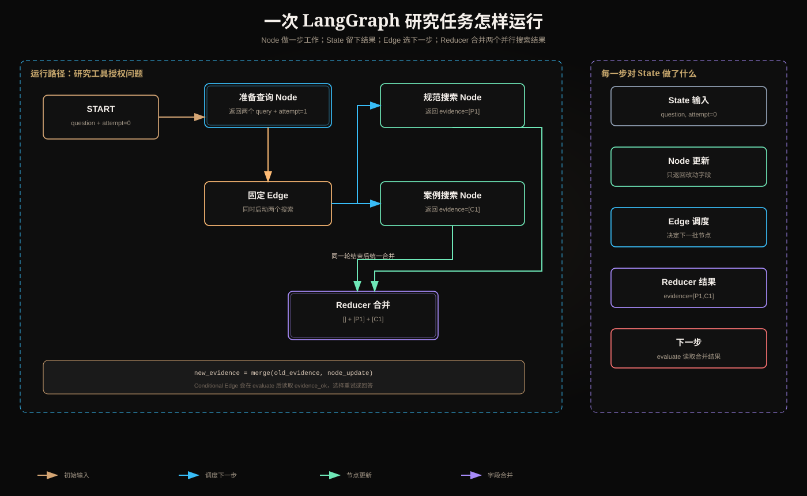

# LangGraph State、Node、Edge、Conditional Edge 与 Reducer：从一次真实运行理解图执行



这几个词容易被写成一句句定义，却仍然不知道程序怎样运行。本文不先背定义，而是先实现一个任务：

> 用户要求系统研究“为什么工具授权不能交给大模型”，系统并行检索规范和工程案例，检查证据，证据不足就重试，充分后生成答案。

理解全文只需要抓住一条主线：

```text
一份任务数据（State）
  → 某一步代码读取它并工作（Node）
  → 该步返回局部更新
  → LangGraph 按字段规则合并更新（Reducer）
  → 再按连接关系选择下一步（Edge / Conditional Edge）
```

## 1. 为什么不用普通函数从头写到尾

最直接的 Python 程序当然可以这样写：

```python
docs = search(question)
if not enough(docs):
    docs += search(rewrite(question))
answer = generate(question, docs)
```

短任务这么写最好。LangGraph 解决的是执行过程变长后出现的问题：

- 检索和验证要并行；
- 运行一半进程可能退出，稍后要继续；
- 某一步要等人工批准几小时；
- 需要知道每一步前后的数据；
- 失败后只重做必要步骤，而不是整条链重跑；
- 多个并行步骤可能同时更新同一字段。

所以 LangGraph 的价值不是把函数换成名词，而是把**状态边界、调度关系、合并规则和恢复边界**显式化。

## 2. 先看完整流程，不急着看代码

```text
                         ┌─ search_policy ─┐
START → prepare_query ───┤                 ├→ evaluate
                         └─ search_cases  ─┘     │
                                                 ├─ 证据充分 → write_answer → END
                                                 ├─ 仍可重试 → prepare_query
                                                 └─ 达到上限 → write_answer → END
```

一次实际运行可能是：

| 时刻 | 正在做什么 | State 中发生的变化 |
|---|---|---|
| T0 | 接收用户输入 | 写入 `question`，`attempt=0` |
| T1 | 准备查询 | 写入两个搜索 query |
| T2 | 两个检索并行执行 | 分别返回规范证据、案例证据 |
| T3 | 合并两个结果 | `evidence` 同时保留两边结果 |
| T4 | 评估证据 | 写入 `evidence_ok=True` |
| T5 | 生成回答 | 写入 `answer`，流程结束 |

下面每个术语都只是在描述这张运行表中的一个责任。

## 3. State：这一条任务当前拥有的数据

### 3.1 它具体是什么

State 是一个带 Schema 的共享数据对象。它记录流程走到当前时刻，后续步骤还需要知道的事实。

```python
from typing import Annotated, TypedDict

class Evidence(TypedDict):
    id: str
    source: str
    claim: str

class ResearchState(TypedDict):
    question: str
    policy_query: str
    case_query: str
    evidence: Annotated[list[Evidence], merge_evidence]
    attempt: int
    evidence_ok: bool
    answer: str | None
```

在三个时间点，它可能分别是：

```python
# T0：刚收到输入
{
    "question": "为什么工具授权不能交给大模型？",
    "attempt": 0,
    "evidence": [],
    "evidence_ok": False,
    "answer": None,
}

# T3：并行检索完成
{
    "question": "为什么工具授权不能交给大模型？",
    "policy_query": "LLM tool authorization security boundary",
    "case_query": "agent tool confused deputy incident",
    "attempt": 1,
    "evidence": [policy_doc, incident_doc],
    "evidence_ok": False,
    "answer": None,
}

# T5：流程结束
{
    ...,
    "evidence_ok": True,
    "answer": "授权必须由受信任的运行时执行……",
}
```

### 3.2 为什么有人说“State 是协议”

这里的协议不是 HTTP 或 MCP。更准确的说法是：**State Schema 是节点之间的数据契约**。

例如：

- `prepare_query` 承诺产生 `policy_query` 和 `case_query`；
- 两个搜索节点承诺产生 `evidence` 更新；
- `evaluate` 假定 `evidence` 是证据列表；
- `write_answer` 假定每条证据包含 `source` 和 `claim`。

如果一端写 `docs: str`，另一端却读取 `evidence: list`，流程会坏掉。Schema 把这类隐式约定变成可检查的接口。

所以不要死记“State 是协议”，应理解为：

> State 是这一条运行的共享工作表；State Schema 是所有步骤对工作表列名、类型和更新方式的共同约定。

### 3.3 State 不是什么

- 不是数据库：Checkpoint 可持久化 State，但它不替代权威业务库。
- 不是模型上下文：只有某个 Node 把字段放进 Prompt，模型才看见它。
- 不是全局变量：每个 Thread 有自己的状态时间线。
- 不是依赖容器：数据库连接、HTTP Client、密钥应放 Runtime Context。

State 中适合保存可序列化、可恢复的业务数据或引用，例如 `document_id`、`artifact_uri`；不应保存 Access Token、Socket、文件句柄和巨大原文。

## 4. Node：完成一个有边界的工作步骤

### 4.1 运行时究竟调用了什么

Node 通常就是同步或异步 Python 函数：读取当前 State，做计算或副作用，返回**局部状态更新**。

```python
def prepare_query(state: ResearchState) -> dict:
    attempt = state["attempt"] + 1
    return {
        "policy_query": f"{state['question']} policy attempt {attempt}",
        "case_query": f"{state['question']} incident attempt {attempt}",
        "attempt": attempt,
    }
```

输入是当前完整快照，输出只是改动：

```text
输入 State：question, attempt=0, evidence=[]
Node 返回：policy_query, case_query, attempt=1
合并后 State：保留 question/evidence，同时加入两个 query，attempt 变为 1
```

Node 不需要返回完整 State。这样 Runtime 能明确看见“谁改了什么”。

### 4.2 Node 的边界怎样划分

一个 Node 应对应一个可独立观察、重试或恢复的步骤，而不是一行代码。

不合理的大节点：

```python
def do_everything(state):
    docs = search(state["question"])
    answer = call_model(docs)
    save(answer)
    send_email(answer)
```

如果 `send_email` 后进程崩溃，恢复时整个函数可能从头执行，搜索、模型计费、保存和发信都可能重复。

更合理的边界：

```text
search → generate → persist → send_notification
```

尤其要把不可逆副作用单独隔离，并使用幂等键。

### 4.3 “Node 可重放”不是说函数天然安全

Checkpoint 通常保存在步骤边界，而不是函数内部每一行。某 Node 中途失败或在 `interrupt()` 后恢复时，Node 可能从函数开头重新运行。

因此：

```python
# 危险：重跑会重复扣款
charge_card(order_id, amount)

# 较安全：资源服务器以幂等键保证同一业务动作只生效一次
charge_card(order_id, amount, idempotency_key=f"charge:{order_id}:v1")
```

所谓“可重放工作单元”，实际含义是：Runtime 允许它再次执行，开发者必须让重复执行可控。它不是 exactly-once 保证。

## 5. Edge：一个节点完成后，固定激活哪个节点

```python
builder.add_edge("prepare_query", "search_policy")
builder.add_edge("prepare_query", "search_cases")
```

其运行语义是：

1. `prepare_query` 执行完成；
2. 它返回的更新先写入 State；
3. `search_policy` 和 `search_cases` 被加入下一轮待执行集合；
4. 两者读取合并后的 State，并可并行运行。

“激活关系”只是调度术语，翻译成人话就是：**这一步做完以后，下一步该运行谁。**

Edge 不是数据管道。并不是 `prepare_query` 把一个返回值参数直接传给 `search_policy`；后者读取的是更新后的共享 State。

### START 和 END

- `START` 是虚拟入口：规定接收初始输入后先运行谁；
- `END` 是虚拟终点：表示该路径不再调度后续节点。

它们不执行模型，也不是业务 Node。

## 6. Conditional Edge：读取当前 State 后选择路线

固定 Edge 表示“必然接着做 B”；Conditional Edge 表示“运行时再决定去 B、C 还是结束”。

```python
from typing import Literal

def route_after_evaluation(
    state: ResearchState,
) -> Literal["retry", "answer"]:
    if state["evidence_ok"]:
        return "answer"
    if state["attempt"] < 2:
        return "retry"
    return "answer"

builder.add_conditional_edges(
    "evaluate",
    route_after_evaluation,
    {
        "retry": "prepare_query",
        "answer": "write_answer",
    },
)
```

注意这里有两层：

1. `evaluate` Node 负责计算事实：证据是否充分；
2. `route_after_evaluation` 负责根据事实选择下一节点。

把“事实判断”和“控制流选择”分开后，二者能分别测试：

```python
assert evaluate(state_with_two_sources) == {"evidence_ok": True}
assert route_after_evaluation({"evidence_ok": True, "attempt": 1}) == "answer"
```

Conditional Edge 并不意味着必须让模型路由。金额上限、重试次数、权限、状态码等确定性条件应由代码判断。模型适合处理语义分类，但其结果也应先做 Schema 校验，再映射到有限路线。

## 7. Reducer：同一字段收到更新时，怎样算出新值

### 7.1 先看默认行为

每个 State 字段都要回答一个问题：旧值和新更新同时存在时，最终留哪个？

若没有指定 Reducer，默认通常是覆盖：

```text
旧 answer = None
Node 更新 answer = "..."
新 answer = "..."
```

对于 `answer`、`attempt`、`evidence_ok`，覆盖往往合理。

### 7.2 为什么 evidence 不能简单覆盖

两个并行搜索 Node 在同一轮分别返回：

```python
# search_policy
{"evidence": [{"id": "P1", ...}]}

# search_cases
{"evidence": [{"id": "C1", ...}]}
```

若两者都覆盖 `evidence`，最终只能留下一个结果；并行分支的另一半工作丢失，甚至会出现同一轮对同一通道的并发更新错误。

我们需要明确的合并函数：

```python
def merge_evidence(
    left: list[Evidence],
    right: list[Evidence],
) -> list[Evidence]:
    by_id = {item["id"]: item for item in left}
    for item in right:
        by_id[item["id"]] = item
    return list(by_id.values())
```

LangGraph 对每次更新近似执行：

```python
state["evidence"] = merge_evidence(
    left=state["evidence"],
    right=node_update["evidence"],
)
```

Reducer 因而不是“并行锁”，而是**一个字段的状态更新函数**。并行只是最容易暴露合并需求的场景；循环中多次追加证据也需要它。

### 7.3 合并函数为什么要关注顺序和重复

生产环境需要问三个问题：

- 先合并 A 再 B，与先 B 再 A，结果是否相同？这影响并行完成顺序。
- `(A 合并 B) 合并 C` 与 `A 合并 (B 合并 C)` 是否相同？这影响分批合并。
- 同一更新重复提交，结果是否变化？这影响重试和恢复。

列表直接相加满足不了去重：

```python
[P1] + [P1] == [P1, P1]
```

按稳定 ID 合并更适合可重试检索。若业务确实要求保留事件的每次发生，则应追加事件，并以唯一 `event_id` 表达重复，而不是假装去重。

## 8. Super-step：为什么两个搜索会一起运行

LangGraph 的图执行可按离散轮次理解：

```text
第 0 轮：START
第 1 轮：prepare_query
第 2 轮：search_policy || search_cases
第 2 轮末：用 Reducer 合并两个更新
第 3 轮：evaluate 读取合并结果
```

同一轮中的节点通常读取该轮开始时的 State 快照，而不是互相读取对方尚未合并的中间结果。轮末形成一致的新状态，下一轮节点才读取它。

这解释了三个常见误会：

- 并行节点不能靠修改共享 list 来“实时通信”；
- Edge 决定谁被调度，不负责字段如何合并；
- Reducer 决定同一字段的多个更新如何汇总，不决定下一步去哪。

## 9. 一段可运行的骨架

下面省略真实搜索和模型调用，但保留完整控制语义：

```python
from typing import Annotated, Literal, TypedDict
from langgraph.graph import END, START, StateGraph


class Evidence(TypedDict):
    id: str
    source: str
    claim: str


def merge_evidence(left: list[Evidence], right: list[Evidence]):
    merged = {item["id"]: item for item in left}
    merged.update({item["id"]: item for item in right})
    return list(merged.values())


class ResearchState(TypedDict):
    question: str
    policy_query: str
    case_query: str
    evidence: Annotated[list[Evidence], merge_evidence]
    attempt: int
    evidence_ok: bool
    answer: str | None


def prepare_query(state: ResearchState):
    attempt = state["attempt"] + 1
    return {
        "policy_query": f"authorization policy {attempt}",
        "case_query": f"authorization incident {attempt}",
        "attempt": attempt,
    }


def search_policy(state: ResearchState):
    return {"evidence": [{
        "id": "P1", "source": "security-policy",
        "claim": "资源服务器必须执行授权检查",
    }]}


def search_cases(state: ResearchState):
    return {"evidence": [{
        "id": "C1", "source": "incident-review",
        "claim": "模型输出可能受提示注入影响",
    }]}


def evaluate(state: ResearchState):
    source_count = len({item["source"] for item in state["evidence"]})
    return {"evidence_ok": source_count >= 2}


def route(state: ResearchState) -> Literal["retry", "answer"]:
    if not state["evidence_ok"] and state["attempt"] < 2:
        return "retry"
    return "answer"


def write_answer(state: ResearchState):
    claims = "；".join(item["claim"] for item in state["evidence"])
    return {"answer": f"结论基于以下证据：{claims}"}


builder = StateGraph(ResearchState)
builder.add_node("prepare_query", prepare_query)
builder.add_node("search_policy", search_policy)
builder.add_node("search_cases", search_cases)
builder.add_node("evaluate", evaluate)
builder.add_node("write_answer", write_answer)

builder.add_edge(START, "prepare_query")
builder.add_edge("prepare_query", "search_policy")
builder.add_edge("prepare_query", "search_cases")
builder.add_edge("search_policy", "evaluate")
builder.add_edge("search_cases", "evaluate")
builder.add_conditional_edges(
    "evaluate", route,
    {"retry": "prepare_query", "answer": "write_answer"},
)
builder.add_edge("write_answer", END)

graph = builder.compile()
result = graph.invoke({
    "question": "为什么授权不能交给模型？",
    "policy_query": "",
    "case_query": "",
    "evidence": [],
    "attempt": 0,
    "evidence_ok": False,
    "answer": None,
})
```

## 10. 用调试器逐步看一次状态变化

不要只检查最终答案。开发时应观察每个 Node 的更新：

```text
prepare_query.update
  attempt: 0 → 1
  policy_query: "" → "authorization policy 1"
  case_query: "" → "authorization incident 1"

search_policy.update
  evidence += P1

search_cases.update
  evidence += C1

reducer.merge
  [] + [P1] + [C1] → [P1, C1]

evaluate.update
  evidence_ok: False → True

route.decision
  "answer" → write_answer
```

若答案错了，这条记录能把问题定位为：检索没找到、Reducer 丢数据、评估规则错、路由错，还是生成答案错。只看最终文本无法区分这些原因。

## 11. 五个概念之间最容易混淆的边界

| 概念 | 它回答的问题 | 它不负责什么 |
|---|---|---|
| State | 这条任务现在知道什么？ | 不决定下一步，不自动进入 Prompt |
| Node | 当前这一步具体做什么？ | 不应偷偷决定整个流程 |
| Edge | 这一步完成后固定运行谁？ | 不合并字段，不传独立参数包 |
| Conditional Edge | 根据当前状态选择哪条路线？ | 不应承担复杂业务处理 |
| Reducer | 某字段的旧值和更新怎样变成新值？ | 不做路由，也不等于数据库事务 |

一句最朴素的总结：

> Node 做一步工作；State 留下这一步之后的数据；Reducer规定数据如何写回；Edge 规定接下来做谁；如果下一步需要看当前数据再决定，就用 Conditional Edge。

## 12. 什么时候不要使用 Reducer 或 LangGraph

不需要累计的标量直接覆盖即可，例如 `status`、`answer`、`attempt`。滥用追加 Reducer 会让旧错误永久堆积。

如果任务只是三四个稳定步骤、无暂停恢复、无并行合并，普通函数通常更清楚。只有当状态演进、分支、恢复或观测确实成为问题时，图运行时才值得引入。

## 13. 必须测试的行为

1. 初始 State 缺少字段时是否尽早失败；
2. Node 是否只返回允许的字段和类型；
3. 两个搜索并行更新 `evidence` 时是否都保留；
4. 同一证据重试返回时是否去重；
5. 证据充分时是否直接进入回答；
6. 证据不足时是否重试；
7. 达到上限时是否确定性终止；
8. Node 重跑时副作用是否重复；
9. 路由函数是否只返回已注册分支；
10. Checkpoint 恢复后读取的 State Schema 是否兼容。

## 参考资料

- [LangGraph Graph API](https://docs.langchain.com/oss/python/langgraph/graph-api)
- [LangGraph Persistence](https://docs.langchain.com/oss/python/langgraph/persistence)
- [LangGraph Interrupts](https://docs.langchain.com/oss/python/langgraph/interrupts)
